# AI Provider Integration

<cite>
**Referenced Files in This Document**
- [index.ts](file://packages/agent-core/src/providers/index.ts)
- [provider.ts](file://packages/agent-core/src/common/types/provider.ts)
- [providerSettings.ts](file://packages/agent-core/src/common/types/providerSettings.ts)
- [models.ts](file://packages/agent-core/src/providers/models.ts)
- [validation.ts](file://packages/agent-core/src/providers/validation.ts)
- [validation-providers.ts](file://packages/agent-core/src/providers/validation-providers.ts)
- [fetch-models.ts](file://packages/agent-core/src/providers/fetch-models.ts)
- [bedrock.ts](file://packages/agent-core/src/providers/bedrock.ts)
- [bedrock-credential-resolver.ts](file://packages/agent-core/src/providers/bedrock-credential-resolver.ts)
- [vertex-auth.ts](file://packages/agent-core/src/providers/vertex-auth.ts)
- [litellm.ts](file://packages/agent-core/src/providers/litellm.ts)
- [ollama.ts](file://packages/agent-core/src/providers/ollama.ts)
- [lmstudio.ts](file://packages/agent-core/src/providers/lmstudio.ts)
- [huggingface-local.ts](file://packages/agent-core/src/providers/huggingface-local.ts)
- [information-viewpoint.md](file://docs/information-viewpoint.md)
</cite>

## Table of Contents

1. [Introduction](#introduction)
2. [Project Structure](#project-structure)
3. [Core Components](#core-components)
4. [Architecture Overview](#architecture-overview)
5. [Detailed Component Analysis](#detailed-component-analysis)
6. [Dependency Analysis](#dependency-analysis)
7. [Performance Considerations](#performance-considerations)
8. [Troubleshooting Guide](#troubleshooting-guide)
9. [Conclusion](#conclusion)
10. [Appendices](#appendices)

## Introduction

This document explains the AI Provider Integration subsystem that powers a multi-provider AI service architecture. It focuses on the provider abstraction layer enabling seamless integration with multiple AI services, including OpenAI, Anthropic, Google Vertex, AWS Bedrock, GitHub Copilot, and local models such as Ollama, LM Studio, and HuggingFace Local. The guide covers authentication handling, model discovery, connection management, provider-specific implementations, and operational patterns such as rate limiting, error handling, and fallback strategies. Both conceptual overviews for beginners and technical details for experienced developers are included.

## Project Structure

The AI provider integration is primarily implemented under the agent-core package, organized around:

- A provider abstraction layer exporting shared utilities and types
- Provider-specific modules implementing authentication resolvers, model discovery, and connection tests
- Centralized provider metadata and configuration types

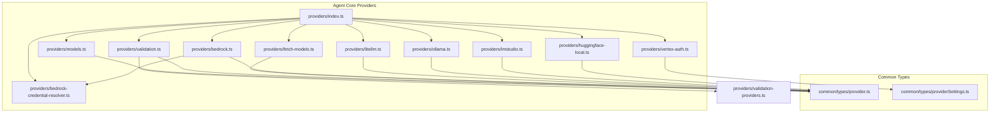

**Diagram sources**

- [index.ts:1-92](file://packages/agent-core/src/providers/index.ts#L1-L92)
- [models.ts:1-48](file://packages/agent-core/src/providers/models.ts#L1-L48)
- [validation.ts:1-61](file://packages/agent-core/src/providers/validation.ts#L1-L61)
- [fetch-models.ts:1-197](file://packages/agent-core/src/providers/fetch-models.ts#L1-L197)
- [bedrock.ts:1-112](file://packages/agent-core/src/providers/bedrock.ts#L1-L112)
- [bedrock-credential-resolver.ts:1-22](file://packages/agent-core/src/providers/bedrock-credential-resolver.ts#L1-L22)
- [vertex-auth.ts:1-126](file://packages/agent-core/src/providers/vertex-auth.ts#L1-L126)
- [litellm.ts:1-168](file://packages/agent-core/src/providers/litellm.ts#L1-L168)
- [ollama.ts:1-97](file://packages/agent-core/src/providers/ollama.ts#L1-L97)
- [lmstudio.ts:1-110](file://packages/agent-core/src/providers/lmstudio.ts#L1-L110)
- [huggingface-local.ts:1-163](file://packages/agent-core/src/providers/huggingface-local.ts#L1-L163)
- [provider.ts:1-543](file://packages/agent-core/src/common/types/provider.ts#L1-L543)
- [providerSettings.ts:1-439](file://packages/agent-core/src/common/types/providerSettings.ts#L1-L439)

**Section sources**

- [index.ts:1-92](file://packages/agent-core/src/providers/index.ts#L1-L92)
- [provider.ts:232-543](file://packages/agent-core/src/common/types/provider.ts#L232-L543)
- [providerSettings.ts:47-228](file://packages/agent-core/src/common/types/providerSettings.ts#L47-L228)

## Core Components

- Provider abstraction and defaults: Defines supported providers, default models, and provider metadata. Includes model discovery endpoints and configuration shapes.
- Provider settings and credentials: Encapsulates connection status, selected models, credentials, and provider categories.
- Model discovery utilities: Provides a generic mechanism to fetch models from provider APIs using a configuration-driven approach.
- Authentication resolver utilities: Implements provider-specific authentication flows, including AWS Bedrock credential resolution and Google Vertex access tokens.
- Provider-specific modules: Implement connection tests, model fetching, and validation tailored to each provider.

Key exports and capabilities:

- Provider metadata and defaults: DEFAULT_PROVIDERS, DEFAULT_MODEL, provider lookup, model validation, and environment variable hints.
- Model discovery: fetchProviderModels with configurable endpoints, auth styles, response formats, and filtering.
- Authentication validation: validateApiKey delegating to provider-specific validators; provider-specific validators for Bedrock, Vertex, and others.
- Connection tests: testOllamaConnection, testLMStudioConnection, testLiteLLMConnection, and HuggingFace Local helpers.

**Section sources**

- [provider.ts:232-543](file://packages/agent-core/src/common/types/provider.ts#L232-L543)
- [providerSettings.ts:47-228](file://packages/agent-core/src/common/types/providerSettings.ts#L47-L228)
- [models.ts:1-48](file://packages/agent-core/src/providers/models.ts#L1-L48)
- [fetch-models.ts:1-197](file://packages/agent-core/src/providers/fetch-models.ts#L1-L197)
- [validation.ts:1-61](file://packages/agent-core/src/providers/validation.ts#L1-L61)
- [index.ts:1-92](file://packages/agent-core/src/providers/index.ts#L1-L92)

## Architecture Overview

The provider integration architecture centers on a provider abstraction layer that:

- Normalizes provider configuration and credentials
- Standardizes model discovery via a configuration-driven endpoint
- Implements provider-specific authentication resolvers
- Exposes connection tests and validation utilities
- Manages connection state and fallback strategies

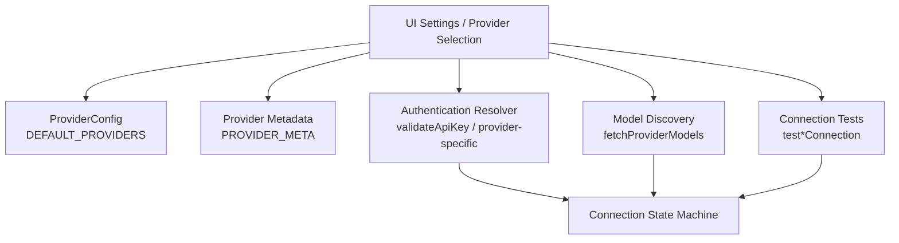

**Diagram sources**

- [provider.ts:232-543](file://packages/agent-core/src/common/types/provider.ts#L232-L543)
- [providerSettings.ts:47-228](file://packages/agent-core/src/common/types/providerSettings.ts#L47-L228)
- [fetch-models.ts:157-197](file://packages/agent-core/src/providers/fetch-models.ts#L157-L197)
- [validation.ts:19-61](file://packages/agent-core/src/providers/validation.ts#L19-L61)
- [information-viewpoint.md:269-291](file://docs/information-viewpoint.md#L269-L291)

## Detailed Component Analysis

### Provider Abstraction and Defaults

The provider abstraction defines:

- Supported providers and categories
- Default models per provider
- Provider metadata (labels, logos, help URLs)
- Configuration shapes for models and credentials
- Helper functions for model validation and provider lookup

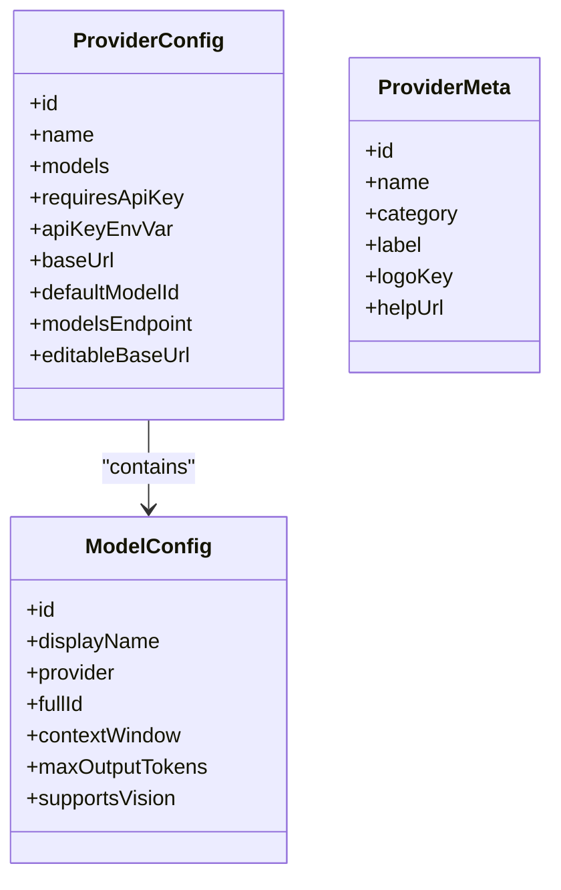

**Diagram sources**

- [provider.ts:134-157](file://packages/agent-core/src/common/types/provider.ts#L134-L157)
- [provider.ts:47-45](file://packages/agent-core/src/common/types/provider.ts#L47-L45)

**Section sources**

- [provider.ts:232-543](file://packages/agent-core/src/common/types/provider.ts#L232-L543)
- [providerSettings.ts:47-228](file://packages/agent-core/src/common/types/providerSettings.ts#L47-L228)

### Model Discovery and Validation

Model discovery is driven by a configuration object that describes how to call a provider’s models endpoint, how to pass credentials, and how to parse the response. The generic fetchProviderModels function:

- Builds the request URL and headers based on authStyle
- Parses provider-specific response formats
- Applies optional model filtering
- Returns a normalized list of models

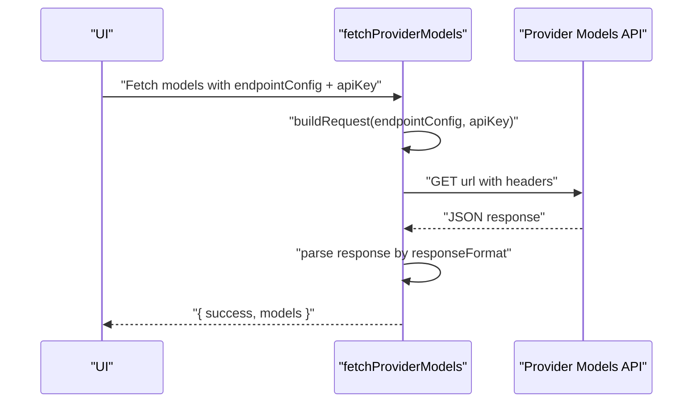

**Diagram sources**

- [fetch-models.ts:157-197](file://packages/agent-core/src/providers/fetch-models.ts#L157-L197)

**Section sources**

- [fetch-models.ts:1-197](file://packages/agent-core/src/providers/fetch-models.ts#L1-L197)
- [models.ts:1-48](file://packages/agent-core/src/providers/models.ts#L1-L48)

### Authentication Resolver Patterns

The authentication resolver pattern validates provider credentials and connection readiness:

- validateApiKey delegates to provider-specific validators
- Provider-specific validators encapsulate provider-specific logic (e.g., AWS Bedrock, Google Vertex)

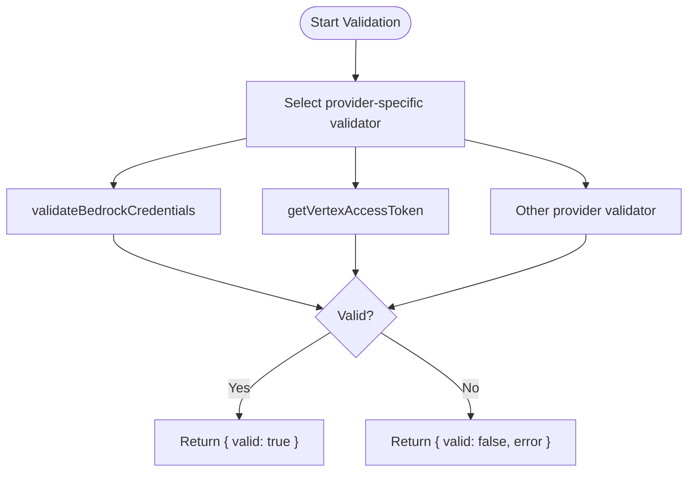

**Diagram sources**

- [validation.ts:19-61](file://packages/agent-core/src/providers/validation.ts#L19-L61)
- [bedrock.ts:20-112](file://packages/agent-core/src/providers/bedrock.ts#L20-L112)
- [vertex-auth.ts:109-125](file://packages/agent-core/src/providers/vertex-auth.ts#L109-L125)

**Section sources**

- [validation.ts:1-61](file://packages/agent-core/src/providers/validation.ts#L1-L61)
- [bedrock.ts:1-112](file://packages/agent-core/src/providers/bedrock.ts#L1-L112)
- [bedrock-credential-resolver.ts:1-22](file://packages/agent-core/src/providers/bedrock-credential-resolver.ts#L1-L22)
- [vertex-auth.ts:1-126](file://packages/agent-core/src/providers/vertex-auth.ts#L1-L126)

### Provider-Specific Implementations

#### AWS Bedrock

- Authentication supports API key, access keys, and IAM profile
- Validates credentials by invoking a Bedrock API command
- Provides model discovery via a dedicated module

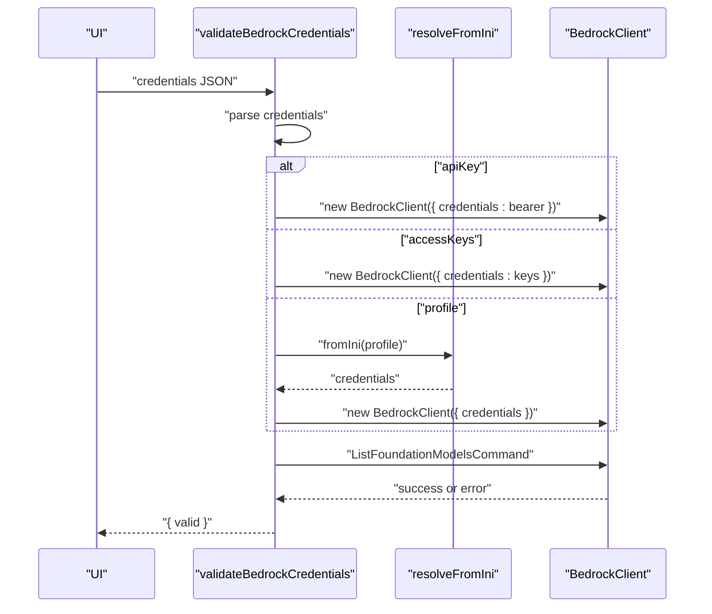

**Diagram sources**

- [bedrock.ts:20-112](file://packages/agent-core/src/providers/bedrock.ts#L20-L112)
- [bedrock-credential-resolver.ts:7-21](file://packages/agent-core/src/providers/bedrock-credential-resolver.ts#L7-L21)

**Section sources**

- [bedrock.ts:1-112](file://packages/agent-core/src/providers/bedrock.ts#L1-L112)
- [bedrock-credential-resolver.ts:1-22](file://packages/agent-core/src/providers/bedrock-credential-resolver.ts#L1-L22)

#### Google Vertex AI

- Authentication via service account key or ADC (gcloud)
- Generates signed JWT and exchanges for an access token
- Provides access token retrieval for downstream requests

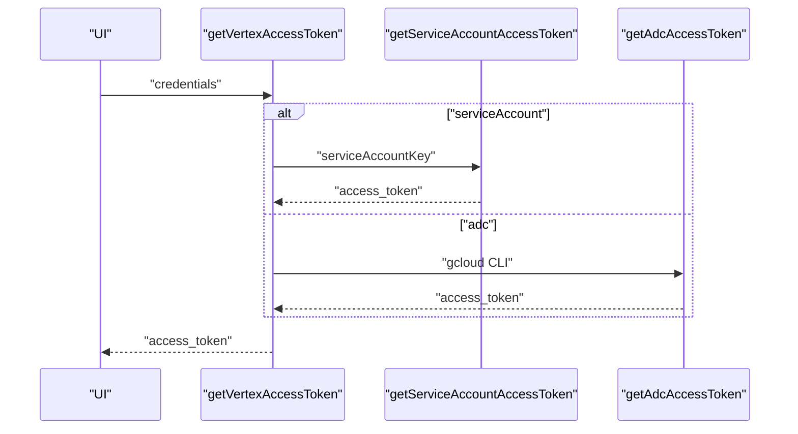

**Diagram sources**

- [vertex-auth.ts:109-125](file://packages/agent-core/src/providers/vertex-auth.ts#L109-L125)

**Section sources**

- [vertex-auth.ts:1-126](file://packages/agent-core/src/providers/vertex-auth.ts#L1-L126)

#### LiteLLM Proxy

- Tests connection to a LiteLLM proxy and lists models
- Accepts optional bearer token authentication
- Parses OpenAI-compatible model list

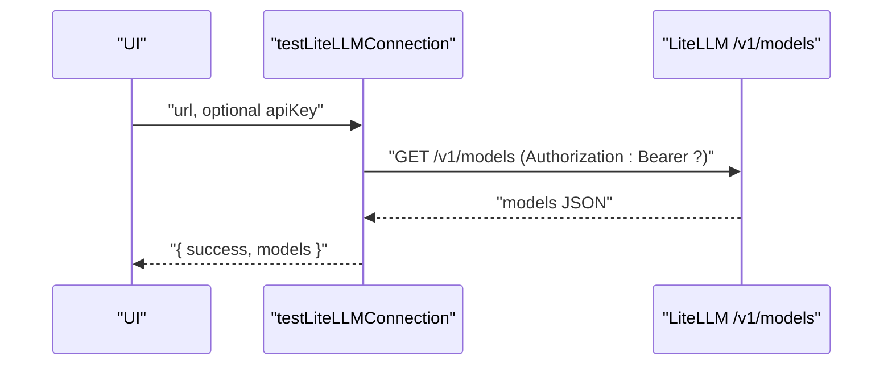

**Diagram sources**

- [litellm.ts:34-89](file://packages/agent-core/src/providers/litellm.ts#L34-L89)

**Section sources**

- [litellm.ts:1-168](file://packages/agent-core/src/providers/litellm.ts#L1-L168)

#### Ollama

- Tests connection to an Ollama server and enumerates models
- Performs tool support checks per model in batches
- Returns normalized model list with tool support status

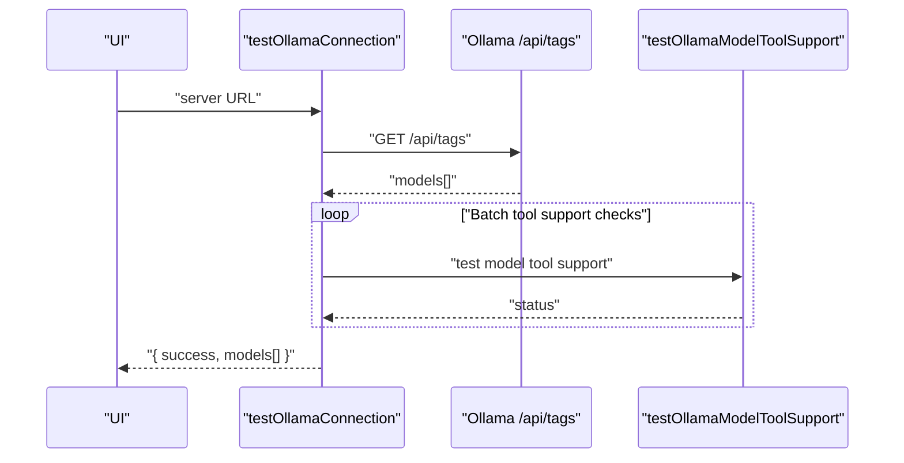

**Diagram sources**

- [ollama.ts:46-97](file://packages/agent-core/src/providers/ollama.ts#L46-L97)

**Section sources**

- [ollama.ts:1-97](file://packages/agent-core/src/providers/ollama.ts#L1-L97)

#### LM Studio

- Validates URL and tests connection to the OpenAI-compatible /v1/models endpoint
- Fetches and enriches models, validating presence and tool support
- Provides configuration validation utilities

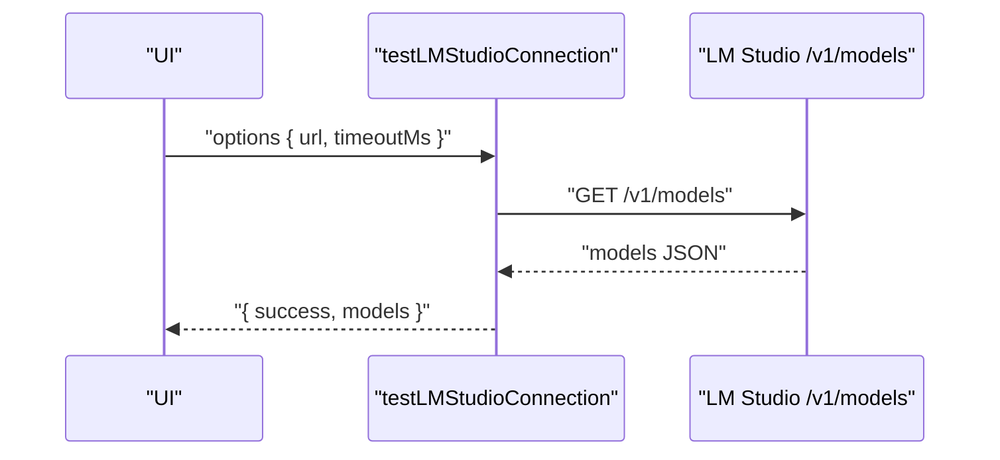

**Diagram sources**

- [lmstudio.ts:35-80](file://packages/agent-core/src/providers/lmstudio.ts#L35-L80)

**Section sources**

- [lmstudio.ts:1-110](file://packages/agent-core/src/providers/lmstudio.ts#L1-L110)

#### HuggingFace Local

- Tests connectivity to the local inference server
- Lists available models and recommends ONNX-compatible models
- Searches the HuggingFace Hub for ONNX models

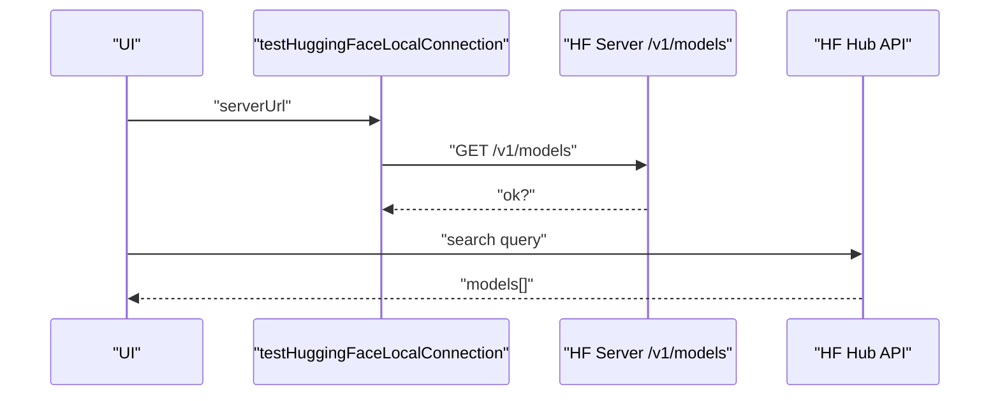

**Diagram sources**

- [huggingface-local.ts:123-163](file://packages/agent-core/src/providers/huggingface-local.ts#L123-L163)

**Section sources**

- [huggingface-local.ts:1-163](file://packages/agent-core/src/providers/huggingface-local.ts#L1-L163)

### Conceptual Overview

For beginners, the provider abstraction layer acts as a unified interface over diverse AI services. It:

- Normalizes how providers are configured and discovered
- Standardizes authentication and connection testing
- Enables switching between providers with minimal code changes
- Provides sensible defaults and helpful error messages

## Dependency Analysis

The provider integration exhibits low coupling and high cohesion:

- providers/index.ts aggregates exports for consumers
- Each provider module encapsulates its own validation and discovery logic
- Common types define shared contracts for configuration and credentials
- No circular dependencies were observed among provider modules

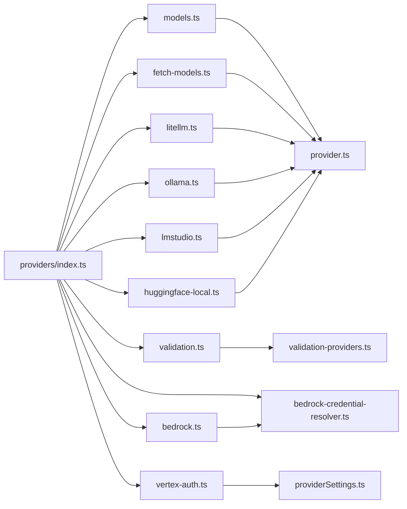

**Diagram sources**

- [index.ts:1-92](file://packages/agent-core/src/providers/index.ts#L1-L92)
- [models.ts:1-48](file://packages/agent-core/src/providers/models.ts#L1-L48)
- [validation.ts:1-61](file://packages/agent-core/src/providers/validation.ts#L1-L61)
- [fetch-models.ts:1-197](file://packages/agent-core/src/providers/fetch-models.ts#L1-L197)
- [bedrock.ts:1-112](file://packages/agent-core/src/providers/bedrock.ts#L1-L112)
- [bedrock-credential-resolver.ts:1-22](file://packages/agent-core/src/providers/bedrock-credential-resolver.ts#L1-L22)
- [vertex-auth.ts:1-126](file://packages/agent-core/src/providers/vertex-auth.ts#L1-L126)DomeWork
- [litellm.ts:1-168](file://packages/agent-core/src/providers/litellm.ts#L1-L168)
- [ollama.ts:1-97](file://packages/agent-core/src/providers/ollama.ts#L1-L97)
- [lmstudio.ts:1-110](file://packages/agent-core/src/providers/lmstudio.ts#L1-L110)
- [huggingface-local.ts:1-163](file://packages/agent-core/src/providers/huggingface-local.ts#L1-L163)
- [provider.ts:1-543](file://packages/agent-core/src/common/types/provider.ts#L1-L543)
- [providerSettings.ts:1-439](file://packages/agent-core/src/common/types/providerSettings.ts#L1-L439)

**Section sources**

- [index.ts:1-92](file://packages/agent-core/src/providers/index.ts#L1-L92)

## Performance Considerations

- Timeouts: Many provider operations enforce timeouts (e.g., LiteLLM, Ollama, LM Studio, HuggingFace Local). Tune timeouts according to network conditions and provider latency.
- Batched operations: Ollama performs tool support checks in batches to avoid overwhelming the server.
- Minimal parsing: fetchProviderModels uses targeted parsers per response format to reduce overhead.
- Caching: Store last-connected timestamps and model lists to minimize repeated discovery calls.

## Troubleshooting Guide

Common integration issues and resolutions:

- Authentication failures
  - Bedrock: Verify credentials type (API key, access keys, or profile) and region. Check for invalid tokens, access denied, or missing permissions.
  - Vertex: Ensure service account JSON is valid or gcloud CLI is installed and logged in for ADC.
  - Standard API key providers: Confirm API key validity and region-specific endpoints when applicable.
- Connectivity issues
  - Ollama/LM Studio/HuggingFace Local: Ensure servers are running and reachable at the configured URLs. Check for timeouts and firewall restrictions.
  - LiteLLM: Confirm proxy is running and reachable; verify optional bearer token if required.
- Model discovery failures
  - fetchProviderModels: Validate endpointConfig (URL, authStyle, responseFormat, modelIdPrefix, modelFilter). Check for network timeouts or unexpected response shapes.
- Connection state machine
  - Use the provider connection state machine to diagnose transient vs persistent errors and to trigger retries or removal of providers.

**Section sources**

- [bedrock.ts:75-112](file://packages/agent-core/src/providers/bedrock.ts#L75-L112)
- [vertex-auth.ts:109-125](file://packages/agent-core/src/providers/vertex-auth.ts#L109-L125)
- [litellm.ts:34-89](file://packages/agent-core/src/providers/litellm.ts#L34-L89)
- [ollama.ts:46-97](file://packages/agent-core/src/providers/ollama.ts#L46-L97)
- [lmstudio.ts:35-80](file://packages/agent-core/src/providers/lmstudio.ts#L35-L80)
- [huggingface-local.ts:123-163](file://packages/agent-core/src/providers/huggingface-local.ts#L123-L163)
- [fetch-models.ts:157-197](file://packages/agent-core/src/providers/fetch-models.ts#L157-L197)
- [information-viewpoint.md:269-291](file://docs/information-viewpoint.md#L269-L291)

## Conclusion

The AI Provider Integration subsystem provides a robust, extensible foundation for multi-provider AI services. Its provider abstraction, standardized model discovery, and provider-specific authentication resolvers enable seamless integration across cloud and local providers. By leveraging timeouts, batching, and a clear connection state machine, applications can achieve reliable performance and resilient fallback strategies.

## Appendices

### Supported Providers and Categories

- Classic providers: Anthropic, OpenAI, Google AI, XAI, DeepSeek, Moonshot, Z.AI, MiniMax, Nebius, Together, Fireworks, Groq, Venice, Accomplish AI
- Cloud providers: AWS Bedrock, Google Vertex AI, Azure AI Foundry
- Local providers: Ollama, LM Studio, HuggingFace Local
- Hybrid/proxy: OpenRouter, LiteLLM, NVIDIA NIM, Custom Endpoint
- Special: GitHub Copilot

**Section sources**

- [providerSettings.ts:47-228](file://packages/agent-core/src/common/types/providerSettings.ts#L47-L228)
- [provider.ts:10-35](file://packages/agent-core/src/common/types/provider.ts#L10-L35)

### Practical Examples

- Provider configuration
  - Use DEFAULT_PROVIDERS to select a provider and its default model.
  - For providers with editable base URLs, configure custom base URLs via provider settings.
  - Example path: [DEFAULT_PROVIDERS:232-509](file://packages/agent-core/src/common/types/provider.ts#L232-L509)

- Authentication setup
  - API key providers: Use validateApiKey to validate keys against provider-specific endpoints.
  - Bedrock: Use validateBedrockCredentials with credentials JSON supporting API key, access keys, or profile.
  - Vertex: Use getVertexAccessToken with service account key or ADC.
  - Example paths:
    - [validateApiKey:19-61](file://packages/agent-core/src/providers/validation.ts#L19-L61)
    - [validateBedrockCredentials:20-112](file://packages/agent-core/src/providers/bedrock.ts#L20-L112)
    - [getVertexAccessToken:109-125](file://packages/agent-core/src/providers/vertex-auth.ts#L109-L125)

- Model selection
  - Discover models using fetchProviderModels with a provider’s modelsEndpoint configuration.
  - Validate a model ID against provider models using isValidModel or findModelById.
  - Example paths:
    - [fetchProviderModels:157-197](file://packages/agent-core/src/providers/fetch-models.ts#L157-L197)
    - [isValidModel / findModelById:20-33](file://packages/agent-core/src/providers/models.ts#L20-L33)

- Connection management
  - Use provider-specific connection tests (e.g., testOllamaConnection, testLMStudioConnection, testLiteLLMConnection).
  - Manage connection state using the provider connection state machine.
  - Example paths:
    - [testOllamaConnection:46-97](file://packages/agent-core/src/providers/ollama.ts#L46-L97)
    - [testLMStudioConnection:35-80](file://packages/agent-core/src/providers/lmstudio.ts#L35-L80)
    - [testLiteLLMConnection:34-89](file://packages/agent-core/src/providers/litellm.ts#L34-L89)
    - [Provider connection state machine:269-291](file://docs/information-viewpoint.md#L269-L291)

- Rate limiting, error handling, and fallback strategies
  - Apply timeouts to all external calls; handle AbortError gracefully.
  - Implement retry logic on transient errors; move to error state on persistent failures.
  - Fallback to alternative providers or local models when remote providers fail.
  - Example paths:
    - [fetch-models timeouts and error handling:164-196](file://packages/agent-core/src/providers/fetch-models.ts#L164-L196)
    - [connection tests timeouts and error handling:80-89](file://packages/agent-core/src/providers/litellm.ts#L80-L89)
    - [connection state machine:269-291](file://docs/information-viewpoint.md#L269-L291)
