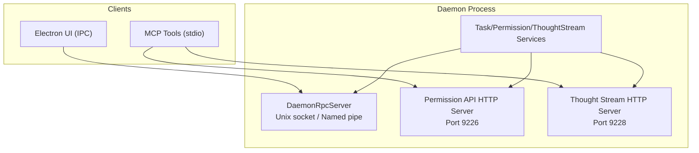
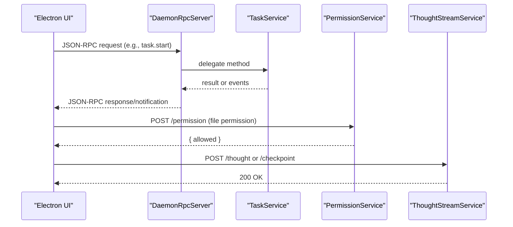
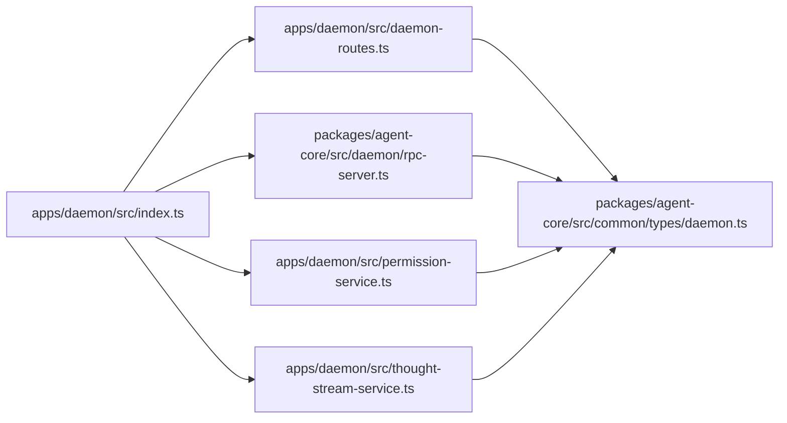

# API Reference

<cite>
**Referenced Files in This Document**
- [index.ts](file://apps/daemon/src/index.ts)
- [daemon-routes.ts](file://apps/daemon/src/daemon-routes.ts)
- [server.ts](file://packages/agent-core/src/daemon/server.ts)
- [rpc-server.ts](file://packages/agent-core/src/daemon/rpc-server.ts)
- [client.ts](file://packages/agent-core/src/daemon/client.ts)
- [types.ts](file://packages/agent-core/src/daemon/types.ts)
- [daemon.ts](file://packages/agent-core/src/common/types/daemon.ts)
- [permission-service.ts](file://apps/daemon/src/permission-service.ts)
- [thought-stream-service.ts](file://apps/daemon/src/thought-stream-service.ts)
- [generator-mcp.ts](file://packages/agent-core/src/opencode/generator-mcp.ts)
- [ask-user-question/index.ts](file://packages/agent-core/mcp-tools/ask-user-question/src/index.ts)
- [file-permission/index.ts](file://packages/agent-core/mcp-tools/file-permission/src/index.ts)
- [report-thought/index.ts](file://packages/agent-core/mcp-tools/report-thought/src/index.ts)
- [report-checkpoint/index.ts](file://packages/agent-core/mcp-tools/report-checkpoint/src/index.ts)
- [thought-stream.ts](file://packages/agent-core/src/common/types/thought-stream.ts)
- [permission.ts](file://packages/agent-core/src/common/types/permission.ts)
</cite>

## Table of Contents

1. [Introduction](#introduction)
2. [Project Structure](#project-structure)
3. [Core Components](#core-components)
4. [Architecture Overview](#architecture-overview)
5. [Detailed Component Analysis](#detailed-component-analysis)
6. [Dependency Analysis](#dependency-analysis)
7. [Performance Considerations](#performance-considerations)
8. [Troubleshooting Guide](#troubleshooting-guide)
9. [Conclusion](#conclusion)
10. [Appendices](#appendices)

## Introduction
DomeWork
This document provides a comprehensive API reference for:

- The Accomplish Daemon RPC API (JSON-RPC 2.0 over Unix domain sockets/Windows named pipes)
- The MCP Tool API (Model Context Protocol tools used by the daemon’s MCP ecosystem)

It covers HTTP endpoints for permission and thought-stream services, RPC method definitions, authentication, rate limiting, error handling, security, and practical guidance for building and integrating custom MCP tools.

## Project Structure

The daemon exposes:

- A Unix domain socket (or Windows named pipe) JSON-RPC server for inter-process communication with the Electron UI and other clients
- Two HTTP microservices for permission and thought-stream bridging
- MCP tool configurations and built-in tools for user consent, file permission, reporting thoughts, and checkpoints

**Diagram sources**

- [index.ts:138-197](file://apps/daemon/src/index.ts#L138-L197)
- [rpc-server.ts:93-134](file://packages/agent-core/src/daemon/rpc-server.ts#L93-L134)
- [permission-service.ts:120-131](file://apps/daemon/src/permission-service.ts#L120-L131)
- [thought-stream-service.ts:111-122](file://apps/daemon/src/thought-stream-service.ts#L111-L122)

**Section sources**

- [index.ts:138-197](file://apps/daemon/src/index.ts#L138-L197)
- [rpc-server.ts:93-134](file://packages/agent-core/src/daemon/rpc-server.ts#L93-L134)
- [permission-service.ts:120-131](file://apps/daemon/src/permission-service.ts#L120-L131)
- [thought-stream-service.ts:111-122](file://apps/daemon/src/thought-stream-service.ts#L111-L122)

## Core Components

- Daemon RPC Server: JSON-RPC 2.0 over a Unix socket or Windows named pipe. Methods include task lifecycle, scheduling, health checks, and WhatsApp controls.
- Permission API HTTP Server: Exposes POST endpoints for file permission and question flows with rate limiting and bearer token auth.
- Thought Stream HTTP Server: Exposes POST endpoints for streaming agent thoughts and checkpoints with rate limiting and bearer token auth.
- MCP Tools: Local stdio MCP servers that integrate with the daemon via environment variables and HTTP endpoints.

**Section sources**

- [daemon-routes.ts:70-307](file://apps/daemon/src/daemon-routes.ts#L70-L307)
- [rpc-server.ts:33-164](file://packages/agent-core/src/daemon/rpc-server.ts#L33-L164)
- [permission-service.ts:17-213](file://apps/daemon/src/permission-service.ts#L17-L213)
- [thought-stream-service.ts:33-131](file://apps/daemon/src/thought-stream-service.ts#L33-L131)

## Architecture Overview

The daemon orchestrates long-lived RPC connections and HTTP microservices. Clients (UI and MCP tools) communicate via:

- RPC over socket for task orchestration and health
- HTTP with bearer token for permission and thought-stream

**Diagram sources**

- [rpc-server.ts:93-134](file://packages/agent-core/src/daemon/rpc-server.ts#L93-L134)
- [daemon-routes.ts:82-187](file://apps/daemon/src/daemon-routes.ts#L82-L187)
- [permission-service.ts:64-131](file://apps/daemon/src/permission-service.ts#L64-L131)
- [thought-stream-service.ts:67-122](file://apps/daemon/src/thought-stream-service.ts#L67-L122)

## Detailed Component Analysis

### Daemon RPC API (JSON-RPC 2.0 over socket)

- Transport: Unix domain socket or Windows named pipe
- Authentication: Bearer token passed via environment variables to MCP tools; RPC itself does not enforce token on socket
- Methods:
  - task.start, task.stop, task.cancel, task.interrupt, task.list, task.get, task.delete, task.clearHistory, task.getTodos, task.status, task.getActiveCount
  - session.resume
  - permission.respond
  - task.schedule, task.listScheduled, task.cancelScheduled, task.setScheduleEnabled
  - whatsapp.connect, whatsapp.disconnect, whatsapp.getConfig, whatsapp.setEnabled
  - daemon.ping, daemon.shutdown
  - health.check
  - accomplish-ai.connect, accomplish-ai.get-usage, accomplish-ai.disconnect

- Notifications:
  - task.progress, task.message, task.statusChange, task.summary, task.complete, task.error, todo.update
  - permission.request
  - task.thought, task.checkpoint (extended daemon notifications)
  - accomplish-ai.usage-update
  - whatsapp.qr, whatsapp.status

- Error codes:
  - Standard JSON-RPC codes (-32700 to -32603)
  - Custom codes for domain errors (e.g., task not found, no provider configured, daemon not ready)

- Example request/response:
  - Request: {"jsonrpc":"2.0","id":1,"method":"task.start","params":{"prompt":"..."}}
  - Response: {"jsonrpc":"2.0","id":1,"result":{"taskId":"...","status":"running",...}}
  - Notification: {"jsonrpc":"2.0","method":"task.progress","params":{"taskId":"...","stage":"..."}}

- Security:
  - Socket path is derived from dataDir for profile isolation
  - Auth token is generated per session and passed to child processes for MCP tools

- Rate limiting:
  - Not enforced at RPC level; use MCP tool HTTP endpoints for rate-limited flows

- Versioning:
  - Methods and notification names are part of the canonical contract; changes should maintain backward compatibility

**Section sources**

- [rpc-server.ts:33-164](file://packages/agent-core/src/daemon/rpc-server.ts#L33-L164)
- [daemon.ts:210-296](file://packages/agent-core/src/common/types/daemon.ts#L210-L296)
- [daemon.ts:60-72](file://packages/agent-core/src/common/types/daemon.ts#L60-L72)
- [daemon-routes.ts:70-307](file://apps/daemon/src/daemon-routes.ts#L70-L307)
- [types.ts:118-169](file://packages/agent-core/src/daemon/types.ts#L118-L169)

### Permission API HTTP Service

- Port: 9226 (fixed constant)
- Endpoint: POST /permission
- Headers:
  - Content-Type: application/json
  - Authorization: Bearer <ACCOMPLISH_DAEMON_AUTH_TOKEN>
- Request body schema:
  - operation: file operation type
  - filePath or filePaths: target paths
  - targetPath: destination for rename/move
  - contentPreview: preview text (truncated)
  - taskId: active task identifier
- Response:
  - { allowed: boolean }
- Behavior:
  - Validates request, ensures an active task exists, auto-denies if no connected clients, otherwise forwards a permission request to the UI and awaits resolution
- Rate limiting: 120 requests per 60 seconds

**Section sources**

- [permission-service.ts:64-131](file://apps/daemon/src/permission-service.ts#L64-L131)
- [permission.ts:15-50](file://packages/agent-core/src/common/types/permission.ts#L15-L50)

### Question API HTTP Service

- Port: 9227 (fixed constant)
- Endpoint: POST /question
- Headers:
  - Content-Type: application/json
  - Authorization: Bearer <ACCOMPLISH_DAEMON_AUTH_TOKEN>
- Request body schema:
  - question: question text
  - header: short category
  - options: selectable choices
  - multiSelect: allow multiple selections
  - taskId: active task identifier
- Response:
  - { answered: boolean, selectedOptions?: string[], customText?: string, denied?: boolean }
- Behavior:
  - Validates request, ensures an active task exists, auto-denies if no connected clients, otherwise forwards a question request to the UI and awaits resolution
- Rate limiting: 120 requests per 60 seconds

**Section sources**

- [permission-service.ts:133-200](file://apps/daemon/src/permission-service.ts#L133-L200)
- [permission.ts:15-50](file://packages/agent-core/src/common/types/permission.ts#L15-L50)

### Thought Stream HTTP Service

- Port: 9228 (fixed constant)
- Endpoints:
  - POST /thought
  - POST /checkpoint
- Headers:
  - Content-Type: application/json
  - Authorization: Bearer <ACCOMPLISH_DAEMON_AUTH_TOKEN>
- Request body schemas:
  - /thought: { taskId, content, category, agentName, timestamp }
  - /checkpoint: { taskId, status, summary, nextPlanned?, blocker?, agentName, timestamp }
- Validation:
  - Uses Zod schemas to validate payloads
- Behavior:
  - Rejects invalid payloads, ignores events for inactive tasks, forwards valid events to the UI
- Rate limiting: 600 requests per 60 seconds

**Section sources**

- [thought-stream-service.ts:67-122](file://apps/daemon/src/thought-stream-service.ts#L67-L122)
- [thought-stream.ts:6-22](file://packages/agent-core/src/common/types/thought-stream.ts#L6-L22)

### MCP Tool API

- MCP tool configuration:
  - Built-in tools are launched as stdio servers with Node.js
  - Environment variables supply ports and auth token
  - Timeout defaults vary by tool (e.g., AskUserQuestion allows up to 10 minutes)

- Tool: AskUserQuestion
  - Tool name: AskUserQuestion
  - Endpoint: POST http://localhost:9227/question
  - Input schema: array of questions with optional header, options, and multiSelect
  - Returns: tool result content reflecting user selection or custom text

- Tool: request_file_permission
  - Tool name: request_file_permission
  - Endpoint: POST http://localhost:9226/permission
  - Input schema: operation and file path(s) with optional previews
  - Returns: “allowed” or “denied”

- Tool: report_thought
  - Tool name: report_thought
  - Endpoint: POST http://127.0.0.1:9228/thought
  - Input schema: content and category
  - Returns: acknowledgment

- Tool: report_checkpoint
  - Tool name: report_checkpoint
  - Endpoint: POST http://127.0.0.1:9228/checkpoint
  - Input schema: status, summary, optional nextPlanned and blocker
  - Returns: acknowledgment

- Configuration builder:
  - Generates MCP server entries for local and remote tools
  - Injects environment variables for ports and auth token
  - Supports browser automation modes and remote connectors

**Section sources**

- [ask-user-question/index.ts:102-187](file://packages/agent-core/mcp-tools/ask-user-question/src/index.ts#L102-L187)
- [file-permission/index.ts:74-128](file://packages/agent-core/mcp-tools/file-permission/src/index.ts#L74-L128)
- [report-thought/index.ts:61-108](file://packages/agent-core/mcp-tools/report-thought/src/index.ts#L61-L108)
- [report-checkpoint/index.ts:71-126](file://packages/agent-core/mcp-tools/report-checkpoint/src/index.ts#L71-L126)
- [generator-mcp.ts:76-191](file://packages/agent-core/src/opencode/generator-mcp.ts#L76-L191)

## Dependency Analysis

**Diagram sources**

- [index.ts:140-172](file://apps/daemon/src/index.ts#L140-L172)
- [daemon-routes.ts:70-79](file://apps/daemon/src/daemon-routes.ts#L70-L79)
- [rpc-server.ts:33-53](file://packages/agent-core/src/daemon/rpc-server.ts#L33-L53)
- [permission-service.ts:17-32](file://apps/daemon/src/permission-service.ts#L17-L32)
- [thought-stream-service.ts:33-45](file://apps/daemon/src/thought-stream-service.ts#L33-L45)

**Section sources**

- [index.ts:140-172](file://apps/daemon/src/index.ts#L140-L172)
- [daemon-routes.ts:70-79](file://apps/daemon/src/daemon-routes.ts#L70-L79)
- [rpc-server.ts:33-53](file://packages/agent-core/src/daemon/rpc-server.ts#L33-L53)
- [permission-service.ts:17-32](file://apps/daemon/src/permission-service.ts#L17-L32)
- [thought-stream-service.ts:33-45](file://apps/daemon/src/thought-stream-service.ts#L33-L45)

## Performance Considerations

- RPC throughput: Single socket with line-delimited JSON; suitable for moderate RPC load
- HTTP services: Use rate limiting to protect endpoints; adjust window and max requests as needed
- MCP tools: Configure appropriate timeouts per tool; long-running user interactions (e.g., AskUserQuestion) require extended timeouts
- BaDomeWork: MCP tools should gracefully handle HTTP errors and retry with backoff

[No sources needed since this section provides general guidance]

## Troubleshooting Guide

- RPC method not found:
  - Ensure the method name matches the canonical contract
- Internal errors:
  - Inspect server logs for handler errors
- Permission/Question timeouts:
  - Verify active task exists and UI client is connected
  - Confirm Authorization header with ACCOMPLISH_DAEMON_AUTH_TOKEN
- Thought stream failures:
  - Confirm task is registered as active
  - Validate payload schema and port configuration
- Daemon shutdown:
  - Use daemon.shutdown to initiate graceful shutdown; verify drain behavior for active tasks

**Section sources**

- [rpc-server.ts:77-105](file://packages/agent-core/src/daemon/rpc-server.ts#L77-L105)
- [daemon.ts:86-100](file://packages/agent-core/src/common/types/daemon.ts#L86-L100)
- [permission-service.ts:92-116](file://apps/daemon/src/permission-service.ts#L92-L116)
- [permission-service.ts:161-185](file://apps/daemon/src/permission-service.ts#L161-L185)
- [thought-stream-service.ts:79-87](file://apps/daemon/src/thought-stream-service.ts#L79-L87)

## Conclusion

The Accomplish Daemon provides a robust RPC surface for task orchestration and two HTTP microservices for permission and thought-stream flows. MCP tools integrate seamlessly via stdio and HTTP, leveraging environment-driven configuration and bearer token authentication. The design emphasizes isolation, rate limiting, and graceful error handling.

[No sources needed since this section summarizes without analyzing specific files]

## Appendices

### Authentication and Security

- RPC over socket: No bearer token enforcement; rely on process isolation and socket path scoping
- HTTP services: Require Authorization: Bearer <ACCOMPLISH_DAEMON_AUTH_TOKEN>
- Token lifecycle: Generated per session and exported to child processes for MCP tools

**Section sources**

- [index.ts:183-197](file://apps/daemon/src/index.ts#L183-L197)
- [ask-user-question/index.ts:14](file://packages/agent-core/mcp-tools/ask-user-question/src/index.ts#L14)
- [file-permission/index.ts:12](file://packages/agent-core/mcp-tools/file-permission/src/index.ts#L12)
- [report-thought/index.ts:15](file://packages/agent-core/mcp-tools/report-thought/src/index.ts#L15)
- [report-checkpoint/index.ts:15](file://packages/agent-core/mcp-tools/report-checkpoint/src/index.ts#L15)

### Rate Limiting

- Permission API: 120 requests per 60 seconds
- Question API: 120 requests per 60 seconds
- Thought Stream: 600 requests per 60 seconds

**Section sources**

- [permission-service.ts:14-27](file://apps/daemon/src/permission-service.ts#L14-L27)
- [thought-stream-service.ts:12-40](file://apps/daemon/src/thought-stream-service.ts#L12-L40)

### Versioning and Compatibility

- RPC method names and notification names are part of the canonical contract; maintain backward compatibility for existing clients
- MCP tool configuration builder supports adding/removing tools; ensure environment variable alignment

**Section sources**

- [daemon.ts:266-296](file://packages/agent-core/src/common/types/daemon.ts#L266-L296)
- [generator-mcp.ts:76-191](file://packages/agent-core/src/opencode/generator-mcp.ts#L76-L191)

### Common Use Cases and Examples

- Start a task and receive progress notifications
- Request user permission for file operations
- Ask a user a question with single or multiple choice options
- Stream agent thoughts and checkpoints to the UI
- Schedule recurring tasks using cron expressions

**Section sources**

- [daemon-routes.ts:82-187](file://apps/daemon/src/daemon-routes.ts#L82-L187)
- [permission-service.ts:64-131](file://apps/daemon/src/permission-service.ts#L64-L131)
- [permission-service.ts:133-200](file://apps/daemon/src/permission-service.ts#L133-L200)
- [thought-stream-service.ts:67-122](file://apps/daemon/src/thought-stream-service.ts#L67-L122)
- [ask-user-question/index.ts:102-187](file://packages/agent-core/mcp-tools/ask-user-question/src/index.ts#L102-L187)
- [file-permission/index.ts:74-128](file://packages/agent-core/mcp-tools/file-permission/src/index.ts#L74-L128)
- [report-thought/index.ts:61-108](file://packages/agent-core/mcp-tools/report-thought/src/index.ts#L61-L108)
- [report-checkpoint/index.ts:71-126](file://packages/agent-core/mcp-tools/report-checkpoint/src/index.ts#L71-L126)

### Client Implementation Guidelines

- Use the RPC client abstraction for typed requests and notifications
- For MCP tools, implement stdio MCP servers and expose tool listings and call handlers
- Respect rate limits and configure timeouts appropriate to the tool’s interaction model
- Forward thought and checkpoint events to the thought stream HTTP endpoints

**Section sources**

- [client.ts:38-163](file://packages/agent-core/src/daemon/client.ts#L38-L163)
- [ask-user-question/index.ts:189-199](file://packages/agent-core/mcp-tools/ask-user-question/src/index.ts#L189-L199)
- [file-permission/index.ts:130-140](file://packages/agent-core/mcp-tools/file-permission/src/index.ts#L130-L140)
- [report-thought/index.ts:110-120](file://packages/agent-core/mcp-tools/report-thought/src/index.ts#L110-L120)
- [report-checkpoint/index.ts:128-138](file://packages/agent-core/mcp-tools/report-checkpoint/src/index.ts#L128-L138)

### Migration and Backwards Compatibility

- Maintain existing RPC method names and notification types
- Avoid breaking changes to request/response schemas; introduce new fields as optional
- MCP tool configuration builder centralizes environment variables; update tool configs when changing ports or auth

**Section sources**

- [daemon.ts:210-296](file://packages/agent-core/src/common/types/daemon.ts#L210-L296)
- [generator-mcp.ts:87-90](file://packages/agent-core/src/opencode/generator-mcp.ts#L87-L90)
