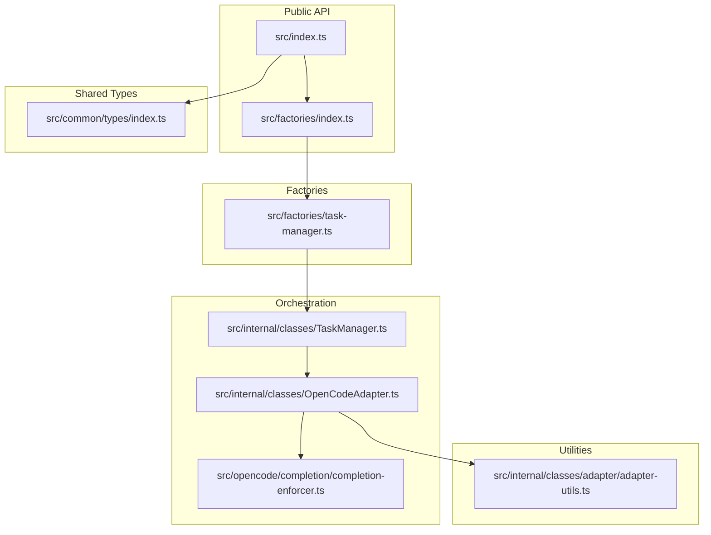
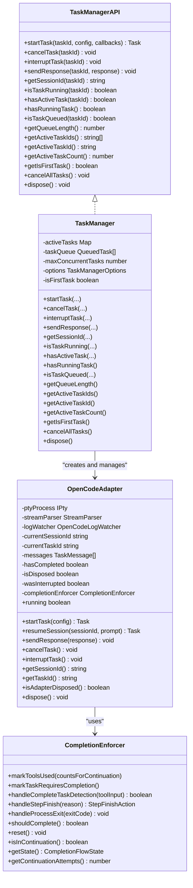
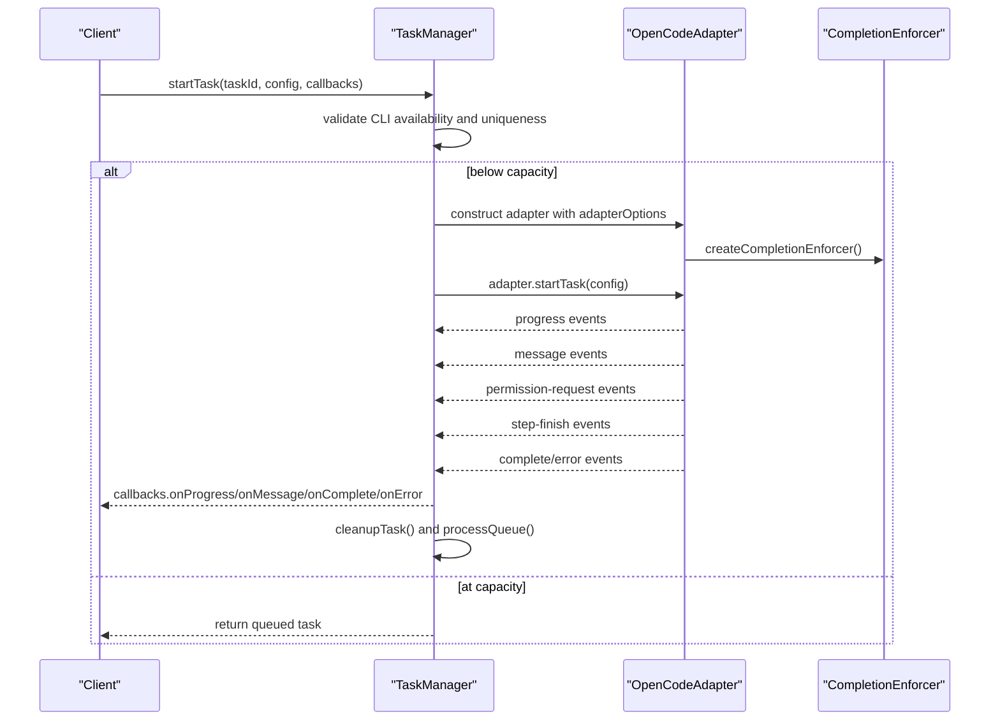
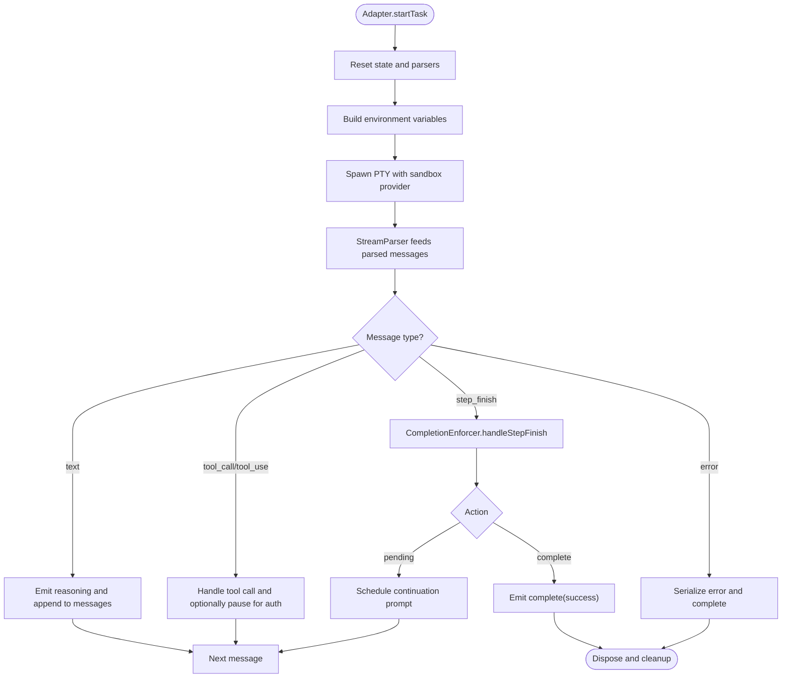
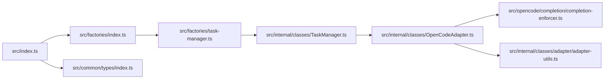

# Agent Core Library

<cite>
**Referenced Files in This Document**
- [index.ts](file://packages/agent-core/src/index.ts)
- [TaskManager.ts](file://packages/agent-core/src/internal/classes/TaskManager.ts)
- [OpenCodeAdapter.ts](file://packages/agent-core/src/internal/classes/OpenCodeAdapter.ts)
- [task-manager.ts](file://packages/agent-core/src/factories/task-manager.ts)
- [types/index.ts](file://packages/agent-core/src/common/types/index.ts)
- [completion-enforcer.ts](file://packages/agent-core/src/opencode/completion/completion-enforcer.ts)
- [adapter-utils.ts](file://packages/agent-core/src/internal/classes/adapter/adapter-utils.ts)
- [README.md](file://packages/agent-core/README.md)
- [package.json](file://packages/agent-core/package.json)
</cite>

## Table of Contents

1. [Introduction](#introduction)
2. [Project Structure](#project-structure)
3. [Core Components](#core-components)
4. [Architecture Overview](#architecture-overview)
5. [Detailed Component Analysis](#detailed-component-analysis)
6. [Dependency Analysis](#dependency-analysis)
7. [Performance Considerations](#performance-considerations)
8. [Troubleshooting Guide](#troubleshooting-guide)
9. [Conclusion](#conclusion)
10. [Appendices](#appendices)

## Introduction

The Agent Core Library is the foundational shared TypeScript library that powers both desktop and web applications within the project. It centralizes core AI agent functionality, including task orchestration, AI provider integration, and cross-platform utilities. The library emphasizes a factory-first API to hide internal implementation details, a robust adapter pattern for AI providers, and a modular architecture with clear separation of concerns. It also provides dependency injection-like patterns through factory functions and adapter options, enabling customization and extensibility across environments.

## Project Structure

The library is organized around a public API surface that exposes factory functions and types, with internal classes implementing core behaviors. Key areas include:

- Public API exports and factory functions
- Task orchestration via TaskManager and OpenCodeAdapter
- Provider integration and completion enforcement
- Shared types and constants for cross-platform compatibility
- Utilities for sandboxing, tool classification, and PTY spawning

**Diagram sources**

- [index.ts:1-583](file://packages/agent-core/src/index.ts#L1-L583)
- [task-manager.ts:1-7](file://packages/agent-core/src/factories/task-manager.ts#L1-L7)
- [TaskManager.ts:1-527](file://packages/agent-core/src/internal/classes/TaskManager.ts#L1-L527)
- [OpenCodeAdapter.ts:1-1052](file://packages/agent-core/src/internal/classes/OpenCodeAdapter.ts#L1-L1052)
- [completion-enforcer.ts:1-212](file://packages/agent-core/src/opencode/completion/completion-enforcer.ts#L1-L212)
- [adapter-utils.ts:1-130](file://packages/agent-core/src/internal/classes/adapter/adapter-utils.ts#L1-L130)
- [types/index.ts:1-135](file://packages/agent-core/src/common/types/index.ts#L1-L135)

**Section sources**

- [index.ts:1-583](file://packages/agent-core/src/index.ts#L1-L583)
- [README.md:1-171](file://packages/agent-core/README.md#L1-L171)

## Core Components

This section introduces the primary building blocks of the Agent Core Library and their roles in service orchestration and AI provider integration.

- Factory Functions: The library’s public API is centered on factory functions that return interfaces, hiding internal implementation details. Examples include createTaskManager, createStorage, createPermissionHandler, createThoughtStreamHandler, createLogWriter, createSkillsManager, and createSpeechService. These factories form the preferred entry point for consumers.
- TaskManager: Orchestrates task lifecycle, concurrency, queuing, and cleanup. It delegates AI provider interaction to OpenCodeAdapter and coordinates callbacks for messages, progress, permissions, and completion.
- OpenCodeAdapter: Implements the adapter pattern for AI provider integration. It spawns PTY processes, parses streaming messages, enforces completion semantics, and handles tool calls and permission requests.
- Completion Enforcer: Ensures tasks reach a proper completion state, managing continuations, partial completions, and tool usage rules.
- Shared Types: Centralized type definitions for tasks, permissions, providers, and other domain concepts, enabling consistent contracts across platforms.

Practical usage patterns:

- Instantiate services via factory functions and configure adapter options for environment, CLI commands, and sandboxing.
- Subscribe to TaskManager callbacks to render UI updates, handle permissions, and track progress.
- Customize sandbox behavior and provider settings through adapter options and factory configurations.

**Section sources**

- [index.ts:14-78](file://packages/agent-core/src/index.ts#L14-L78)
- [TaskManager.ts:93-527](file://packages/agent-core/src/internal/classes/TaskManager.ts#L93-L527)
- [OpenCodeAdapter.ts:126-533](file://packages/agent-core/src/internal/classes/OpenCodeAdapter.ts#L126-L533)
- [completion-enforcer.ts:22-212](file://packages/agent-core/src/opencode/completion/completion-enforcer.ts#L22-L212)
- [types/index.ts:1-135](file://packages/agent-core/src/common/types/index.ts#L1-L135)
- [README.md:51-107](file://packages/agent-core/README.md#L51-L107)

## Architecture Overview

The Agent Core Library follows a layered architecture:

- Public API Layer: Exposes factory functions and public interfaces.
- Orchestration Layer: TaskManager coordinates task execution and integrates with adapters.
- Adapter Layer: OpenCodeAdapter encapsulates AI provider integration and streaming.
- Utility Layer: Shared utilities for sandboxing, tool classification, and PTY spawning.
- Type Layer: Strongly typed contracts for cross-platform compatibility.

**Diagram sources**

- [TaskManager.ts:93-527](file://packages/agent-core/src/internal/classes/TaskManager.ts#L93-L527)
- [OpenCodeAdapter.ts:126-533](file://packages/agent-core/src/internal/classes/OpenCodeAdapter.ts#L126-L533)
- [completion-enforcer.ts:22-212](file://packages/agent-core/src/opencode/completion/completion-enforcer.ts#L22-L212)

## Detailed Component Analysis

### TaskManager: Service Orchestration and Concurrency

TaskManager is responsible for:

- Managing a bounded pool of concurrent tasks
- Queuing tasks when capacity is exceeded
- Delegating execution to OpenCodeAdapter
- Coordinating lifecycle callbacks and cleanup
- Supporting cancellation, interruption, and session management

Key behaviors:

- Concurrency control: Limits active tasks and queues extras when at capacity.
- Adapter wiring: Attaches event handlers for messages, progress, permissions, completion, and errors.
- Batched message handling: Integrates with internal message processing when onBatchedMessages is provided.
- Cleanup and disposal: Ensures adapters are properly disposed and proxies are stopped.

**Diagram sources**

- [TaskManager.ts:109-346](file://packages/agent-core/src/internal/classes/TaskManager.ts#L109-L346)
- [OpenCodeAdapter.ts:281-430](file://packages/agent-core/src/internal/classes/OpenCodeAdapter.ts#L281-L430)
- [completion-enforcer.ts:212-181](file://packages/agent-core/src/opencode/completion/completion-enforcer.ts#L212-L181)

**Section sources**

- [TaskManager.ts:93-527](file://packages/agent-core/src/internal/classes/TaskManager.ts#L93-L527)
- [task-manager.ts:1-7](file://packages/agent-core/src/factories/task-manager.ts#L1-L7)

### OpenCodeAdapter: AI Provider Integration (Adapter Pattern)

OpenCodeAdapter implements the adapter pattern for AI provider integration:

- PTY process spawning with sandboxing support
- Streaming message parsing and event emission
- Completion enforcement and tool call handling
- Permission request interception and MCP connector auth pause
- Debug logging and error classification

Highlights:

- Sandbox factory and configuration enable runtime customization without recreating TaskManager.
- CompletionEnforcer ensures proper task completion semantics and manages continuations.
- Tool classification utilities differentiate task-related tools from non-task continuations.
- Browser frame parsing supports live preview capabilities.

**Diagram sources**

- [OpenCodeAdapter.ts:281-711](file://packages/agent-core/src/internal/classes/OpenCodeAdapter.ts#L281-L711)
- [completion-enforcer.ts:97-181](file://packages/agent-core/src/opencode/completion/completion-enforcer.ts#L97-L181)
- [adapter-utils.ts:91-111](file://packages/agent-core/src/internal/classes/adapter/adapter-utils.ts#L91-L111)

**Section sources**

- [OpenCodeAdapter.ts:126-533](file://packages/agent-core/src/internal/classes/OpenCodeAdapter.ts#L126-L533)
- [adapter-utils.ts:1-130](file://packages/agent-core/src/internal/classes/adapter/adapter-utils.ts#L1-L130)

### Factory Functions: Dependency Injection and Service Creation

The library promotes dependency injection-like patterns through factory functions:

- createTaskManager: Returns a TaskManagerAPI instance configured via TaskManagerOptions.
- Adapter options: Provide platform, packaging, temp path, CLI command builder, environment builder, sandbox factory/provider/config, and model display name resolver.
- Lazy sandbox factory: Allows runtime updates to sandbox configuration without reconstructing TaskManager.

Integration patterns:

- Configure getCliCommand and buildCliArgs to integrate with the target AI provider CLI.
- Use buildEnvironment to inject secrets and runtime settings.
- Leverage sandboxFactory for dynamic sandbox configuration changes.

**Section sources**

- [index.ts:14-25](file://packages/agent-core/src/index.ts#L14-L25)
- [task-manager.ts:1-7](file://packages/agent-core/src/factories/task-manager.ts#L1-L7)
- [TaskManager.ts:66-74](file://packages/agent-core/src/internal/classes/TaskManager.ts#L66-L74)
- [OpenCodeAdapter.ts:68-86](file://packages/agent-core/src/internal/classes/OpenCodeAdapter.ts#L68-L86)

### Shared Types and Contracts

The shared types module consolidates contracts for tasks, permissions, providers, and other domain concepts:

- Task types: Task, TaskConfig, TaskMessage, TaskResult, TaskStatus, and related progress/update events.
- Permission types: PermissionRequest, PermissionResponse, and related constants.
- Provider types: ProviderConfig, ModelConfig, SelectedModel, and credentials for various providers.
- Thought stream and todo types: For observation, reasoning, decision, and action categorization.
- Constants and utilities: Model display names, provider metadata, ID generators, and validation helpers.

These types enable consistent contracts across desktop and web applications, supporting both Node.js and browser contexts via sub-path exports.

**Section sources**

- [types/index.ts:1-135](file://packages/agent-core/src/common/types/index.ts#L1-L135)

## Dependency Analysis

The Agent Core Library maintains low coupling and high cohesion:

- Factories decouple consumers from internal implementations.
- TaskManager depends on OpenCodeAdapter for provider integration.
- OpenCodeAdapter depends on CompletionEnforcer for completion semantics and adapter utilities for tool classification and PTY spawning.
- Shared types are imported across modules to maintain consistent contracts.

**Diagram sources**

- [index.ts:1-583](file://packages/agent-core/src/index.ts#L1-L583)
- [task-manager.ts:1-7](file://packages/agent-core/src/factories/task-manager.ts#L1-L7)
- [TaskManager.ts:1-527](file://packages/agent-core/src/internal/classes/TaskManager.ts#L1-L527)
- [OpenCodeAdapter.ts:1-1052](file://packages/agent-core/src/internal/classes/OpenCodeAdapter.ts#L1-L1052)
- [completion-enforcer.ts:1-212](file://packages/agent-core/src/opencode/completion/completion-enforcer.ts#L1-L212)
- [adapter-utils.ts:1-130](file://packages/agent-core/src/internal/classes/adapter/adapter-utils.ts#L1-L130)
- [types/index.ts:1-135](file://packages/agent-core/src/common/types/index.ts#L1-L135)

**Section sources**

- [package.json:65-82](file://packages/agent-core/package.json#L65-L82)

## Performance Considerations

- Concurrency and queuing: TaskManager limits concurrent tasks to prevent resource exhaustion. Tune maxConcurrentTasks based on system capabilities.
- Batching and buffering: Internal message batching reduces UI rendering overhead when onBatchedMessages is used. Ensure callbacks are efficient to avoid blocking the event loop.
- Sandbox overhead: Dynamic sandbox configuration via sandboxFactory enables runtime tuning but adds minimal overhead compared to the benefits of isolation.
- PTY and streaming: StreamParser and circular output buffers minimize memory usage during long-running tasks.
- Completion enforcement: Continuation scheduling prevents premature completion and reduces retries, improving throughput for complex tasks.

## Troubleshooting Guide

Common issues and resolutions:

- CLI not available: TaskManager.startTask throws when the CLI is unavailable. Ensure isCliAvailable resolves to true and the CLI path is correct.
- Task stuck or not completing: Verify CompletionEnforcer rules and tool usage. Check for tool classification mismatches and ensure tool names align with supported patterns.
- Permission requests: When adapters emit permission-request events, ensure the client responds promptly to avoid timeouts.
- Authentication errors: OpenCodeAdapter detects auth errors via log watcher and emits auth-error events. Validate provider credentials and token lifecycles.
- Browser frame parsing: Large base64 payloads are filtered out; ensure clients listen for browser-frame events separately from stdout logs.
- Disposal and cleanup: Always call TaskManager.dispose to stop proxies and clean up adapters. For adapters, call dispose to free PTY and watchers.

**Section sources**

- [TaskManager.ts:110-117](file://packages/agent-core/src/internal/classes/TaskManager.ts#L110-L117)
- [OpenCodeAdapter.ts:231-279](file://packages/agent-core/src/internal/classes/OpenCodeAdapter.ts#L231-L279)
- [completion-enforcer.ts:142-181](file://packages/agent-core/src/opencode/completion/completion-enforcer.ts#L142-L181)

## Conclusion

The Agent Core Library provides a robust, extensible foundation for AI agent orchestration across desktop and web applications. Its factory-driven API, adapter pattern for provider integration, and modular architecture enable consistent behavior and easy customization. By leveraging TaskManager for orchestration, OpenCodeAdapter for provider integration, and CompletionEnforcer for reliable task completion, teams can build scalable, maintainable agent experiences with clear separation of concerns and strong typing.

## Appendices

### Practical Usage Examples

- Creating a TaskManager and starting a task:
  - Use createTaskManager with adapterOptions that define getCliCommand, buildEnvironment, and buildCliArgs.
  - Subscribe to callbacks for onMessage, onProgress, onPermissionRequest, onComplete, and onError.
  - Start tasks with startTask and manage lifecycle via cancelTask, interruptTask, and dispose.

- Configuring sandbox behavior:
  - Provide sandboxFactory to dynamically adjust sandbox settings per task.
  - Alternatively, set sandboxProvider and sandboxConfig for static configuration.

- Integrating with providers:
  - Implement buildCliArgs to pass provider-specific arguments.
  - Use buildEnvironment to inject API keys and runtime settings.

**Section sources**

- [README.md:11-47](file://packages/agent-core/README.md#L11-L47)
- [TaskManager.ts:66-74](file://packages/agent-core/src/internal/classes/TaskManager.ts#L66-L74)
- [OpenCodeAdapter.ts:68-86](file://packages/agent-core/src/internal/classes/OpenCodeAdapter.ts#L68-L86)
