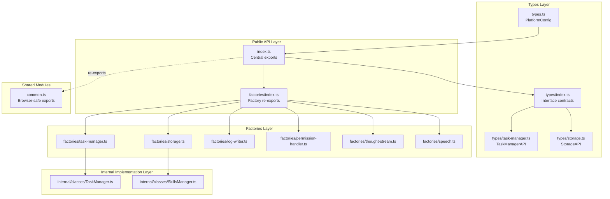
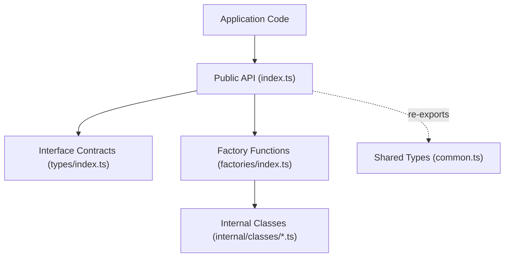
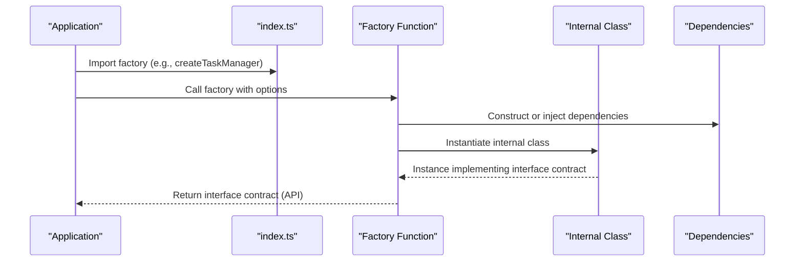
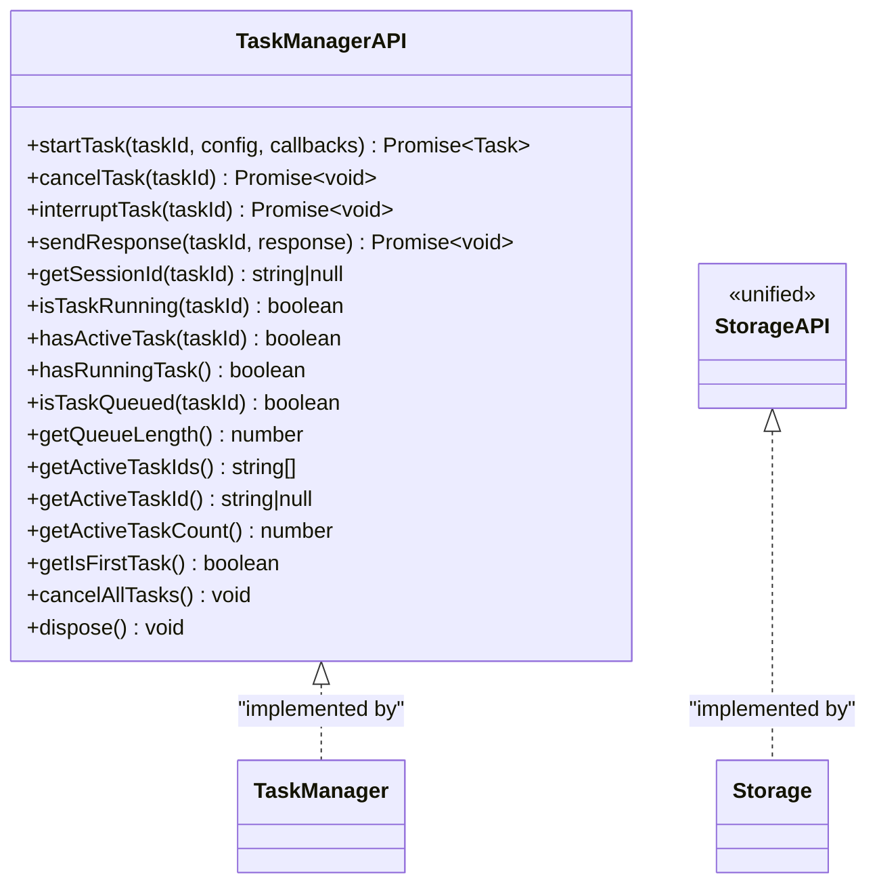
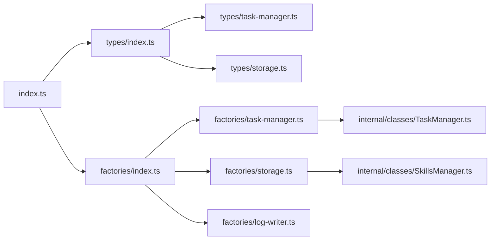

# Core Architecture and Design Patterns

<cite>
**Referenced Files in This Document**
- [index.ts](file://packages/agent-core/src/index.ts)
- [common.ts](file://packages/agent-core/src/common.ts)
- [types.ts](file://packages/agent-core/src/types.ts)
- [types/index.ts](file://packages/agent-core/src/types/index.ts)
- [types/task-manager.ts](file://packages/agent-core/src/types/task-manager.ts)
- [types/storage.ts](file://packages/agent-core/src/types/storage.ts)
- [factories/index.ts](file://packages/agent-core/src/factories/index.ts)
- [factories/task-manager.ts](file://packages/agent-core/src/factories/task-manager.ts)
- [factories/storage.ts](file://packages/agent-core/src/factories/storage.ts)
- [factories/log-writer.ts](file://packages/agent-core/src/factories/log-writer.ts)
- [factories/permission-handler.ts](file://packages/agent-core/src/factories/permission-handler.ts)
- [factories/thought-stream.ts](file://packages/agent-core/src/factories/thought-stream.ts)
- [factories/speech.ts](file://packages/agent-core/src/factories/speech.ts)
- [internal/classes/TaskManager.ts](file://packages/agent-core/src/internal/classes/TaskManager.ts)
- [internal/classes/SkillsManager.ts](file://packages/agent-core/src/internal/classes/SkillsManager.ts)
</cite>

## Table of Contents

1. [Introduction](#introduction)
2. [Project Structure](#project-structure)
3. [Core Components](#core-components)
4. [Architecture Overview](#architecture-overview)
5. [Detailed Component Analysis](#detailed-component-analysis)
6. [Dependency Analysis](#dependency-analysis)
7. [Performance Considerations](#performance-considerations)
8. [Troubleshooting Guide](#troubleshooting-guide)
9. [Conclusion](#conclusion)

## Introduction

This document explains the foundational design principles of the Agent Core Library, focusing on the factory pattern for service creation, interface-based API contracts, and a modular architecture with clear separation of concerns. It documents how dependency injection is achieved through factory functions, how the public API contract system ensures stability, and how backward compatibility is preserved. The layered architecture is described with shared types, utilities, and common modules, and the document provides practical examples of factory usage, service instantiation patterns, and API integration. Extensibility points, customization options, and architectural trade-offs are addressed for both beginners and experienced developers.

## Project Structure

The Agent Core Library organizes functionality into cohesive layers:

- Public API surface: centralized exports and factory functions
- Types: public interface contracts and shared type definitions
- Factories: encapsulated constructors returning interface contracts
- Internal classes: concrete implementations hidden behind factories
- Shared modules: common types, constants, schemas, and utilities

**Diagram sources**

- [index.ts:1-583](file://packages/agent-core/src/index.ts#L1-L583)
- [common.ts:1-241](file://packages/agent-core/src/common.ts#L1-L241)
- [types.ts:1-29](file://packages/agent-core/src/types.ts#L1-L29)
- [types/index.ts:1-72](file://packages/agent-core/src/types/index.ts#L1-L72)
- [types/task-manager.ts:1-230](file://packages/agent-core/src/types/task-manager.ts#L1-L230)
- [types/storage.ts:1-352](file://packages/agent-core/src/types/storage.ts#L1-L352)
- [factories/index.ts:1-8](file://packages/agent-core/src/factories/index.ts#L1-L8)
- [factories/task-manager.ts:1-7](file://packages/agent-core/src/factories/task-manager.ts#L1-L7)
- [factories/storage.ts:1-277](file://packages/agent-core/src/factories/storage.ts#L1-L277)
- [factories/log-writer.ts:1-80](file://packages/agent-core/src/factories/log-writer.ts#L1-L80)
- [factories/permission-handler.ts:1-10](file://packages/agent-core/src/factories/permission-handler.ts#L1-L10)
- [factories/thought-stream.ts:1-7](file://packages/agent-core/src/factories/thought-stream.ts#L1-L7)
- [factories/speech.ts:1-8](file://packages/agent-core/src/factories/speech.ts#L1-L8)
- [internal/classes/TaskManager.ts:1-527](file://packages/agent-core/src/internal/classes/TaskManager.ts#L1-L527)
- [internal/classes/SkillsManager.ts:1-156](file://packages/agent-core/src/internal/classes/SkillsManager.ts#L1-L156)

**Section sources**

- [index.ts:1-583](file://packages/agent-core/src/index.ts#L1-L583)
- [common.ts:1-241](file://packages/agent-core/src/common.ts#L1-L241)
- [types.ts:1-29](file://packages/agent-core/src/types.ts#L1-L29)
- [types/index.ts:1-72](file://packages/agent-core/src/types/index.ts#L1-L72)

## Core Components

This section introduces the primary building blocks of the architecture and how they relate to each other.

- Factory functions: The preferred API for constructing services. They return interface contracts, hiding internal implementation details and enabling controlled dependency injection.
- Interface contracts: Strongly typed APIs that define the behavior consumers must rely on. Examples include TaskManagerAPI, StorageAPI, and others.
- Modular architecture: Clear separation between public API, factories, internal implementations, and shared modules.
- Backward compatibility: Legacy names are re-exported alongside new interface names to avoid breaking changes.

Key characteristics:

- Explicit exports in the public index file ensure API stability.
- Factories encapsulate construction and wiring, centralizing DI.
- Types define contracts for both runtime behavior and compile-time safety.
- Shared modules expose browser-safe types and utilities.

Practical examples (paths only):

- Creating a TaskManager: [factories/task-manager.ts:4-6](file://packages/agent-core/src/factories/task-manager.ts#L4-L6)
- Creating a Storage instance: [factories/storage.ts:113-274](file://packages/agent-core/src/factories/storage.ts#L113-L274)
- Using the public API: [index.ts:14-23](file://packages/agent-core/src/index.ts#L14-L23)

**Section sources**

- [index.ts:14-23](file://packages/agent-core/src/index.ts#L14-L23)
- [index.ts:80-87](file://packages/agent-core/src/index.ts#L80-L87)
- [types/index.ts:1-72](file://packages/agent-core/src/types/index.ts#L1-L72)

## Architecture Overview

The Agent Core Library follows a layered architecture:

- Public API layer: Centralized exports and factory functions
- Types layer: Interface contracts and shared types
- Factories layer: Encapsulated constructors returning interface contracts
- Internal implementation layer: Concrete classes implementing behavior
- Shared modules: Common types, constants, schemas, and utilities

**Diagram sources**

- [index.ts:1-583](file://packages/agent-core/src/index.ts#L1-L583)
- [types/index.ts:1-72](file://packages/agent-core/src/types/index.ts#L1-L72)
- [factories/index.ts:1-8](file://packages/agent-core/src/factories/index.ts#L1-L8)
- [common.ts:1-241](file://packages/agent-core/src/common.ts#L1-L241)

## Detailed Component Analysis

### Factory Pattern and Dependency Injection

The library uses factory functions to implement dependency injection and encapsulation:

- Factories return interface contracts, not concrete classes.
- Dependencies are passed as options or constructed internally by factories.
- This approach enables swapping implementations, testing, and controlled initialization.

Examples:

- TaskManager factory: [factories/task-manager.ts:4-6](file://packages/agent-core/src/factories/task-manager.ts#L4-L6)
- Storage factory: [factories/storage.ts:113-274](file://packages/agent-core/src/factories/storage.ts#L113-L274)
- LogWriter factory: [factories/log-writer.ts:22-79](file://packages/agent-core/src/factories/log-writer.ts#L22-L79)
- Permission handler factory: [factories/permission-handler.ts:7-9](file://packages/agent-core/src/factories/permission-handler.ts#L7-L9)
- Thought stream factory: [factories/thought-stream.ts:4-6](file://packages/agent-core/src/factories/thought-stream.ts#L4-L6)
- Speech service factory: [factories/speech.ts:5-7](file://packages/agent-core/src/factories/speech.ts#L5-L7)

**Diagram sources**

- [index.ts:14-23](file://packages/agent-core/src/index.ts#L14-L23)
- [factories/task-manager.ts:4-6](file://packages/agent-core/src/factories/task-manager.ts#L4-L6)
- [internal/classes/TaskManager.ts:93-103](file://packages/agent-core/src/internal/classes/TaskManager.ts#L93-L103)

**Section sources**

- [factories/index.ts:1-8](file://packages/agent-core/src/factories/index.ts#L1-L8)
- [factories/task-manager.ts:1-7](file://packages/agent-core/src/factories/task-manager.ts#L1-L7)
- [factories/storage.ts:1-277](file://packages/agent-core/src/factories/storage.ts#L1-L277)
- [factories/log-writer.ts:1-80](file://packages/agent-core/src/factories/log-writer.ts#L1-L80)
- [factories/permission-handler.ts:1-10](file://packages/agent-core/src/factories/permission-handler.ts#L1-L10)
- [factories/thought-stream.ts:1-7](file://packages/agent-core/src/factories/thought-stream.ts#L1-L7)
- [factories/speech.ts:1-8](file://packages/agent-core/src/factories/speech.ts#L1-L8)

### Interface-Based API Design and Contracts

The public API is defined by interface contracts that consumers must implement or rely on:

- TaskManagerAPI: Defines task lifecycle operations and state queries.
- StorageAPI: Unifies task, settings, provider, secure storage, connector, desktop control, scheduler, and database lifecycle operations.
- Additional contracts for PermissionHandlerAPI, ThoughtStreamAPI, LogWriterAPI, SkillsManagerAPI, and SpeechServiceAPI.

Contract examples:

- TaskManagerAPI: [types/task-manager.ts:127-229](file://packages/agent-core/src/types/task-manager.ts#L127-L229)
- StorageAPI: [types/storage.ts:321-331](file://packages/agent-core/src/types/storage.ts#L321-L331)
- Public exports: [index.ts:32-78](file://packages/agent-core/src/index.ts#L32-L78)

**Diagram sources**

- [types/task-manager.ts:127-229](file://packages/agent-core/src/types/task-manager.ts#L127-L229)
- [types/storage.ts:321-331](file://packages/agent-core/src/types/storage.ts#L321-L331)
- [internal/classes/TaskManager.ts:93-103](file://packages/agent-core/src/internal/classes/TaskManager.ts#L93-L103)
- [internal/classes/SkillsManager.ts:20-28](file://packages/agent-core/src/internal/classes/SkillsManager.ts#L20-L28)

**Section sources**

- [types/task-manager.ts:1-230](file://packages/agent-core/src/types/task-manager.ts#L1-L230)
- [types/storage.ts:1-352](file://packages/agent-core/src/types/storage.ts#L1-L352)
- [index.ts:32-78](file://packages/agent-core/src/index.ts#L32-L78)

### Modular Architecture and Separation of Concerns

Modularity is achieved through:

- Clear boundaries between public API, factories, internal classes, and shared modules.
- Shared types and utilities in common.ts enable browser-safe usage and reduce duplication.
- Factories encapsulate construction logic and dependency wiring.

Evidence:

- Public API re-exports: [index.ts:100-583](file://packages/agent-core/src/index.ts#L100-L583)
- Shared exports: [common.ts:1-241](file://packages/agent-core/src/common.ts#L1-241)
- Factory re-exports: [factories/index.ts:1-8](file://packages/agent-core/src/factories/index.ts#L1-L8)

**Section sources**

- [index.ts:100-583](file://packages/agent-core/src/index.ts#L100-L583)
- [common.ts:1-241](file://packages/agent-core/src/common.ts#L1-241)
- [factories/index.ts:1-8](file://packages/agent-core/src/factories/index.ts#L1-L8)

### Backward Compatibility Strategy

The library preserves backward compatibility by:

- Re-exporting legacy type names alongside new interface names.
- Maintaining stable public API exports.

Examples:

- Backward-compatible re-exports: [index.ts:80-87](file://packages/agent-core/src/index.ts#L80-L87)

**Section sources**

- [index.ts:80-87](file://packages/agent-core/src/index.ts#L80-L87)

### Practical Examples: Factory Usage and Service Instantiation

- Create a TaskManager: [factories/task-manager.ts:4-6](file://packages/agent-core/src/factories/task-manager.ts#L4-L6)
- Create a Storage instance: [factories/storage.ts:113-274](file://packages/agent-core/src/factories/storage.ts#L113-L274)
- Create a LogWriter: [factories/log-writer.ts:22-79](file://packages/agent-core/src/factories/log-writer.ts#L22-L79)
- Create a PermissionHandler: [factories/permission-handler.ts:7-9](file://packages/agent-core/src/factories/permission-handler.ts#L7-L9)
- Create a ThoughtStream handler: [factories/thought-stream.ts:4-6](file://packages/agent-core/src/factories/thought-stream.ts#L4-L6)
- Create a Speech service: [factories/speech.ts:5-7](file://packages/agent-core/src/factories/speech.ts#L5-L7)

Integration patterns:

- Import the factory from the public API index: [index.ts:14-23](file://packages/agent-core/src/index.ts#L14-L23)
- Pass options conforming to the interface contracts: [types/task-manager.ts:114-125](file://packages/agent-core/src/types/task-manager.ts#L114-L125), [types/storage.ts:25-37](file://packages/agent-core/src/types/storage.ts#L25-L37)

**Section sources**

- [index.ts:14-23](file://packages/agent-core/src/index.ts#L14-L23)
- [types/task-manager.ts:114-125](file://packages/agent-core/src/types/task-manager.ts#L114-L125)
- [types/storage.ts:25-37](file://packages/agent-core/src/types/storage.ts#L25-L37)

### Relationship Between Core Architecture and Application-Specific Implementations

Applications integrate with the core by:

- Using factory functions to construct services with application-specific options.
- Implementing callback interfaces (e.g., TaskCallbacks) to receive lifecycle events.
- Leveraging shared types for cross-module compatibility.

Example integration points:

- Task lifecycle callbacks: [types/task-manager.ts:24-79](file://packages/agent-core/src/types/task-manager.ts#L24-L79)
- Platform configuration types: [types.ts:1-29](file://packages/agent-core/src/types.ts#L1-L29)

**Section sources**

- [types/task-manager.ts:24-79](file://packages/agent-core/src/types/task-manager.ts#L24-L79)
- [types.ts:1-29](file://packages/agent-core/src/types.ts#L1-L29)

## Dependency Analysis

The dependency graph emphasizes the direction of imports and the role of factories and types.

**Diagram sources**

- [index.ts:1-583](file://packages/agent-core/src/index.ts#L1-L583)
- [types/index.ts:1-72](file://packages/agent-core/src/types/index.ts#L1-L72)
- [types/task-manager.ts:1-230](file://packages/agent-core/src/types/task-manager.ts#L1-L230)
- [types/storage.ts:1-352](file://packages/agent-core/src/types/storage.ts#L1-L352)
- [factories/index.ts:1-8](file://packages/agent-core/src/factories/index.ts#L1-L8)
- [factories/task-manager.ts:1-7](file://packages/agent-core/src/factories/task-manager.ts#L1-L7)
- [factories/storage.ts:1-277](file://packages/agent-core/src/factories/storage.ts#L1-L277)
- [factories/log-writer.ts:1-80](file://packages/agent-core/src/factories/log-writer.ts#L1-L80)
- [internal/classes/TaskManager.ts:1-527](file://packages/agent-core/src/internal/classes/TaskManager.ts#L1-L527)
- [internal/classes/SkillsManager.ts:1-156](file://packages/agent-core/src/internal/classes/SkillsManager.ts#L1-L156)

**Section sources**

- [index.ts:1-583](file://packages/agent-core/src/index.ts#L1-L583)
- [types/index.ts:1-72](file://packages/agent-core/src/types/index.ts#L1-L72)
- [factories/index.ts:1-8](file://packages/agent-core/src/factories/index.ts#L1-L8)

## Performance Considerations

- Concurrency control: TaskManager limits concurrent tasks and queues overflow to prevent resource exhaustion. See [internal/classes/TaskManager.ts:91-127](file://packages/agent-core/src/internal/classes/TaskManager.ts#L91-L127).
- Batching and message processing: TaskManager integrates with internal batching utilities to optimize rendering and reduce overhead when onBatchedMessages is provided. See [internal/classes/TaskManager.ts:167-183](file://packages/agent-core/src/internal/classes/TaskManager.ts#L167-L183).
- Resource cleanup: TaskManager disposes adapters and stops proxies on shutdown to free resources. See [internal/classes/TaskManager.ts:512-521](file://packages/agent-core/src/internal/classes/TaskManager.ts#L512-L521).
- Database lifecycle: Storage factory manages initialization, migrations, and closing to avoid repeated setup costs. See [factories/storage.ts:259-273](file://packages/agent-core/src/factories/storage.ts#L259-L273).

[No sources needed since this section provides general guidance]

## Troubleshooting Guide

Common issues and diagnostics:

- CLI availability: TaskManager validates CLI presence before starting tasks and throws a specific error when missing. See [internal/classes/TaskManager.ts:110-113](file://packages/agent-core/src/internal/classes/TaskManager.ts#L110-L113).
- Task state inconsistencies: Use TaskManager’s state queries (e.g., isTaskRunning, hasActiveTask) to diagnose lifecycle issues. See [internal/classes/TaskManager.ts:430-441](file://packages/agent-core/src/internal/classes/TaskManager.ts#L430-L441).
- Queue overflow: When max concurrency is reached, tasks are queued; monitor queue length and adjust maxConcurrentTasks accordingly. See [internal/classes/TaskManager.ts:119-126](file://packages/agent-core/src/internal/classes/TaskManager.ts#L119-L126).
- Storage initialization: Ensure Storage.initialize is called before use and handle migration errors. See [factories/storage.ts:259-266](file://packages/agent-core/src/factories/storage.ts#L259-L266).

**Section sources**

- [internal/classes/TaskManager.ts:110-113](file://packages/agent-core/src/internal/classes/TaskManager.ts#L110-L113)
- [internal/classes/TaskManager.ts:430-441](file://packages/agent-core/src/internal/classes/TaskManager.ts#L430-L441)
- [internal/classes/TaskManager.ts:119-126](file://packages/agent-core/src/internal/classes/TaskManager.ts#L119-L126)
- [factories/storage.ts:259-266](file://packages/agent-core/src/factories/storage.ts#L259-L266)

## Conclusion

The Agent Core Library’s architecture centers on factory functions, interface contracts, and a modular design that enforces separation of concerns. The public API is stable and backward-compatible, while internal implementations remain encapsulated. Applications integrate by constructing services via factories and implementing callback interfaces, enabling extensibility and customization without sacrificing maintainability. The layered structure, combined with clear contracts and controlled dependency injection, provides a robust foundation for building agent-driven applications.
