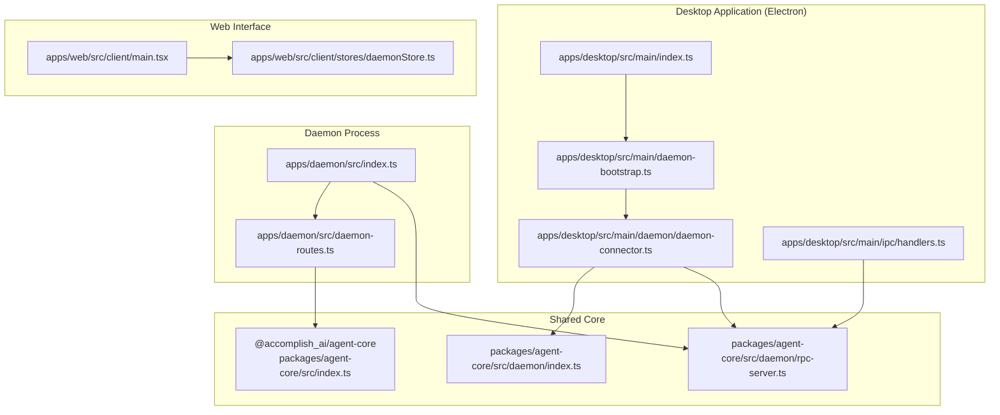
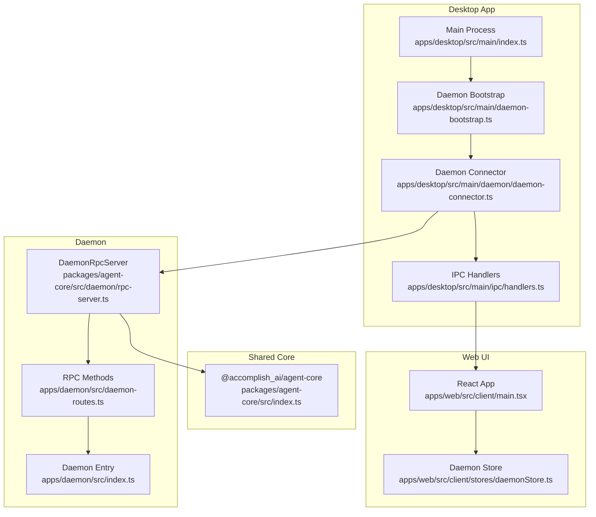
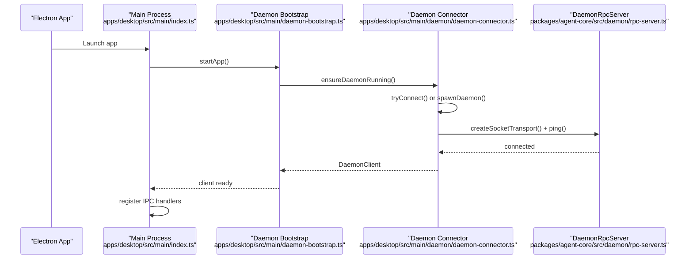
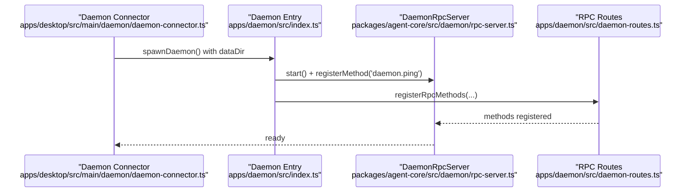
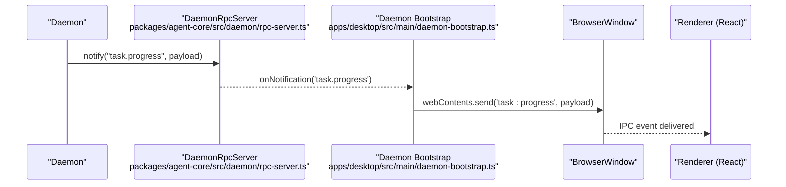
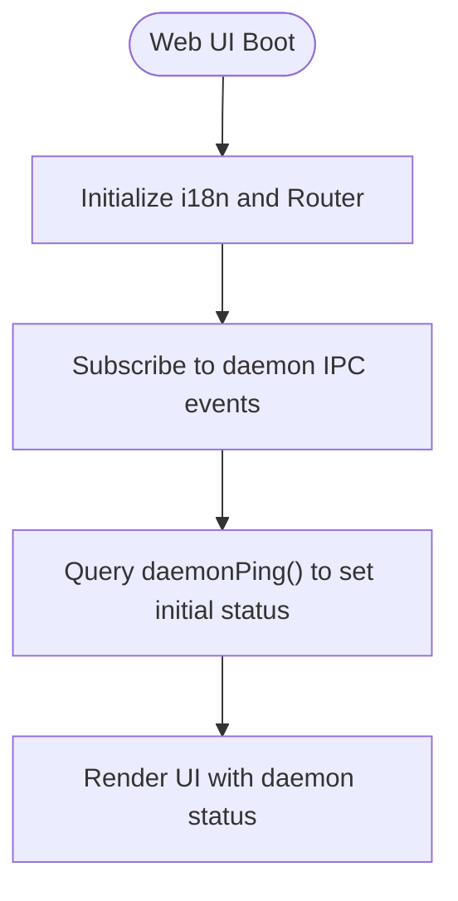
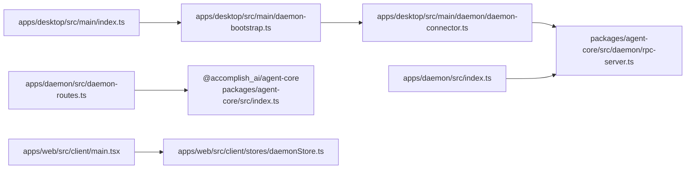

# Architecture Overview

<cite>
**Referenced Files in This Document**
- [README.md](file://README.md)
- [apps/desktop/src/main/index.ts](file://apps/desktop/src/main/index.ts)
- [apps/desktop/src/main/daemon-bootstrap.ts](file://apps/desktop/src/main/daemon-bootstrap.ts)
- [apps/desktop/src/main/daemon/daemon-connector.ts](file://apps/desktop/src/main/daemon/daemon-connector.ts)
- [apps/desktop/src/main/ipc/handlers.ts](file://apps/desktop/src/main/ipc/handlers.ts)
- [apps/daemon/src/index.ts](file://apps/daemon/src/index.ts)
- [apps/daemon/src/daemon-routes.ts](file://apps/daemon/src/daemon-routes.ts)
- [packages/agent-core/src/index.ts](file://packages/agent-core/src/index.ts)
- [packages/agent-core/src/daemon/index.ts](file://packages/agent-core/src/daemon/index.ts)
- [packages/agent-core/src/daemon/rpc-server.ts](file://packages/agent-core/src/daemon/rpc-server.ts)
- [apps/web/src/client/main.tsx](file://apps/web/src/client/main.tsx)
- [apps/web/src/client/stores/daemonStore.ts](file://apps/web/src/client/stores/daemonStore.ts)
- [docs/architecture.md](file://docs/architecture.md)
</cite>

## Table of Contents

1. [Introduction](#introduction)
2. [Project Structure](#project-structure)
3. [Core Components](#core-components)
4. [Architecture Overview](#architecture-overview)
5. [Detailed Component Analysis](#detailed-component-analysis)
6. [Dependency Analysis](#dependency-analysis)
7. [Performance Considerations](#performance-considerations)
8. [Troubleshooting Guide](#troubleshooting-guide)
9. [Conclusion](#conclusion)
10. [Appendices](#appendices)

## Introduction

This document describes the Accomplish system architecture, focusing on the high-level design and interactions among:

- The Electron desktop application (main, preload, renderer)
- The background daemon process (standalone Node.js process)
- The web interface (React-based client)

It explains the microservice-like separation of concerns, IPC and RPC mechanisms, process communication protocols, infrastructure requirements, and cross-cutting concerns such as security, real-time communication, and cross-platform compatibility. It also documents the technology stack and the rationale for running tasks locally to preserve privacy and performance.

## Project Structure

The repository follows a workspace-based monorepo layout with three primary areas:

- apps/desktop: Electron application (main, preload, renderer)
- apps/daemon: Standalone background daemon process
- packages/agent-core: Shared core logic, types, and RPC/IPC abstractions

**Diagram sources**

- [apps/desktop/src/main/index.ts:1-177](file://apps/desktop/src/main/index.ts#L1-L177)
- [apps/desktop/src/main/daemon-bootstrap.ts:1-201](file://apps/desktop/src/main/daemon-bootstrap.ts#L1-L201)
- [apps/desktop/src/main/daemon/daemon-connector.ts:1-412](file://apps/desktop/src/main/daemon/daemon-connector.ts#L1-L412)
- [apps/desktop/src/main/ipc/handlers.ts:1-4](file://apps/desktop/src/main/ipc/handlers.ts#L1-L4)
- [apps/daemon/src/index.ts:1-295](file://apps/daemon/src/index.ts#L1-L295)
- [apps/daemon/src/daemon-routes.ts:1-308](file://apps/daemon/src/daemon-routes.ts#L1-L308)
- [packages/agent-core/src/index.ts:1-583](file://packages/agent-core/src/index.ts#L1-L583)
- [packages/agent-core/src/daemon/index.ts:1-37](file://packages/agent-core/src/daemon/index.ts#L1-L37)
- [packages/agent-core/src/daemon/rpc-server.ts:1-165](file://packages/agent-core/src/daemon/rpc-server.ts#L1-L165)
- [apps/web/src/client/main.tsx:1-22](file://apps/web/src/client/main.tsx#L1-L22)
- [apps/web/src/client/stores/daemonStore.ts:1-86](file://apps/web/src/client/stores/daemonStore.ts#L1-L86)

**Section sources**

- [docs/architecture.md:1-18](file://docs/architecture.md#L1-L18)
- [README.md:296-309](file://README.md#L296-L309)

## Core Components

- Electron desktop app (main process):
  - Initializes logging, single-instance enforcement, protocol handlers, and window lifecycle.
  - Boots and manages the background daemon, forwards daemon notifications to the renderer, and sets up reconnection logic.
- Background daemon:
  - A standalone Node.js process that exposes a Unix socket/Windows named pipe JSON-RPC server.
  - Orchestrates tasks, permissions, scheduling, thought streams, and integrates with MCP tools.
- Shared core (@accomplish_ai/agent-core):
  - Provides RPC server/client abstractions, transports, PID/socket path utilities, and public APIs for factories and types.
- Web interface (React):
  - A client-side UI that subscribes to daemon status and renders execution, history, and settings views.

Key responsibilities:

- Separation of concerns: desktop app handles UI and IPC; daemon handles execution and persistence; shared core provides transport and contracts.
- Local-first execution: tasks run on the user’s machine with optional permission gating and thought streaming.
- Real-time updates: daemon-to-desktop notifications are forwarded to the renderer via IPC channels.

**Section sources**

- [apps/desktop/src/main/index.ts:1-177](file://apps/desktop/src/main/index.ts#L1-L177)
- [apps/desktop/src/main/daemon-bootstrap.ts:1-201](file://apps/desktop/src/main/daemon-bootstrap.ts#L1-L201)
- [apps/desktop/src/main/daemon/daemon-connector.ts:1-412](file://apps/desktop/src/main/daemon/daemon-connector.ts#L1-L412)
- [apps/daemon/src/index.ts:1-295](file://apps/daemon/src/index.ts#L1-L295)
- [apps/daemon/src/daemon-routes.ts:1-308](file://apps/daemon/src/daemon-routes.ts#L1-L308)
- [packages/agent-core/src/index.ts:1-583](file://packages/agent-core/src/index.ts#L1-L583)
- [packages/agent-core/src/daemon/index.ts:1-37](file://packages/agent-core/src/daemon/index.ts#L1-L37)
- [packages/agent-core/src/daemon/rpc-server.ts:1-165](file://packages/agent-core/src/daemon/rpc-server.ts#L1-L165)
- [apps/web/src/client/main.tsx:1-22](file://apps/web/src/client/main.tsx#L1-L22)
- [apps/web/src/client/stores/daemonStore.ts:1-86](file://apps/web/src/client/stores/daemonStore.ts#L1-L86)

## Architecture Overview

The system employs a microservice-like architecture with clear boundaries:

- Desktop main process: orchestrates app lifecycle, spawns/reconnects to the daemon, and forwards daemon notifications to the renderer.
- Daemon process: persistent execution engine exposing a socket-based JSON-RPC server and HTTP endpoints for permission and thought stream services.
- Shared core: defines RPC transport, server/client, and public contracts used by both desktop and daemon.

**Diagram sources**

- [apps/desktop/src/main/index.ts:1-177](file://apps/desktop/src/main/index.ts#L1-L177)
- [apps/desktop/src/main/daemon-bootstrap.ts:1-201](file://apps/desktop/src/main/daemon-bootstrap.ts#L1-L201)
- [apps/desktop/src/main/daemon/daemon-connector.ts:1-412](file://apps/desktop/src/main/daemon/daemon-connector.ts#L1-L412)
- [apps/desktop/src/main/ipc/handlers.ts:1-4](file://apps/desktop/src/main/ipc/handlers.ts#L1-L4)
- [packages/agent-core/src/daemon/rpc-server.ts:1-165](file://packages/agent-core/src/daemon/rpc-server.ts#L1-L165)
- [apps/daemon/src/daemon-routes.ts:1-308](file://apps/daemon/src/daemon-routes.ts#L1-L308)
- [apps/daemon/src/index.ts:1-295](file://apps/daemon/src/index.ts#L1-L295)
- [packages/agent-core/src/index.ts:1-583](file://packages/agent-core/src/index.ts#L1-L583)
- [apps/web/src/client/main.tsx:1-22](file://apps/web/src/client/main.tsx#L1-L22)
- [apps/web/src/client/stores/daemonStore.ts:1-86](file://apps/web/src/client/stores/daemonStore.ts#L1-L86)

## Detailed Component Analysis

### Electron Main Process

- Initializes logging, single-instance enforcement, Sentry, and sets up protocol handlers and IPC.
- Creates the main window and delegates startup to a dedicated function.
- Handles uncaught exceptions and rejections and ensures graceful shutdown.

**Diagram sources**

- [apps/desktop/src/main/index.ts:1-177](file://apps/desktop/src/main/index.ts#L1-L177)
- [apps/desktop/src/main/daemon-bootstrap.ts:1-201](file://apps/desktop/src/main/daemon-bootstrap.ts#L1-L201)
- [apps/desktop/src/main/daemon/daemon-connector.ts:1-412](file://apps/desktop/src/main/daemon/daemon-connector.ts#L1-L412)
- [packages/agent-core/src/daemon/rpc-server.ts:1-165](file://packages/agent-core/src/daemon/rpc-server.ts#L1-L165)

**Section sources**

- [apps/desktop/src/main/index.ts:1-177](file://apps/desktop/src/main/index.ts#L1-L177)

### Daemon Process Lifecycle and RPC

- The daemon initializes PID locking, storage, services, and starts the RPC server and auxiliary HTTP endpoints.
- It registers RPC methods for task orchestration, permissions, scheduling, and integration services.
- It supports graceful shutdown with a drain phase and emits notifications for UI updates.

**Diagram sources**

- [apps/desktop/src/main/daemon/daemon-connector.ts:1-412](file://apps/desktop/src/main/daemon/daemon-connector.ts#L1-L412)
- [apps/daemon/src/index.ts:1-295](file://apps/daemon/src/index.ts#L1-L295)
- [packages/agent-core/src/daemon/rpc-server.ts:1-165](file://packages/agent-core/src/daemon/rpc-server.ts#L1-L165)
- [apps/daemon/src/daemon-routes.ts:1-308](file://apps/daemon/src/daemon-routes.ts#L1-L308)

**Section sources**

- [apps/daemon/src/index.ts:1-295](file://apps/daemon/src/index.ts#L1-L295)
- [apps/daemon/src/daemon-routes.ts:1-308](file://apps/daemon/src/daemon-routes.ts#L1-L308)
- [packages/agent-core/src/daemon/rpc-server.ts:1-165](file://packages/agent-core/src/daemon/rpc-server.ts#L1-L165)

### IPC and Notification Forwarding (Desktop -> Renderer)

- The desktop app registers notification handlers that forward daemon events to the renderer via Electron IPC channels.
- It supports reconnection and re-registers handlers when the daemon client is replaced.

**Diagram sources**

- [packages/agent-core/src/daemon/rpc-server.ts:1-165](file://packages/agent-core/src/daemon/rpc-server.ts#L1-L165)
- [apps/desktop/src/main/daemon-bootstrap.ts:1-201](file://apps/desktop/src/main/daemon-bootstrap.ts#L1-L201)

**Section sources**

- [apps/desktop/src/main/daemon-bootstrap.ts:108-201](file://apps/desktop/src/main/daemon-bootstrap.ts#L108-L201)

### Web Interface Integration

- The React app initializes routing and internationalization, and consumes a global API surface to subscribe to daemon events and manage status.
- The daemon store subscribes to IPC events and reflects connection state in the UI.

**Diagram sources**

- [apps/web/src/client/main.tsx:1-22](file://apps/web/src/client/main.tsx#L1-L22)
- [apps/web/src/client/stores/daemonStore.ts:1-86](file://apps/web/src/client/stores/daemonStore.ts#L1-L86)

**Section sources**

- [apps/web/src/client/main.tsx:1-22](file://apps/web/src/client/main.tsx#L1-L22)
- [apps/web/src/client/stores/daemonStore.ts:1-86](file://apps/web/src/client/stores/daemonStore.ts#L1-L86)

## Dependency Analysis

- Desktop main depends on:
  - Daemon bootstrap and connector for lifecycle and reconnection.
  - IPC handlers for desktop-to-daemon interactions.
- Daemon depends on:
  - Shared core RPC server and transport abstractions.
  - Task, permission, scheduler, and thought stream services.
- Shared core provides:
  - RPC server/client, transports, PID/socket path utilities, and public API contracts.

**Diagram sources**

- [apps/desktop/src/main/index.ts:1-177](file://apps/desktop/src/main/index.ts#L1-L177)
- [apps/desktop/src/main/daemon-bootstrap.ts:1-201](file://apps/desktop/src/main/daemon-bootstrap.ts#L1-L201)
- [apps/desktop/src/main/daemon/daemon-connector.ts:1-412](file://apps/desktop/src/main/daemon/daemon-connector.ts#L1-L412)
- [packages/agent-core/src/daemon/rpc-server.ts:1-165](file://packages/agent-core/src/daemon/rpc-server.ts#L1-L165)
- [apps/daemon/src/index.ts:1-295](file://apps/daemon/src/index.ts#L1-L295)
- [apps/daemon/src/daemon-routes.ts:1-308](file://apps/daemon/src/daemon-routes.ts#L1-L308)
- [packages/agent-core/src/index.ts:1-583](file://packages/agent-core/src/index.ts#L1-L583)
- [apps/web/src/client/main.tsx:1-22](file://apps/web/src/client/main.tsx#L1-L22)
- [apps/web/src/client/stores/daemonStore.ts:1-86](file://apps/web/src/client/stores/daemonStore.ts#L1-L86)

**Section sources**

- [packages/agent-core/src/index.ts:1-583](file://packages/agent-core/src/index.ts#L1-L583)
- [packages/agent-core/src/daemon/index.ts:1-37](file://packages/agent-core/src/daemon/index.ts#L1-L37)

## Performance Considerations

- Local execution: Tasks run on the user’s machine to minimize latency and avoid network overhead.
- Efficient IPC/RPC: Socket-based JSON-RPC minimizes serialization overhead compared to HTTP.
- Backoff reconnection: Exponential backoff reduces load during transient failures.
- Graceful shutdown: Drain phase prevents abrupt termination of active tasks, improving reliability.

## Troubleshooting Guide

Common scenarios and diagnostics:

- Daemon not reachable:
  - Verify socket path and PID lock; ensure the daemon is started with the correct data directory.
  - Check reconnection logs and confirm exponential backoff is triggered.
- Permission requests not received:
  - Confirm the daemon has connected clients and that the UI is subscribed to permission events.
- UI shows disconnected state:
  - Inspect daemon store subscriptions and ensure IPC event handlers are registered.

Operational tips:

- Use the daemon log tailing facility in development to observe real-time output.
- Monitor daemon ping and status endpoints to validate health.

**Section sources**

- [apps/desktop/src/main/daemon/daemon-connector.ts:158-213](file://apps/desktop/src/main/daemon/daemon-connector.ts#L158-L213)
- [apps/web/src/client/stores/daemonStore.ts:48-86](file://apps/web/src/client/stores/daemonStore.ts#L48-L86)
- [apps/daemon/src/daemon-routes.ts:177-177](file://apps/daemon/src/daemon-routes.ts#L177-L177)

## Conclusion

Accomplish separates UI, execution, and persistence into distinct processes with a clear RPC boundary. The Electron desktop app manages lifecycle and user experience, the daemon executes tasks and enforces permissions, and the shared core provides transport and contracts. This design emphasizes local-first execution, privacy, and scalability through modular services.

## Appendices

### Technology Stack

- Desktop: Electron, React, TypeScript
- Runtime and tooling: Node.js, Vite
- Core framework: @accomplish_ai/agent-core (RPC, transports, factories, types)
- IPC/RPC: Unix socket/Windows named pipe JSON-RPC 2.0

**Section sources**

- [README.md:296-309](file://README.md#L296-L309)
- [packages/agent-core/src/index.ts:1-583](file://packages/agent-core/src/index.ts#L1-L583)

### Infrastructure Requirements

- Single-instance enforcement and protocol handlers for deep-linking.
- Cross-platform socket path resolution and PID lock management.
- Optional packaged mode with resource path injection for MCP tools and assets.

**Section sources**

- [apps/desktop/src/main/index.ts:118-177](file://apps/desktop/src/main/index.ts#L118-L177)
- [apps/desktop/src/main/daemon/daemon-connector.ts:55-122](file://apps/desktop/src/main/daemon/daemon-connector.ts#L55-L122)
- [apps/daemon/src/index.ts:113-124](file://apps/daemon/src/index.ts#L113-L124)

### Security and Permissions

- Permission requests are routed through the daemon and surfaced to the UI for user approval.
- Thought stream and checkpoint events are forwarded to the UI for transparency.
- API keys and sensitive data are stored securely in OS keychain and protected by the daemon’s storage layer.

**Section sources**

- [apps/daemon/src/daemon-routes.ts:150-176](file://apps/daemon/src/daemon-routes.ts#L150-L176)
- [apps/desktop/src/main/daemon-bootstrap.ts:168-200](file://apps/desktop/src/main/daemon-bootstrap.ts#L168-L200)

### Real-Time Communication

- Notifications from the daemon are forwarded to the renderer via IPC channels.
- The web UI subscribes to daemon status and updates the UI accordingly.

**Section sources**

- [packages/agent-core/src/daemon/rpc-server.ts:78-87](file://packages/agent-core/src/daemon/rpc-server.ts#L78-L87)
- [apps/desktop/src/main/daemon-bootstrap.ts:131-200](file://apps/desktop/src/main/daemon-bootstrap.ts#L131-L200)
- [apps/web/src/client/stores/daemonStore.ts:48-86](file://apps/web/src/client/stores/daemonStore.ts#L48-L86)

### Cross-Platform Compatibility

- Socket path and PID lock utilities adapt to platform-specific paths.
- Packaging logic injects resources and environment variables for MCP tools and assets.

**Section sources**

- [packages/agent-core/src/daemon/rpc-server.ts:156-163](file://packages/agent-core/src/daemon/rpc-server.ts#L156-L163)
- [apps/desktop/src/main/daemon/daemon-connector.ts:55-122](file://apps/desktop/src/main/daemon/daemon-connector.ts#L55-L122)
- [apps/daemon/src/index.ts:113-124](file://apps/daemon/src/index.ts#L113-L124)
