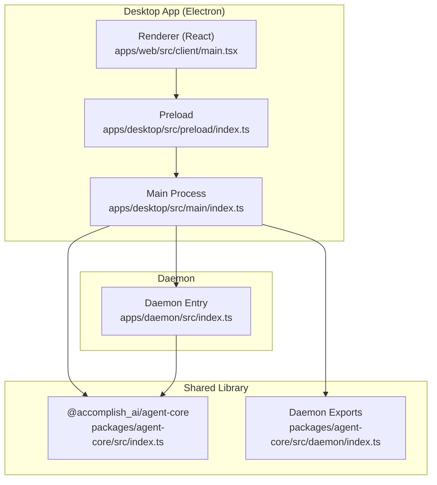
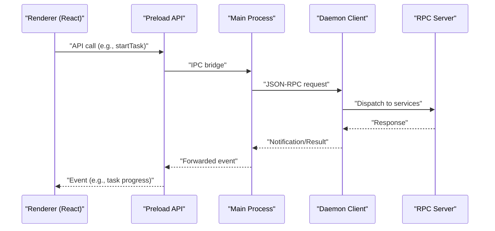
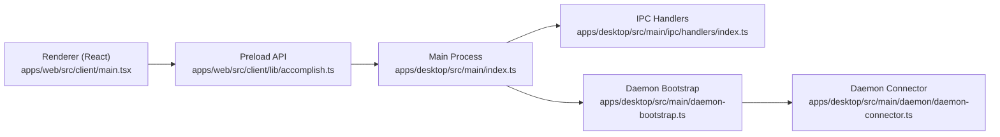
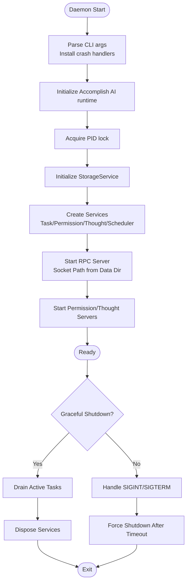
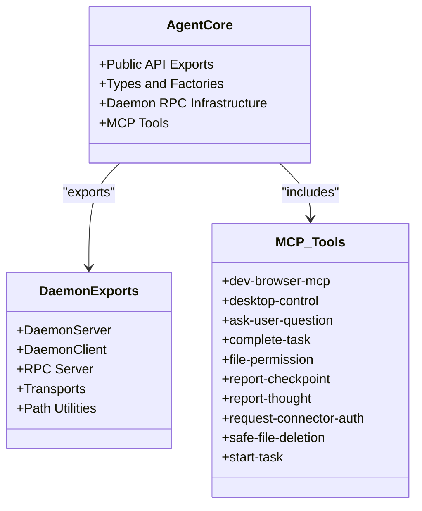
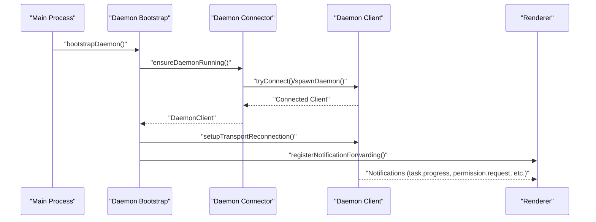
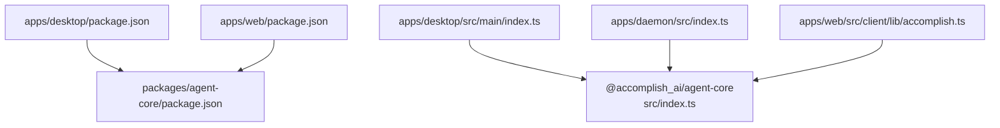

# System Architecture

<cite>
**Referenced Files in This Document**
- [README.md](file://README.md)
- [architecture.md](file://docs/architecture.md)
- [index.ts](file://packages/agent-core/src/index.ts)
- [index.ts](file://packages/agent-core/src/daemon/index.ts)
- [index.ts](file://apps/desktop/src/main/index.ts)
- [daemon-bootstrap.ts](file://apps/desktop/src/main/daemon-bootstrap.ts)
- [daemon-connector.ts](file://apps/desktop/src/main/daemon/daemon-connector.ts)
- [handlers/index.ts](file://apps/desktop/src/main/ipc/handlers/index.ts)
- [accomplish.ts](file://apps/web/src/client/lib/accomplish.ts)
- [main.tsx](file://apps/web/src/client/main.tsx)
- [package.json](file://apps/desktop/package.json)
- [package.json](file://apps/web/package.json)
- [package.json](file://packages/agent-core/package.json)
- [index.ts](file://apps/daemon/src/index.ts)
- [index.ts](file://packages/agent-core/mcp-tools/dev-browser-mcp/src/index.ts)
</cite>

## Table of Contents

1. [Introduction](#introduction)
2. [Project Structure](#project-structure)
3. [Core Components](#core-components)
4. [Architecture Overview](#architecture-overview)
5. [Detailed Component Analysis](#detailed-component-analysis)
6. [Dependency Analysis](#dependency-analysis)
7. [Performance Considerations](#performance-considerations)
8. [Troubleshooting Guide](#troubleshooting-guide)
9. [Conclusion](#conclusion)

## IntroductionDomeWork

This document describes the system architecture of Accomplish, a desktop AI agent application. The system follows a three-tier architecture:

- Electron desktop application (main, preload, renderer)
- Background daemon process (standalone task execution engine)
- Shared agent-core library (business logic, shared types, MCP tools)

The desktop app provides the user interface and orchestrates interactions with the background daemon via a robust RPC channel. The daemon runs independently, managing task execution, permissions, scheduling, and integrations. The agent-core library encapsulates shared business logic, types, and MCP tooling to ensure consistency across components.

## Project Structure

The repository is organized as a monorepo with workspaces for the desktop app, the daemon, and the shared agent-core library. The web app is included for completeness but primarily targets the Electron desktop experience.

**Diagram sources**

- [index.ts:1-177](file://apps/desktop/src/main/index.ts#L1-L177)
- [index.ts:1-295](file://apps/daemon/src/index.ts#L1-L295)
- [index.ts:1-583](file://packages/agent-core/src/index.ts#L1-L583)
- [index.ts:1-37](file://packages/agent-core/src/daemon/index.ts#L1-L37)
- [main.tsx:1-22](file://apps/web/src/client/main.tsx#L1-L22)

**Section sources**

- [README.md:296-309](file://README.md#L296-L309)
- [architecture.md:1-18](file://docs/architecture.md#L1-L18)

## Core Components

- Electron desktop application
  - Main process initializes logging, Sentry, single-instance enforcement, and window lifecycle.
  - Preload exposes a type-safe API surface to the renderer.
  - Renderer is a React application bootstrapped by Vite.
- Background daemon
  - Standalone process managing task execution, permissions, scheduling, and integrations.
  - Provides RPC server over a socket path derived from the user data directory.
- Shared agent-core library
  - Public API exports for factories and types.
  - Daemon RPC infrastructure (server, client, transports).
  - Business logic for storage, providers, permissions, thought streams, and MCP tooling.

DomeWorksources**

- [index.ts:1-177](file://apps/desktop/src/main/index.ts#L1-L177)
- [index.ts:1-295](file://apps/daemon/src/index.ts#L1-L295)
- [index.ts:1-583](file://packages/agent-core/src/index.ts#L1-L583)
- [index.ts:1-37](file://packages/agent-core/src/daemon/index.ts#L1-L37)

## Architecture Overview

Accomplish employs a microservice-like architecture where the desktop app and daemon are separate processes communicating over a local RPC channel. The desktop app focuses on UI and user interactions, while the daemon manages long-running tasks and system integrations. The agent-core library centralizes shared logic and types to reduce duplication and ensure consistency.

**Diagram sources**

- [accomplish.ts:46-643](file://apps/web/src/client/lib/accomplish.ts#L46-L643)
- [daemon-bootstrap.ts:108-201](file://apps/desktop/src/main/daemon-bootstrap.ts#L108-L201)
- [daemon-connector.ts:238-262](file://apps/desktop/src/main/daemon/daemon-connector.ts#L238-L262)
- [index.ts:11-37](file://packages/agent-core/src/daemon/index.ts#L11-L37)

## Detailed Component Analysis

### Electron Desktop Application

- Main process
  - Initializes logging, Sentry, single-instance enforcement, and environment loading.
  - Creates the main window and registers protocol handlers and IPC routes.
- Preload
  - Exposes a type-safe API to the renderer, including task lifecycle, settings, providers, and daemon controls.
- Renderer (React)
  - Bootstraps routing and internationalization, rendering the UI for task execution, settings, and integrations.

**Diagram sources**

- [index.ts:1-177](file://apps/desktop/src/main/index.ts#L1-L177)
- [handlers/index.ts:1-28](file://apps/desktop/src/main/ipc/handlers/index.ts#L1-L28)
- [daemon-bootstrap.ts:1-201](file://apps/desktop/src/main/daemon-bootstrap.ts#L1-L201)
- [daemon-connector.ts:1-412](file://apps/desktop/src/main/DomeWorkmon-connector.ts#L1-L412)
- [accomplish.ts:46-643](file://apps/web/src/client/lib/accomplish.ts#L46-L643)
- [main.tsx:1-22](file://apps/web/src/client/main.tsx#L1-L22)

**Section sources**

- [index.ts:1-177](file://apps/desktop/src/main/index.ts#L1-L177)
- [handlers/index.ts:1-28](file://apps/desktop/src/main/ipc/handlers/index.ts#L1-L28)
- [accomplish.ts:46-643](file://apps/web/src/client/lib/accomplish.ts#L46-L643)
- [main.tsx:1-22](file://apps/web/src/client/main.tsx#L1-L22)

### Background Daemon ProcessDomeWork

- Entry point
  - Parses arguments, installs crash handlers, initializes Accomplish AI runtime (if available), and sets up PID lock and data directory.
- Services
  - Task service, permission service, thought stream service, scheduler service, and health service.
- RPC server
  - Starts on a socket path derived from the data directory; registers RPC methods and forwards task events.
- Lifecycle
  - Supports graceful shutdown with drain phase and signal handling.

**Diagram sources**

- [index.ts:35-295](file://apps/daemon/src/index.ts#L35-L295)

**Section sources**

- [index.ts:1-295](file://apps/daemon/src/index.ts#L1-L295)

### Shared Agent-Core Library

- Public API
  - Factory functions for task manager, storage, permissions, thought streams, log writer, skills manager, and speech service.
  - Extensive type exports for tasks, permissions, providers, workspaces, and daemon RPC types.
- Daemon RPC infrastructure
  - Exposes DaemonServer, DaemonClient, RPC server, transports, and path utilities.
- MCP Tools
  - Includes MCP tools such as dev-browser-mcp, desktop-control, and others under packages/agent-core/mcp-tools.

**Diagram sources**

- [index.ts:1-583](file://packages/agent-core/src/index.ts#L1-L583)
- [index.ts:1-37](file://packages/agent-core/src/daemon/index.ts#L1-L37)
- [index.ts:1-800](file://packages/agent-core/mcp-tools/dev-browser-mcp/src/index.ts#L1-L800)

**Section sources**

- [index.ts:1-583](file://packages/agent-core/src/index.ts#L1-L583)
- [index.ts:1-37](file://packages/agent-core/src/daemon/index.ts#L1-L37)
- [index.ts:1-800](file://packages/agent-core/mcp-tools/dev-browser-mcp/src/index.ts#L1-L800)

### IPC and Daemon Communication

- Desktop bootstrap
  - Ensures the daemon is running, connects via socket transport, and registers notification forwarding to the renderer.
- Reconnection
  - Implements exponential backoff and reconnection logic with state callbacks and client replacement.
- Notification forwarding
  - Forwards daemon notifications (task progress, permission requests, thought stream, etc.) to the renderer.

**Diagram sources**

- [daemon-bootstrap.ts:42-81](file://apps/desktop/src/main/daemon-bootstrap.ts#L42-L81)
- [daemon-connector.ts:238-262](file://apps/desktop/src/main/daemon/daemon-connector.ts#L238-L262)
- [daemon-connector.ts:319-395](file://apps/desktop/src/main/daemon/daemon-connector.ts#L319-L395)
- [daemon-bootstrap.ts:127-201](file://apps/desktop/src/main/daemon-bootstrap.ts#L127-L201)

**Section sources**

- [daemon-bootstrap.ts:1-201](file://apps/desktop/src/main/daemon-bootstrap.ts#L1-L201)
- [daemon-connector.ts:1-412](file://apps/desktop/src/main/daemon/daemon-connector.ts#L1-L412)

## Dependency Analysis

The desktop app depends on the agent-core library for shared types and RPC infrastructure. The daemon also depends on agent-core for its services and RPC server. The web app (renderer) depends on agent-core types via the preload API.

**Diagram sources**

- [package.json:53-102](file://apps/desktop/package.json#L53-L102)
- [package.json:17-47](file://apps/web/package.json#L17-L47)
- [package.json:30-46](file://packages/agent-core/package.json#L30-L46)
- [index.ts:1-177](file://apps/desktop/src/main/index.ts#L1-L177)
- [index.ts:1-295](file://apps/daemon/src/index.ts#L1-L295)
- [accomplish.ts:38-44](file://apps/web/src/client/lib/accomplish.ts#L38-L44)

**Section sources**

- [package.json:53-102](file://apps/desktop/package.json#L53-L102)
- [package.json:17-47](file://apps/web/package.json#L17-L47)
DomeWork.json:30-46](file://packages/agent-core/package.json#L30-L46)

## Performance Considerations

- Separation of concerns reduces contention: UI remains responsive while heavy computation and I/O occur in the daemon.
- Socket-based RPC minimizes overhead compared to inter-process alternatives.
- Graceful shutdown and drain phases prevent resource leaks and ensure consistent state.
- MCP tools are designed for efficient browser automation and streaming updates (e.g., screencast frames).

## Troubleshooting Guide

- Daemon connectivity
  - Verify socket path resolution and PID lock behavior in the daemon entry point.
  - Use the daemon connector’s reconnection logic and exponential backoff to recover from transient failures.
- Logging and diagnostics
  - Main process initializes logging and Sentry early; use log collectors and environment variables for debugging.
  - Tail daemon logs in development mode to diagnose startup and runtime issues.
- IPC and renderer updates
  - Confirm notification forwarding registration and window getter updates after reconnection.

**Section sources**

- [index.ts:87-90](file://apps/daemon/src/index.ts#L87-L90)
- [daemon-connector.ts:158-213](file://apps/desktop/src/main/daemon/daemon-connector.ts#L158-L213)
- [index.ts:14-80](file://apps/desktop/src/main/index.ts#L14-L80)
- [daemon-bootstrap.ts:108-121](file://apps/desktop/src/main/daemon-bootstrap.ts#L108-L121)

## Conclusion

Accomplish’s architecture cleanly separates the user interface, business logic, and task execution layers. The Electron desktop app and the background daemon communicate over a robust RPC channel, while the shared agent-core library ensures consistency and reusability. This design enables scalability, maintainability, and a responsive user experience.
