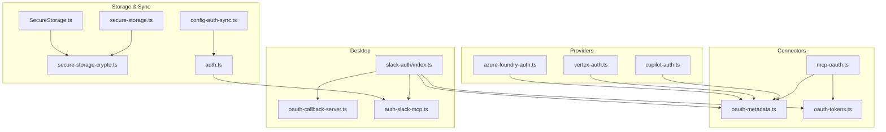
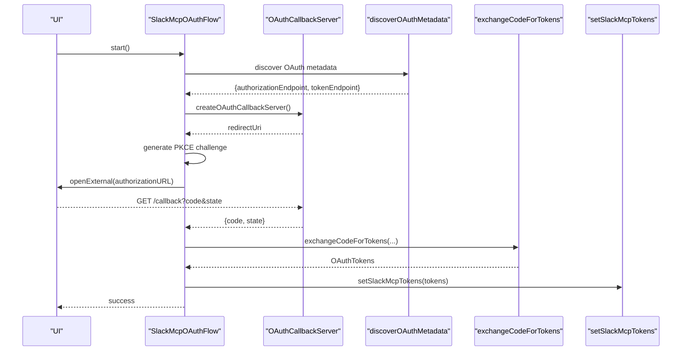
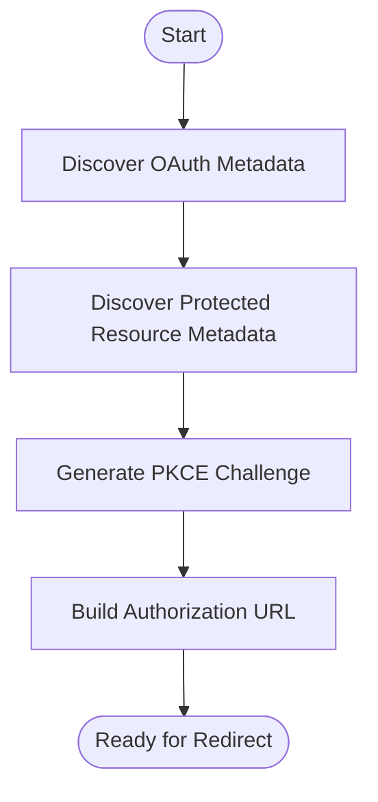
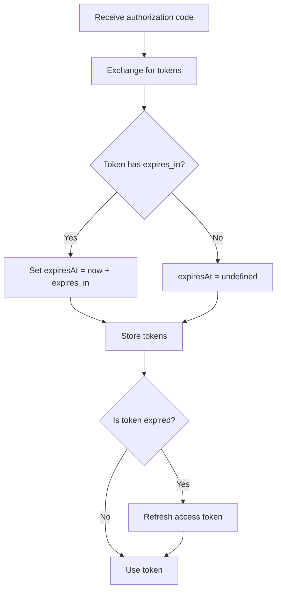
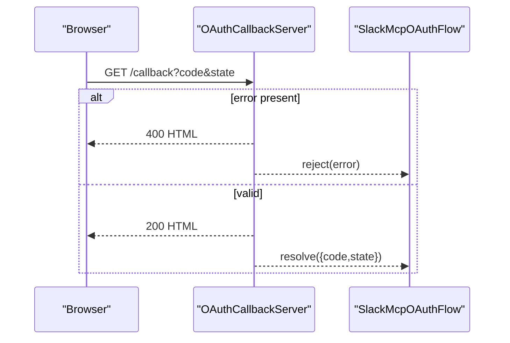
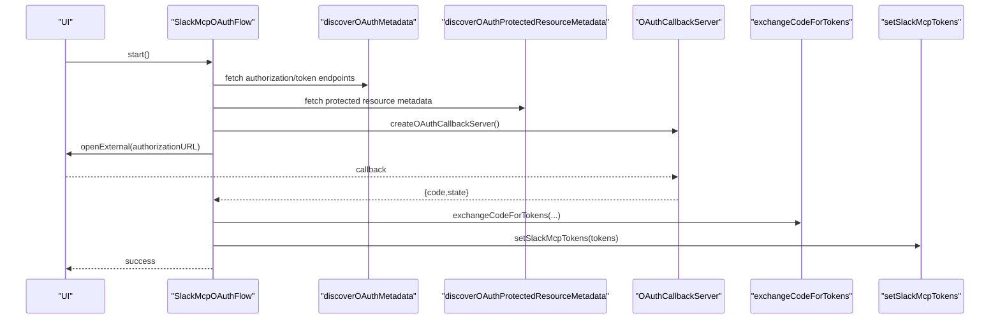
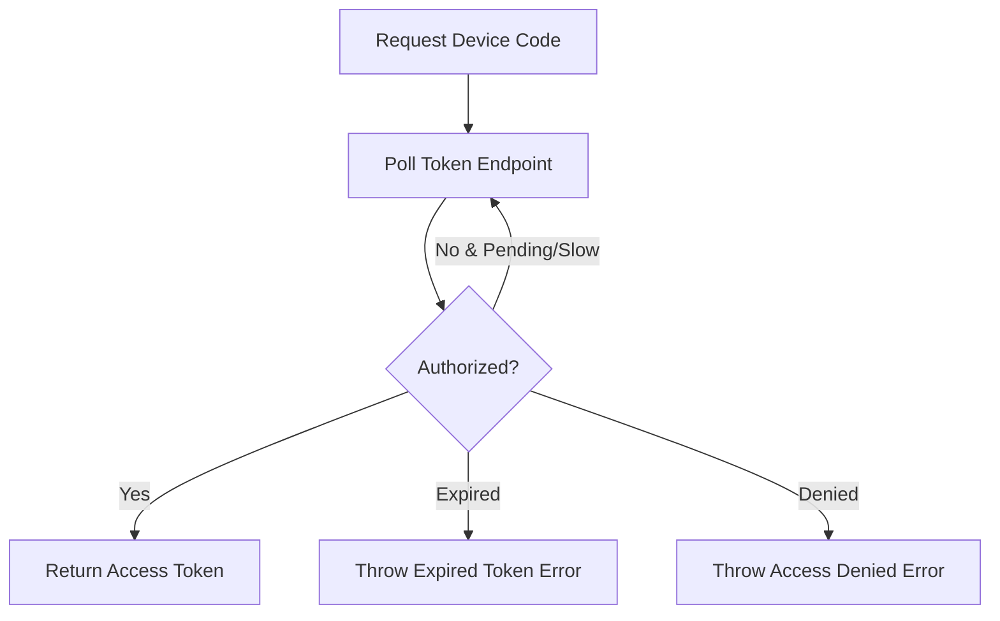
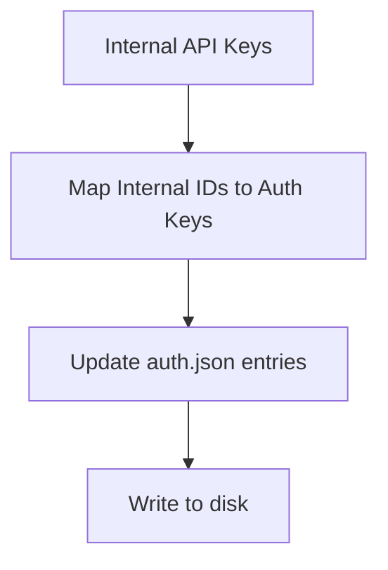
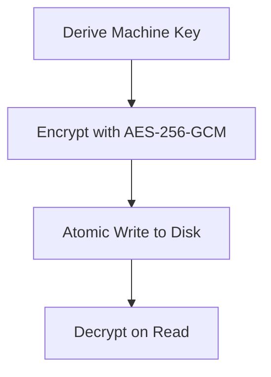
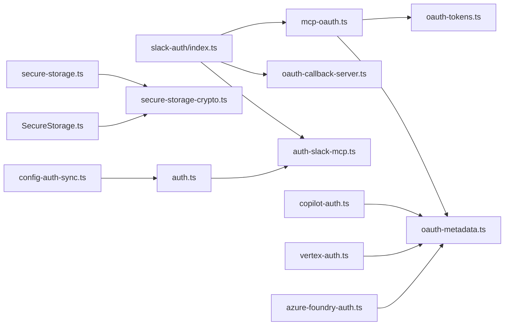

# Authentication and OAuth

<cite>
**Referenced Files in This Document**
- [oauth-tokens.ts](file://packages/agent-core/src/connectors/oauth-tokens.ts)
- [oauth-metadata.ts](file://packages/agent-core/src/connectors/oauth-metadata.ts)
- [mcp-oauth.ts](file://packages/agent-core/src/connectors/mcp-oauth.ts)
- [oauth-callback-server.ts](file://apps/desktop/src/main/oauth-callback-server.ts)
- [slack-auth/index.ts](file://apps/desktop/src/main/opencode/slack-auth/index.ts)
- [auth-slack-mcp.ts](file://packages/agent-core/src/opencode/auth-slack-mcp.ts)
- [connector.ts](file://packages/agent-core/src/common/types/connector.ts)
- [copilot-auth.ts](file://packages/agent-core/src/providers/copilot-auth.ts)
- [vertex-auth.ts](file://packages/agent-core/src/providers/vertex-auth.ts)
- [azure-foundry-auth.ts](file://packages/agent-core/src/providers/azure-foundry-auth.ts)
- [auth.ts](file://packages/agent-core/src/opencode/auth.ts)
- [config-auth-sync.ts](file://packages/agent-core/src/opencode/config-auth-sync.ts)
- [secure-storage.ts](file://packages/agent-core/src/storage/secure-storage.ts)
- [SecureStorage.ts](file://packages/agent-core/src/internal/classes/SecureStorage.ts)
- [secure-storage-crypto.ts](file://packages/agent-core/src/internal/classes/secure-storage-crypto.ts)
- [mcp-oauth.unit.test.ts](file://packages/agent-core/tests/connectors/mcp-oauth.unit.test.ts)
- [oauth-callback-server.unit.test.ts](file://apps/desktop/__tests__/unit/main/oauth-callback-server.unit.test.ts)
</cite>

## Table of Contents

1. [Introduction](#introduction)
2. [Project Structure](#project-structure)
3. [Core Components](#core-components)
4. [Architecture Overview](#architecture-overview)
5. [Detailed Component Analysis](#detailed-component-analysis)
6. [Dependency Analysis](#dependency-analysis)
7. [Performance Considerations](#performance-considerations)
8. [Troubleshooting Guide](#troubleshooting-guide)
9. [Conclusion](#conclusion)
10. [Appendices](#appendices)

## Introduction

This document explains the Authentication and OAuth subsystem across the project, focusing on multi-provider authentication, OAuth token management, session handling, Slack integration, MCP OAuth handling, and token synchronization. It covers both conceptual overviews for beginners and technical details for experienced developers, including security considerations, credential storage, and practical examples for setup, token refresh, and troubleshooting.

## Project Structure

The authentication and OAuth capabilities are implemented across shared connectors, provider-specific modules, desktop callback handling, and secure storage utilities. The key areas include:

- OAuth metadata discovery and PKCE helpers
- Token exchange and refresh utilities
- Desktop OAuth callback server
- Slack MCP OAuth flow and persistence
- Provider-specific flows (GitHub Copilot device code, Azure Foundry, Google Vertex)
- Secure credential storage and OpenCode auth synchronization

**Diagram sources**

- [oauth-metadata.ts:1-155](file://packages/agent-core/src/connectors/oauth-metadata.ts#L1-L155)
- [oauth-tokens.ts:1-126](file://packages/agent-core/src/connectors/oauth-tokens.ts#L1-L126)
- [mcp-oauth.ts:1-97](file://packages/agent-core/src/connectors/mcp-oauth.ts#L1-L97)
- [oauth-callback-server.ts:1-129](file://apps/desktop/src/main/oauth-callback-server.ts#L1-L129)
- [slack-auth/index.ts:1-173](file://apps/desktop/src/main/opencode/slack-auth/index.ts#L1-L173)
- [auth-slack-mcp.ts:1-125](file://packages/agent-core/src/opencode/auth-slack-mcp.ts#L1-L125)
- [copilot-auth.ts:1-128](file://packages/agent-core/src/providers/copilot-auth.ts#L1-L128)
- [vertex-auth.ts:1-126](file://packages/agent-core/src/providers/vertex-auth.ts#L1-L126)
- [azure-foundry-auth.ts:1-148](file://packages/agent-core/src/providers/azure-foundry-auth.ts#L1-L148)
- [secure-storage.ts:105-277](file://packages/agent-core/src/storage/secure-storage.ts#L105-L277)
- [SecureStorage.ts:1-203](file://packages/agent-core/src/internal/classes/SecureStorage.ts#L1-L203)
- [secure-storage-crypto.ts:1-114](file://packages/agent-core/src/internal/classes/secure-storage-crypto.ts#L1-L114)
- [auth.ts:1-117](file://packages/agent-core/src/opencode/auth.ts#L1-L117)
- [config-auth-sync.ts:1-80](file://packages/agent-core/src/opencode/config-auth-sync.ts#L1-L80)

**Section sources**

- [oauth-metadata.ts:1-155](file://packages/agent-core/src/connectors/oauth-metadata.ts#L1-L155)
- [oauth-tokens.ts:1-126](file://packages/agent-core/src/connectors/oauth-tokens.ts#L1-L126)
- [mcp-oauth.ts:1-97](file://packages/agent-core/src/connectors/mcp-oauth.ts#L1-L97)
- [oauth-callback-server.ts:1-129](file://apps/desktop/src/main/oauth-callback-server.ts#L1-L129)
- [slack-auth/index.ts:1-173](file://apps/desktop/src/main/opencode/slack-auth/index.ts#L1-L173)
- [auth-slack-mcp.ts:1-125](file://packages/agent-core/src/opencode/auth-slack-mcp.ts#L1-L125)
- [copilot-auth.ts:1-128](file://packages/agent-core/src/providers/copilot-auth.ts#L1-L128)
- [vertex-auth.ts:1-126](file://packages/agent-core/src/providers/vertex-auth.ts#L1-L126)
- [azure-foundry-auth.ts:1-148](file://packages/agent-core/src/providers/azure-foundry-auth.ts#L1-L148)
- [secure-storage.ts:105-277](file://packages/agent-core/src/storage/secure-storage.ts#L105-L277)
- [SecureStorage.ts:1-203](file://packages/agent-core/src/internal/classes/SecureStorage.ts#L1-L203)
- [secure-storage-crypto.ts:1-114](file://packages/agent-core/src/internal/classes/secure-storage-crypto.ts#L1-L114)
- [auth.ts:1-117](file://packages/agent-core/src/opencode/auth.ts#L1-L117)
- [config-auth-sync.ts:1-80](file://packages/agent-core/src/opencode/config-auth-sync.ts#L1-L80)

## Core Components

- OAuth metadata discovery and PKCE helpers: Discover authorization and token endpoints, protected resource metadata, and build authorization URLs with PKCE challenges.
- OAuth token exchange and refresh: Exchange authorization codes for tokens, refresh expired access tokens, and detect expiration with a buffer.
- Desktop OAuth callback server: Local HTTP server to receive OAuth callbacks securely on loopback interfaces with timeouts and error handling.
- Slack MCP OAuth flow: Complete OAuth 2.0 with PKCE against Slack MCP, persisting tokens and state to a dedicated JSON file.
- Provider-specific flows: GitHub Copilot device code flow, Google Vertex access token acquisition, and Azure Foundry auth helpers.
- Secure storage: AES-256-GCM encrypted storage for API keys and sensitive values with machine-derived keys.
- OpenCode auth synchronization: Bridge internal provider IDs to OpenCode auth.json keys and synchronize API keys.

**Section sources**

- [mcp-oauth.ts:1-97](file://packages/agent-core/src/connectors/mcp-oauth.ts#L1-L97)
- [oauth-tokens.ts:1-126](file://packages/agent-core/src/connectors/oauth-tokens.ts#L1-L126)
- [oauth-callback-server.ts:1-129](file://apps/desktop/src/main/oauth-callback-server.ts#L1-L129)
- [slack-auth/index.ts:1-173](file://apps/desktop/src/main/opencode/slack-auth/index.ts#L1-L173)
- [auth-slack-mcp.ts:1-125](file://packages/agent-core/src/opencode/auth-slack-mcp.ts#L1-L125)
- [copilot-auth.ts:1-128](file://packages/agent-core/src/providers/copilot-auth.ts#L1-L128)
- [vertex-auth.ts:1-126](file://packages/agent-core/src/providers/vertex-auth.ts#L1-L126)
- [azure-foundry-auth.ts:1-148](file://packages/agent-core/src/providers/azure-foundry-auth.ts#L1-L148)
- [secure-storage.ts:105-277](file://packages/agent-core/src/storage/secure-storage.ts#L105-L277)
- [SecureStorage.ts:1-203](file://packages/agent-core/src/internal/classes/SecureStorage.ts#L1-L203)
- [secure-storage-crypto.ts:1-114](file://packages/agent-core/src/internal/classes/secure-storage-crypto.ts#L1-L114)
- [auth.ts:1-117](file://packages/agent-core/src/opencode/auth.ts#L1-L117)
- [config-auth-sync.ts:1-80](file://packages/agent-core/src/opencode/config-auth-sync.ts#L1-L80)

## Architecture Overview

The authentication system follows a layered design:

- Connectors provide reusable OAuth primitives (metadata discovery, PKCE, token exchange/refresh).
- Desktop components orchestrate the interactive OAuth flow (callback server, Slack MCP flow).
- Provider-specific modules encapsulate vendor-specific flows.
- Secure storage persists sensitive data safely.
- OpenCode synchronization integrates with external auth.json for compatibility.

**Diagram sources**

- [slack-auth/index.ts:31-98](file://apps/desktop/src/main/opencode/slack-auth/index.ts#L31-L98)
- [oauth-callback-server.ts:40-129](file://apps/desktop/src/main/oauth-callback-server.ts#L40-L129)
- [oauth-metadata.ts:31-60](file://packages/agent-core/src/connectors/oauth-metadata.ts#L31-L60)
- [oauth-tokens.ts:7-61](file://packages/agent-core/src/connectors/oauth-tokens.ts#L7-L61)
- [auth-slack-mcp.ts:103-115](file://packages/agent-core/src/opencode/auth-slack-mcp.ts#L103-L115)

## Detailed Component Analysis

### OAuth Metadata Discovery and PKCE

- Discovers OAuth 2.0 authorization server metadata from well-known endpoints and protected resource metadata via 401 challenges.
- Generates PKCE code verifiers and challenges (S256) and builds authorization URLs with state and scopes.

**Diagram sources**

- [oauth-metadata.ts:31-154](file://packages/agent-core/src/connectors/oauth-metadata.ts#L31-L154)
- [mcp-oauth.ts:56-96](file://packages/agent-core/src/connectors/mcp-oauth.ts#L56-L96)

**Section sources**

- [oauth-metadata.ts:1-155](file://packages/agent-core/src/connectors/oauth-metadata.ts#L1-L155)
- [mcp-oauth.ts:1-97](file://packages/agent-core/src/connectors/mcp-oauth.ts#L1-L97)

### Token Management

- Exchanges authorization codes for OAuth tokens and refreshes access tokens using refresh tokens.
- Determines token expiration with a 5-minute buffer to proactively refresh.

**Diagram sources**

- [oauth-tokens.ts:7-125](file://packages/agent-core/src/connectors/oauth-tokens.ts#L7-L125)

**Section sources**

- [oauth-tokens.ts:1-126](file://packages/agent-core/src/connectors/oauth-tokens.ts#L1-L126)

### Session Handling and Callback Server

- A local HTTP server listens on loopback for OAuth callbacks, validates state, and resolves promises upon success or rejects on errors or timeouts.
- Provides shutdown semantics to cancel in-flight flows.

**Diagram sources**

- [oauth-callback-server.ts:56-98](file://apps/desktop/src/main/oauth-callback-server.ts#L56-L98)

**Section sources**

- [oauth-callback-server.ts:1-129](file://apps/desktop/src/main/oauth-callback-server.ts#L1-L129)
- [oauth-callback-server.unit.test.ts:1-74](file://apps/desktop/__tests__/unit/main/oauth-callback-server.unit.test.ts#L1-L74)

### Slack MCP OAuth Integration

- Orchestrates PKCE-based OAuth against Slack MCP, validates state, exchanges code for tokens, and persists tokens to a JSON file.
- Provides status checks for connection and pending authorization states.

**Diagram sources**

- [slack-auth/index.ts:31-98](file://apps/desktop/src/main/opencode/slack-auth/index.ts#L31-L98)
- [auth-slack-mcp.ts:62-125](file://packages/agent-core/src/opencode/auth-slack-mcp.ts#L62-L125)

**Section sources**

- [slack-auth/index.ts:1-173](file://apps/desktop/src/main/opencode/slack-auth/index.ts#L1-L173)
- [auth-slack-mcp.ts:1-125](file://packages/agent-core/src/opencode/auth-slack-mcp.ts#L1-L125)
- [mcp-oauth.unit.test.ts:1-49](file://packages/agent-core/tests/connectors/mcp-oauth.unit.test.ts#L1-L49)

### Provider-Specific OAuth Flows

- GitHub Copilot device code flow: Requests a device code, polls until authorized, and returns an access token.
- Google Vertex: Acquires access tokens via service account JWT exchange or ADC (gcloud).
- Azure Foundry: Builds auth headers supporting API key and Entra ID flows.

**Diagram sources**

- [copilot-auth.ts:38-127](file://packages/agent-core/src/providers/copilot-auth.ts#L38-L127)

**Section sources**

- [copilot-auth.ts:1-128](file://packages/agent-core/src/providers/copilot-auth.ts#L1-L128)
- [vertex-auth.ts:1-126](file://packages/agent-core/src/providers/vertex-auth.ts#L1-L126)
- [azure-foundry-auth.ts:1-148](file://packages/agent-core/src/providers/azure-foundry-auth.ts#L1-L148)

### Token Synchronization Mechanisms

- OpenCode auth.json synchronization maps internal provider IDs to auth.json keys and updates entries atomically.
- OpenCode MCP auth persistence stores Slack MCP tokens and state in a structured JSON file.

**Diagram sources**

- [config-auth-sync.ts:33-79](file://packages/agent-core/src/opencode/config-auth-sync.ts#L33-L79)
- [auth.ts:74-100](file://packages/agent-core/src/opencode/auth.ts#L74-L100)
- [auth-slack-mcp.ts:41-125](file://packages/agent-core/src/opencode/auth-slack-mcp.ts#L41-L125)

**Section sources**

- [config-auth-sync.ts:1-80](file://packages/agent-core/src/opencode/config-auth-sync.ts#L1-L80)
- [auth.ts:1-117](file://packages/agent-core/src/opencode/auth.ts#L1-L117)
- [auth-slack-mcp.ts:1-125](file://packages/agent-core/src/opencode/auth-slack-mcp.ts#L1-L125)

### Security Considerations and Best Practices

- Credential storage: AES-256-GCM with PBKDF2-derived keys and atomic writes to prevent corruption.
- Token lifecycle: Proactive refresh before expiry using a buffer; enforce PKCE and state validation.
- Network safety: Timeout-based fetch wrappers; strict validation of metadata documents.
- Platform constraints: Loopback-only callback server; avoid exposing ports publicly.

**Diagram sources**

- [secure-storage-crypto.ts:61-113](file://packages/agent-core/src/internal/classes/secure-storage-crypto.ts#L61-L113)
- [SecureStorage.ts:31-203](file://packages/agent-core/src/internal/classes/SecureStorage.ts#L31-L203)

**Section sources**

- [secure-storage.ts:105-277](file://packages/agent-core/src/storage/secure-storage.ts#L105-L277)
- [SecureStorage.ts:1-203](file://packages/agent-core/src/internal/classes/SecureStorage.ts#L1-L203)
- [secure-storage-crypto.ts:1-114](file://packages/agent-core/src/internal/classes/secure-storage-crypto.ts#L1-L114)
- [oauth-tokens.ts:118-125](file://packages/agent-core/src/connectors/oauth-tokens.ts#L118-L125)
- [oauth-metadata.ts:14-25](file://packages/agent-core/src/connectors/oauth-metadata.ts#L14-L25)

## Dependency Analysis

The following diagram highlights key dependencies among authentication components:

**Diagram sources**

- [mcp-oauth.ts:1-97](file://packages/agent-core/src/connectors/mcp-oauth.ts#L1-L97)
- [oauth-metadata.ts:1-155](file://packages/agent-core/src/connectors/oauth-metadata.ts#L1-L155)
- [oauth-tokens.ts:1-126](file://packages/agent-core/src/connectors/oauth-tokens.ts#L1-L126)
- [slack-auth/index.ts:1-173](file://apps/desktop/src/main/opencode/slack-auth/index.ts#L1-L173)
- [oauth-callback-server.ts:1-129](file://apps/desktop/src/main/oauth-callback-server.ts#L1-L129)
- [auth-slack-mcp.ts:1-125](file://packages/agent-core/src/opencode/auth-slack-mcp.ts#L1-L125)
- [copilot-auth.ts:1-128](file://packages/agent-core/src/providers/copilot-auth.ts#L1-L128)
- [vertex-auth.ts:1-126](file://packages/agent-core/src/providers/vertex-auth.ts#L1-L126)
- [azure-foundry-auth.ts:1-148](file://packages/agent-core/src/providers/azure-foundry-auth.ts#L1-L148)
- [secure-storage.ts:105-277](file://packages/agent-core/src/storage/secure-storage.ts#L105-L277)
- [secure-storage-crypto.ts:1-114](file://packages/agent-core/src/internal/classes/secure-storage-crypto.ts#L1-L114)
- [SecureStorage.ts:1-203](file://packages/agent-core/src/internal/classes/SecureStorage.ts#L1-L203)
- [auth.ts:1-117](file://packages/agent-core/src/opencode/auth.ts#L1-L117)
- [config-auth-sync.ts:1-80](file://packages/agent-core/src/opencode/config-auth-sync.ts#L1-L80)

**Section sources**

- [mcp-oauth.ts:1-97](file://packages/agent-core/src/connectors/mcp-oauth.ts#L1-L97)
- [oauth-tokens.ts:1-126](file://packages/agent-core/src/connectors/oauth-tokens.ts#L1-L126)
- [oauth-metadata.ts:1-155](file://packages/agent-core/src/connectors/oauth-metadata.ts#L1-L155)
- [slack-auth/index.ts:1-173](file://apps/desktop/src/main/opencode/slack-auth/index.ts#L1-L173)
- [oauth-callback-server.ts:1-129](file://apps/desktop/src/main/oauth-callback-server.ts#L1-L129)
- [auth-slack-mcp.ts:1-125](file://packages/agent-core/src/opencode/auth-slack-mcp.ts#L1-L125)
- [copilot-auth.ts:1-128](file://packages/agent-core/src/providers/copilot-auth.ts#L1-L128)
- [vertex-auth.ts:1-126](file://packages/agent-core/src/providers/vertex-auth.ts#L1-L126)
- [azure-foundry-auth.ts:1-148](file://packages/agent-core/src/providers/azure-foundry-auth.ts#L1-L148)
- [secure-storage.ts:105-277](file://packages/agent-core/src/storage/secure-storage.ts#L105-L277)
- [secure-storage-crypto.ts:1-114](file://packages/agent-core/src/internal/classes/secure-storage-crypto.ts#L1-L114)
- [SecureStorage.ts:1-203](file://packages/agent-core/src/internal/classes/SecureStorage.ts#L1-L203)
- [auth.ts:1-117](file://packages/agent-core/src/opencode/auth.ts#L1-L117)
- [config-auth-sync.ts:1-80](file://packages/agent-core/src/opencode/config-auth-sync.ts#L1-L80)

## Performance Considerations

- Use timeouts for metadata and token endpoint calls to avoid hanging network operations.
- Refresh tokens proactively to minimize latency during requests.
- Keep callback server timeouts reasonable to prevent resource leaks.
- Prefer compact PKCE challenges and avoid excessive scopes to reduce authorization overhead.

[No sources needed since this section provides general guidance]

## Troubleshooting Guide

Common issues and resolutions:

- Callback server address in use: The callback server reports an error when the port is occupied; choose a different port or free the port.
- Missing code or state: The callback server returns a 400 error when required parameters are absent; ensure the authorization server returns both code and state.
- State mismatch: The Slack MCP flow cancels and clears auth state if the returned state does not match the original; verify state handling.
- Token exchange failures: Inspect error bodies from token endpoints; ensure correct client credentials and redirect URIs.
- Protected resource metadata discovery: The system follows WWW-Authenticate headers and falls back to well-known paths; verify server responses and content types.
- Secure storage corruption: Atomic writes and salt resets mitigate corruption; clear secure storage if decryption fails.

**Section sources**

- [oauth-callback-server.ts:69-97](file://apps/desktop/src/main/oauth-callback-server.ts#L69-L97)
- [slack-auth/index.ts:76-94](file://apps/desktop/src/main/opencode/slack-auth/index.ts#L76-L94)
- [oauth-tokens.ts:38-43](file://packages/agent-core/src/connectors/oauth-tokens.ts#L38-L43)
- [oauth-metadata.ts:66-154](file://packages/agent-core/src/connectors/oauth-metadata.ts#L66-L154)
- [secure-storage.ts:238-242](file://packages/agent-core/src/storage/secure-storage.ts#L238-L242)

## Conclusion

The authentication and OAuth subsystem provides a robust, extensible foundation for multi-provider authentication. It combines standardized OAuth flows with provider-specific integrations, secure token management, and resilient session handling. By following the outlined best practices and leveraging the provided components, teams can implement secure and maintainable authentication across diverse AI providers and environments.

[No sources needed since this section summarizes without analyzing specific files]

## Appendices

### Practical Examples

- Setup Slack MCP OAuth
  - Steps: Discover metadata, start callback server, generate PKCE, open authorization URL, exchange code for tokens, persist tokens.
  - References: [slack-auth/index.ts:31-98](file://apps/desktop/src/main/opencode/slack-auth/index.ts#L31-L98), [oauth-callback-server.ts:40-129](file://apps/desktop/src/main/oauth-callback-server.ts#L40-L129), [oauth-tokens.ts:7-61](file://packages/agent-core/src/connectors/oauth-tokens.ts#L7-L61), [auth-slack-mcp.ts:103-115](file://packages/agent-core/src/opencode/auth-slack-mcp.ts#L103-L115)

- Token Refresh
  - Steps: Detect expiration, call refresh endpoint, update tokens, preserve refresh token if not renewed.
  - References: [oauth-tokens.ts:66-116](file://packages/agent-core/src/connectors/oauth-tokens.ts#L66-L116)

- Troubleshoot Authentication Issues
  - Verify callback server startup, state matching, and error responses.
  - References: [oauth-callback-server.ts:69-97](file://apps/desktop/src/main/oauth-callback-server.ts#L69-L97), [slack-auth/index.ts:76-94](file://apps/desktop/src/main/opencode/slack-auth/index.ts#L76-L94)

- Implement Custom Authentication Provider
  - Use connector primitives to implement PKCE, metadata discovery, and token exchange; integrate with secure storage for credentials.
  - References: [mcp-oauth.ts:1-97](file://packages/agent-core/src/connectors/mcp-oauth.ts#L1-L97), [oauth-tokens.ts:1-126](file://packages/agent-core/src/connectors/oauth-tokens.ts#L1-L126), [secure-storage.ts:148-152](file://packages/agent-core/src/storage/secure-storage.ts#L148-L152)

**Section sources**

- [slack-auth/index.ts:31-98](file://apps/desktop/src/main/opencode/slack-auth/index.ts#L31-L98)
- [oauth-callback-server.ts:40-129](file://apps/desktop/src/main/oauth-callback-server.ts#L40-L129)
- [oauth-tokens.ts:1-126](file://packages/agent-core/src/connectors/oauth-tokens.ts#L1-L126)
- [auth-slack-mcp.ts:103-115](file://packages/agent-core/src/opencode/auth-slack-mcp.ts#L103-L115)
- [mcp-oauth.ts:1-97](file://packages/agent-core/src/connectors/mcp-oauth.ts#L1-L97)
- [secure-storage.ts:148-152](file://packages/agent-core/src/storage/secure-storage.ts#L148-L152)
