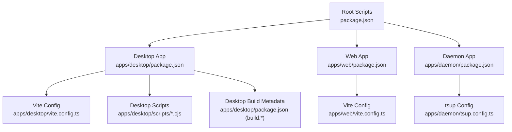
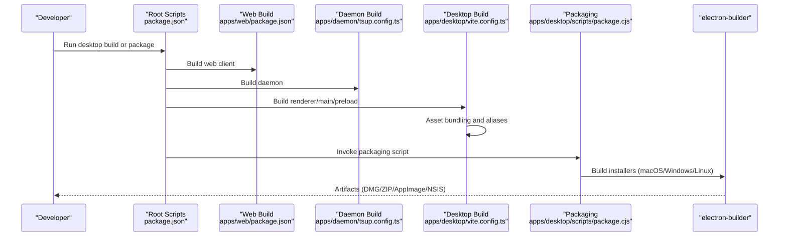
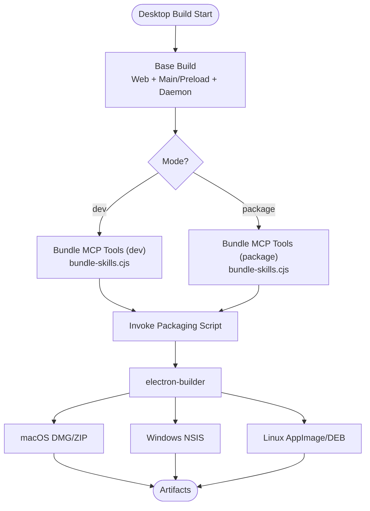
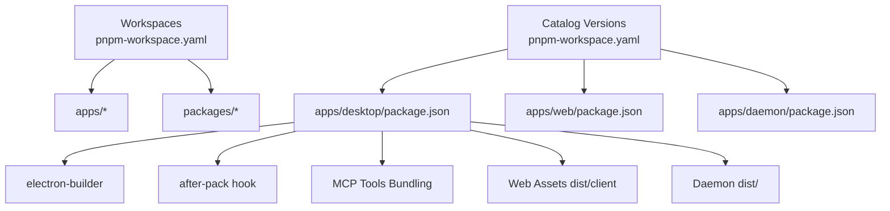

# Build and Deployment

<cite>
**Referenced Files in This Document**
- [package.json](file://package.json)
- [pnpm-workspace.yaml](file://pnpm-workspace.yaml)
- [scripts/dev.cjs](file://scripts/dev.cjs)
- [scripts/predev.cjs](file://scripts/predev.cjs)
- [scripts/dev-runtime.cjs](file://scripts/dev-runtime.cjs)
- [apps/desktop/package.json](file://apps/desktop/package.json)
- [apps/desktop/vite.config.ts](file://apps/desktop/vite.config.ts)
- [apps/desktop/scripts/package.cjs](file://apps/desktop/scripts/package.cjs)
- [apps/desktop/scripts/bundle-skills.cjs](file://apps/desktop/scripts/bundle-skills.cjs)
- [apps/desktop/scripts/after-pack.cjs](file://apps/desktop/scripts/after-pack.cjs)
- [apps/desktop/scripts/postinstall.cjs](file://apps/desktop/scripts/postinstall.cjs)
- [apps/web/package.json](file://apps/web/package.json)
- [apps/web/vite.config.ts](file://apps/web/vite.config.ts)
- [apps/daemon/package.json](file://apps/daemon/package.json)
- [apps/daemon/tsup.config.ts](file://apps/daemon/tsup.config.ts)
- [.github/workflows/release.yml](file://.github/workflows/release.yml)
</cite>

## Table of Contents

1. [Introduction](#introduction)
2. [Project Structure](#project-structure)
3. [Core Components](#core-components)
4. [Architecture Overview](#architecture-overview)
5. [Detailed Component Analysis](#detailed-component-analysis)
6. [Dependency Analysis](#dependency-analysis)
7. [Performance Considerations](#performance-considerations)
8. [Troubleshooting Guide](#troubleshooting-guide)
9. [Conclusion](#conclusion)
10. [Appendices](#appendices)

## Introduction

This document explains the Build and Deployment system for the monorepo, focusing on how the desktop, daemon, and web applications are built, optimized, packaged, and released across Windows, macOS, and Linux. It covers the monorepo configuration, asset bundling, platform-specific builds, CI/CD automation, and operational guidance for both beginners and advanced developers. Practical examples demonstrate build commands, packaging scripts, and deployment procedures, along with guidance on customizing and extending the build system.

## Project Structure

The monorepo uses pnpm workspaces to manage three primary applications:

- Desktop app (Electron + Vite): builds renderer and main processes, bundles assets, and packages cross-platform installers.
- Web app (Vite): builds the browser UI with React and Tailwind.
- Daemon: a Node.js service built with tsup, integrated with the desktop app.

The root package orchestrates workspace-wide scripts and dependency overrides. The desktop app defines platform-specific packaging metadata and extra resources, while the daemon and web apps define their own build scripts and configurations.

**Diagram sources**

- [package.json:12-38](file://package.json#L12-L38)
- [apps/desktop/package.json:13-52](file://apps/desktop/package.json#L13-L52)
- [apps/web/package.json:6-16](file://apps/web/package.json#L6-L16)
- [apps/daemon/package.json:8-17](file://apps/daemon/package.json#L8-L17)
- [apps/desktop/vite.config.ts:64-131](file://apps/desktop/vite.config.ts#L64-L131)
- [apps/web/vite.config.ts:51-83](file://apps/web/vite.config.ts#L51-L83)
- [apps/daemon/tsup.config.ts:3-30](file://apps/daemon/tsup.config.ts#L3-L30)

**Section sources**

- [package.json:12-38](file://package.json#L12-L38)
- [pnpm-workspace.yaml:1-12](file://pnpm-workspace.yaml#L1-L12)
- [apps/desktop/package.json:103-267](file://apps/desktop/package.json#L103-L267)
- [apps/web/package.json:6-16](file://apps/web/package.json#L6-L16)
- [apps/daemon/package.json:8-17](file://apps/daemon/package.json#L8-L17)

## Core Components

- Monorepo orchestration: root scripts coordinate workspace builds and tests.
- Desktop build pipeline: Vite for renderer/main, tsup for preload, tsup for daemon, and electron-builder for packaging.
- Web build pipeline: Vite with React and Tailwind; assets are emitted under dist/client.
- Daemon build pipeline: tsup with externalized native modules and bundled JS dependencies.
- Packaging and distribution: electron-builder configured via desktop package build metadata; CI automates cross-platform builds and releases.

Practical commands:

- Development: root dev starts web and desktop concurrently; desktop dev supports local/remote/clean modes.
- Desktop builds: base build, electron build, unpacked build, and platform-specific packaging.
- Web builds: client build and preview.
- Daemon builds: ESM output suitable for inclusion in the desktop app.

**Section sources**

- [package.json:24-28](file://package.json#L24-L28)
- [scripts/dev.cjs:55-80](file://scripts/dev.cjs#L55-L80)
- [apps/desktop/package.json:23-31](file://apps/desktop/package.json#L23-L31)
- [apps/web/package.json:7-11](file://apps/web/package.json#L7-L11)
- [apps/daemon/package.json:9](file://apps/daemon/package.json#L9)
- [apps/desktop/package.json:103-267](file://apps/desktop/package.json#L103-L267)

## Architecture Overview

The build system integrates workspace scripts, per-app build tools, and packaging utilities to produce platform-specific artifacts.

**Diagram sources**

- [package.json:24-28](file://package.json#L24-L28)
- [apps/web/package.json:7-11](file://apps/web/package.json#L7-L11)
- [apps/daemon/tsup.config.ts:3-30](file://apps/daemon/tsup.config.ts#L3-L30)
- [apps/desktop/vite.config.ts:64-131](file://apps/desktop/vite.config.ts#L64-L131)
- [apps/desktop/scripts/package.cjs:86-93](file://apps/desktop/scripts/package.cjs#L86-L93)

## Detailed Component Analysis

### Desktop Application Build and Packaging

The desktop app coordinates multiple build stages and packaging targets:

- Base build: builds the web client, compiles TS/ESM for main/preload, and prepares assets.
- Electron build: adds daemon and MCP tools, then invokes the packaging script.
- Unpacked build: produces portable distributions for Linux/Windows.
- Platform-specific packaging: macOS (DMG/ZIP), Windows (NSIS), Linux (AppImage/DEB).

Asset bundling and optimization:

- Renderer and preload are built with Vite and electron plugin; main is externalized to avoid bundling Node/Electron internals.
- Theme initialization script is generated for both dev and production.
- MCP tools are bundled conditionally depending on dev/package mode; runtime dependencies are handled differently for dev vs. packaged builds.

Packaging and distribution:

- electron-builder configuration is defined in the desktop package build metadata.
- Custom packaging script resolves workspace symlinks and copies pnpm store symlinks to enable electron-builder to pack native modules.
- after-pack hook injects platform/arch Node.js binaries, copies node-pty prebuilds on Windows, prunes unused binaries, and resigns macOS apps.
- postinstall script installs Electron-compatible prebuilds on Windows and sets up MCP tools runtime dependencies.

**Diagram sources**

- [apps/desktop/package.json:23-31](file://apps/desktop/package.json#L23-L31)
- [apps/desktop/scripts/bundle-skills.cjs:227-248](file://apps/desktop/scripts/bundle-skills.cjs#L227-L248)
- [apps/desktop/scripts/package.cjs:86-93](file://apps/desktop/scripts/package.cjs#L86-L93)
- [apps/desktop/package.json:103-267](file://apps/desktop/package.json#L103-L267)

**Section sources**

- [apps/desktop/package.json:23-31](file://apps/desktop/package.json#L23-L31)
- [apps/desktop/vite.config.ts:64-131](file://apps/desktop/vite.config.ts#L64-L131)
- [apps/desktop/scripts/bundle-skills.cjs:10-254](file://apps/desktop/scripts/bundle-skills.cjs#L10-L254)
- [apps/desktop/scripts/package.cjs:40-139](file://apps/desktop/scripts/package.cjs#L40-L139)
- [apps/desktop/scripts/after-pack.cjs:62-98](file://apps/desktop/scripts/after-pack.cjs#L62-L98)
- [apps/desktop/scripts/postinstall.cjs:44-96](file://apps/desktop/scripts/postinstall.cjs#L44-L96)

### Web Application Build

The web app uses Vite with React and Tailwind. The build emits assets to dist/client and ensures Node-only AWS SDK packages are not bundled into the browser bundle. An early theme initialization script is generated for fast rendering.

Key behaviors:

- Theme initialization plugin compiles a browser-ready script from TypeScript sources.
- Aliases resolve agent-core to the common surface for browser compatibility.
- Externalization prevents bundling of Node-only AWS SDK packages.

**Section sources**

- [apps/web/package.json:7-11](file://apps/web/package.json#L7-L11)
- [apps/web/vite.config.ts:14-48](file://apps/web/vite.config.ts#L14-L48)
- [apps/web/vite.config.ts:51-83](file://apps/web/vite.config.ts#L51-L83)

### Daemon Application Build

The daemon is built with tsup targeting Node 20, emitting ESM. Native modules are kept external to support per-platform compilation. The bundle includes JS dependencies required for WhatsApp integration and agent-core.

Optimization highlights:

- Externalizes native modules (better-sqlite3, node-pty) and optional LLM gateway client.
- NoExternal includes agent-core, zod, Baileys, and pino to keep the daemon self-contained.
- Banner injects a CJS require shim to support dynamic require() in ESM.

**Section sources**

- [apps/daemon/package.json:9](file://apps/daemon/package.json#L9)
- [apps/daemon/tsup.config.ts:3-30](file://apps/daemon/tsup.config.ts#L3-L30)

### Development Workflow Orchestration

The root dev script coordinates web and desktop development:

- Starts the web dev server and waits for it to be ready.
- Spawns the desktop dev runtime with optional clean/check modes.
- Handles child process lifecycle, port cleanup, and graceful shutdown.

Pre-dev checks ensure dependencies and built outputs are present before starting dev.

**Section sources**

- [scripts/dev.cjs:55-80](file://scripts/dev.cjs#L55-L80)
- [scripts/predev.cjs:7-15](file://scripts/predev.cjs#L7-L15)
- [scripts/dev-runtime.cjs:163-198](file://scripts/dev-runtime.cjs#L163-L198)

## Dependency Analysis

Workspace and catalog management:

- Workspaces include apps and packages directories.
- Catalogs pin versions for selected dependencies to ensure consistent builds across platforms.

Desktop packaging dependencies:

- electron-builder drives cross-platform packaging.
- Custom scripts resolve symlinks and inject platform-specific Node binaries.
- Optional native modules are handled via prebuilds and after-pack adjustments.

**Diagram sources**

- [pnpm-workspace.yaml:1-12](file://pnpm-workspace.yaml#L1-L12)
- [apps/desktop/package.json:103-267](file://apps/desktop/package.json#L103-L267)

**Section sources**

- [pnpm-workspace.yaml:1-12](file://pnpm-workspace.yaml#L1-L12)
- [apps/desktop/package.json:103-267](file://apps/desktop/package.json#L103-L267)

## Performance Considerations

- Minimize bundling of Node-only packages in the web build to reduce bundle size and avoid runtime errors.
- Keep native modules external in the daemon to avoid expensive rebuilds and ensure per-platform compatibility.
- Use selective externalization in the desktop main process to prevent bundling Node/Electron internals.
- Optimize MCP tools bundling by separating dev/runtime dependencies and reinstalling only production dependencies for packaged builds.
- Leverage after-pack to inject only necessary Node.js binaries and prune unused prebuilds on Windows.

[No sources needed since this section provides general guidance]

## Troubleshooting Guide

Common issues and resolutions:

- Port conflicts during dev: the dev runtime clears ports before launching processes.
- Windows native module failures: postinstall installs Electron-compatible prebuilds for better-sqlite3 and validates node-pty prebuilds.
- Workspace symlink problems with electron-builder: packaging script temporarily replaces pnpm store symlinks with real copies, then restores them.
- Missing Node.js binaries in macOS universal builds: after-pack verifies and copies both x64 and arm64 Node binaries; otherwise, the build fails with a clear message.
- Prebuild validation failures: desktop dev script validates native modules and falls back to electron-rebuild when necessary.

Operational tips:

- Use dev:check mode to validate the desktop runtime without launching the app.
- Clean mode resets dist-electron and related outputs before starting dev.
- CI builds use frozen lockfiles and explicit system dependencies for reproducible results.

**Section sources**

- [scripts/dev-runtime.cjs:300-306](file://scripts/dev-runtime.cjs#L300-L306)
- [apps/desktop/scripts/postinstall.cjs:44-96](file://apps/desktop/scripts/postinstall.cjs#L44-L96)
- [apps/desktop/scripts/package.cjs:40-139](file://apps/desktop/scripts/package.cjs#L40-L139)
- [apps/desktop/scripts/after-pack.cjs:217-224](file://apps/desktop/scripts/after-pack.cjs#L217-L224)
- [scripts/dev.cjs:28-36](file://scripts/dev.cjs#L28-L36)

## Conclusion

The monorepo’s build and deployment system combines Vite, tsup, and electron-builder to deliver optimized desktop, web, and daemon applications. The desktop pipeline leverages custom packaging scripts and hooks to handle platform-specific binaries and native modules, while CI automates cross-platform builds and releases. By following the documented commands, configurations, and troubleshooting steps, teams can maintain reliable development workflows and efficient production releases.

[No sources needed since this section summarizes without analyzing specific files]

## Appendices

### Practical Build Commands

- Root
  - Build all: pnpm run build
  - Build desktop: pnpm run build:desktop
  - Build web: pnpm run build:web
- Desktop
  - Base build: pnpm run build:base
  - Electron build: pnpm run build:electron
  - Unpacked build: pnpm run build:unpack
  - Package macOS: pnpm run package:mac
  - Package Windows: pnpm run package:win
  - Package Linux: pnpm run package:linux
- Web
  - Dev: pnpm run dev
  - Build: pnpm run build
- Daemon
  - Build: pnpm run build

**Section sources**

- [package.json:24-28](file://package.json#L24-L28)
- [apps/desktop/package.json:23-31](file://apps/desktop/package.json#L23-L31)
- [apps/web/package.json:7-11](file://apps/web/package.json#L7-L11)
- [apps/daemon/package.json:9](file://apps/daemon/package.json#L9)

### CI/CD Pipeline Overview

- Triggers: pushes to semantic version tags.
- Jobs:
  - macOS ARM64: downloads Node.js binaries, builds DMG/ZIP.
  - Linux x64/ARM64: builds portable archives.
  - Windows x64: builds portable ZIP.
- Release: aggregates artifacts and creates a GitHub release with generated notes.

**Section sources**

- [.github/workflows/release.yml:11-232](file://.github/workflows/release.yml#L11-L232)
