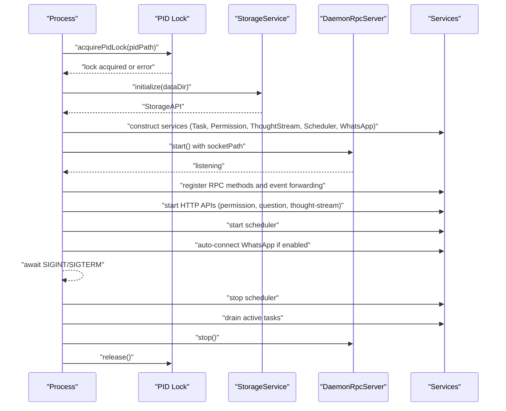
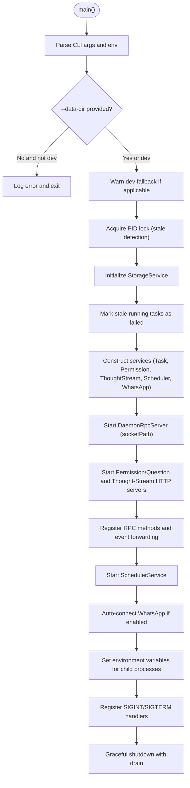
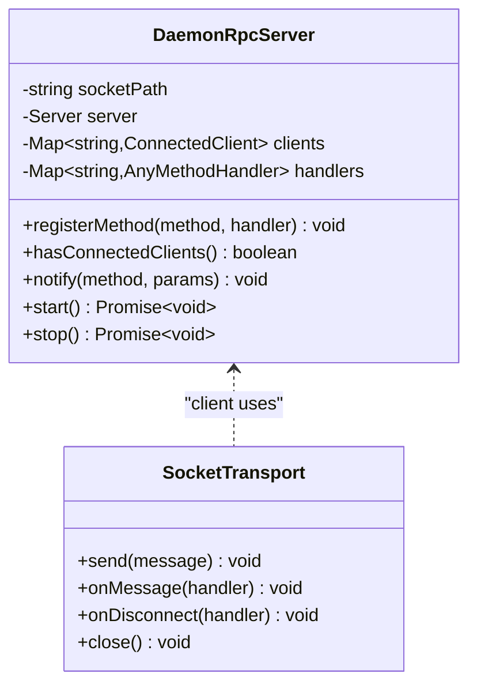
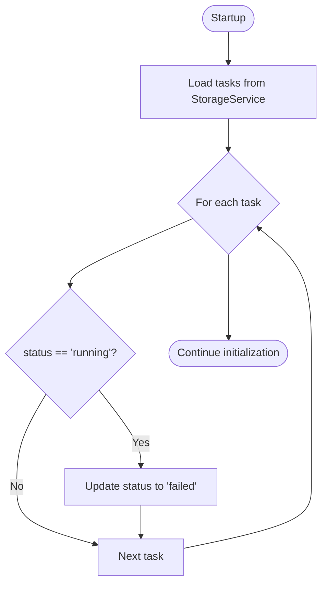
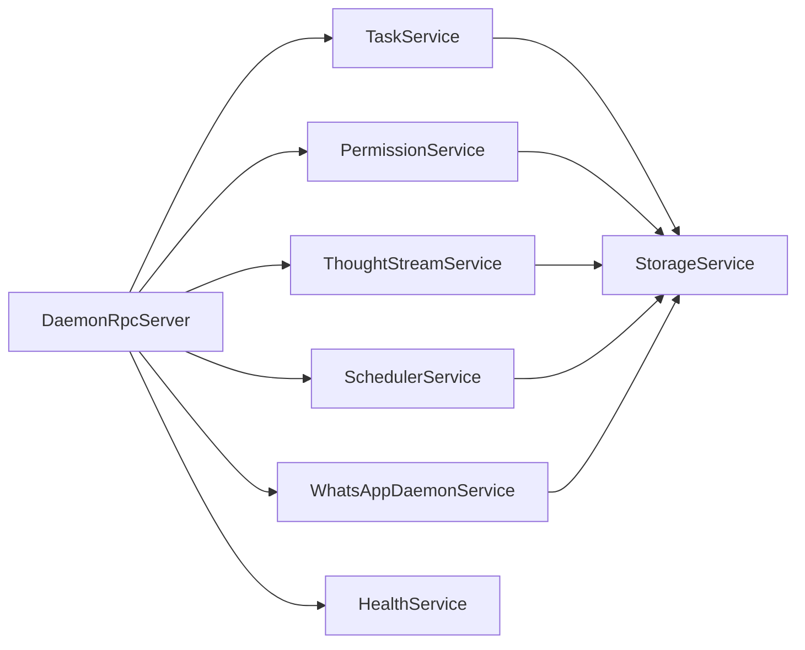
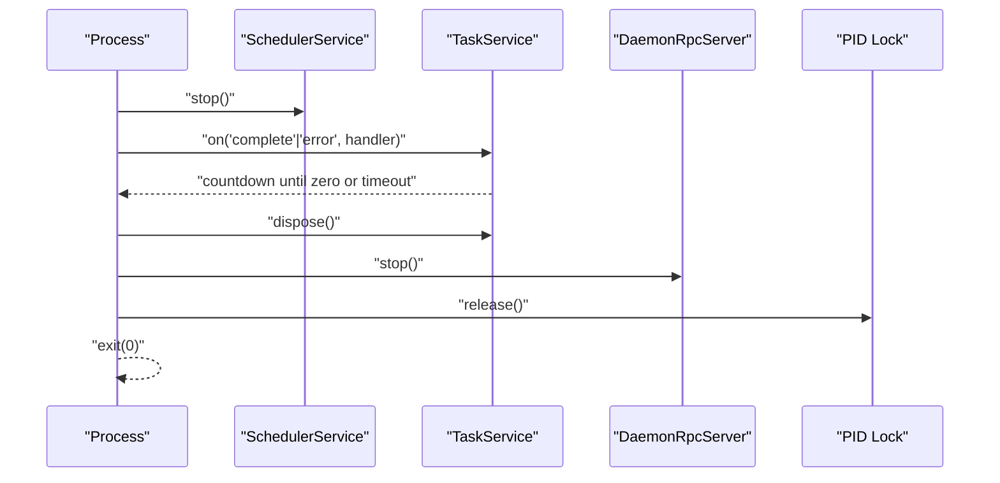
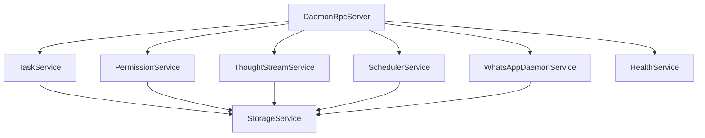

# Daemon Architecture

<cite>
**Referenced Files in This Document**
- [apps/daemon/src/index.ts](file://apps/daemon/src/index.ts)
- [packages/agent-core/src/daemon/server.ts](file://packages/agent-core/src/daemon/server.ts)
- [packages/agent-core/src/daemon/rpc-server.ts](file://packages/agent-core/src/daemon/rpc-server.ts)
- [packages/agent-core/src/daemon/socket-path.ts](file://packages/agent-core/src/daemon/socket-path.ts)
- [packages/agent-core/src/daemon/pid-lock.ts](file://packages/agent-core/src/daemon/pid-lock.ts)
- [packages/agent-core/src/daemon/crash-handlers.ts](file://packages/agent-core/src/daemon/crash-handlers.ts)
- [packages/agent-core/src/daemon/socket-transport.ts](file://packages/agent-core/src/daemon/socket-transport.ts)
- [packages/agent-core/src/daemon/ipc-transport.ts](file://packages/agent-core/src/daemon/ipc-transport.ts)
- [apps/daemon/src/storage-service.ts](file://apps/daemon/src/storage-service.ts)
- [apps/daemon/src/task-service.ts](file://apps/daemon/src/task-service.ts)
- [apps/daemon/src/permission-service.ts](file://apps/daemon/src/permission-service.ts)
- [apps/daemon/src/thought-stream-service.ts](file://apps/daemon/src/thought-stream-service.ts)
- [apps/daemon/src/scheduler-service.ts](file://apps/daemon/src/scheduler-service.ts)
- [apps/daemon/src/whatsapp-service.ts](file://apps/daemon/src/whatsapp-service.ts)
- [apps/daemon/src/health.ts](file://apps/daemon/src/health.ts)
</cite>

## Table of Contents

1. [Introduction](#introduction)
2. [Project Structure](#project-structure)
3. [Core Components](#core-components)
4. [Architecture Overview](#architecture-overview)
5. [Detailed Component Analysis](#detailed-component-analysis)
6. [Dependency Analysis](#dependency-analysis)
7. [Performance Considerations](#performance-considerations)
8. [Security and Isolation](#security-and-isolation)
9. [Practical Configuration Examples](#practical-configuration-examples)
10. [Troubleshooting Guide](#troubleshooting-guide)
11. [Conclusion](#conclusion)

## Introduction

This document explains the Daemon Architecture for the background service that powers persistent orchestration, secure RPC communication, and system isolation. It covers the initialization sequence, RPC server design using Unix domain sockets (and Windows named pipes), crash recovery, modular service architecture, graceful shutdown, packaged versus development modes, environment variable handling, and security considerations. Practical examples demonstrate startup configuration, service registration, and lifecycle management.

## Project Structure

The daemon is implemented as a standalone Node.js process with a modular service architecture. Services are organized by responsibility and communicate via:

- JSON-RPC over Unix domain sockets (or Windows named pipes)
- HTTP endpoints for permission and thought-stream services
- Event emitters for inter-service coordination
- Shared storage for persistence and cross-process visibility

```mermaid
graph TB
subgraph "Daemon Process"
IDX["index.ts<br/>Startup, services, RPC server"]
RPC["DaemonRpcServer<br/>Unix/Named Pipe JSON-RPC"]
PID["PID Lock<br/>Stale detection"]
CRASH["Crash Handlers<br/>Global error hooks"]
end
subgraph "Services"
STOR["StorageService<br/>Shared DB"]
TASK["TaskService<br/>Task lifecycle"]
PERM["PermissionService<br/>HTTP + Rate Limit"]
THOUGHT["ThoughtStreamService<br/>HTTP + Rate Limit"]
SCHED["SchedulerService<br/>Cron scheduler"]
WHATS["WhatsAppDaemonService<br/>Integration bridge"]
HEALTH["HealthService<br/>Status metrics"]
end
IDX --> PID
IDX --> RPC
IDX --> STOR
IDX --> TASK
IDX --> PERM
IDX --> THOUGHT
IDX --> SCHED
IDX --> WHATS
IDX --> HEALTH
RPC <- --> TASK
RPC <- --> PERM
RPC <- --> THOUGHT
RPC <- --> SCHED
RPC <- --> WHATS
RPC <- --> HEALTH
```

**Diagram sources**

- [apps/daemon/src/index.ts:35-288](file://apps/daemon/src/index.ts#L35-L288)
- [packages/agent-core/src/daemon/rpc-server.ts:33-164](file://packages/agent-core/src/daemon/rpc-server.ts#L33-L164)
- [packages/agent-core/src/daemon/pid-lock.ts:90-150](file://packages/agent-core/src/daemon/pid-lock.ts#L90-L150)
- [packages/agent-core/src/daemon/crash-handlers.ts:16-31](file://packages/agent-core/src/daemon/crash-handlers.ts#L16-L31)
- [apps/daemon/src/storage-service.ts:9-57](file://apps/daemon/src/storage-service.ts#L9-L57)
- [apps/daemon/src/task-service.ts:33-206](file://apps/daemon/src/task-service.ts#L33-L206)
- [apps/daemon/src/permission-service.ts:17-213](file://apps/daemon/src/permission-service.ts#L17-L213)
- [apps/daemon/src/thought-stream-service.ts:33-131](file://apps/daemon/src/thought-stream-service.ts#L33-L131)
- [apps/daemon/src/scheduler-service.ts:198-349](file://apps/daemon/src/scheduler-service.ts#L198-L349)
- [apps/daemon/src/whatsapp-service.ts:36-242](file://apps/daemon/src/whatsapp-service.ts#L36-L242)
- [apps/daemon/src/health.ts:6-21](file://apps/daemon/src/health.ts#L6-L21)

**Section sources**

- [apps/daemon/src/index.ts:35-288](file://apps/daemon/src/index.ts#L35-L288)

## Core Components

- Initialization and orchestration: [apps/daemon/src/index.ts](file://apps/daemon/src/index.ts)
- RPC server: [packages/agent-core/src/daemon/rpc-server.ts](file://packages/agent-core/src/daemon/rpc-server.ts)
- PID lock and crash handlers: [packages/agent-core/src/daemon/pid-lock.ts](file://packages/agent-core/src/daemon/pid-lock.ts), [packages/agent-core/src/daemon/crash-handlers.ts](file://packages/agent-core/src/daemon/crash-handlers.ts)
- Socket path resolution: [packages/agent-core/src/daemon/socket-path.ts](file://packages/agent-core/src/daemon/socket-path.ts)
- Transport implementations: [packages/agent-core/src/daemon/socket-transport.ts](file://packages/agent-core/src/daemon/socket-transport.ts), [packages/agent-core/src/daemon/ipc-transport.ts](file://packages/agent-core/src/daemon/ipc-transport.ts)
- Modular services: [apps/daemon/src/storage-service.ts](file://apps/daemon/src/storage-service.ts), [apps/daemon/src/task-service.ts](file://apps/daemon/src/task-service.ts), [apps/daemon/src/permission-service.ts](file://apps/daemon/src/permission-service.ts), [apps/daemon/src/thought-stream-service.ts](file://apps/daemon/src/thought-stream-service.ts), [apps/daemon/src/scheduler-service.ts](file://apps/daemon/src/scheduler-service.ts), [apps/daemon/src/whatsapp-service.ts](file://apps/daemon/src/whatsapp-service.ts), [apps/daemon/src/health.ts](file://apps/daemon/src/health.ts)

**Section sources**

- [apps/daemon/src/index.ts:35-288](file://apps/daemon/src/index.ts#L35-L288)
- [packages/agent-core/src/daemon/rpc-server.ts:33-164](file://packages/agent-core/src/daemon/rpc-server.ts#L33-L164)
- [packages/agent-core/src/daemon/pid-lock.ts:90-150](file://packages/agent-core/src/daemon/pid-lock.ts#L90-L150)
- [packages/agent-core/src/daemon/crash-handlers.ts:16-31](file://packages/agent-core/src/daemon/crash-handlers.ts#L16-L31)
- [packages/agent-core/src/daemon/socket-path.ts:28-46](file://packages/agent-core/src/daemon/socket-path.ts#L28-L46)
- [packages/agent-core/src/daemon/socket-transport.ts:38-162](file://packages/agent-core/src/daemon/socket-transport.ts#L38-L162)
- [packages/agent-core/src/daemon/ipc-transport.ts:38-104](file://packages/agent-core/src/daemon/ipc-transport.ts#L38-L104)
- [apps/daemon/src/storage-service.ts:9-57](file://apps/daemon/src/storage-service.ts#L9-L57)
- [apps/daemon/src/task-service.ts:33-206](file://apps/daemon/src/task-service.ts#L33-L206)
- [apps/daemon/src/permission-service.ts:17-213](file://apps/daemon/src/permission-service.ts#L17-L213)
- [apps/daemon/src/thought-stream-service.ts:33-131](file://apps/daemon/src/thought-stream-service.ts#L33-L131)
- [apps/daemon/src/scheduler-service.ts:198-349](file://apps/daemon/src/scheduler-service.ts#L198-L349)
- [apps/daemon/src/whatsapp-service.ts:36-242](file://apps/daemon/src/whatsapp-service.ts#L36-L242)
- [apps/daemon/src/health.ts:6-21](file://apps/daemon/src/health.ts#L6-L21)

## Architecture Overview

The daemon is a persistent background process that:

- Ensures single-instance operation via PID lock with stale detection
- Initializes shared storage and performs crash recovery
- Starts modular services (task, permission, thought-stream, scheduler, WhatsApp)
- Exposes a JSON-RPC server over Unix domain sockets (or Windows named pipes)
- Provides HTTP endpoints for permission and thought-stream APIs
- Implements graceful shutdown with drain phases and resource cleanup
- Supports packaged and development modes with environment variable handling



**Diagram sources**

- [apps/daemon/src/index.ts:87-287](file://apps/daemon/src/index.ts#L87-L287)
- [packages/agent-core/src/daemon/rpc-server.ts:93-134](file://packages/agent-core/src/daemon/rpc-server.ts#L93-L134)
- [packages/agent-core/src/daemon/pid-lock.ts:90-150](file://packages/agent-core/src/daemon/pid-lock.ts#L90-L150)
- [apps/daemon/src/storage-service.ts:18-41](file://apps/daemon/src/storage-service.ts#L18-L41)
- [apps/daemon/src/permission-service.ts:120-131](file://apps/daemon/src/permission-service.ts#L120-L131)
- [apps/daemon/src/thought-stream-service.ts:111-122](file://apps/daemon/src/thought-stream-service.ts#L111-L122)
- [apps/daemon/src/scheduler-service.ts:213-231](file://apps/daemon/src/scheduler-service.ts#L213-L231)
- [apps/daemon/src/whatsapp-service.ts:203-222](file://apps/daemon/src/whatsapp-service.ts#L203-L222)

## Detailed Component Analysis

### Initialization Sequence

- Validates arguments and environment for data directory and development mode
- Installs crash handlers globally
- Resolves data directory and derives socket path and PID path
- Acquires PID lock with stale detection
- Initializes storage and performs crash recovery (marks stale running tasks as failed)
- Constructs services with packaged/dev mode context
- Starts RPC server and HTTP APIs
- Registers RPC methods and task/event forwarding
- Starts scheduler and auto-connects WhatsApp
- Sets environment variables for child processes
- Registers graceful shutdown with drain phases



**Diagram sources**

- [apps/daemon/src/index.ts:35-288](file://apps/daemon/src/index.ts#L35-L288)
- [packages/agent-core/src/daemon/pid-lock.ts:90-150](file://packages/agent-core/src/daemon/pid-lock.ts#L90-L150)
- [apps/daemon/src/storage-service.ts:18-41](file://apps/daemon/src/storage-service.ts#L18-L41)
- [apps/daemon/src/permission-service.ts:120-200](file://apps/daemon/src/permission-service.ts#L120-L200)
- [apps/daemon/src/thought-stream-service.ts:111-122](file://apps/daemon/src/thought-stream-service.ts#L111-L122)
- [apps/daemon/src/scheduler-service.ts:213-231](file://apps/daemon/src/scheduler-service.ts#L213-L231)
- [apps/daemon/src/whatsapp-service.ts:203-222](file://apps/daemon/src/whatsapp-service.ts#L203-L222)

**Section sources**

- [apps/daemon/src/index.ts:64-207](file://apps/daemon/src/index.ts#L64-L207)
- [packages/agent-core/src/daemon/pid-lock.ts:90-150](file://packages/agent-core/src/daemon/pid-lock.ts#L90-L150)
- [apps/daemon/src/storage-service.ts:18-41](file://apps/daemon/src/storage-service.ts#L18-L41)

### RPC Server Architecture (Unix Domain Sockets / Windows Named Pipes)

- JSON-RPC 2.0 over newline-delimited JSON
- Built-in health check method
- Client connection tracking and notifications
- Stale socket removal on start
- Cross-platform socket path resolution



**Diagram sources**

- [packages/agent-core/src/daemon/rpc-server.ts:33-164](file://packages/agent-core/src/daemon/rpc-server.ts#L33-L164)
- [packages/agent-core/src/daemon/socket-transport.ts:38-162](file://packages/agent-core/src/daemon/socket-transport.ts#L38-L162)

**Section sources**

- [packages/agent-core/src/daemon/rpc-server.ts:33-164](file://packages/agent-core/src/daemon/rpc-server.ts#L33-L164)
- [packages/agent-core/src/daemon/socket-path.ts:28-46](file://packages/agent-core/src/daemon/socket-path.ts#L28-L46)
- [packages/agent-core/src/daemon/socket-transport.ts:38-162](file://packages/agent-core/src/daemon/socket-transport.ts#L38-L162)

### Crash Recovery Mechanism

- On startup, iterates stored tasks
- Marks any task with status “running” as “failed”
- Prevents inconsistent state after unexpected daemon termination



**Diagram sources**

- [apps/daemon/src/index.ts:99-105](file://apps/daemon/src/index.ts#L99-L105)

**Section sources**

- [apps/daemon/src/index.ts:99-105](file://apps/daemon/src/index.ts#L99-L105)

### Modular Service Architecture

- TaskService: orchestrates task lifecycle, integrates with TaskManager, emits events, and coordinates summaries
- PermissionService: exposes HTTP endpoints for file permission and question requests, rate-limited, secured by auth token
- ThoughtStreamService: exposes HTTP endpoints for thought and checkpoint events, rate-limited, secured by auth token
- SchedulerService: cron-based scheduling with alignment to minute boundaries, catch-up on startup
- WhatsAppDaemonService: manages integration lifecycle, wiring task bridge and storage synchronization
- StorageService: shared database initialization with packaged/dev naming and migration support
- HealthService: provides version, uptime, active task count, and memory usage



**Diagram sources**

- [apps/daemon/src/index.ts:107-172](file://apps/daemon/src/index.ts#L107-L172)
- [apps/daemon/src/task-service.ts:33-206](file://apps/daemon/src/task-service.ts#L33-L206)
- [apps/daemon/src/permission-service.ts:17-213](file://apps/daemon/src/permission-service.ts#L17-L213)
- [apps/daemon/src/thought-stream-service.ts:33-131](file://apps/daemon/src/thought-stream-service.ts#L33-L131)
- [apps/daemon/src/scheduler-service.ts:198-349](file://apps/daemon/src/scheduler-service.ts#L198-L349)
- [apps/daemon/src/whatsapp-service.ts:36-242](file://apps/daemon/src/whatsapp-service.ts#L36-L242)
- [apps/daemon/src/storage-service.ts:9-57](file://apps/daemon/src/storage-service.ts#L9-L57)
- [apps/daemon/src/health.ts:6-21](file://apps/daemon/src/health.ts#L6-L21)

**Section sources**

- [apps/daemon/src/task-service.ts:33-206](file://apps/daemon/src/task-service.ts#L33-L206)
- [apps/daemon/src/permission-service.ts:17-213](file://apps/daemon/src/permission-service.ts#L17-L213)
- [apps/daemon/src/thought-stream-service.ts:33-131](file://apps/daemon/src/thought-stream-service.ts#L33-L131)
- [apps/daemon/src/scheduler-service.ts:198-349](file://apps/daemon/src/scheduler-service.ts#L198-L349)
- [apps/daemon/src/whatsapp-service.ts:36-242](file://apps/daemon/src/whatsapp-service.ts#L36-L242)
- [apps/daemon/src/storage-service.ts:9-57](file://apps/daemon/src/storage-service.ts#L9-L57)
- [apps/daemon/src/health.ts:6-21](file://apps/daemon/src/health.ts#L6-L21)

### Graceful Shutdown Process

- Stops scheduler first to prevent new tasks
- Drains active tasks with a bounded timeout
- Disposes services and transports
- Releases PID lock and exits cleanly



**Diagram sources**

- [apps/daemon/src/index.ts:208-287](file://apps/daemon/src/index.ts#L208-L287)
- [apps/daemon/src/scheduler-service.ts:233-243](file://apps/daemon/src/scheduler-service.ts#L233-L243)
- [apps/daemon/src/task-service.ts:203-206](file://apps/daemon/src/task-service.ts#L203-L206)
- [packages/agent-core/src/daemon/rpc-server.ts:140-154](file://packages/agent-core/src/daemon/rpc-server.ts#L140-L154)
- [packages/agent-core/src/daemon/pid-lock.ts:134-146](file://packages/agent-core/src/daemon/pid-lock.ts#L134-L146)

**Section sources**

- [apps/daemon/src/index.ts:208-287](file://apps/daemon/src/index.ts#L208-L287)

### Packaged vs Development Mode and Environment Variables

- Packaged mode: CLI args override environment variables for Windows login item support
- Development mode: ACCOMPLISH_DAEMON_DEV=1 allows fallback to default data directory
- Environment variables exported for child processes:
  - Authentication token and well-known ports for permission and thought-stream APIs
  - MCP tools rely on THOUGHT_STREAM_PORT for reporting checkpoints/thoughts

**Section sources**

- [apps/daemon/src/index.ts:107-116](file://apps/daemon/src/index.ts#L107-L116)
- [apps/daemon/src/index.ts:183-197](file://apps/daemon/src/index.ts#L183-L197)
- [apps/daemon/src/storage-service.ts:26-28](file://apps/daemon/src/storage-service.ts#L26-L28)

## Dependency Analysis

The daemon composes a set of cohesive services around a shared StorageAPI and a central RPC server. Services depend on storage for persistence and on each other through RPC and event channels.



**Diagram sources**

- [apps/daemon/src/index.ts:107-172](file://apps/daemon/src/index.ts#L107-L172)
- [apps/daemon/src/task-service.ts:33-47](file://apps/daemon/src/task-service.ts#L33-L47)
- [apps/daemon/src/permission-service.ts:17-32](file://apps/daemon/src/permission-service.ts#L17-L32)
- [apps/daemon/src/thought-stream-service.ts:33-44](file://apps/daemon/src/thought-stream-service.ts#L33-L44)
- [apps/daemon/src/scheduler-service.ts:198-207](file://apps/daemon/src/scheduler-service.ts#L198-L207)
- [apps/daemon/src/whatsapp-service.ts:36-55](file://apps/daemon/src/whatsapp-service.ts#L36-L55)
- [apps/daemon/src/storage-service.ts:9-18](file://apps/daemon/src/storage-service.ts#L9-L18)

**Section sources**

- [apps/daemon/src/index.ts:107-172](file://apps/daemon/src/index.ts#L107-L172)

## Performance Considerations

- RPC throughput: newline-delimited JSON minimizes overhead; buffer limits protect against runaway payloads
- HTTP rate limiting: PermissionService and ThoughtStreamService apply per-minute request caps
- Scheduler alignment: Tick aligned to minute boundaries reduces CPU wake-ups
- Concurrency: TaskService limits concurrent tasks and defers CLI availability checks
- Graceful drain: Bounded timeout prevents indefinite stalls during shutdown

[No sources needed since this section provides general guidance]

## Security and Isolation

- Authentication token: A per-session token secures HTTP endpoints and is propagated to child processes
- Process isolation: Unix domain sockets and Windows named pipes provide OS-level IPC isolation
- Resource limits: Buffer overflow protection and rate limiters mitigate abuse
- Single-instance enforcement: PID lock with stale detection prevents multiple daemons from sharing state
- Crash resilience: Global crash handlers log fatal errors and terminate the process safely

**Section sources**

- [apps/daemon/src/index.ts:92-93](file://apps/daemon/src/index.ts#L92-L93)
- [packages/agent-core/src/daemon/socket-transport.ts:15-16](file://packages/agent-core/src/daemon/socket-transport.ts#L15-L16)
- [packages/agent-core/src/daemon/socket-transport.ts:86-91](file://packages/agent-core/src/daemon/socket-transport.ts#L86-L91)
- [apps/daemon/src/permission-service.ts:14-27](file://apps/daemon/src/permission-service.ts#L14-L27)
- [apps/daemon/src/thought-stream-service.ts:12-40](file://apps/daemon/src/thought-stream-service.ts#L12-L40)
- [packages/agent-core/src/daemon/pid-lock.ts:35-42](file://packages/agent-core/src/daemon/pid-lock.ts#L35-L42)
- [packages/agent-core/src/daemon/crash-handlers.ts:22-30](file://packages/agent-core/src/daemon/crash-handlers.ts#L22-L30)

## Practical Configuration Examples

- Startup configuration
  - Provide data directory for production: pass --data-dir and ensure ACCOMPLISH_IS_PACKAGED=1 for packaged mode
  - Development mode fallback: set ACCOMPLISH_DAEMON_DEV=1 to use default directory
  - Exported environment variables for child processes include authentication token and API ports
- Service registration
  - RPC methods are registered centrally; services expose capabilities via well-known endpoints
  - Permission and thought-stream services bind to fixed ports for MCP tools
- Lifecycle management
  - Use daemon.shutdown RPC to trigger graceful shutdown
  - SIGINT/SIGTERM initiate drain and cleanup

**Section sources**

- [apps/daemon/src/index.ts:67-83](file://apps/daemon/src/index.ts#L67-L83)
- [apps/daemon/src/index.ts:183-197](file://apps/daemon/src/index.ts#L183-L197)
- [apps/daemon/src/index.ts:269-287](file://apps/daemon/src/index.ts#L269-L287)

## Troubleshooting Guide

- PID lock conflicts
  - Symptom: startup fails with “already running” message
  - Resolution: remove stale lock file or ensure only one daemon instance runs per data directory
- Stale running tasks
  - Symptom: tasks appear stuck in “running” after crash
  - Resolution: crash recovery automatically marks them as failed on next startup
- RPC connectivity
  - Symptom: clients cannot connect or receive notifications
  - Resolution: verify socket path derivation and stale socket removal; confirm RPC server is listening
- HTTP API failures
  - Symptom: permission/question/thought endpoints return errors
  - Resolution: check auth token propagation, rate limiter thresholds, and service initialization order
- Graceful shutdown hangs
  - Symptom: shutdown waits indefinitely for active tasks
  - Resolution: ensure tasks complete or time out; review drain timeout and active task counts

**Section sources**

- [packages/agent-core/src/daemon/pid-lock.ts:115-129](file://packages/agent-core/src/daemon/pid-lock.ts#L115-L129)
- [apps/daemon/src/index.ts:99-105](file://apps/daemon/src/index.ts#L99-L105)
- [packages/agent-core/src/daemon/rpc-server.ts:93-134](file://packages/agent-core/src/daemon/rpc-server.ts#L93-L134)
- [apps/daemon/src/permission-service.ts:64-131](file://apps/daemon/src/permission-service.ts#L64-L131)
- [apps/daemon/src/thought-stream-service.ts:67-122](file://apps/daemon/src/thought-stream-service.ts#L67-L122)
- [apps/daemon/src/index.ts:208-287](file://apps/daemon/src/index.ts#L208-L287)

## Conclusion

The daemon architecture provides a robust, modular, and secure foundation for background orchestration. Its design emphasizes single-instance safety, crash recovery, isolated IPC, and graceful lifecycle management. The separation of concerns across services enables maintainability and extensibility while preserving strong isolation and predictable behavior in both packaged and development environments.
