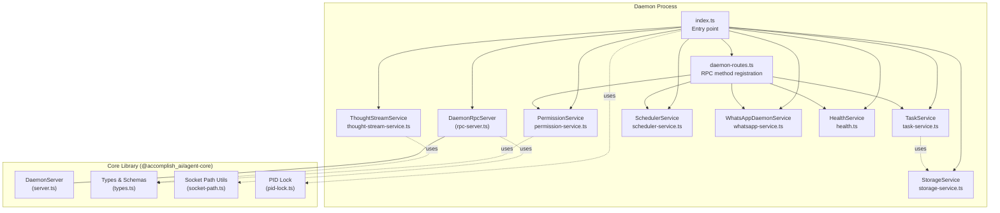
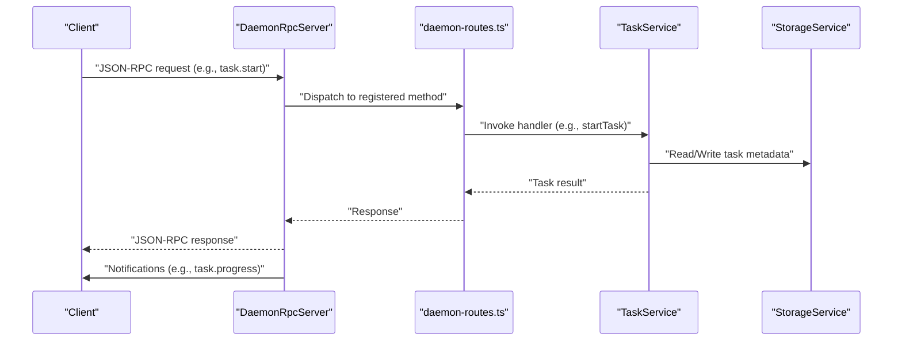
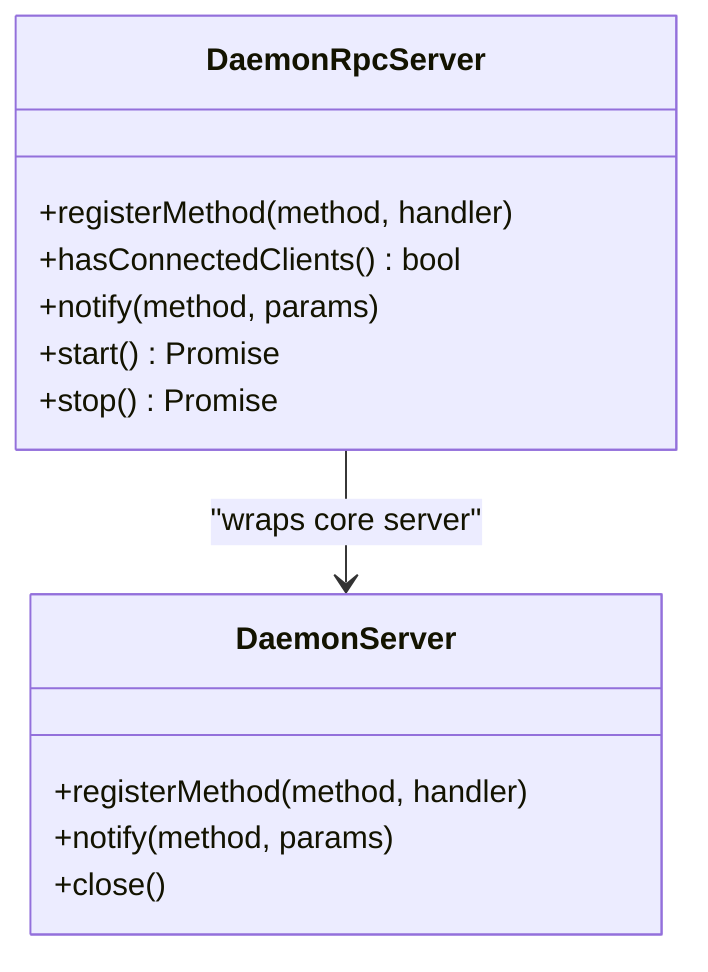
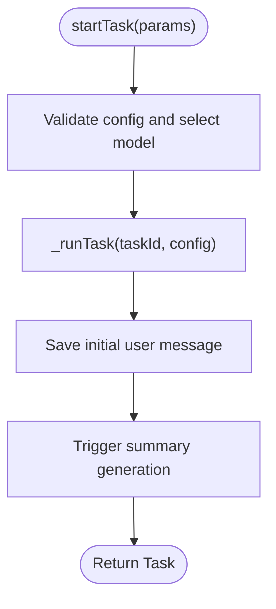
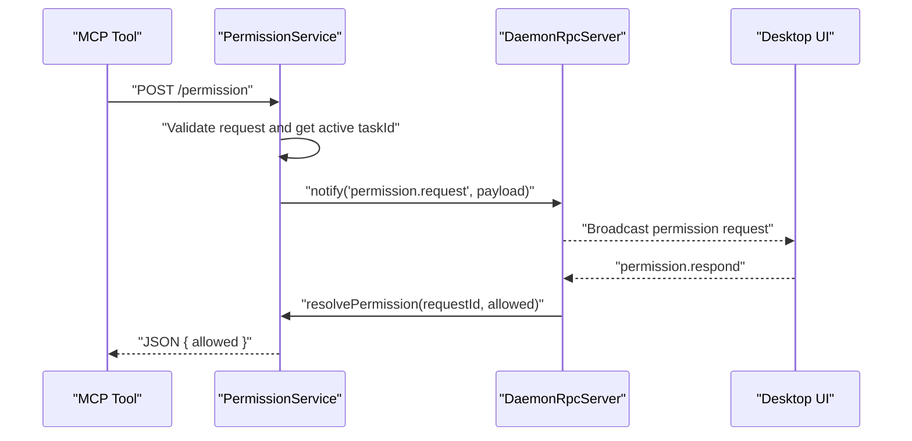
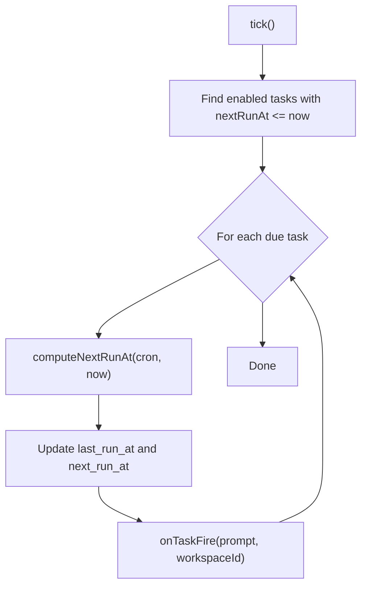
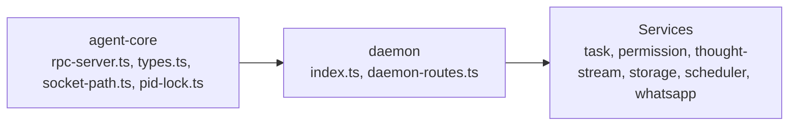

# Daemon Process

<cite>
**Referenced Files in This Document**
- [apps/daemon/src/index.ts](file://apps/daemon/src/index.ts)
- [apps/daemon/src/daemon-routes.ts](file://apps/daemon/src/daemon-routes.ts)
- [apps/daemon/src/task-service.ts](file://apps/daemon/src/task-service.ts)
- [apps/daemon/src/permission-service.ts](file://apps/daemon/src/permission-service.ts)
- [apps/daemon/src/thought-stream-service.ts](file://apps/daemon/src/thought-stream-service.ts)
- [apps/daemon/src/storage-service.ts](file://apps/daemon/src/storage-service.ts)
- [apps/daemon/src/scheduler-service.ts](file://apps/daemon/src/scheduler-service.ts)
- [apps/daemon/src/whatsapp-service.ts](file://apps/daemon/src/whatsapp-service.ts)
- [apps/daemon/src/health.ts](file://apps/daemon/src/health.ts)
- [packages/agent-core/src/daemon/rpc-server.ts](file://packages/agent-core/src/daemon/rpc-server.ts)
- [packages/agent-core/src/daemon/server.ts](file://packages/agent-core/src/daemon/server.ts)
- [packages/agent-core/src/daemon/types.ts](file://packages/agent-core/src/daemon/types.ts)
- [packages/agent-core/src/daemon/socket-path.ts](file://packages/agent-core/src/daemon/socket-path.ts)
- [packages/agent-core/src/daemon/pid-lock.ts](file://packages/agent-core/src/daemon/pid-lock.ts)
- [apps/daemon/package.json](file://apps/daemon/package.json)
</cite>

## Table of Contents

1. [Introduction](#introduction)
2. [Project Structure](#project-structure)
3. [Core Components](#core-components)
4. [Architecture Overview](#architecture-overview)
5. [Detailed Component Analysis](#detailed-component-analysis)
6. [Dependency Analysis](#dependency-analysis)
7. [Performance Considerations](#performance-considerations)
8. [Troubleshooting Guide](#troubleshooting-guide)
9. [Conclusion](#conclusion)
10. [Appendices](#appendices)

## Introduction

The Daemon Process is a persistent background service responsible for AI task execution, file operations, and system interactions. It exposes a JSON-RPC 2.0 RPC server over a Unix domain socket (or Windows named pipe) for clients to start, stop, and monitor tasks. It also hosts auxiliary HTTP servers for permission handling and thought-stream telemetry, and coordinates scheduled task execution. The daemon maintains a shared SQLite database and secure storage, enforces process isolation via PID locks, and supports graceful shutdown with a drain period to safely terminate active tasks.

## Project Structure

The daemon is implemented as a standalone Node.js application with modular services:

- Entry point initializes services, RPC server, and HTTP servers, then starts scheduling and optional integrations.
- Services encapsulate distinct responsibilities: task execution, permission handling, thought-stream telemetry, storage, scheduling, and messaging integrations.
- The RPC server is implemented in the agent-core package and extended by the daemon-specific RPC server wrapper.
- Transport and isolation utilities include socket path resolution and PID lock acquisition.

**Diagram sources**

- [apps/daemon/src/index.ts:35-288](file://apps/daemon/src/index.ts#L35-L288)
- [apps/daemon/src/daemon-routes.ts:70-307](file://apps/daemon/src/daemon-routes.ts#L70-L307)
- [apps/daemon/src/task-service.ts:33-206](file://apps/daemon/src/task-service.ts#L33-L206)
- [apps/daemon/src/permission-service.ts:17-213](file://apps/daemon/src/permission-service.ts#L17-L213)
- [apps/daemon/src/thought-stream-service.ts:33-131](file://apps/daemon/src/thought-stream-service.ts#L33-L131)
- [apps/daemon/src/storage-service.ts:9-57](file://apps/daemon/src/storage-service.ts#L9-L57)
- [apps/daemon/src/scheduler-service.ts:198-349](file://apps/daemon/src/scheduler-service.ts#L198-L349)
- [apps/daemon/src/whatsapp-service.ts:36-242](file://apps/daemon/src/whatsapp-service.ts#L36-L242)
- [apps/daemon/src/health.ts:6-21](file://apps/daemon/src/health.ts#L6-L21)
- [packages/agent-core/src/daemon/rpc-server.ts:33-164](file://packages/agent-core/src/daemon/rpc-server.ts#L33-L164)
- [packages/agent-core/src/daemon/server.ts:31-124](file://packages/agent-core/src/daemon/server.ts#L31-L124)
- [packages/agent-core/src/daemon/types.ts:51-194](file://packages/agent-core/src/daemon/types.ts#L51-L194)
- [packages/agent-core/src/daemon/socket-path.ts:28-46](file://packages/agent-core/src/daemon/socket-path.ts#L28-L46)
- [packages/agent-core/src/daemon/pid-lock.ts:90-150](file://packages/agent-core/src/daemon/pid-lock.ts#L90-L150)

**Section sources**

- [apps/daemon/src/index.ts:35-288](file://apps/daemon/src/index.ts#L35-L288)
- [apps/daemon/package.json:1-38](file://apps/daemon/package.json#L1-L38)

## Core Components

- RPC server: A JSON-RPC 2.0 server over a Unix socket (Windows named pipe) supporting method registration, notifications, and health checks.
- Task service: Manages task lifecycle, validates configurations, and integrates with the task manager and storage.
- Permission service: Exposes HTTP endpoints for file permission and question requests, coordinating with the UI via RPC notifications.
- Thought-stream service: Exposes HTTP endpoints for thought and checkpoint events, forwarding them to RPC clients.
- Storage service: Initializes and manages the shared SQLite database and secure storage.
- Scheduler service: Periodically evaluates cron-enabled scheduled tasks and triggers task execution.
- WhatsApp daemon service: Orchestrates the WhatsApp integration lifecycle and bridges messaging to tasks.
- Health service: Provides health status including version, uptime, active task count, and memory usage.

**Section sources**

- [apps/daemon/src/daemon-routes.ts:70-307](file://apps/daemon/src/daemon-routes.ts#L70-L307)
- [apps/daemon/src/task-service.ts:33-206](file://apps/daemon/src/task-service.ts#L33-L206)
- [apps/daemon/src/permission-service.ts:17-213](file://apps/daemon/src/permission-service.ts#L17-L213)
- [apps/daemon/src/thought-stream-service.ts:33-131](file://apps/daemon/src/thought-stream-service.ts#L33-L131)
- [apps/daemon/src/storage-service.ts:9-57](file://apps/daemon/src/storage-service.ts#L9-L57)
- [apps/daemon/src/scheduler-service.ts:198-349](file://apps/daemon/src/scheduler-service.ts#L198-L349)
- [apps/daemon/src/whatsapp-service.ts:36-242](file://apps/daemon/src/whatsapp-service.ts#L36-L242)
- [apps/daemon/src/health.ts:6-21](file://apps/daemon/src/health.ts#L6-L21)

## Architecture Overview

The daemon composes multiple services around a central RPC server. Clients (desktop UI or MCP tools) communicate via JSON-RPC over the daemon’s socket. The daemon also exposes dedicated HTTP servers for permission handling and thought-stream telemetry. Services share a common storage backend and coordinate via RPC notifications.

**Diagram sources**

- [apps/daemon/src/daemon-routes.ts:82-106](file://apps/daemon/src/daemon-routes.ts#L82-L106)
- [apps/daemon/src/task-service.ts:78-111](file://apps/daemon/src/task-service.ts#L78-L111)
- [apps/daemon/src/storage-service.ts:18-40](file://apps/daemon/src/storage-service.ts#L18-L40)
- [packages/agent-core/src/daemon/rpc-server.ts:58-87](file://packages/agent-core/src/daemon/rpc-server.ts#L58-L87)

## Detailed Component Analysis

### RPC Server and Communication Protocol

- The RPC server listens on a Unix domain socket (or Windows named pipe) determined by the data directory to isolate profiles.
- It supports registering methods, sending notifications to all connected clients, and health checks.
- The server strips stale sockets on startup and tracks connected clients to support permission handling fast-fail behavior.

**Diagram sources**

- [packages/agent-core/src/daemon/rpc-server.ts:33-164](file://packages/agent-core/src/daemon/rpc-server.ts#L33-L164)
- [packages/agent-core/src/daemon/server.ts:31-124](file://packages/agent-core/src/daemon/server.ts#L31-L124)

**Section sources**

- [packages/agent-core/src/daemon/rpc-server.ts:33-164](file://packages/agent-core/src/daemon/rpc-server.ts#L33-L164)
- [packages/agent-core/src/daemon/socket-path.ts:28-46](file://packages/agent-core/src/daemon/socket-path.ts#L28-L46)

### Task Execution Service

- Validates task configuration, selects a model if not provided, and persists initial messages.
- Integrates with the task manager to enforce concurrency limits and manage lifecycle events.
- Emits summary generation events and forwards task progress via RPC notifications.

**Diagram sources**

- [apps/daemon/src/task-service.ts:78-111](file://apps/daemon/src/task-service.ts#L78-L111)
- [apps/daemon/src/task-service.ts:166-174](file://apps/daemon/src/task-service.ts#L166-L174)

**Section sources**

- [apps/daemon/src/task-service.ts:33-206](file://apps/daemon/src/task-service.ts#L33-L206)

### Permission Handling Service

- Exposes two HTTP endpoints: one for file permission requests and another for questions.
- Validates requests, checks for an active task, and consults connected clients via RPC notifications.
- Implements rate limiting and returns immediate denials when no clients are connected.

**Diagram sources**

- [apps/daemon/src/permission-service.ts:64-131](file://apps/daemon/src/permission-service.ts#L64-L131)
- [apps/daemon/src/permission-service.ts:133-200](file://apps/daemon/src/permission-service.ts#L133-L200)
- [apps/daemon/src/daemon-routes.ts:150-176](file://apps/daemon/src/daemon-routes.ts#L150-L176)

**Section sources**

- [apps/daemon/src/permission-service.ts:17-213](file://apps/daemon/src/permission-service.ts#L17-L213)

### Thought-Stream Telemetry Service

- Exposes HTTP endpoints for thought and checkpoint events.
- Validates payloads against schemas, checks if the task is still active, and forwards events to RPC clients.

**Section sources**

- [apps/daemon/src/thought-stream-service.ts:33-131](file://apps/daemon/src/thought-stream-service.ts#L33-L131)

### Storage Service

- Initializes the shared SQLite database and secure storage, ensuring compatibility with packaged vs. dev modes.
- Creates the data directory with appropriate permissions and migrates schema on initialization.

**Section sources**

- [apps/daemon/src/storage-service.ts:9-57](file://apps/daemon/src/storage-service.ts#L9-L57)

### Scheduler Service

- Evaluates cron-enabled scheduled tasks every minute, aligning to the next minute boundary.
- Computes next run times, updates last and next run timestamps, and fires tasks via a callback.

**Diagram sources**

- [apps/daemon/src/scheduler-service.ts:249-270](file://apps/daemon/src/scheduler-service.ts#L249-L270)
- [apps/daemon/src/scheduler-service.ts:101-174](file://apps/daemon/src/scheduler-service.ts#L101-L174)

**Section sources**

- [apps/daemon/src/scheduler-service.ts:198-349](file://apps/daemon/src/scheduler-service.ts#L198-L349)

### WhatsApp Integration Service

- Orchestrates the lifecycle of the WhatsApp integration, wiring task bridging and storage synchronization.
- Emits events for QR and status changes, and supports auto-connect on startup.

**Section sources**

- [apps/daemon/src/whatsapp-service.ts:36-242](file://apps/daemon/src/whatsapp-service.ts#L36-L242)

### Health Monitoring

- Provides version, uptime, active task count, and memory usage metrics.
- Integrated with the RPC server’s health check method.

**Section sources**

- [apps/daemon/src/health.ts:6-21](file://apps/daemon/src/health.ts#L6-L21)

## Dependency Analysis

- The daemon depends on @accomplish_ai/agent-core for RPC server, types, schemas, and shared utilities.
- Services are loosely coupled via the RPC server and shared storage.
- Transport isolation is enforced by socket path derivation from the data directory and PID lock acquisition.

**Diagram sources**

- [packages/agent-core/src/daemon/rpc-server.ts:33-164](file://packages/agent-core/src/daemon/rpc-server.ts#L33-L164)
- [packages/agent-core/src/daemon/types.ts:51-194](file://packages/agent-core/src/daemon/types.ts#L51-L194)
- [packages/agent-core/src/daemon/socket-path.ts:28-46](file://packages/agent-core/src/daemon/socket-path.ts#L28-L46)
- [packages/agent-core/src/daemon/pid-lock.ts:90-150](file://packages/agent-core/src/daemon/pid-lock.ts#L90-L150)
- [apps/daemon/src/index.ts:107-136](file://apps/daemon/src/index.ts#L107-L136)

**Section sources**

- [apps/daemon/src/index.ts:107-136](file://apps/daemon/src/index.ts#L107-L136)
- [apps/daemon/src/daemon-routes.ts:55-65](file://apps/daemon/src/daemon-routes.ts#L55-L65)

## Performance Considerations

- Concurrency: The task service sets a maximum concurrent task limit to prevent resource exhaustion.
- Rate limiting: HTTP endpoints for permission and thought-stream telemetry implement rate limiting windows to mitigate abuse.
- Memory: Health checks expose heap usage; monitor and scale accordingly.
- Scheduling cadence: The scheduler ticks every 60 seconds and aligns to minute boundaries to minimize overhead.
- Disk IO: Shared SQLite database and secure storage require careful backup and migration strategies.

[No sources needed since this section provides general guidance]

## Troubleshooting Guide

- Stale socket file: The RPC server removes stale sockets on startup; if connectivity fails, verify the socket path and permissions.
- PID lock conflicts: If another daemon instance is detected, the PID lock prevents multiple daemons from sharing the same data directory.
- Permission requests timing out: When no UI clients are connected, permission endpoints auto-deny; ensure the UI is connected before issuing requests.
- Graceful shutdown: The daemon drains active tasks before exiting; if tasks hang, review logs and consider forced termination after the drain timeout.
- Data directory issues: The daemon requires a data directory; in dev mode, it falls back to a default location, but production requires explicit configuration.

**Section sources**

- [packages/agent-core/src/daemon/rpc-server.ts:156-163](file://packages/agent-core/src/daemon/rpc-server.ts#L156-L163)
- [packages/agent-core/src/daemon/pid-lock.ts:90-150](file://packages/agent-core/src/daemon/pid-lock.ts#L90-L150)
- [apps/daemon/src/permission-service.ts:92-97](file://apps/daemon/src/permission-service.ts#L92-L97)
- [apps/daemon/src/index.ts:208-287](file://apps/daemon/src/index.ts#L208-L287)

## Conclusion

The Daemon Process provides a robust, modular foundation for AI task execution and system operations. Its JSON-RPC 2.0 RPC server, combined with specialized services for permissions, telemetry, storage, scheduling, and integrations, enables reliable background operation. Proper configuration of the data directory, transport isolation, and resource management ensures stability and scalability.

[No sources needed since this section summarizes without analyzing specific files]

## Appendices

### Practical Examples

- Starting the daemon with a data directory:
  - Provide the data directory flag and ensure the PID lock is acquired.
  - Example invocation: see [apps/daemon/src/index.ts:67-83](file://apps/daemon/src/index.ts#L67-L83).

- RPC method registration:
  - Methods are registered centrally and validated via Zod schemas.
  - See [apps/daemon/src/daemon-routes.ts:82-106](file://apps/daemon/src/daemon-routes.ts#L82-L106).

- Permission handling flow:
  - HTTP endpoint validates requests, emits RPC notifications, and resolves responses.
  - See [apps/daemon/src/permission-service.ts:64-131](file://apps/daemon/src/permission-service.ts#L64-L131).

- Thought-stream event forwarding:
  - Events are validated and forwarded to RPC clients.
  - See [apps/daemon/src/thought-stream-service.ts:67-122](file://apps/daemon/src/thought-stream-service.ts#L67-L122).

- Scheduler usage:
  - Create, list, enable/disable, and cancel schedules; the scheduler evaluates them every minute.
  - See [apps/daemon/src/scheduler-service.ts:302-348](file://apps/daemon/src/scheduler-service.ts#L302-L348).

- Security model and isolation:
  - Socket path derived from data directory; PID lock prevents multiple instances.
  - See [packages/agent-core/src/daemon/socket-path.ts:28-46](file://packages/agent-core/src/daemon/socket-path.ts#L28-L46) and [packages/agent-core/src/daemon/pid-lock.ts:90-150](file://packages/agent-core/src/daemon/pid-lock.ts#L90-L150).

- Resource management:
  - Concurrency limits for tasks; rate limiting for HTTP endpoints; graceful drain on shutdown.
  - See [apps/daemon/src/task-service.ts:64](file://apps/daemon/src/task-service.ts#L64) and [apps/daemon/src/permission-service.ts:14](file://apps/daemon/src/permission-service.ts#L14).
