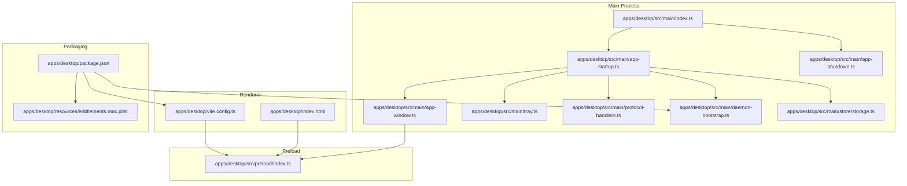
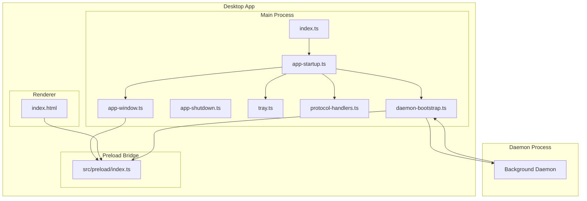
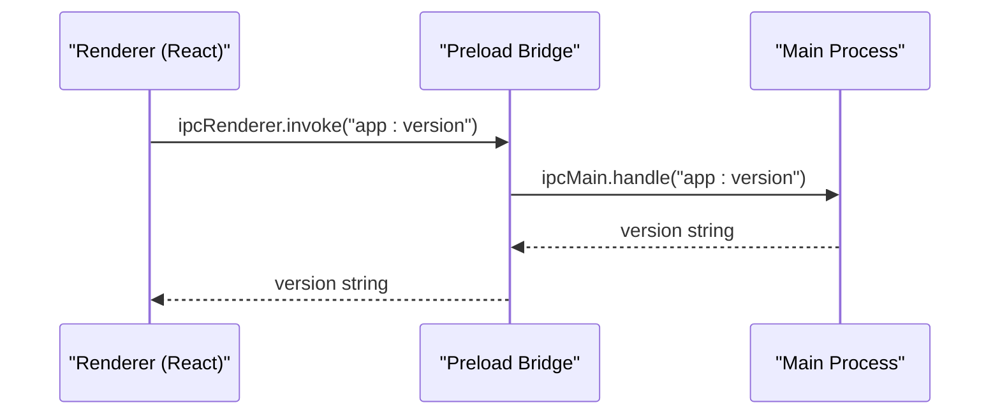
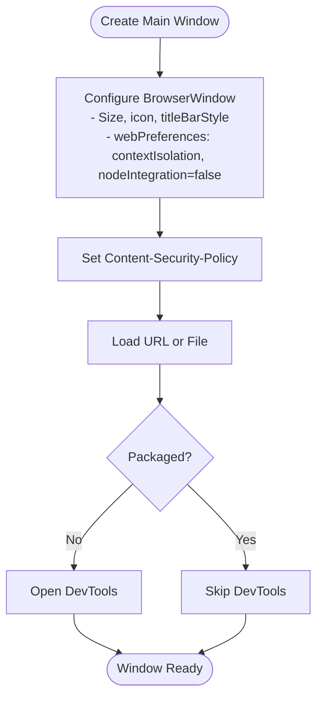
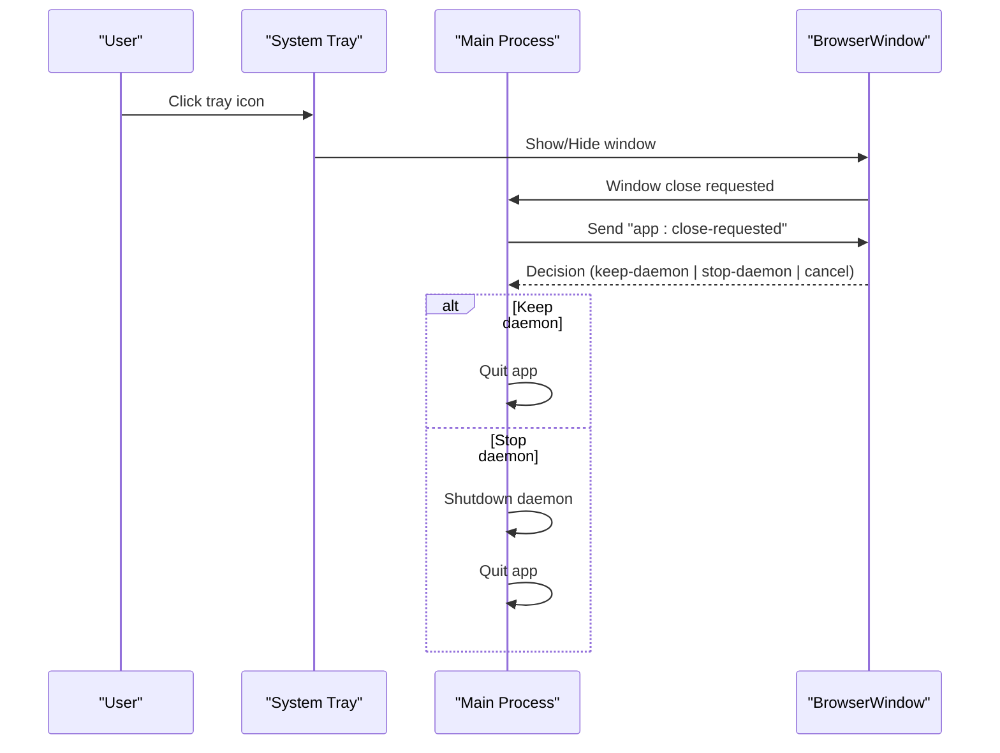
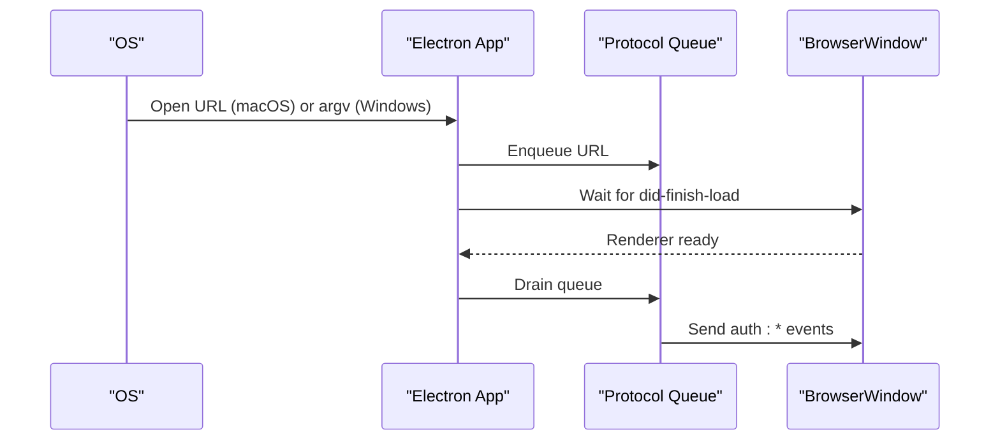
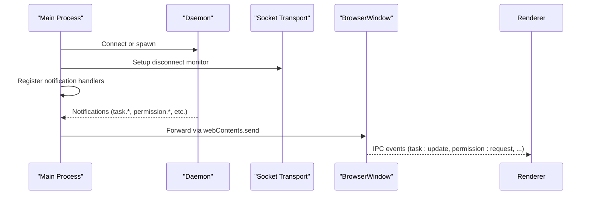
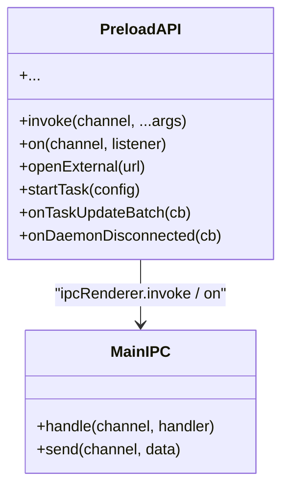
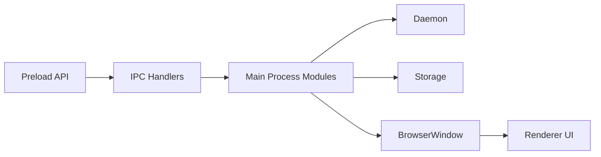

# Desktop Application

<cite>
**Referenced Files in This Document**
- [apps/desktop/src/main/index.ts](file://apps/desktop/src/main/index.ts)
- [apps/desktop/src/main/app-window.ts](file://apps/desktop/src/main/app-window.ts)
- [apps/desktop/src/main/app-startup.ts](file://apps/desktop/src/main/app-startup.ts)
- [apps/desktop/src/main/app-shutdown.ts](file://apps/desktop/src/main/app-shutdown.ts)
- [apps/desktop/src/main/tray.ts](file://apps/desktop/src/main/tray.ts)
- [apps/desktop/src/main/protocol-handlers.ts](file://apps/desktop/src/main/protocol-handlers.ts)
- [apps/desktop/src/main/daemon-bootstrap.ts](file://apps/desktop/src/main/daemon-bootstrap.ts)
- [apps/desktop/src/main/store/storage.ts](file://apps/desktop/src/main/store/storage.ts)
- [apps/desktop/src/preload/index.ts](file://apps/desktop/src/preload/index.ts)
- [apps/desktop/vite.config.ts](file://apps/desktop/vite.config.ts)
- [apps/desktop/package.json](file://apps/desktop/package.json)
- [apps/desktop/index.html](file://apps/desktop/index.html)
- [apps/desktop/resources/entitlements.mac.plist](file://apps/desktop/resources/entitlements.mac.plist)
</cite>

## Table of Contents

1. [Introduction](#introduction)
2. [Project Structure](#project-structure)
3. [Core Components](#core-components)
4. [Architecture Overview](#architecture-overview)
5. [Detailed Component Analysis](#detailed-component-analysis)
6. [Dependency Analysis](#dependency-analysis)
7. [Performance Considerations](#performance-considerations)
8. [Troubleshooting Guide](#troubleshooting-guide)
9. [Conclusion](#conclusion)
10. [Appendices](#appendices)

## Introduction

This document explains the Electron-based desktop application, focusing on the dual-process architecture, window and system tray management, protocol handling, preload security model, and the integration with the background daemon process. It provides both a beginner-friendly conceptual overview and technical details for experienced developers, including cross-platform considerations and practical examples for configuration and integration.

## Project Structure

The desktop app is organized into:

- Main process entry and lifecycle orchestration
- Renderer window creation and security policy
- Preload bridge exposing a controlled API surface to the renderer
- System tray integration and close behavior
- Daemon bootstrap and IPC event forwarding
- Build configuration and packaging metadata

**Diagram sources**

- [apps/desktop/src/main/index.ts:1-177](file://apps/desktop/src/main/index.ts#L1-L177)
- [apps/desktop/src/main/app-window.ts:1-117](file://apps/desktop/src/main/app-window.ts#L1-L117)
- [apps/desktop/src/main/app-startup.ts:1-285](file://apps/desktop/src/main/app-startup.ts#L1-L285)
- [apps/desktop/src/main/app-shutdown.ts:1-91](file://apps/desktop/src/main/app-shutdown.ts#L1-L91)
- [apps/desktop/src/main/tray.ts:1-108](file://apps/desktop/src/main/tray.ts#L1-L108)
- [apps/desktop/src/main/protocol-handlers.ts:1-125](file://apps/desktop/src/main/protocol-handlers.ts#L1-L125)
- [apps/desktop/src/main/daemon-bootstrap.ts:1-201](file://apps/desktop/src/main/daemon-bootstrap.ts#L1-L201)
- [apps/desktop/src/main/store/storage.ts:1-60](file://apps/desktop/src/main/store/storage.ts#L1-L60)
- [apps/desktop/src/preload/index.ts:1-888](file://apps/desktop/src/preload/index.ts#L1-L888)
- [apps/desktop/index.html:1-17](file://apps/desktop/index.html#L1-L17)
- [apps/desktop/vite.config.ts:1-132](file://apps/desktop/vite.config.ts#L1-L132)
- [apps/desktop/package.json:1-269](file://apps/desktop/package.json#L1-L269)
- [apps/desktop/resources/entitlements.mac.plist:1-19](file://apps/desktop/resources/entitlements.mac.plist#L1-L19)

**Section sources**

- [apps/desktop/src/main/index.ts:1-177](file://apps/desktop/src/main/index.ts#L1-L177)
- [apps/desktop/src/main/app-window.ts:1-117](file://apps/desktop/src/main/app-window.ts#L1-L117)
- [apps/desktop/src/main/app-startup.ts:1-285](file://apps/desktop/src/main/app-startup.ts#L1-L285)
- [apps/desktop/src/main/app-shutdown.ts:1-91](file://apps/desktop/src/main/app-shutdown.ts#L1-L91)
- [apps/desktop/src/main/tray.ts:1-108](file://apps/desktop/src/main/tray.ts#L1-L108)
- [apps/desktop/src/main/protocol-handlers.ts:1-125](file://apps/desktop/src/main/protocol-handlers.ts#L1-L125)
- [apps/desktop/src/main/daemon-bootstrap.ts:1-201](file://apps/desktop/src/main/daemon-bootstrap.ts#L1-L201)
- [apps/desktop/src/main/store/storage.ts:1-60](file://apps/desktop/src/main/store/storage.ts#L1-L60)
- [apps/desktop/src/preload/index.ts:1-888](file://apps/desktop/src/preload/index.ts#L1-L888)
- [apps/desktop/index.html:1-17](file://apps/desktop/index.html#L1-L17)
- [apps/desktop/vite.config.ts:1-132](file://apps/desktop/vite.config.ts#L1-L132)
- [apps/desktop/package.json:1-269](file://apps/desktop/package.json#L1-L269)
- [apps/desktop/resources/entitlements.mac.plist:1-19](file://apps/desktop/resources/entitlements.mac.plist#L1-L19)

## Core Components

- Main process bootstrap and lifecycle: initializes logging, environment, single-instance enforcement, protocol clients, and window creation.
- Window management: creates the main BrowserWindow with security policies, devtools, and CSP.
- Preload bridge: exposes a typed IPC API surface to the renderer while maintaining context isolation.
- System tray: integrates with OS notifications, auto-start, and window visibility toggles.
- Daemon integration: connects to or spawns a background daemon, forwards notifications to the renderer, and manages reconnection.
- Storage: initializes SQLite-backed storage and secure storage for settings and credentials.
- Packaging and build: Vite/Electron build pipeline, platform-specific targets, entitlements, and extra resources.

**Section sources**

- [apps/desktop/src/main/index.ts:1-177](file://apps/desktop/src/main/index.ts#L1-L177)
- [apps/desktop/src/main/app-window.ts:1-117](file://apps/desktop/src/main/app-window.ts#L1-L117)
- [apps/desktop/src/main/app-startup.ts:1-285](file://apps/desktop/src/main/app-startup.ts#L1-L285)
- [apps/desktop/src/main/tray.ts:1-108](file://apps/desktop/src/main/tray.ts#L1-L108)
- [apps/desktop/src/main/daemon-bootstrap.ts:1-201](file://apps/desktop/src/main/daemon-bootstrap.ts#L1-L201)
- [apps/desktop/src/main/store/storage.ts:1-60](file://apps/desktop/src/main/store/storage.ts#L1-L60)
- [apps/desktop/src/preload/index.ts:1-888](file://apps/desktop/src/preload/index.ts#L1-L888)
- [apps/desktop/vite.config.ts:1-132](file://apps/desktop/vite.config.ts#L1-L132)
- [apps/desktop/package.json:1-269](file://apps/desktop/package.json#L1-L269)

## Architecture Overview

The desktop app follows Electron’s dual-process model:

- Main process: orchestrates app lifecycle, window creation, system tray, protocol handling, daemon bootstrap, and IPC registration.
- Renderer process: runs the React UI, communicates with the main process via a controlled preload bridge.
- Background daemon: runs separately, communicates with the main process via a socket-based transport, and emits notifications forwarded to the renderer.

**Diagram sources**

- [apps/desktop/src/main/index.ts:1-177](file://apps/desktop/src/main/index.ts#L1-L177)
- [apps/desktop/src/main/app-window.ts:1-117](file://apps/desktop/src/main/app-window.ts#L1-L117)
- [apps/desktop/src/main/app-startup.ts:1-285](file://apps/desktop/src/main/app-startup.ts#L1-L285)
- [apps/desktop/src/main/app-shutdown.ts:1-91](file://apps/desktop/src/main/app-shutdown.ts#L1-L91)
- [apps/desktop/src/main/tray.ts:1-108](file://apps/desktop/src/main/tray.ts#L1-L108)
- [apps/desktop/src/main/protocol-handlers.ts:1-125](file://apps/desktop/src/main/protocol-handlers.ts#L1-L125)
- [apps/desktop/src/main/daemon-bootstrap.ts:1-201](file://apps/desktop/src/main/daemon-bootstrap.ts#L1-L201)
- [apps/desktop/src/preload/index.ts:1-888](file://apps/desktop/src/preload/index.ts#L1-L888)
- [apps/desktop/index.html:1-17](file://apps/desktop/index.html#L1-L17)

## Detailed Component Analysis

### Dual-Process Architecture and Security Model

- Context isolation and preload bridge:
  - The BrowserWindow is configured with contextIsolation enabled and nodeIntegration disabled.
  - A preload script defines a typed API surface exposed to the renderer via contextBridge.
  - IPC calls are routed through ipcRenderer.invoke/listener in the preload bridge and ipcMain.handle/on in the main process.
- Content Security Policy:
  - The main process sets a strict CSP for the renderer session, allowing self, unsafe-inline in development, and restricting connect-src to secure origins and WebSocket protocols.
- Single-instance enforcement:
  - The app requests a single-instance lock and focuses the existing instance on second launches.

**Diagram sources**

- [apps/desktop/src/main/app-window.ts:92-104](file://apps/desktop/src/main/app-window.ts#L92-L104)
- [apps/desktop/src/main/protocol-handlers.ts:115-124](file://apps/desktop/src/main/protocol-handlers.ts#L115-L124)
- [apps/desktop/src/preload/index.ts:29-30](file://apps/desktop/src/preload/index.ts#L29-L30)

**Section sources**

- [apps/desktop/src/main/app-window.ts:58-104](file://apps/desktop/src/main/app-window.ts#L58-L104)
- [apps/desktop/src/preload/index.ts:1-888](file://apps/desktop/src/preload/index.ts#L1-L888)
- [apps/desktop/src/main/protocol-handlers.ts:115-124](file://apps/desktop/src/main/protocol-handlers.ts#L115-L124)

### Window Management

- Window creation:
  - Creates a BrowserWindow with platform-specific title bar style and traffic light position on macOS.
  - Loads either a router URL (when provided) or a local index.html from the packaged web UI.
  - Applies a devtools toggle in non-packaged environments and sets a dark/light background based on native theme.
- Security and navigation:
  - Sets a strict CSP per session.
  - Opens external http/https links in the system browser and denies in-app popups.
  - Provides a context menu with spell-check suggestions and add-to-dictionary actions.

**Diagram sources**

- [apps/desktop/src/main/app-window.ts:31-116](file://apps/desktop/src/main/app-window.ts#L31-L116)

**Section sources**

- [apps/desktop/src/main/app-window.ts:1-117](file://apps/desktop/src/main/app-window.ts#L1-L117)
- [apps/desktop/index.html:6-9](file://apps/desktop/index.html#L6-L9)

### System Tray Integration and Close Behavior

- Tray creation:
  - Creates a tray icon sized appropriately per platform and binds a context menu with Show/Hide, auto-start toggle, and Quit.
  - Updates tooltip and menu dynamically based on active task count.
- Close behavior:
  - Intercepts window close, asks the renderer for a decision (keep daemon, stop daemon, cancel), and acts accordingly.
  - Graceful shutdown tears down tray, daemon, browser preview streams, analytics, and storage.

**Diagram sources**

- [apps/desktop/src/main/tray.ts:56-98](file://apps/desktop/src/main/tray.ts#L56-L98)
- [apps/desktop/src/main/app-startup.ts:206-253](file://apps/desktop/src/main/app-startup.ts#L206-L253)
- [apps/desktop/src/main/app-shutdown.ts:31-90](file://apps/desktop/src/main/app-shutdown.ts#L31-L90)

**Section sources**

- [apps/desktop/src/main/tray.ts:1-108](file://apps/desktop/src/main/tray.ts#L1-L108)
- [apps/desktop/src/main/app-startup.ts:206-253](file://apps/desktop/src/main/app-startup.ts#L206-L253)
- [apps/desktop/src/main/app-shutdown.ts:1-91](file://apps/desktop/src/main/app-shutdown.ts#L1-L91)

### Protocol Handlers and Deep Linking

- Cross-platform deep linking:
  - Registers macOS open-url and Windows argv-based protocol activation for accomplish:// URLs.
  - Queues URLs until the renderer is ready and then dispatches them to the renderer.
- OAuth and MCP callbacks:
  - Routes specific callback paths to the renderer for authentication flows.

**Diagram sources**

- [apps/desktop/src/main/protocol-handlers.ts:23-61](file://apps/desktop/src/main/protocol-handlers.ts#L23-L61)

**Section sources**

- [apps/desktop/src/main/protocol-handlers.ts:1-125](file://apps/desktop/src/main/protocol-handlers.ts#L1-L125)

### Daemon Integration and Notification Forwarding

- Bootstrap:
  - Ensures a daemon is running (spawns if needed) and establishes a socket-based transport.
  - Sets up reconnection detection and registers notification forwarding to the renderer.
- Forwarded events:
  - Task progress, batched updates, completion/error, status changes, summaries, permission requests, todos, thought/stream checkpoints, usage updates, and integration-specific events (e.g., WhatsApp QR/status).

**Diagram sources**

- [apps/desktop/src/main/daemon-bootstrap.ts:42-81](file://apps/desktop/src/main/daemon-bootstrap.ts#L42-L81)
- [apps/desktop/src/main/daemon-bootstrap.ts:108-200](file://apps/desktop/src/main/daemon-bootstrap.ts#L108-L200)

**Section sources**

- [apps/desktop/src/main/daemon-bootstrap.ts:1-201](file://apps/desktop/src/main/daemon-bootstrap.ts#L1-L201)

### Preload API Surface and IPC Patterns

- Preload API categories include:
  - App info, shell, tasks, permissions, sessions, settings, API keys, onboarding, model selection, sandbox, connectors, favorites, files, workspaces, knowledge notes, debug utilities, daemon control, close behavior, and more.
- Event subscriptions:
  - Provides typed listeners for task updates, progress, permission requests, debug logs, theme changes, and daemon connectivity events.
- Example usage patterns:
  - Renderer invokes ipcRenderer.invoke with a channel name and arguments.
  - Main process registers ipcMain.handle for the channel and returns a value or triggers an operation.
  - For long-running or frequent events, batched channels reduce IPC overhead.

**Diagram sources**

- [apps/desktop/src/preload/index.ts:25-800](file://apps/desktop/src/preload/index.ts#L25-L800)
- [apps/desktop/src/main/protocol-handlers.ts:115-124](file://apps/desktop/src/main/protocol-handlers.ts#L115-L124)

**Section sources**

- [apps/desktop/src/preload/index.ts:1-888](file://apps/desktop/src/preload/index.ts#L1-L888)
- [apps/desktop/src/main/protocol-handlers.ts:115-124](file://apps/desktop/src/main/protocol-handlers.ts#L115-L124)

### Storage and Settings

- Storage:
  - Initializes a SQLite database and secure storage in the app’s userData directory.
  - Supports migration and legacy data import on first run.
- Secure storage:
  - Used for sensitive credentials and keys; cleared on clean start.

**Section sources**

- [apps/desktop/src/main/store/storage.ts:1-60](file://apps/desktop/src/main/store/storage.ts#L1-L60)
- [apps/desktop/src/main/index.ts:45-59](file://apps/desktop/src/main/index.ts#L45-L59)

### Build, Packaging, and Platform Entitlements

- Build pipeline:
  - Vite with electron plugin compiles main and preload scripts, aliases workspace packages, and externalizes node modules except local sources.
  - Sourcemaps enabled for debugging.
- Packaging:
  - Electron Builder configuration defines product name, appId, artifacts, extraResources (web UI, daemon, skills), asar packing, and platform-specific targets.
  - macOS hardened runtime with entitlements for JIT, unsigned memory, library validation disabled, network client/server, and user-selected file access.
- Scripts:
  - npm-style scripts for dev, build, package, and test workflows.

**Section sources**

- [apps/desktop/vite.config.ts:1-132](file://apps/desktop/vite.config.ts#L1-L132)
- [apps/desktop/package.json:103-267](file://apps/desktop/package.json#L103-L267)
- [apps/desktop/resources/entitlements.mac.plist:1-19](file://apps/desktop/resources/entitlements.mac.plist#L1-L19)

## Dependency Analysis

- Main process dependencies:
  - Electron app APIs for lifecycle, BrowserWindow, Tray, Menu, protocol clients.
  - Agent Core for daemon transport, RPC client, and shared types.
  - Local modules for window creation, startup/shutdown, tray, protocol handling, daemon bootstrap, and storage.
- Preload dependencies:
  - Electron contextBridge and ipcRenderer.
  - Agent Core types for typed IPC payloads.
- Renderer:
  - React UI consuming the preload bridge API.
- Packaging:
  - Extra resources include web UI, daemon binaries, MCP tools, and bundled skills.

**Diagram sources**

- [apps/desktop/src/preload/index.ts:1-888](file://apps/desktop/src/preload/index.ts#L1-L888)
- [apps/desktop/src/main/app-startup.ts:194-195](file://apps/desktop/src/main/app-startup.ts#L194-L195)
- [apps/desktop/src/main/daemon-bootstrap.ts:108-200](file://apps/desktop/src/main/daemon-bootstrap.ts#L108-L200)
- [apps/desktop/src/main/store/storage.ts:1-60](file://apps/desktop/src/main/store/storage.ts#L1-L60)
- [apps/desktop/src/main/app-window.ts:1-117](file://apps/desktop/src/main/app-window.ts#L1-L117)

**Section sources**

- [apps/desktop/src/main/index.ts:1-177](file://apps/desktop/src/main/index.ts#L1-L177)
- [apps/desktop/src/main/app-startup.ts:194-195](file://apps/desktop/src/main/app-startup.ts#L194-L195)
- [apps/desktop/src/main/daemon-bootstrap.ts:108-200](file://apps/desktop/src/main/daemon-bootstrap.ts#L108-L200)
- [apps/desktop/src/main/store/storage.ts:1-60](file://apps/desktop/src/main/store/storage.ts#L1-L60)
- [apps/desktop/src/main/app-window.ts:1-117](file://apps/desktop/src/main/app-window.ts#L1-L117)
- [apps/desktop/src/preload/index.ts:1-888](file://apps/desktop/src/preload/index.ts#L1-L888)

## Performance Considerations

- Prefer batched IPC channels for frequent updates to reduce IPC overhead.
- Minimize main-thread blocking; delegate heavy work to the daemon or preload-bound workers.
- Use contextIsolation and CSP to prevent unnecessary renderer-side computations and network calls.
- Leverage platform-specific optimizations (e.g., hidden inset title bar on macOS) without impacting performance.
- Keep preload API surface minimal to reduce attack surface and improve maintainability.

## Troubleshooting Guide

- Uncaught exceptions and unhandled rejections:
  - The main process logs uncaught exceptions and unhandled rejections via the log collector.
- Daemon connectivity:
  - If daemon fails to start or disconnects, the UI shows status dots and toasts; reconnection is handled automatically.
- Window not loading:
  - Verify ROUTER_URL or WEB_DIST paths; confirm CSP allows connections; check devtools logs in non-packaged mode.
- Tray and close behavior:
  - If the app does not quit as expected, review the close-requested IPC flow and decisions returned by the renderer.
- Logging and diagnostics:
  - Use preload APIs to export logs and capture screenshots/Aria tree for bug reports.

**Section sources**

- [apps/desktop/src/main/index.ts:100-116](file://apps/desktop/src/main/index.ts#L100-L116)
- [apps/desktop/src/main/app-startup.ts:181-192](file://apps/desktop/src/main/app-startup.ts#L181-L192)
- [apps/desktop/src/main/app-window.ts:92-104](file://apps/desktop/src/main/app-window.ts#L92-L104)
- [apps/desktop/src/preload/index.ts:552-553](file://apps/desktop/src/preload/index.ts#L552-L553)
- [apps/desktop/src/preload/index.ts:739-763](file://apps/desktop/src/preload/index.ts#L739-L763)

## Conclusion

The desktop application leverages Electron’s dual-process architecture to deliver a secure, cross-platform desktop experience. The main process manages lifecycle, windowing, system integration, and daemon connectivity, while the renderer consumes a carefully curated preload API. Robust IPC patterns, CSP, and platform-specific packaging ensure reliability and safety across Windows, macOS, and Linux.

## Appendices

### Practical Examples

- Window configuration
  - Use the window creation function to customize size, minimum dimensions, title bar style, and CSP.
  - Reference: [apps/desktop/src/main/app-window.ts:31-116](file://apps/desktop/src/main/app-window.ts#L31-L116)

- Menu bar and context menu
  - The window sets a context menu for misspelled words and denies in-app popups, opening external links in the system browser.
  - Reference: [apps/desktop/src/main/app-window.ts:66-90](file://apps/desktop/src/main/app-window.ts#L66-L90)

- System tray integration
  - Create tray, update tooltip/count, toggle auto-start, and handle clicks to show/hide the window.
  - Reference: [apps/desktop/src/main/tray.ts:56-98](file://apps/desktop/src/main/tray.ts#L56-L98)

- Preload API usage
  - Invoke settings, tasks, permissions, and daemon controls via preload channels; subscribe to events for real-time updates.
  - Reference: [apps/desktop/src/preload/index.ts:25-800](file://apps/desktop/src/preload/index.ts#L25-L800)

- Relationship to the background daemon
  - Bootstrap the daemon, register notification forwarding, and handle reconnection; UI receives task and permission events.
  - Reference: [apps/desktop/src/main/daemon-bootstrap.ts:42-81](file://apps/desktop/src/main/daemon-bootstrap.ts#L42-L81)

- Cross-platform considerations
  - macOS: hidden inset title bar, dock icon, entitlements for JIT and network access.
  - Windows: default title bar, protocol client registration, NSIS installer options.
  - Linux: tray icon sizing and packaging targets.
  - Reference: [apps/desktop/src/main/app-window.ts:56-57](file://apps/desktop/src/main/app-window.ts#L56-L57), [apps/desktop/resources/entitlements.mac.plist:1-19](file://apps/desktop/resources/entitlements.mac.plist#L1-L19), [apps/desktop/package.json:259-266](file://apps/desktop/package.json#L259-L266)

- Debugging and performance tips
  - Enable devtools in non-packaged mode; export logs and capture screenshots/Aria tree for bug reports.
  - Use batched IPC channels and minimize main-thread work.
  - Reference: [apps/desktop/src/main/app-window.ts:95-97](file://apps/desktop/src/main/app-window.ts#L95-L97), [apps/desktop/src/preload/index.ts:552-553](file://apps/desktop/src/preload/index.ts#L552-L553), [apps/desktop/src/preload/index.ts:739-763](file://apps/desktop/src/preload/index.ts#L739-L763)
