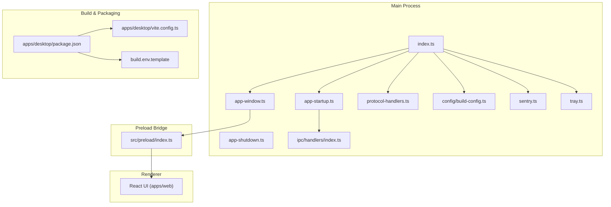
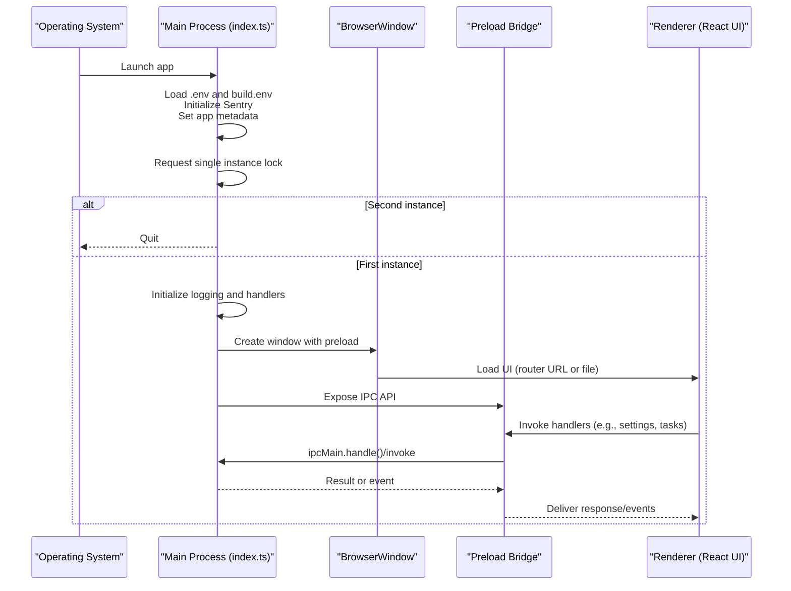
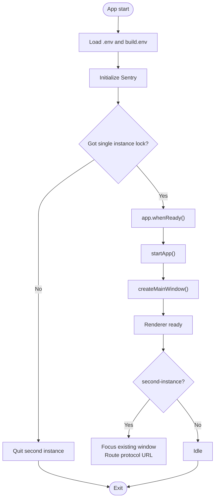
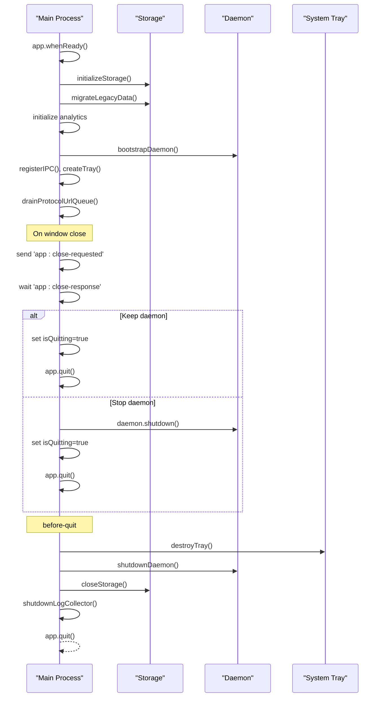
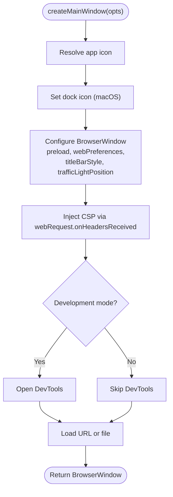
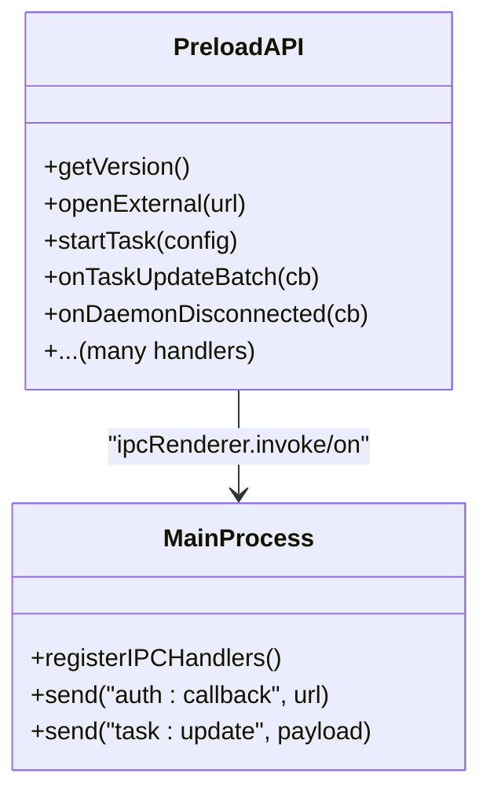
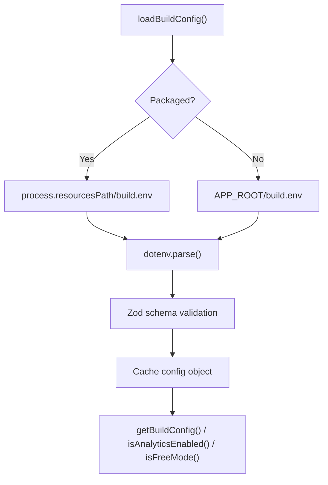
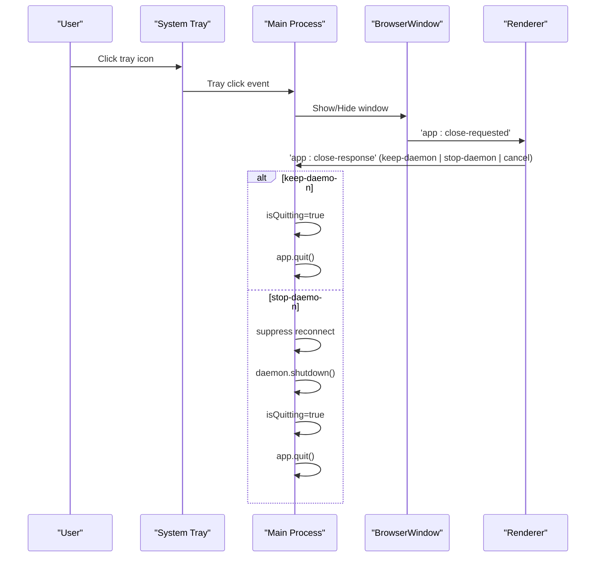
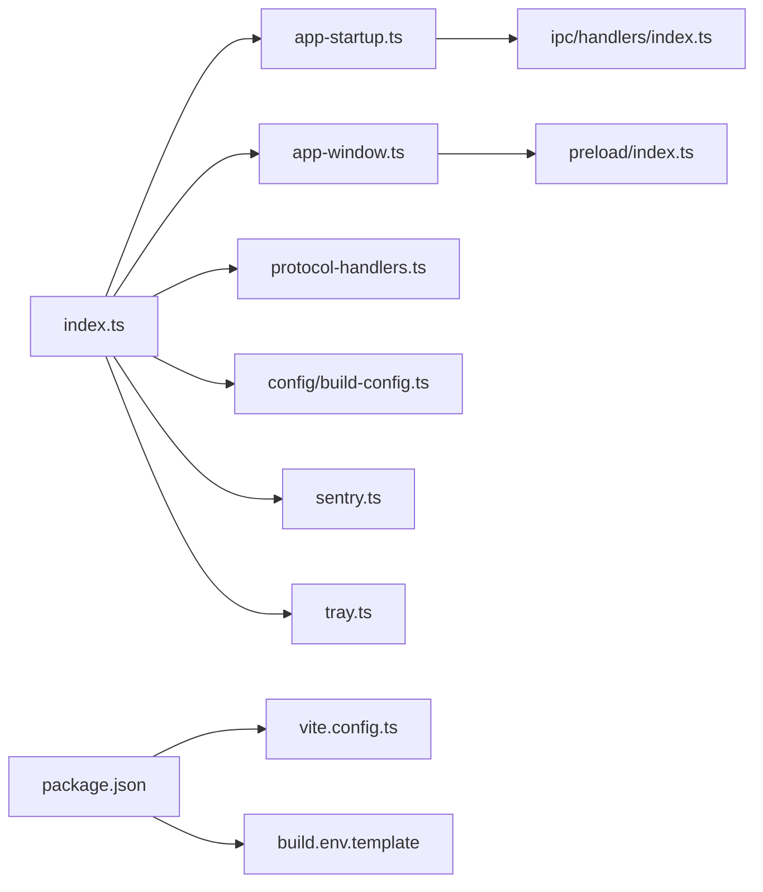

# Electron Architecture and Process Management

<cite>
**Referenced Files in This Document**
- [apps/desktop/src/main/index.ts](file://apps/desktop/src/main/index.ts)
- [apps/desktop/src/main/app-startup.ts](file://apps/desktop/src/main/app-startup.ts)
- [apps/desktop/src/main/app-shutdown.ts](file://apps/desktop/src/main/app-shutdown.ts)
- [apps/desktop/src/main/app-window.ts](file://apps/desktop/src/main/app-window.ts)
- [apps/desktop/src/main/protocol-handlers.ts](file://apps/desktop/src/main/protocol-handlers.ts)
- [apps/desktop/src/main/config/build-config.ts](file://apps/desktop/src/main/config/build-config.ts)
- [apps/desktop/src/main/sentry.ts](file://apps/desktop/src/main/sentry.ts)
- [apps/desktop/src/main/tray.ts](file://apps/desktop/src/main/tray.ts)
- [apps/desktop/src/preload/index.ts](file://apps/desktop/src/preload/index.ts)
- [apps/desktop/src/main/ipc/handlers/index.ts](file://apps/desktop/src/main/ipc/handlers/index.ts)
- [apps/desktop/package.json](file://apps/desktop/package.json)
- [apps/desktop/vite.config.ts](file://apps/desktop/vite.config.ts)
- [apps/desktop/build.env.template](file://apps/desktop/build.env.template)
</cite>

## Table of Contents

1. [Introduction](#introduction)
2. [Project Structure](#project-structure)
3. [Core Components](#core-components)
4. [Architecture Overview](#architecture-overview)
5. [Detailed Component Analysis](#detailed-component-analysis)
6. [Dependency Analysis](#dependency-analysis)
7. [Performance Considerations](#performance-considerations)
8. [Troubleshooting Guide](#troubleshooting-guide)
9. [Conclusion](#conclusion)
10. [Appendices](#appendices)

## Introduction

This document explains the Electron architecture and process management for the desktop application. It covers the dual-process design: the main process (Node/Electron APIs, system integration, lifecycle) and the renderer process (UI rendering and user interaction). It documents the single instance lock and second-instance handling, build configuration and environment management, and the secure communication bridge between processes. Practical examples demonstrate lifecycle hooks, startup/shutdown procedures, and IPC patterns. Security considerations and best practices are highlighted throughout.

## Project Structure

The desktop app is organized around Electron’s main and renderer processes, with a preload bridge exposing a controlled API surface to the renderer. Supporting modules handle startup, shutdown, window creation, protocol handling, build configuration, analytics/error tracking, and system tray integration.

**Diagram sources**

- [apps/desktop/src/main/index.ts:1-177](file://apps/desktop/src/main/index.ts#L1-L177)
- [apps/desktop/src/main/app-startup.ts:1-285](file://apps/desktop/src/main/app-startup.ts#L1-L285)
- [apps/desktop/src/main/app-shutdown.ts:1-91](file://apps/desktop/src/main/app-shutdown.ts#L1-L91)
- [apps/desktop/src/main/app-window.ts:1-117](file://apps/desktop/src/main/app-window.ts#L1-L117)
- [apps/desktop/src/main/protocol-handlers.ts:1-125](file://apps/desktop/src/main/protocol-handlers.ts#L1-L125)
- [apps/desktop/src/main/config/build-config.ts:1-108](file://apps/desktop/src/main/config/build-config.ts#L1-L108)
- [apps/desktop/src/main/sentry.ts:1-48](file://apps/desktop/src/main/sentry.ts#L1-L48)
- [apps/desktop/src/main/tray.ts:1-108](file://apps/desktop/src/main/tray.ts#L1-L108)
- [apps/desktop/src/preload/index.ts:1-888](file://apps/desktop/src/preload/index.ts#L1-L888)
- [apps/desktop/src/main/ipc/handlers/index.ts:1-28](file://apps/desktop/src/main/ipc/handlers/index.ts#L1-L28)
- [apps/desktop/package.json:1-269](file://apps/desktop/package.json#L1-L269)
- [apps/desktop/vite.config.ts:1-132](file://apps/desktop/vite.config.ts#L1-L132)
- [apps/desktop/build.env.template:1-13](file://apps/desktop/build.env.template#L1-L13)

**Section sources**

- [apps/desktop/src/main/index.ts:1-177](file://apps/desktop/src/main/index.ts#L1-L177)
- [apps/desktop/src/main/app-startup.ts:1-285](file://apps/desktop/src/main/app-startup.ts#L1-L285)
- [apps/desktop/src/main/app-window.ts:1-117](file://apps/desktop/src/main/app-window.ts#L1-L117)
- [apps/desktop/src/main/protocol-handlers.ts:1-125](file://apps/desktop/src/main/protocol-handlers.ts#L1-L125)
- [apps/desktop/src/main/config/build-config.ts:1-108](file://apps/desktop/src/main/config/build-config.ts#L1-L108)
- [apps/desktop/src/main/sentry.ts:1-48](file://apps/desktop/src/main/sentry.ts#L1-L48)
- [apps/desktop/src/main/tray.ts:1-108](file://apps/desktop/src/main/tray.ts#L1-L108)
- [apps/desktop/src/preload/index.ts:1-888](file://apps/desktop/src/preload/index.ts#L1-L888)
- [apps/desktop/src/main/ipc/handlers/index.ts:1-28](file://apps/desktop/src/main/ipc/handlers/index.ts#L1-L28)
- [apps/desktop/package.json:1-269](file://apps/desktop/package.json#L1-L269)
- [apps/desktop/vite.config.ts:1-132](file://apps/desktop/vite.config.ts#L1-L132)
- [apps/desktop/build.env.template:1-13](file://apps/desktop/build.env.template#L1-L13)

## Core Components

- Main process entry and lifecycle:
  - Initializes environment, loads build configuration, sets app metadata, registers single instance lock, and wires lifecycle events.
  - Creates the main BrowserWindow and registers protocol handlers and IPC handlers.
- Startup orchestration:
  - Performs migrations, initializes storage, analytics, daemon, tray, and registers IPC handlers before opening the window.
- Shutdown orchestration:
  - Gracefully tears down services, stops streams, closes storage, and exits the app.
- Window creation:
  - Configures BrowserWindow with security hardening, preload script, CSP, and devtools toggles.
- Preload bridge:
  - Exposes a typed, minimal API surface to the renderer via contextBridge and ipcRenderer, enabling controlled IPC.
- Build configuration and environment:
  - Loads build.env for Free builds, validates with Zod, and avoids leaking secrets into child processes.
- Single instance lock and protocol handling:
  - Enforces a single app instance, focuses existing instance on second-instance, and routes deep links to the renderer.
- System tray:
  - Provides quick actions, auto-start toggle, and task status indicator.

**Section sources**

- [apps/desktop/src/main/index.ts:1-177](file://apps/desktop/src/main/index.ts#L1-L177)
- [apps/desktop/src/main/app-startup.ts:1-285](file://apps/desktop/src/main/app-startup.ts#L1-L285)
- [apps/desktop/src/main/app-shutdown.ts:1-91](file://apps/desktop/src/main/app-shutdown.ts#L1-L91)
- [apps/desktop/src/main/app-window.ts:1-117](file://apps/desktop/src/main/app-window.ts#L1-L117)
- [apps/desktop/src/preload/index.ts:1-888](file://apps/desktop/src/preload/index.ts#L1-L888)
- [apps/desktop/src/main/config/build-config.ts:1-108](file://apps/desktop/src/main/config/build-config.ts#L1-L108)
- [apps/desktop/src/main/protocol-handlers.ts:1-125](file://apps/desktop/src/main/protocol-handlers.ts#L1-L125)
- [apps/desktop/src/main/tray.ts:1-108](file://apps/desktop/src/main/tray.ts#L1-L108)

## Architecture Overview

The desktop app follows Electron’s dual-process model:

- Main process: orchestrates app lifecycle, manages BrowserWindow, integrates with system services, and runs long-lived services (daemon, analytics).
- Renderer process: hosts the React UI, listens to IPC events, and triggers main-process actions via the preload bridge.
- Preload: acts as a secure bridge, exposing only explicitly whitelisted APIs.

**Diagram sources**

- [apps/desktop/src/main/index.ts:118-146](file://apps/desktop/src/main/index.ts#L118-L146)
- [apps/desktop/src/main/app-window.ts:31-116](file://apps/desktop/src/main/app-window.ts#L31-L116)
- [apps/desktop/src/preload/index.ts:25-80](file://apps/desktop/src/preload/index.ts#L25-L80)
- [apps/desktop/src/main/ipc/handlers/index.ts:14-27](file://apps/desktop/src/main/ipc/handlers/index.ts#L14-L27)

## Detailed Component Analysis

### Main Process Lifecycle and Single Instance Lock

- Environment and metadata:
  - Loads .env and build.env, sets app name and user data paths, and initializes Sentry before app readiness.
- Single instance enforcement:
  - Uses requestSingleInstanceLock to ensure only one app instance runs. On second instance, quits immediately.
- Second-instance handling:
  - Focuses the existing window and routes protocol URLs to the renderer.
- Uncaught error handling:
  - Listens to uncaughtException and unhandledRejection to log and prevent crashes from taking down the app unexpectedly.
- Protocol handling:
  - Registers macOS open-url and Windows argv-based protocol activation; queues URLs until the renderer is ready.

**Diagram sources**

- [apps/desktop/src/main/index.ts:118-146](file://apps/desktop/src/main/index.ts#L118-L146)
- [apps/desktop/src/main/protocol-handlers.ts:86-110](file://apps/desktop/src/main/protocol-handlers.ts#L86-L110)

**Section sources**

- [apps/desktop/src/main/index.ts:1-177](file://apps/desktop/src/main/index.ts#L1-L177)
- [apps/desktop/src/main/protocol-handlers.ts:1-125](file://apps/desktop/src/main/protocol-handlers.ts#L1-L125)

### Startup and Shutdown Orchestration

- Startup:
  - Migrates legacy data, initializes storage and workspaces, validates providers, auto-starts local model server if configured, initializes analytics, boots daemon, registers IPC handlers, creates tray, drains queued protocol URLs, and handles close behavior via IPC.
- Shutdown:
  - Destroys tray, shuts down daemon, stops browser preview streams and local model server, cleans up OAuth flows, closes storage, flushes analytics, and quits the app with timeout protection.

**Diagram sources**

- [apps/desktop/src/main/app-startup.ts:47-284](file://apps/desktop/src/main/app-startup.ts#L47-L284)
- [apps/desktop/src/main/app-shutdown.ts:31-90](file://apps/desktop/src/main/app-shutdown.ts#L31-L90)

**Section sources**

- [apps/desktop/src/main/app-startup.ts:1-285](file://apps/desktop/src/main/app-startup.ts#L1-L285)
- [apps/desktop/src/main/app-shutdown.ts:1-91](file://apps/desktop/src/main/app-shutdown.ts#L1-L91)

### Window Creation and Security Hardening

- Creates the main BrowserWindow with:
  - Preload script path resolution.
  - Security-focused webPreferences: nodeIntegration disabled, contextIsolation enabled, spellcheck enabled.
  - Platform-specific dock icon and title bar style.
  - Content-Security-Policy headers injected via webRequest hook.
  - Devtools auto-open in development mode.
- Loads either a router URL or a local index.html from the web build output.

**Diagram sources**

- [apps/desktop/src/main/app-window.ts:31-116](file://apps/desktop/src/main/app-window.ts#L31-L116)

**Section sources**

- [apps/desktop/src/main/app-window.ts:1-117](file://apps/desktop/src/main/app-window.ts#L1-L117)

### Preload Bridge and IPC Patterns

- The preload script exposes a typed API to the renderer via contextBridge, wrapping ipcRenderer.invoke and ipcRenderer.on.
- Examples of exposed capabilities:
  - App info, shell operations, task lifecycle, permission responses, settings, provider configurations, speech, skills, daemon control, favorites, files, sandbox, connectors, HuggingFace local server, workspace management, and debug utilities.
- Renderer-to-main IPC:
  - Uses ipcRenderer.invoke for requests and ipcRenderer.on for event subscriptions.
- Main-to-renderer IPC:
  - Uses BrowserWindow.webContents.send for events like auth callbacks and task updates.

**Diagram sources**

- [apps/desktop/src/preload/index.ts:25-800](file://apps/desktop/src/preload/index.ts#L25-L800)
- [apps/desktop/src/main/ipc/handlers/index.ts:14-27](file://apps/desktop/src/main/ipc/handlers/index.ts#L14-L27)

**Section sources**

- [apps/desktop/src/preload/index.ts:1-888](file://apps/desktop/src/preload/index.ts#L1-L888)
- [apps/desktop/src/main/ipc/handlers/index.ts:1-28](file://apps/desktop/src/main/ipc/handlers/index.ts#L1-L28)

### Build Configuration and Environment Management

- build.env loading:
  - Loaded from process.resourcesPath/build.env in packaged apps or APP_ROOT/build.env in development.
  - Parsed with Zod into a local object; never mutates process.env to avoid leaking secrets to child processes.
- Feature gating:
  - Analytics and error tracking are enabled when tokens/DSNs are present.
  - Free tier availability determined by presence of gateway URL.
- Vite/Electron build:
  - Aliases workspace packages to local source and externalizes node_modules except local code.
  - Defines preload build outputs and main process entry.

**Diagram sources**

- [apps/desktop/src/main/config/build-config.ts:40-102](file://apps/desktop/src/main/config/build-config.ts#L40-L102)
- [apps/desktop/build.env.template:1-13](file://apps/desktop/build.env.template#L1-L13)
- [apps/desktop/vite.config.ts:77-91](file://apps/desktop/vite.config.ts#L77-L91)

**Section sources**

- [apps/desktop/src/main/config/build-config.ts:1-108](file://apps/desktop/src/main/config/build-config.ts#L1-L108)
- [apps/desktop/build.env.template:1-13](file://apps/desktop/build.env.template#L1-L13)
- [apps/desktop/vite.config.ts:1-132](file://apps/desktop/vite.config.ts#L1-L132)

### System Tray and Close Behavior

- Tray menu:
  - Show/hide window, start-at-login toggle, quit.
  - Tooltip reflects active task count.
- Close behavior:
  - Renderer sends a themed close dialog and emits decisions via IPC.
  - Main process decides whether to keep or stop the daemon before quitting.

**Diagram sources**

- [apps/desktop/src/main/tray.ts:56-81](file://apps/desktop/src/main/tray.ts#L56-L81)
- [apps/desktop/src/main/app-startup.ts:206-253](file://apps/desktop/src/main/app-startup.ts#L206-L253)

**Section sources**

- [apps/desktop/src/main/tray.ts:1-108](file://apps/desktop/src/main/tray.ts#L1-L108)
- [apps/desktop/src/main/app-startup.ts:206-253](file://apps/desktop/src/main/app-startup.ts#L206-L253)

### Security Implications and Best Practices

- Context isolation and preload:
  - nodeIntegration disabled, contextIsolation enabled, preload exposes only explicit APIs.
- CSP:
  - Strict CSP applied via webRequest hook to mitigate XSS.
- Secrets management:
  - build.env parsed into a local object; never leaked to process.env or child processes.
- Error tracking:
  - Sentry initialized with device fingerprinting and breadcrumb scrubbing; no-op in OSS builds.
- Single instance:
  - Prevents duplicate state and resource contention.

**Section sources**

- [apps/desktop/src/main/app-window.ts:58-104](file://apps/desktop/src/main/app-window.ts#L58-L104)
- [apps/desktop/src/main/config/build-config.ts:47-79](file://apps/desktop/src/main/config/build-config.ts#L47-L79)
- [apps/desktop/src/main/sentry.ts:18-47](file://apps/desktop/src/main/sentry.ts#L18-L47)
- [apps/desktop/src/main/index.ts:118-146](file://apps/desktop/src/main/index.ts#L118-L146)

## Dependency Analysis

The main process depends on:

- Electron app lifecycle and BrowserWindow APIs.
- Local modules for startup/shutdown, window creation, protocol handling, build config, Sentry, and tray.
- Preload bridge for IPC contract.
- Package.json and Vite config for build and packaging.

**Diagram sources**

- [apps/desktop/src/main/index.ts:1-177](file://apps/desktop/src/main/index.ts#L1-L177)
- [apps/desktop/src/main/app-startup.ts:1-285](file://apps/desktop/src/main/app-startup.ts#L1-L285)
- [apps/desktop/src/main/app-window.ts:1-117](file://apps/desktop/src/main/app-window.ts#L1-L117)
- [apps/desktop/src/main/protocol-handlers.ts:1-125](file://apps/desktop/src/main/protocol-handlers.ts#L1-L125)
- [apps/desktop/src/main/config/build-config.ts:1-108](file://apps/desktop/src/main/config/build-config.ts#L1-L108)
- [apps/desktop/src/main/sentry.ts:1-48](file://apps/desktop/src/main/sentry.ts#L1-L48)
- [apps/desktop/src/main/tray.ts:1-108](file://apps/desktop/src/main/tray.ts#L1-L108)
- [apps/desktop/src/preload/index.ts:1-888](file://apps/desktop/src/preload/index.ts#L1-L888)
- [apps/desktop/src/main/ipc/handlers/index.ts:1-28](file://apps/desktop/src/main/ipc/handlers/index.ts#L1-L28)
- [apps/desktop/package.json:1-269](file://apps/desktop/package.json#L1-L269)
- [apps/desktop/vite.config.ts:1-132](file://apps/desktop/vite.config.ts#L1-L132)
- [apps/desktop/build.env.template:1-13](file://apps/desktop/build.env.template#L1-L13)

**Section sources**

- [apps/desktop/src/main/index.ts:1-177](file://apps/desktop/src/main/index.ts#L1-L177)
- [apps/desktop/package.json:103-268](file://apps/desktop/package.json#L103-L268)
- [apps/desktop/vite.config.ts:64-131](file://apps/desktop/vite.config.ts#L64-L131)

## Performance Considerations

- Asar packaging and selective unpacking reduce binary size and improve startup speed.
- Preload and main bundles are built separately with externalized node_modules to minimize bundle size.
- IPC batching for task updates reduces overhead for frequent events.
- Graceful degradation: daemon failures do not block UI startup; services are started asynchronously.

[No sources needed since this section provides general guidance]

## Troubleshooting Guide

- Uncaught exceptions and rejections:
  - Logged via the log collector before the app exits.
- Analytics and Sentry:
  - Initialization is best-effort; missing DSNs or misconfigured tokens are handled gracefully.
- Build secrets leakage:
  - build.env is parsed into a local object; verify APP_ROOT is set correctly and resources path is used in packaged builds.
- Protocol deep links:
  - Queued until renderer is ready; ensure the window is created and the renderer is listening for auth callbacks.
- Close behavior:
  - If the renderer does not respond to the close request, the window remains open; verify IPC listeners are registered.

**Section sources**

- [apps/desktop/src/main/index.ts:100-116](file://apps/desktop/src/main/index.ts#L100-L116)
- [apps/desktop/src/main/sentry.ts:18-47](file://apps/desktop/src/main/sentry.ts#L18-L47)
- [apps/desktop/src/main/config/build-config.ts:40-80](file://apps/desktop/src/main/config/build-config.ts#L40-L80)
- [apps/desktop/src/main/protocol-handlers.ts:35-48](file://apps/desktop/src/main/protocol-handlers.ts#L35-L48)
- [apps/desktop/src/main/app-startup.ts:222-252](file://apps/desktop/src/main/app-startup.ts#L222-L252)

## Conclusion

The desktop app implements a robust Electron architecture with clear separation of concerns. The main process manages lifecycle, security, and system integration, while the renderer focuses on UI and user interaction. The preload bridge provides a secure IPC surface, and build configuration ensures proper feature gating and secret handling. Single instance lock, protocol handling, and graceful shutdown further enhance reliability and user experience.

[No sources needed since this section summarizes without analyzing specific files]

## Appendices

### Practical Examples Index

- Single instance lock and second-instance focus:
  - [apps/desktop/src/main/index.ts:118-141](file://apps/desktop/src/main/index.ts#L118-L141)
- Protocol URL handling and queueing:
  - [apps/desktop/src/main/protocol-handlers.ts:20-61](file://apps/desktop/src/main/protocol-handlers.ts#L20-L61)
- Window creation with CSP and preload:
  - [apps/desktop/src/main/app-window.ts:31-116](file://apps/desktop/src/main/app-window.ts#L31-L116)
- Preload API exposure:
  - [apps/desktop/src/preload/index.ts:25-800](file://apps/desktop/src/preload/index.ts#L25-L800)
- Build configuration loading and validation:
  - [apps/desktop/src/main/config/build-config.ts:40-102](file://apps/desktop/src/main/config/build-config.ts#L40-L102)
- Sentry initialization:
  - [apps/desktop/src/main/sentry.ts:18-47](file://apps/desktop/src/main/sentry.ts#L18-L47)
- System tray integration:
  - [apps/desktop/src/main/tray.ts:56-81](file://apps/desktop/src/main/tray.ts#L56-L81)
- Startup and shutdown lifecycle:
  - [apps/desktop/src/main/app-startup.ts:47-284](file://apps/desktop/src/main/app-startup.ts#L47-L284)
  - [apps/desktop/src/main/app-shutdown.ts:31-90](file://apps/desktop/src/main/app-shutdown.ts#L31-L90)
