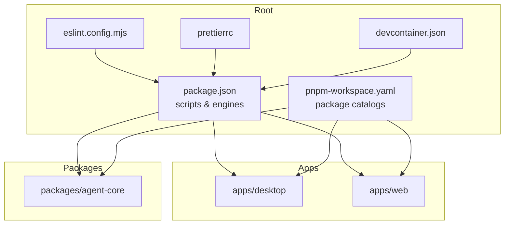
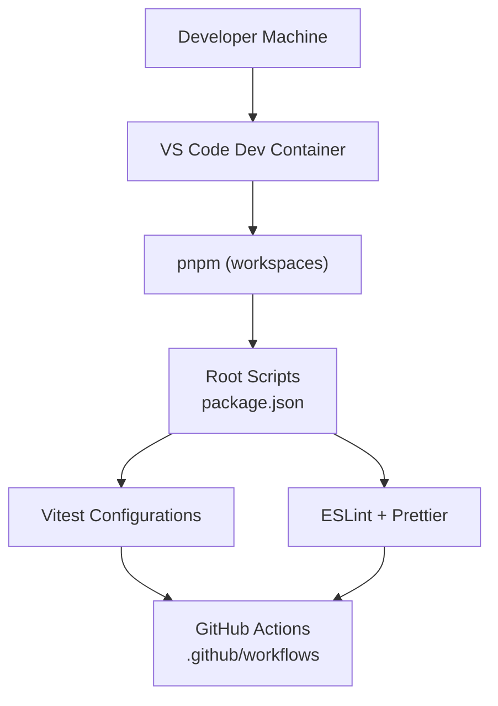
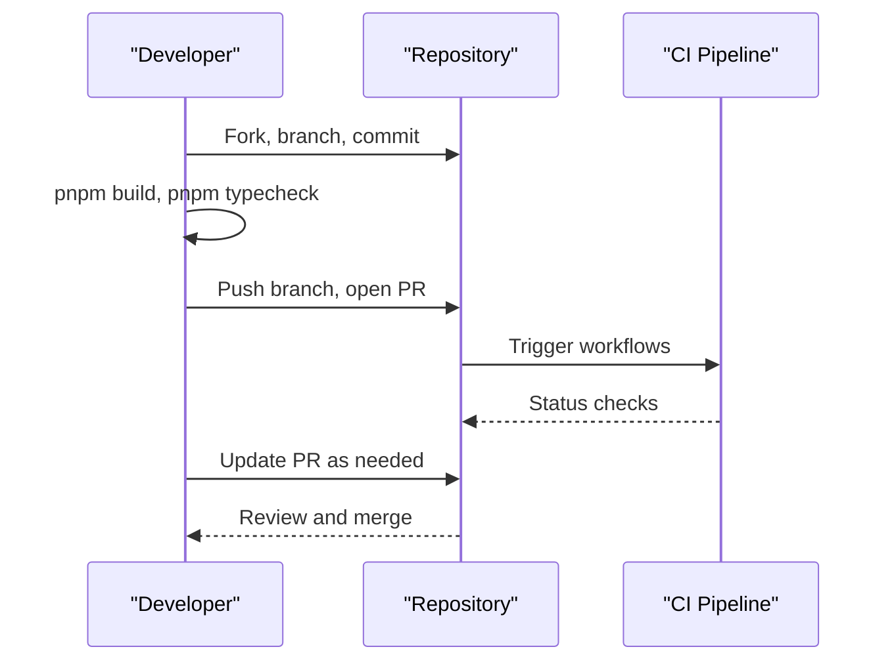
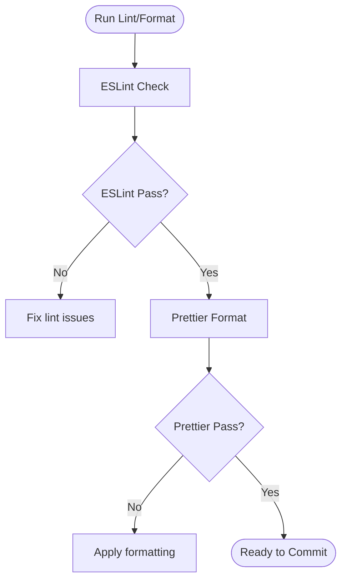
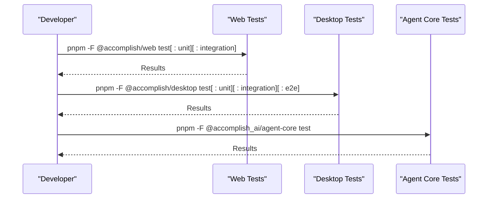
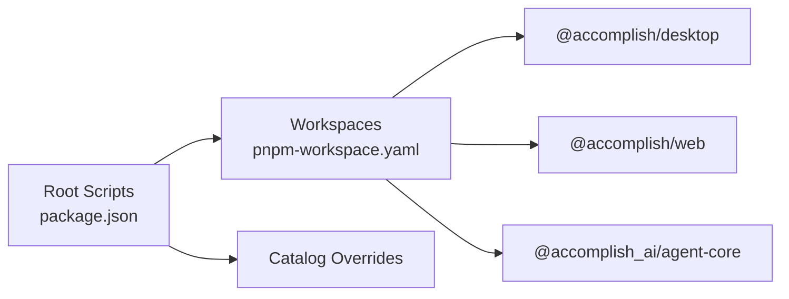

# Development Guidelines

<cite>
**Referenced Files in This Document**
- [CONTRIBUTING.md](file://CONTRIBUTING.md)
- [README.md](file://README.md)
- [package.json](file://package.json)
- [pnpm-workspace.yaml](file://pnpm-workspace.yaml)
- [eslint.config.mjs](file://eslint.config.mjs)
- [.prettierrc](file://.prettierrc)
- [.devcontainer/devcontainer.json](file://.devcontainer/devcontainer.json)
- [apps/desktop/vitest.config.ts](file://apps/desktop/vitest.config.ts)
- [packages/agent-core/vitest.config.ts](file://packages/agent-core/vitest.config.ts)
- [.github/PULL_REQUEST_TEMPLATE.md](file://.github/PULL_REQUEST_TEMPLATE.md)
- [.github/dependabot.yml](file://.github/dependabot.yml)
- [.github/release.yml](file://.github/release.yml)
</cite>

## Table of Contents

1. [Introduction](#introduction)
2. [Project Structure](#project-structure)
3. [Core Components](#core-components)
4. [Architecture Overview](#architecture-overview)
5. [Detailed Component Analysis](#detailed-component-analysis)
6. [Dependency Analysis](#dependency-analysis)
7. [Performance Considerations](#performance-considerations)
8. [Troubleshooting Guide](#troubleshooting-guide)
9. [Conclusion](#conclusion)
10. [Appendices](#appendices)

## Introduction

This document defines the development guidelines for contributing to the Accomplish project. It consolidates the contribution process, development workflow, code standards, formatting, testing, and collaboration practices. It is intended for both newcomers and experienced contributors to maintain consistent development practices across the monorepo.

## Project Structure

Accomplish is a pnpm-managed monorepo organized into applications and shared packages:

- apps: Application workspaces (desktop, web)
- packages: Shared libraries and core logic (agent-core)
- Root scripts and tooling orchestrate cross-workspace commands

**Diagram sources**

- [package.json:12-38](file://package.json#L12-L38)
- [pnpm-workspace.yaml:1-12](file://pnpm-workspace.yaml#L1-L12)
- [eslint.config.mjs:1-65](file://eslint.config.mjs#L1-L65)
- [.prettierrc:1-7](file://.prettierrc#L1-L7)
- [.devcontainer/devcontainer.json:1-18](file://.devcontainer/devcontainer.json#L1-L18)

**Section sources**

- [README.md:296-309](file://README.md#L296-L309)
- [pnpm-workspace.yaml:1-12](file://pnpm-workspace.yaml#L1-L12)
- [package.json:12-38](file://package.json#L12-L38)

## Core Components

- Contribution guidelines: Fork, branch, commit, and PR workflow
- Development commands: dev, build, typecheck, lint, format
- Testing: Workspace-specific test commands and coverage configuration
- Code standards: ESLint + Prettier with TypeScript-focused rules
- Collaboration: Conventional commits, PR template, dependabot automation

**Section sources**

- [CONTRIBUTING.md:5-89](file://CONTRIBUTING.md#L5-L89)
- [README.md:251-293](file://README.md#L251-L293)
- [package.json:12-38](file://package.json#L12-L38)
- [eslint.config.mjs:26-56](file://eslint.config.mjs#L26-L56)
- [.prettierrc:1-7](file://.prettierrc#L1-L7)

## Architecture Overview

The development workflow spans local tooling, monorepo orchestration, and CI/CD automation.

**Diagram sources**

- [.devcontainer/devcontainer.json:1-18](file://.devcontainer/devcontainer.json#L1-L18)
- [package.json:12-38](file://package.json#L12-L38)
- [eslint.config.mjs:1-65](file://eslint.config.mjs#L1-L65)
- [apps/desktop/vitest.config.ts:1-48](file://apps/desktop/vitest.config.ts#L1-L48)
- [packages/agent-core/vitest.config.ts:1-16](file://packages/agent-core/vitest.config.ts#L1-L16)

## Detailed Component Analysis

### Development Environment Setup

- Prerequisites: Node.js 20+ and pnpm 9+
- Local setup: Install dependencies and run the desktop app in development mode
- Dev container: VS Code dev container image with Node.js 20 and pnpm preinstalled; forwards port 5173 for the web UI

Recommended steps:

- Install dependencies at the repository root
- Start development with the desktop app
- Use the dev container for consistent environments

**Section sources**

- [README.md:261-266](file://README.md#L261-L266)
- [README.md:251-258](file://README.md#L251-L258)
- [.devcontainer/devcontainer.json:1-18](file://.devcontainer/devcontainer.json#L1-L18)

### IDE Configuration and Debugging

- Dev container extensions: Prettier, ESLint, TailwindCSS for consistent formatting and linting
- Port forwarding: Forward port 5173 for the web UI during development
- Debugging tips:
  - Use the dev container to avoid environment drift
  - Run typecheck and lint locally before committing
  - Use workspace-specific test commands to isolate failures

**Section sources**

- [.devcontainer/devcontainer.json:8-16](file://.devcontainer/devcontainer.json#L8-L16)
- [package.json:31-35](file://package.json#L31-L35)

### Code Contribution Process

- Fork the repository and create a feature branch
- Follow conventional commit messages
- Ensure builds and typechecks pass
- Update documentation if needed
- Open a PR with the provided template

**Diagram sources**

- [CONTRIBUTING.md:55-64](file://CONTRIBUTING.md#L55-L64)
- [README.md:317-326](file://README.md#L317-L326)
- [.github/PULL_REQUEST_TEMPLATE.md:1-27](file://.github/PULL_REQUEST_TEMPLATE.md#L1-L27)

**Section sources**

- [CONTRIBUTING.md:5-19](file://CONTRIBUTING.md#L5-L19)
- [CONTRIBUTING.md:55-64](file://CONTRIBUTING.md#L55-L64)
- [.github/PULL_REQUEST_TEMPLATE.md:1-27](file://.github/PULL_REQUEST_TEMPLATE.md#L1-L27)

### Pull Request Guidelines

- PR title should follow conventional commit format
- Include a clear description of what changed, why it is needed, and how to test it
- Dependabot groups and labels help categorize dependency updates
- Release automation categorizes changelogs by labels

**Section sources**

- [.github/PULL_REQUEST_TEMPLATE.md:20-21](file://.github/PULL_REQUEST_TEMPLATE.md#L20-L21)
- [.github/dependabot.yml:14-29](file://.github/dependabot.yml#L14-L29)
- [.github/release.yml:5-26](file://.github/release.yml#L5-L26)

### Issue Reporting Procedures

Include the following when reporting issues:

- Operating system and version
- Steps to reproduce
- Expected vs actual behavior
- Any error messages or logs

**Section sources**

- [CONTRIBUTING.md:74-82](file://CONTRIBUTING.md#L74-L82)

### Coding Standards, Linting, and Formatting

- Language: TypeScript across the codebase
- Linting: ESLint with TypeScript rules and React hooks plugin for web app
- Formatting: Prettier with semicolons, single quotes, trailing commas, print width 100
- Ignored paths: dist, node_modules, release, playwright-report, scripts, theme-init.js, out, .claude

**Diagram sources**

- [eslint.config.mjs:26-56](file://eslint.config.mjs#L26-L56)
- [.prettierrc:1-7](file://.prettierrc#L1-L7)
- [package.json:31-35](file://package.json#L31-L35)

**Section sources**

- [CONTRIBUTING.md:48-54](file://CONTRIBUTING.md#L48-L54)
- [eslint.config.mjs:10-22](file://eslint.config.mjs#L10-L22)
- [eslint.config.mjs:26-56](file://eslint.config.mjs#L26-L56)
- [.prettierrc:1-7](file://.prettierrc#L1-L7)

### Testing Procedures

- Web UI tests: workspace-specific commands for unit and integration tests
- Desktop app tests: unit, integration, and Docker-based E2E tests
- Core logic tests: Vitest configuration with coverage and thresholds
- Test aliases: pnpm scripts target specific workspaces

**Diagram sources**

- [CONTRIBUTING.md:25-46](file://CONTRIBUTING.md#L25-L46)
- [apps/desktop/vitest.config.ts:15-46](file://apps/desktop/vitest.config.ts#L15-L46)
- [packages/agent-core/vitest.config.ts:4-15](file://packages/agent-core/vitest.config.ts#L4-L15)

**Section sources**

- [CONTRIBUTING.md:21-46](file://CONTRIBUTING.md#L21-L46)
- [apps/desktop/vitest.config.ts:15-46](file://apps/desktop/vitest.config.ts#L15-L46)
- [packages/agent-core/vitest.config.ts:4-15](file://packages/agent-core/vitest.config.ts#L4-L15)

### Documentation Standards and Community Guidelines

- Commit messages: Use conventional commit prefixes (feat, fix, docs, refactor, chore)
- PR descriptions: Explain what the change does, why it is needed, and how to test it
- Licensing: Contributions are made under the MIT License

**Section sources**

- [CONTRIBUTING.md:65-73](file://CONTRIBUTING.md#L65-L73)
- [CONTRIBUTING.md:59-64](file://CONTRIBUTING.md#L59-L64)
- [CONTRIBUTING.md:87-89](file://CONTRIBUTING.md#L87-L89)

## Dependency Analysis

Monorepo dependencies are managed via pnpm workspaces and catalog overrides. Root scripts coordinate cross-workspace operations.

**Diagram sources**

- [package.json:12-38](file://package.json#L12-L38)
- [pnpm-workspace.yaml:1-12](file://pnpm-workspace.yaml#L1-L12)

**Section sources**

- [package.json:44-59](file://package.json#L44-L59)
- [pnpm-workspace.yaml:1-12](file://pnpm-workspace.yaml#L1-L12)

## Performance Considerations

- Prefer workspace-specific test commands to reduce overhead
- Use typecheck and lint in CI to catch regressions early
- Keep functions focused and small to improve maintainability

## Troubleshooting Guide

Common development issues and resolutions:

- Node or pnpm version mismatch: Ensure Node.js 20+ and pnpm 9+ per engines and packageManager
- Dev container not applying formatting/linting: Verify dev container extensions are installed and enabled
- Test coverage thresholds failing: Review thresholds and adjust tests to meet coverage targets
- Dependency conflicts: Use catalog overrides and keep dependencies aligned across workspaces

**Section sources**

- [package.json:39-42](file://package.json#L39-L42)
- [.devcontainer/devcontainer.json:8-16](file://.devcontainer/devcontainer.json#L8-L16)
- [apps/desktop/vitest.config.ts:34-39](file://apps/desktop/vitest.config.ts#L34-L39)
- [package.json:44-59](file://package.json#L44-L59)

## Conclusion

These guidelines standardize how contributors develop, test, and collaborate on Accomplish. By following the contribution process, adhering to code standards, and leveraging the provided tooling, teams can maintain high-quality, consistent code across the monorepo.

## Appendices

- Quick reference: Use pnpm scripts to develop, build, typecheck, lint, and format
- CI/CD: Dependabot automates dependency updates; release automation categorizes changelogs

**Section sources**

- [README.md:268-283](file://README.md#L268-L283)
- [.github/dependabot.yml:1-57](file://.github/dependabot.yml#L1-L57)
- [.github/release.yml:1-26](file://.github/release.yml#L1-L26)
