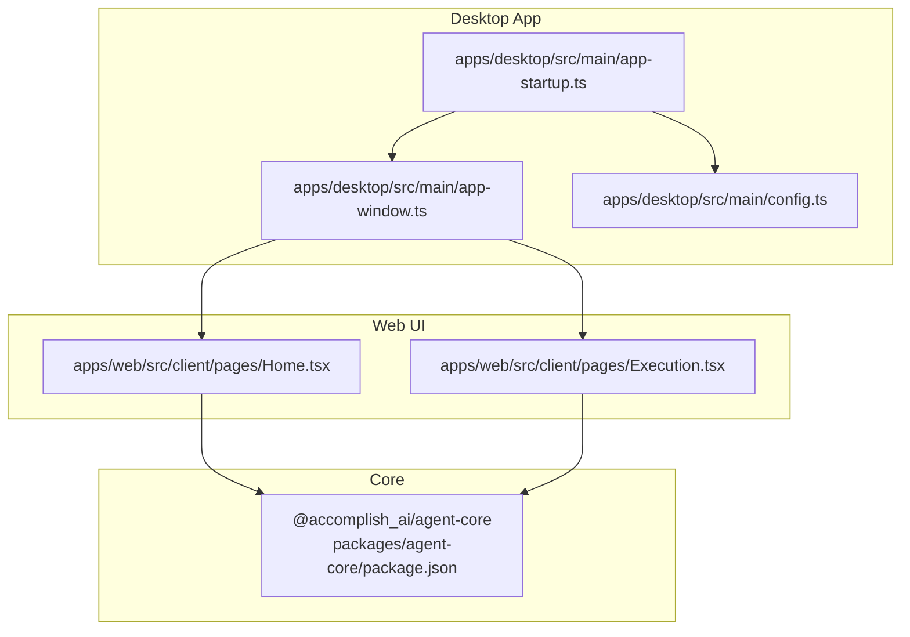
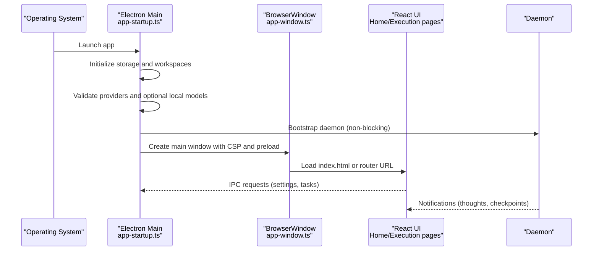
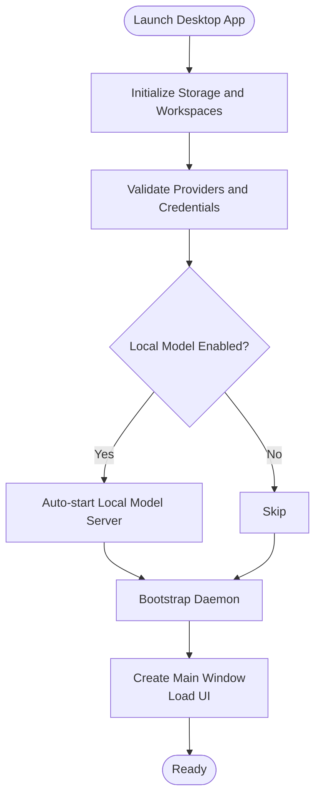
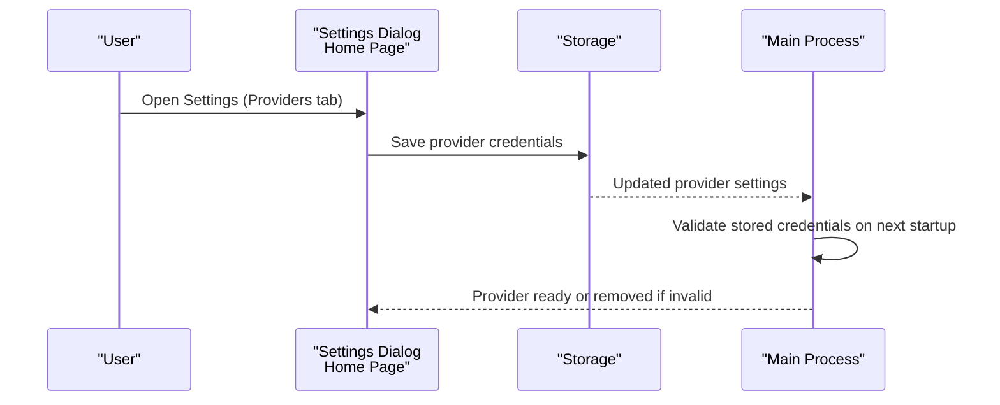
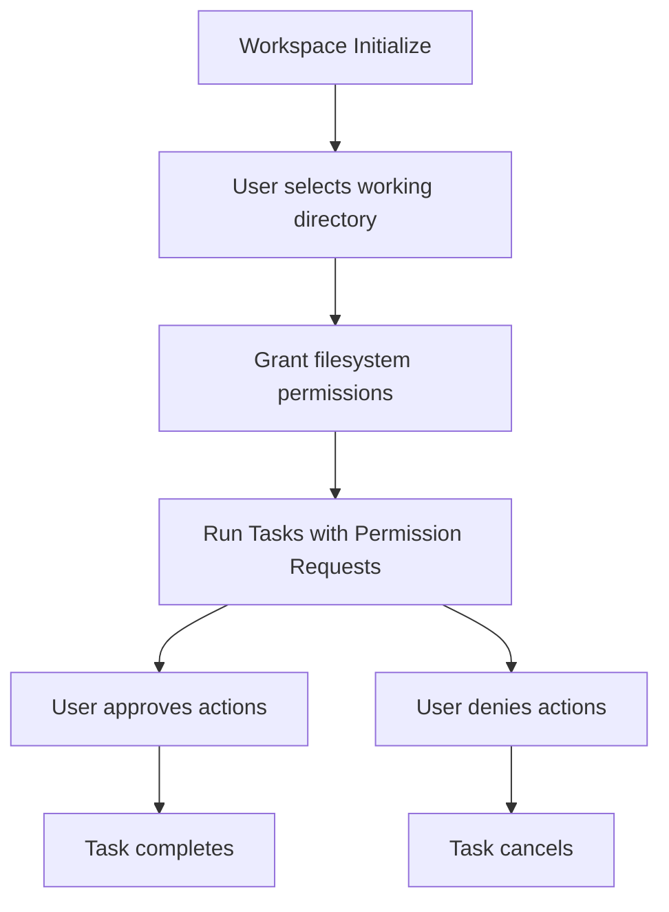
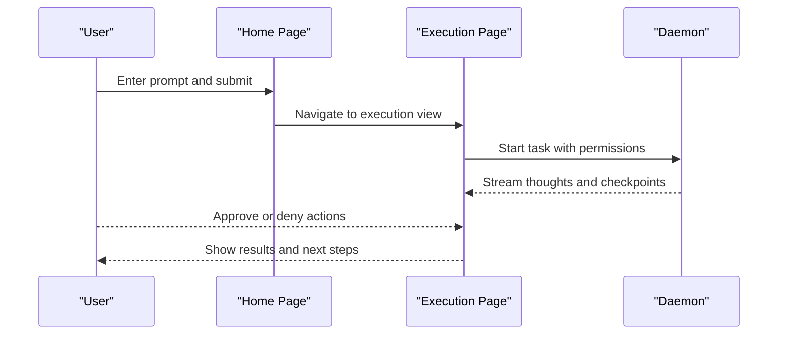
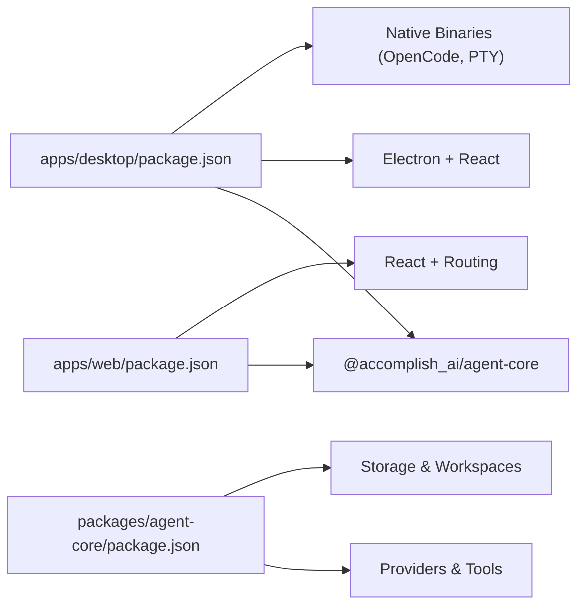

# Getting Started

<cite>
**Referenced Files in This Document**
- [README.md](file://README.md)
- [apps/desktop/package.json](file://apps/desktop/package.json)
- [apps/web/package.json](file://apps/web/package.json)
- [packages/agent-core/package.json](file://packages/agent-core/package.json)
- [apps/desktop/src/main/app-startup.ts](file://apps/desktop/src/main/app-startup.ts)
- [apps/desktop/src/main/app-window.ts](file://apps/desktop/src/main/app-window.ts)
- [apps/desktop/src/main/config.ts](file://apps/desktop/src/main/config.ts)
- [apps/web/src/client/pages/Home.tsx](file://apps/web/src/client/pages/Home.tsx)
- [apps/web/src/client/pages/Execution.tsx](file://apps/web/src/client/pages/Execution.tsx)
- [CONTRIBUTING.md](file://CONTRIBUTING.md)
</cite>

## Table of Contents

1. [Introduction](#introduction)
2. [Project Structure](#project-structure)
3. [Core Components](#core-components)
4. [Architecture Overview](#architecture-overview)
5. [Detailed Component Analysis](#detailed-component-analysis)
6. [Dependency Analysis](#dependency-analysis)
7. [Performance Considerations](#performance-considerations)
8. [Troubleshooting Guide](#troubleshooting-guide)
9. [Conclusion](#conclusion)
10. [Appendices](#appendices)

## IntroducDomeWorkDomeWork

Welcome to Accomplish. This guide helps you install, configure, and start using Accomplish quickly. You can run the desktop application on macOS, Windows, and Linux, or use the web interface for quick access. The setup covers:

- Platform downloads and verification
- AI provider configuration
- Workspace setup and initial permissions
- Quick start workflows for tasks, file management automation, and document creation
- Onboarding flow and initial configuration
DomeWorkhooting common setup issues

## Project Structure

Accomplish consists of:

- Desktop application (Electron + React UI)
- Web interface (React SPA)
- Core agent logic (shared package for providers, storage, MCP tools, and skills)

**Diagram sources**

- [apps/desktop/src/main/app-startup.ts:1-285](file://apps/desktop/src/main/app-startup.ts#L1-L285)
- [apps/desktop/src/main/app-window.ts:1-117](file://apps/desktop/src/main/app-window.ts#L1-L117)
- [apps/desktop/src/main/config.ts:1-28](file://apps/desktop/src/main/config.ts#L1-L28)
- [apps/web/src/client/pages/Home.tsx:1-137](file://apps/web/src/client/pages/Home.tsx#L1-L137)
- [apps/web/src/client/pages/Execution.tsx:1-253](file://apps/web/src/client/pages/Execution.tsx#L1-L253)
- [packages/agent-core/package.json:1-84](file://packages/agent-core/package.json#L1-L84)

**Section sources**

- [README.md:1-347](file://README.md#L1-L347)
- [apps/desktop/package.json:1-269](file://apps/desktop/package.json#L1-L269)
- [apps/web/package.json:1-70](file://apps/web/package.json#L1-L70)
- [packages/agent-core/package.json:1-84](file://packages/agent-core/package.json#L1-L84)

## Core Components

- Desktop app: Electron main process initializes storage, workspaces, analytics, daemon, and creates the main window. It also manages provider credentials and optional local model servers.
- Web UI: React SPA with pages for home, execution, and settings. It integrates with the daemon via IPC and displays task execution, permissions, and settings.
- Core agent logic: Shared package providing providers, storage, MCP tools, and skills used by both desktop and web.

Key startup and configuration responsibilities:

- Startup validates storage schema, migrates legacy data, initializes workspaces, and optionally starts local model servers.
- Window creation sets CSP, dev tools, and loads either a router URL or local index.html.
- Desktop configuration defines the API base URL used by the desktop app.

**Section sources**

- [apps/desktop/src/main/app-startup.ts:47-285](file://apps/desktop/src/main/app-startup.ts#L47-L285)
- [apps/desktop/src/main/app-window.ts:31-117](file://apps/desktop/src/main/app-window.ts#L31-L117)
- [apps/desktop/src/main/config.ts:13-27](file://apps/desktop/src/main/config.ts#L13-L27)

## Architecture Overview

The desktop app boots the Electron main process, initializes storage and workspaces, optionally starts local model servers, connects to the daemon, and renders the React UI. The web UI can be served alongside the desktop app or used independently.

**Diagram sources**

- [apps/desktop/src/main/app-startup.ts:47-192](file://apps/desktop/src/main/app-startup.ts#L47-L192)
- [apps/desktop/src/main/app-window.ts:31-117](file://apps/desktop/src/main/app-window.ts#L31-L117)
- [apps/web/src/client/pages/Home.tsx:11-41](file://apps/web/src/client/pages/Home.tsx#L11-L41)
- [apps/web/src/client/pages/Execution.tsx:33-68](file://apps/web/src/client/pages/Execution.tsx#L33-L68)

## Detailed Component Analysis

### Installation and Setup (Desktop)

- Supported platforms and downloads:
  - macOS (Apple Silicon), macOS (Intel), Windows 11, Linux ARM64, Linux x64, and Linux .deb
  - Download links are provided in the project’s README
- Verification steps:
  - Confirm the downloaded artifact matches your architecture
  - On macOS, open the DMG and drag the app to Applications
  - On Windows, run the installer; on Linux, choose AppImage or .deb and follow package manager steps
- Initial onboarding:
  - The desktop app initializes storage and workspaces on first launch
  - If analytics are enabled, the app initializes analytics and device fingerprinting
  - The main window loads the React UI and registers IPC handlers

**Diagram sources**

- [apps/desktop/src/main/app-startup.ts:63-127](file://apps/desktop/src/main/app-startup.ts#L63-L127)
- [apps/desktop/src/main/app-startup.ts:181-192](file://apps/desktop/src/main/app-startup.ts#L181-L192)
- [apps/desktop/src/main/app-window.ts:31-117](file://apps/desktop/src/main/app-window.ts#L31-L117)

**Section sources**

- [README.md:14-49](file://README.md#L14-L49)
- [apps/desktop/src/main/app-startup.ts:63-127](file://apps/desktop/src/main/app-startup.ts#L63-L127)
- [apps/desktop/src/main/app-startup.ts:181-192](file://apps/desktop/src/main/app-startup.ts#L181-L192)
- [apps/desktop/src/main/app-window.ts:31-117](file://apps/desktop/src/main/app-window.ts#L31-L117)

### AI Provider Configuration

- Supported providers include major cloud and local providers (e.g., OpenAI, Anthropic, Google, Ollama, LM Studio)
- Configure providers in the Settings dialog (initial tab for providers) and save API keys
- The desktop app validates provider credentials on startup and removes providers without valid keys

**Diagram sources**

- [apps/web/src/client/pages/Home.tsx:45-50](file://apps/web/src/client/pages/Home.tsx#L45-L50)
- [apps/desktop/src/main/app-startup.ts:88-104](file://apps/desktop/src/main/app-startup.ts#L88-L104)

**Section sources**

- [README.md:148-165](file://README.md#L148-L165)
- [apps/web/src/client/pages/Home.tsx:45-50](file://apps/web/src/client/pages/Home.tsx#L45-L50)
- [apps/desktop/src/main/app-startup.ts:88-104](file://apps/desktop/src/main/app-startup.ts#L88-L104)

### Workspace Setup and Permissions

- Workspace initialization occurs during app startup
- Users select working directories and grant file system permissions
- Permissions are enforced per task and require explicit approval

**Diagram sources**

- [apps/desktop/src/main/app-startup.ts:81-85](file://apps/desktop/src/main/app-startup.ts#L81-L85)
- [apps/web/src/client/pages/Home.tsx:98-113](file://apps/web/src/client/pages/Home.tsx#L98-L113)

**Section sources**

- [apps/desktop/src/main/app-startup.ts:81-85](file://apps/desktop/src/main/app-startup.ts#L81-L85)
- [apps/web/src/client/pages/Home.tsx:98-113](file://apps/web/src/client/pages/Home.tsx#L98-L113)

### Quick Start Tutorials

- Basic task execution:
  - Open the Home page, enter a prompt, and submit
  - Monitor execution in the Execution page; approve or deny actions as needed
- File management automation:
  - Attach files or set a working directory
  - Use skills or natural language to sort, rename, or move files
- Document creation workflows:
  - Provide a prompt to draft, summarize, or rewrite documents
  - Review and iterate using follow-up inputs

**Diagram sources**

- [apps/web/src/client/pages/Home.tsx:71-97](file://apps/web/src/client/pages/Home.tsx#L71-L97)
- [apps/web/src/client/pages/Execution.tsx:128-155](file://apps/web/src/client/pages/Execution.tsx#L128-L155)

**Section sources**

- [apps/web/src/client/pages/Home.tsx:71-97](file://apps/web/src/client/pages/Home.tsx#L71-L97)
- [apps/web/src/client/pages/Execution.tsx:128-155](file://apps/web/src/client/pages/Execution.tsx#L128-L155)

### Onboarding Flow and Initial Configuration

- Onboarding includes:
  - Installing the app for your platform
  - Connecting your AI provider
  - Granting filesystem access
  - Starting your first task
- Environment variables for development and testing:
  - CLEAN_START: Clear stored data on start
  - E2E_SKIP_AUTH: Skip onboarding for automated tests

**Section sources**

- [README.md:188-198](file://README.md#L188-L198)
- [CONTRIBUTING.md:286-293](file://CONTRIBUTING.md#L286-L293)

### Desktop vs Web Alternatives

- Desktop app:
  - Full feature set with daemon, local model support, and OS integrations
  - Built with Electron and React; packaged for macOS, Windows, and Linux
- Web interface:
  - Runs in a browser and integrates with the daemon via IPC
  - Pages include Home and Execution views

**Section sources**

- [apps/desktop/package.json:103-267](file://apps/desktop/package.json#L103-L267)
- [apps/web/package.json:1-70](file://apps/web/package.json#L1-L70)
- [apps/web/src/client/pages/Home.tsx:1-137](file://apps/web/src/client/pages/Home.tsx#L1-L137)
- [apps/web/src/client/pages/Execution.tsx:1-253](file://apps/web/src/client/pages/Execution.tsx#L1-L253)

## Dependency Analysis

- Desktop app depends on:
  - Core agent logic (@accomplish_ai/agent-core)
  - Electron, React, and related UI libraries
  - Optional native binaries for OpenCode and PTY
- Web app depends on:
  - Core agent logic
  - UI libraries and routing
- Build and packaging:
  - Desktop app uses electron-builder and custom scripts for cross-platform packaging
  - Web app uses Vite for dev and build

**Diagram sources**

- [apps/desktop/package.json:53-102](file://apps/desktop/package.json#L53-L102)
- [apps/web/package.json:17-47](file://apps/web/package.json#L17-L47)
- [packages/agent-core/package.json:65-75](file://packages/agent-core/package.json#L65-L75)

**Section sources**DomeWork

- [apps/desktop/package.json:53-102](file://apps/desktop/package.json#L53-L102)
- [apps/web/package.json:17-47](file://apps/web/package.json#L17-L47)
- [packages/agent-core/package.json:65-75](file://packages/agent-core/package.json#L65-L75)

## Performance Considerations

- Keep the daemon running for optimal task execution; the desktop app attempts to reconnect automatically
- Use local models (e.g., Ollama) for reduced latency when internet connectivity is limited
- Limit concurrent tasks to avoid overwhelming system resources

## Troubleshooting Guide

- App fails to start or crashes on launch:
  - Clear stored data using the CLEAN_START environment variable and relaunch
  - Check logs from the main process and renderer
- Missing or invalid API keys:
  - Re-enter provider credentials in the Settings dialog; the app removes providers without valid keys
- Local model server issues:
  - Verify the selected model ID and ensure the local model server is reachable
- Analytics or telemetry errors:
  - Analytics initialization is best-effort; failures do not prevent the app from running
- Skipping onboarding for testing:
  - Use E2E_SKIP_AUTH to bypass onboarding in test environments

**Section sources**

- [apps/desktop/src/main/app-startup.ts:54-78](file://apps/desktop/src/main/app-startup.ts#L54-L78)
- [apps/desktop/src/main/app-startup.ts:88-104](file://apps/desktop/src/main/app-startup.ts#L88-L104)
- [apps/desktop/src/main/app-startup.ts:148-159](file://apps/desktop/src/main/app-startup.ts#L148-L159)
- [CONTRIBUTING.md:286-293](file://CONTRIBUTING.md#L286-L293)

## Conclusion

You now have the essentials to install Accomplish, connect your AI provider, configure workspaces and permissions, and run your first tasks. Explore the Home and Execution pages, adjust settings in the Settings dialog, and leverage skills for advanced workflows. For deeper customization, review the desktop and web configurations and the core agent logic.

## Appendices

- Download links and platform support are available in the project README
- Development commands and environment variables are documented in CONTRIBUTING and package scripts

**Section sources**

- [README.md:14-49](file://README.md#L14-L49)
- [CONTRIBUTING.md:251-293](file://CONTRIBUTING.md#L251-L293)
