# MCP Tool Framework

<cite>
**Referenced Files in This Document**
- [generator-mcp.ts](file://packages/agent-core/src/opencode/generator-mcp.ts)
- [index.ts](file://packages/agent-core/mcp-tools/file-permission/src/index.ts)
- [index.ts](file://packages/agent-core/mcp-tools/ask-user-question/src/index.ts)
- [index.ts](file://packages/agent-core/mcp-tools/complete-task/src/index.ts)
- [index.ts](file://packages/agent-core/mcp-tools/desktop-control/src/index.ts)
- [index.ts](file://packages/agent-core/mcp-tools/dev-browser-mcp/src/index.ts)
- [connection.ts](file://packages/agent-core/mcp-tools/dev-browser-mcp/src/connection.ts)
- [client.ts](file://packages/agent-core/src/daemon/client.ts)
- [rpc-server.ts](file://packages/agent-core/src/daemon/rpc-server.ts)
- [rpc-message-handler.ts](file://packages/agent-core/src/daemon/rpc-message-handler.ts)
- [types.ts](file://packages/agent-core/src/daemon/types.ts)
- [permission-handler.ts](file://packages/agent-core/src/services/permission-handler.ts)
- [permission.ts](file://packages/agent-core/src/common/types/permission.ts)
</cite>

## Table of Contents

1. [Introduction](#introduction)
2. [Project Structure](#project-structure)
3. [Core Components](#core-components)
4. [Architecture Overview](#architecture-overview)
5. [Detailed Component Analysis](#detailed-component-analysis)
6. [Dependency Analysis](#dependency-analysis)
7. [Performance Considerations](#performance-considerations)
8. [Troubleshooting Guide](#troubleshooting-guide)
9. [Conclusion](#conclusion)

## Introduction

This document explains the Model Context Protocol (MCP) tool framework that powers extensible tool capabilities in the system. The MCP tool framework enables AI agents to safely and programmatically extend functionality beyond core features by invoking specialized tools hosted as MCP servers. These tools are configured centrally, launched on demand, and communicate via a standardized MCP protocol. The framework includes:

- Built-in MCP tools for file permission handling, desktop control, and development browser automation
- A tool framework that builds and manages MCP server configurations
- A communication protocol based on MCP SDK for tool discovery and invocation
- A daemon RPC layer for orchestration and notifications
- A permission and question request lifecycle for safe user consent

The goal is to help both beginners understand what MCP tools are and how they fit into agent workflows, and to provide experienced developers with implementation patterns, configuration options, and integration guidance.

## Project Structure

The MCP tool framework spans two primary areas:

- Tool implementations under packages/agent-core/mcp-tools
- Orchestration and communication under packages/agent-core/src

Key locations:

- Tool server implementations: file-permission, ask-user-question, complete-task, desktop-control, dev-browser-mcp
- Tool framework configuration builder: generator-mcp.ts
- Daemon RPC client and server: client.ts, rpc-server.ts, rpc-message-handler.ts, types.ts
- Permission and question request lifecycle: permission-handler.ts, permission.ts

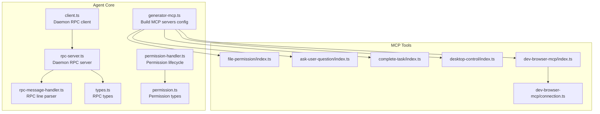

**Diagram sources**

- [generator-mcp.ts:76-191](file://packages/agent-core/src/opencode/generator-mcp.ts#L76-L191)
- [client.ts:38-164](file://packages/agent-core/src/daemon/client.ts#L38-L164)
- [rpc-server.ts:33-165](file://packages/agent-core/src/daemon/rpc-server.ts#L33-L165)
- [rpc-message-handler.ts:46-87](file://packages/agent-core/src/daemon/rpc-message-handler.ts#L46-L87)
- [types.ts:9-194](file://packages/agent-core/src/daemon/types.ts#L9-L194)
- [permission-handler.ts:37-172](file://packages/agent-core/src/services/permission-handler.ts#L37-L172)
- [permission.ts:15-50](file://packages/agent-core/src/common/types/permission.ts#L15-L50)
- [index.ts:1-140](file://packages/agent-core/mcp-tools/file-permission/src/index.ts#L1-L140)
- [index.ts:1-199](file://packages/agent-core/mcp-tools/ask-user-question/src/index.ts#L1-L199)
- [index.ts:1-90](file://packages/agent-core/mcp-tools/complete-task/src/index.ts#L1-L90)
- [index.ts:1-304](file://packages/agent-core/mcp-tools/desktop-control/src/index.ts#L1-L304)
- [index.ts:1-800](file://packages/agent-core/mcp-tools/dev-browser-mcp/src/index.ts#L1-L800)
- [connection.ts:1-388](file://packages/agent-core/mcp-tools/dev-browser-mcp/src/connection.ts#L1-L388)

**Section sources**

- [generator-mcp.ts:76-191](file://packages/agent-core/src/opencode/generator-mcp.ts#L76-L191)
- [client.ts:38-164](file://packages/agent-core/src/daemon/client.ts#L38-L164)
- [rpc-server.ts:33-165](file://packages/agent-core/src/daemon/rpc-server.ts#L33-L165)
- [rpc-message-handler.ts:46-87](file://packages/agent-core/src/daemon/rpc-message-handler.ts#L46-L87)
- [types.ts:9-194](file://packages/agent-core/src/daemon/types.ts#L9-L194)
- [permission-handler.ts:37-172](file://packages/agent-core/src/services/permission-handler.ts#L37-L172)
- [permission.ts:15-50](file://packages/agent-core/src/common/types/permission.ts#L15-L50)
- [index.ts:1-140](file://packages/agent-core/mcp-tools/file-permission/src/index.ts#L1-L140)
- [index.ts:1-199](file://packages/agent-core/mcp-tools/ask-user-question/src/index.ts#L1-L199)
- [index.ts:1-90](file://packages/agent-core/mcp-tools/complete-task/src/index.ts#L1-L90)
- [index.ts:1-304](file://packages/agent-core/mcp-tools/desktop-control/src/index.ts#L1-L304)
- [index.ts:1-800](file://packages/agent-core/mcp-tools/dev-browser-mcp/src/index.ts#L1-L800)
- [connection.ts:1-388](file://packages/agent-core/mcp-tools/dev-browser-mcp/src/connection.ts#L1-L388)

## Core Components

- MCP tool servers: Each tool is a self-contained MCP server that lists tools and handles invocations. Examples include file-permission, ask-user-question, complete-task, desktop-control, and dev-browser-mcp.
- Tool framework: The generator constructs MCP server configurations, wiring ports, environment variables, and timeouts for each tool.
- Communication protocol: MCP SDK is used for tool discovery and invocation. The dev-browser-mcp also integrates with Playwright and CDP for browser automation.
- Daemon RPC: The agent communicates with the daemon via JSON-RPC 2.0 over a Unix socket or named pipe. The client sends requests and receives notifications; the server registers methods and pushes notifications.
- Permission and question lifecycle: A centralized handler manages pending requests, timeouts, and validation for file permission and question prompts.

**Section sources**

- [index.ts:30-128](file://packages/agent-core/mcp-tools/file-permission/src/index.ts#L30-L128)
- [index.ts:38-100](file://packages/agent-core/mcp-tools/ask-user-question/src/index.ts#L38-L100)
- [index.ts:11-44](file://packages/agent-core/mcp-tools/complete-task/src/index.ts#L11-L44)
- [index.ts:162-303](file://packages/agent-core/mcp-tools/desktop-control/src/index.ts#L162-L303)
- [index.ts:12-31](file://packages/agent-core/mcp-tools/dev-browser-mcp/src/index.ts#L12-L31)
- [generator-mcp.ts:76-191](file://packages/agent-core/src/opencode/generator-mcp.ts#L76-L191)
- [client.ts:38-164](file://packages/agent-core/src/daemon/client.ts#L38-L164)
- [rpc-server.ts:33-165](file://packages/agent-core/src/daemon/rpc-server.ts#L33-L165)
- [rpc-message-handler.ts:46-87](file://packages/agent-core/src/daemon/rpc-message-handler.ts#L46-L87)
- [permission-handler.ts:37-172](file://packages/agent-core/src/services/permission-handler.ts#L37-L172)

## Architecture Overview

The MCP tool framework orchestrates tool servers and integrates with the agent’s daemon for safe, controlled operations. The tool framework builds a configuration map of MCP servers, each with type, command/url, headers, environment, and timeouts. Built-in tools include file-permission, ask-user-question, complete-task, desktop-control, and dev-browser-mcp. Optional connectors can be added as remote MCP servers.

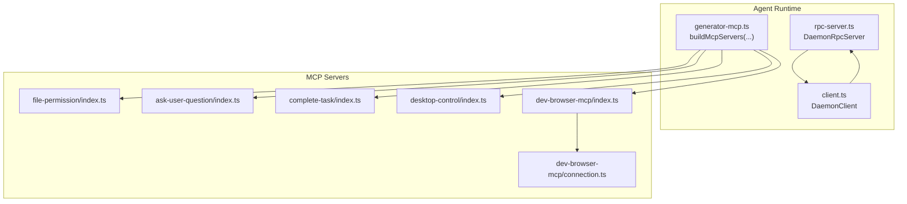

**Diagram sources**

- [generator-mcp.ts:76-191](file://packages/agent-core/src/opencode/generator-mcp.ts#L76-L191)
- [rpc-server.ts:33-165](file://packages/agent-core/src/daemon/rpc-server.ts#L33-L165)
- [client.ts:38-164](file://packages/agent-core/src/daemon/client.ts#L38-L164)
- [index.ts:1-140](file://packages/agent-core/mcp-tools/file-permission/src/index.ts#L1-L140)
- [index.ts:1-199](file://packages/agent-core/mcp-tools/ask-user-question/src/index.ts#L1-L199)
- [index.ts:1-90](file://packages/agent-core/mcp-tools/complete-task/src/index.ts#L1-L90)
- [index.ts:1-304](file://packages/agent-core/mcp-tools/desktop-control/src/index.ts#L1-L304)
- [index.ts:1-800](file://packages/agent-core/mcp-tools/dev-browser-mcp/src/index.ts#L1-L800)
- [connection.ts:1-388](file://packages/agent-core/mcp-tools/dev-browser-mcp/src/connection.ts#L1-L388)

## Detailed Component Analysis

### Tool Framework: Configuration Builder

The tool framework constructs MCP server configurations for the agent runtime. It resolves local tool commands, sets environment variables (including daemon auth tokens), applies timeouts, and supports optional connectors and browser modes.

Key responsibilities:

- Resolve local tool command paths from the mcpToolsPath
- Build environment variables for tools (e.g., PERMISSION_API_PORT, QUESTION_API_PORT)
- Configure browser-related environment (CDP endpoint/headers) for dev-browser-mcp
- Add remote connectors with bearer tokens
- Enforce timeouts per tool

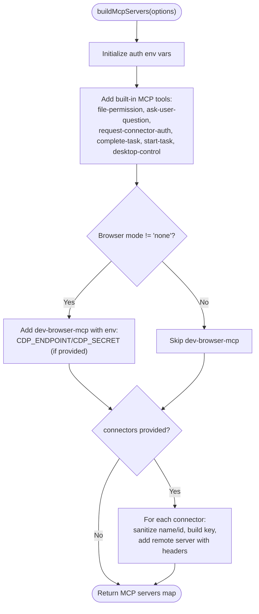

**Diagram sources**

- [generator-mcp.ts:76-191](file://packages/agent-core/src/opencode/generator-mcp.ts#L76-L191)

**Section sources**

- [generator-mcp.ts:56-70](file://packages/agent-core/src/opencode/generator-mcp.ts#L56-L70)
- [generator-mcp.ts:76-191](file://packages/agent-core/src/opencode/generator-mcp.ts#L76-L191)

### File Permission MCP Tool

The file-permission MCP tool requests user consent before performing file operations. It exposes a single tool that accepts operation type, file paths, targets, and content previews, then forwards the request to the permission HTTP API.

Implementation highlights:

- Lists a tool named request_file_permission with a structured input schema
- Validates arguments and forwards to the permission API with Authorization header if present
- Returns allowed/denied as text content

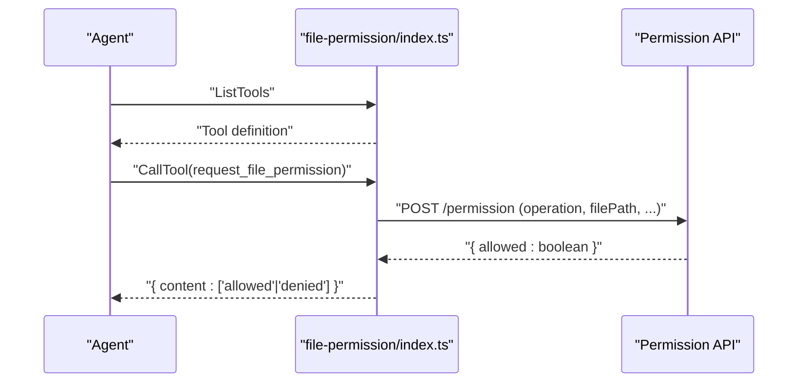

**Diagram sources**

- [index.ts:30-128](file://packages/agent-core/mcp-tools/file-permission/src/index.ts#L30-L128)

**Section sources**

- [index.ts:22-28](file://packages/agent-core/mcp-tools/file-permission/src/index.ts#L22-L28)
- [index.ts:35-72](file://packages/agent-core/mcp-tools/file-permission/src/index.ts#L35-L72)
- [index.ts:74-128](file://packages/agent-core/mcp-tools/file-permission/src/index.ts#L74-L128)

### Ask User Question MCP Tool

The ask-user-question MCP tool requests user input via a question API. It supports single or multi-select options and returns the user’s selection or free-form text.

Implementation highlights:

- Lists a tool named AskUserQuestion with a structured input schema
- Validates presence of questions and required fields
- Calls the question API with Authorization header if present
- Returns user-selected options or custom text

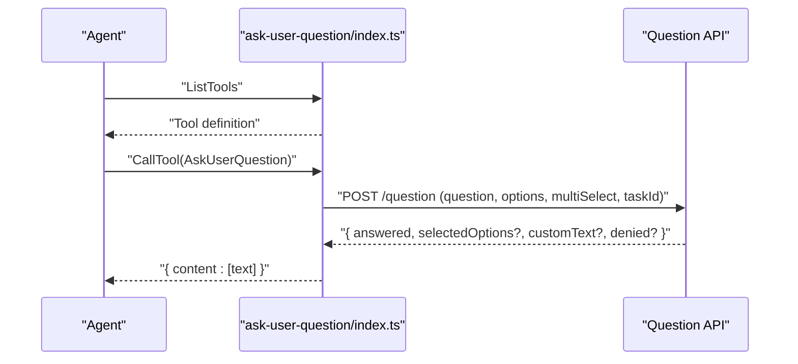

**Diagram sources**

- [index.ts:38-100](file://packages/agent-core/mcp-tools/ask-user-question/src/index.ts#L38-L100)
- [index.ts:102-187](file://packages/agent-core/mcp-tools/ask-user-question/src/index.ts#L102-L187)

**Section sources**

- [index.ts:24-36](file://packages/agent-core/mcp-tools/ask-user-question/src/index.ts#L24-L36)
- [index.ts:43-100](file://packages/agent-core/mcp-tools/ask-user-question/src/index.ts#L43-L100)
- [index.ts:102-187](file://packages/agent-core/mcp-tools/ask-user-question/src/index.ts#L102-L187)

### Complete Task MCP Tool

The complete-task MCP tool signals task completion with status, summary, and remaining work. It is mandatory to call this tool to end a task.

Implementation highlights:

- Lists a tool named complete_task with required fields
- Logs status and summary for observability
- Returns a concise response text based on status

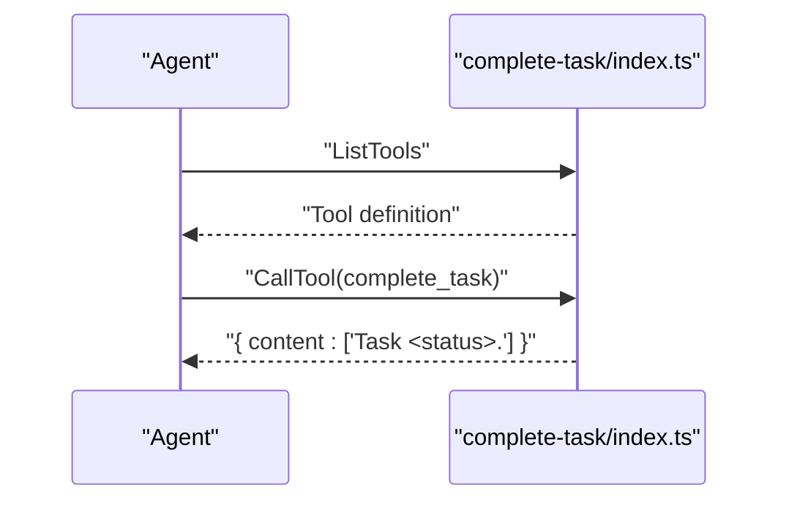

**Diagram sources**

- [index.ts:11-44](file://packages/agent-core/mcp-tools/complete-task/src/index.ts#L11-L44)
- [index.ts:46-78](file://packages/agent-core/mcp-tools/complete-task/src/index.ts#L46-L78)

**Section sources**

- [index.ts:11-44](file://packages/agent-core/mcp-tools/complete-task/src/index.ts#L11-L44)
- [index.ts:46-78](file://packages/agent-core/mcp-tools/complete-task/src/index.ts#L46-L78)

### Desktop Control MCP Tool

The desktop-control MCP tool exposes an HTTP server that validates requests, checks a blocklist, requests user permission, and executes automation actions. It follows a strict order: validation → blocklist → permission → execution.

Implementation highlights:

- Validates action requests and describes actions for permission prompts
- Checks blocklist entries for sensitive applications/windows
- Requests permission via the permission HTTP API
- Executes actions and returns structured results

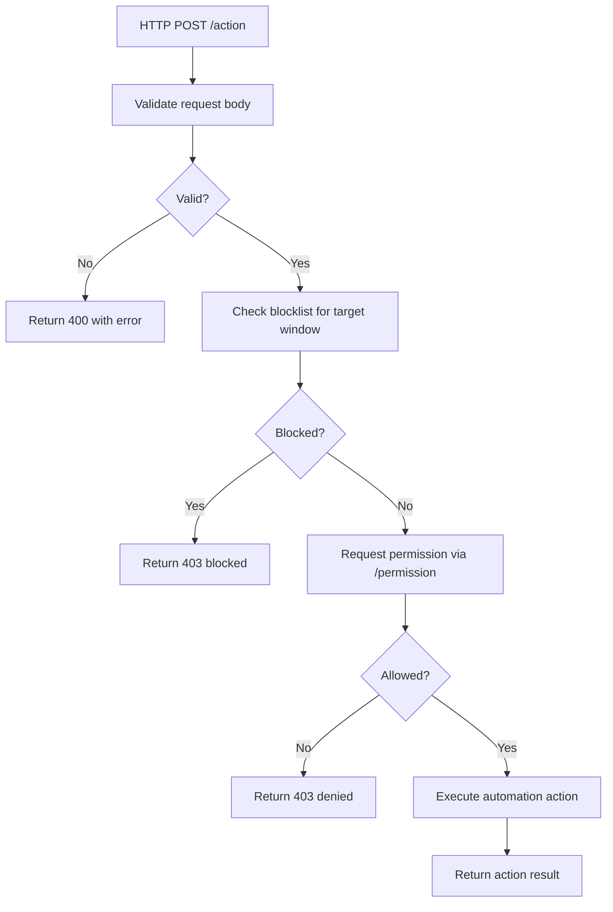

**Diagram sources**

- [index.ts:135-157](file://packages/agent-core/mcp-tools/desktop-control/src/index.ts#L135-L157)
- [index.ts:191-245](file://packages/agent-core/mcp-tools/desktop-control/src/index.ts#L191-L245)

**Section sources**

- [index.ts:44-79](file://packages/agent-core/mcp-tools/desktop-control/src/index.ts#L44-L79)
- [index.ts:85-130](file://packages/agent-core/mcp-tools/desktop-control/src/index.ts#L85-L130)
- [index.ts:135-157](file://packages/agent-core/mcp-tools/desktop-control/src/index.ts#L135-L157)
- [index.ts:191-245](file://packages/agent-core/mcp-tools/desktop-control/src/index.ts#L191-L245)

### Dev-Browser MCP Tool and Connection Management

The dev-browser-mcp MCP tool integrates with Playwright and CDP to manage browser automation. It supports two connection modes:

- Builtin: Connects to a dev-browser HTTP server and obtains a CDP endpoint
- Remote: Connects directly to a CDP endpoint (e.g., Chrome DevTools)

Key capabilities:

- Page management, CDP session reuse, and screencast streaming
- Snapshot parsing and diffing for page state understanding
- Environment-driven configuration for CDP endpoint and secret headers
- Task-scoped page naming and cleanup

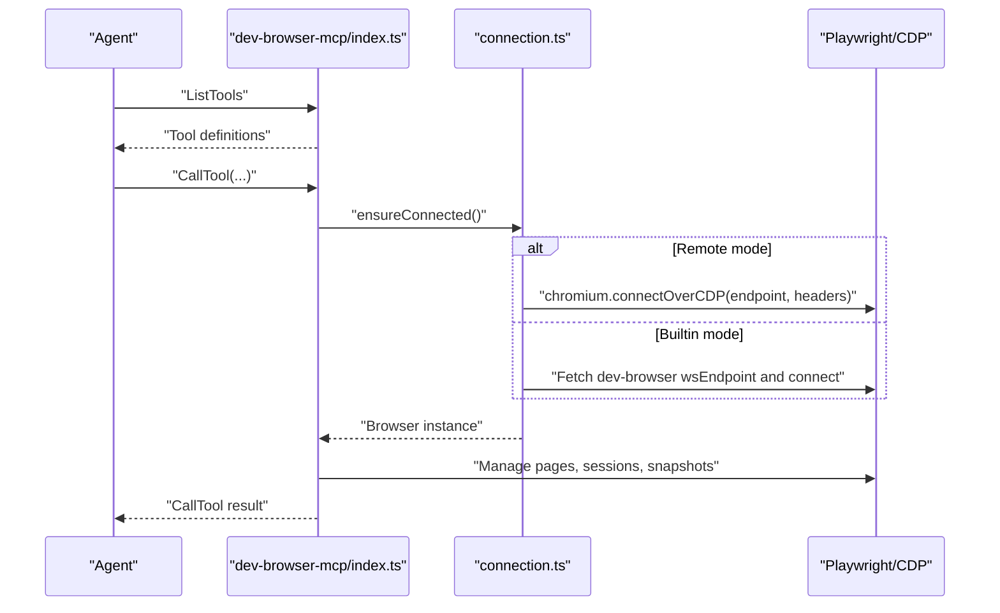

**Diagram sources**

- [index.ts:12-31](file://packages/agent-core/mcp-tools/dev-browser-mcp/src/index.ts#L12-L31)
- [connection.ts:75-91](file://packages/agent-core/mcp-tools/dev-browser-mcp/src/connection.ts#L75-L91)
- [connection.ts:93-100](file://packages/agent-core/mcp-tools/dev-browser-mcp/src/connection.ts#L93-L100)
- [connection.ts:212-234](file://packages/agent-core/mcp-tools/dev-browser-mcp/src/connection.ts#L212-L234)
- [connection.ts:329-337](file://packages/agent-core/mcp-tools/dev-browser-mcp/src/connection.ts#L329-L337)

**Section sources**

- [index.ts:12-31](file://packages/agent-core/mcp-tools/dev-browser-mcp/src/index.ts#L12-L31)
- [connection.ts:8-21](file://packages/agent-core/mcp-tools/dev-browser-mcp/src/connection.ts#L8-L21)
- [connection.ts:75-91](file://packages/agent-core/mcp-tools/dev-browser-mcp/src/connection.ts#L75-L91)
- [connection.ts:93-100](file://packages/agent-core/mcp-tools/dev-browser-mcp/src/connection.ts#L93-L100)
- [connection.ts:212-234](file://packages/agent-core/mcp-tools/dev-browser-mcp/src/connection.ts#L212-L234)
- [connection.ts:329-337](file://packages/agent-core/mcp-tools/dev-browser-mcp/src/connection.ts#L329-L337)

### Daemon RPC Layer

The daemon RPC layer provides a JSON-RPC 2.0 transport between the agent and the daemon. The client sends typed requests and receives notifications; the server registers methods and pushes notifications to connected clients.

Key responsibilities:

- Client: send requests, track pending calls, handle timeouts, register notification handlers
- Server: parse incoming lines, dispatch to registered handlers, send responses and notifications

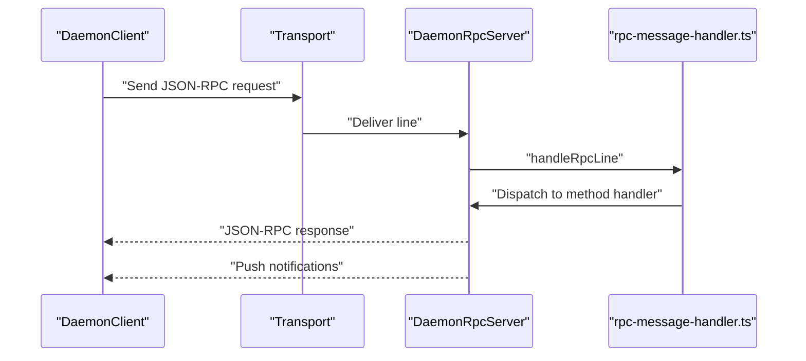

**Diagram sources**

- [client.ts:57-84](file://packages/agent-core/src/daemon/client.ts#L57-L84)
- [client.ts:89-107](file://packages/agent-core/src/daemon/client.ts#L89-L107)
- [rpc-server.ts:106-127](file://packages/agent-core/src/daemon/rpc-server.ts#L106-L127)
- [rpc-message-handler.ts:46-87](file://packages/agent-core/src/daemon/rpc-message-handler.ts#L46-L87)

**Section sources**

- [client.ts:38-164](file://packages/agent-core/src/daemon/client.ts#L38-L164)
- [rpc-server.ts:33-165](file://packages/agent-core/src/daemon/rpc-server.ts#L33-L165)
- [rpc-message-handler.ts:46-87](file://packages/agent-core/src/daemon/rpc-message-handler.ts#L46-L87)
- [types.ts:9-194](file://packages/agent-core/src/daemon/types.ts#L9-L194)

### Permission and Question Lifecycle

The permission handler manages pending requests for file operations and questions. It validates inputs, tracks timeouts, and resolves requests with allow/deny decisions or question responses.

Highlights:

- Pending request maps keyed by request IDs
- Validation helpers for file permission and question requests
- Timeout-based rejection and cancellation support

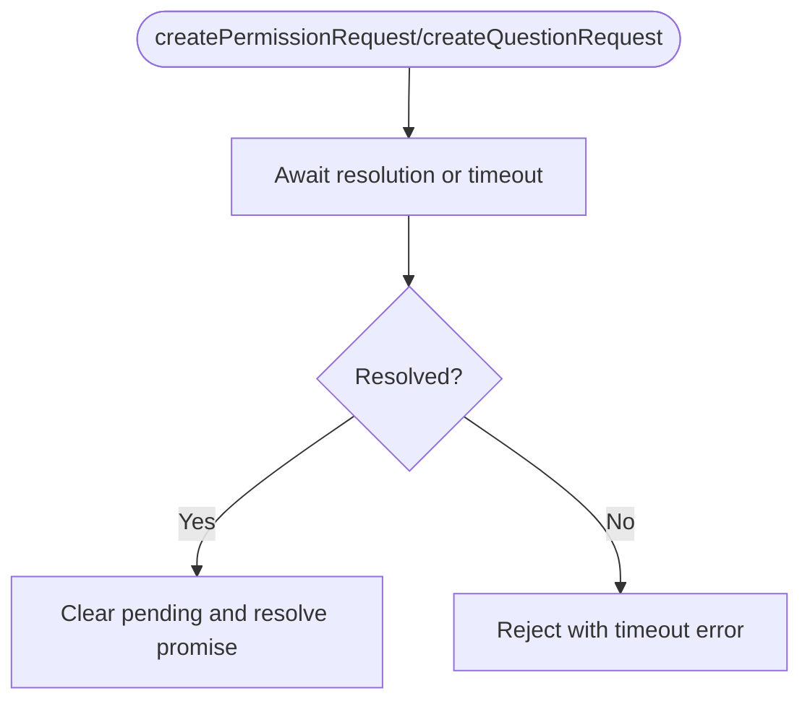

**Diagram sources**

- [permission-handler.ts:47-81](file://packages/agent-core/src/services/permission-handler.ts#L47-L81)
- [permission-handler.ts:84-107](file://packages/agent-core/src/services/permission-handler.ts#L84-L107)
- [permission.ts:15-50](file://packages/agent-core/src/common/types/permission.ts#L15-L50)

**Section sources**

- [permission-handler.ts:37-172](file://packages/agent-core/src/services/permission-handler.ts#L37-L172)
- [permission.ts:15-50](file://packages/agent-core/src/common/types/permission.ts#L15-L50)

## Dependency Analysis

The MCP tool framework exhibits clear separation of concerns:

- Tool framework depends on tool implementations and environment configuration
- MCP tools depend on the MCP SDK and optional HTTP APIs
- Daemon RPC depends on typed contracts and message handlers
- Permission lifecycle depends on shared permission types

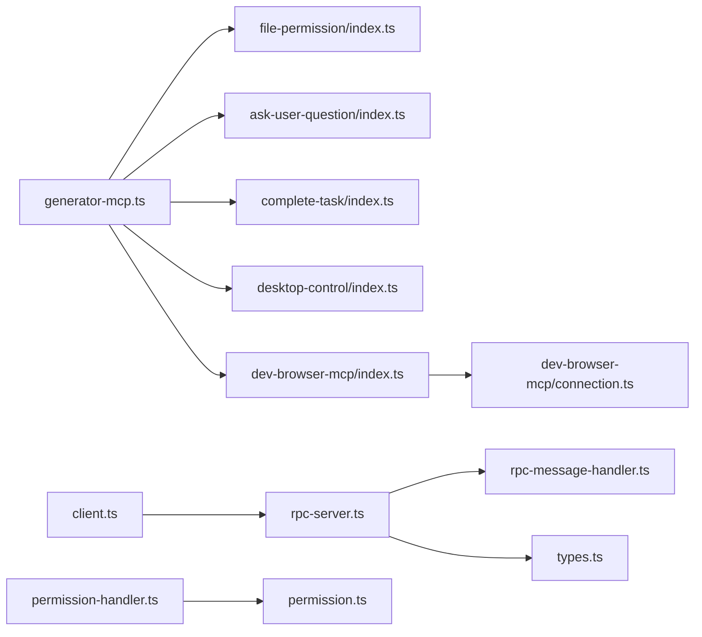

**Diagram sources**

- [generator-mcp.ts:76-191](file://packages/agent-core/src/opencode/generator-mcp.ts#L76-L191)
- [index.ts:1-140](file://packages/agent-core/mcp-tools/file-permission/src/index.ts#L1-L140)
- [index.ts:1-199](file://packages/agent-core/mcp-tools/ask-user-question/src/index.ts#L1-L199)
- [index.ts:1-90](file://packages/agent-core/mcp-tools/complete-task/src/index.ts#L1-L90)
- [index.ts:1-304](file://packages/agent-core/mcp-tools/desktop-control/src/index.ts#L1-L304)
- [index.ts:1-800](file://packages/agent-core/mcp-tools/dev-browser-mcp/src/index.ts#L1-L800)
- [connection.ts:1-388](file://packages/agent-core/mcp-tools/dev-browser-mcp/src/connection.ts#L1-L388)
- [client.ts:38-164](file://packages/agent-core/src/daemon/client.ts#L38-L164)
- [rpc-server.ts:33-165](file://packages/agent-core/src/daemon/rpc-server.ts#L33-L165)
- [rpc-message-handler.ts:46-87](file://packages/agent-core/src/daemon/rpc-message-handler.ts#L46-L87)
- [types.ts:9-194](file://packages/agent-core/src/daemon/types.ts#L9-L194)
- [permission-handler.ts:37-172](file://packages/agent-core/src/services/permission-handler.ts#L37-L172)
- [permission.ts:15-50](file://packages/agent-core/src/common/types/permission.ts#L15-L50)

**Section sources**

- [generator-mcp.ts:76-191](file://packages/agent-core/src/opencode/generator-mcp.ts#L76-L191)
- [client.ts:38-164](file://packages/agent-core/src/daemon/client.ts#L38-L164)
- [rpc-server.ts:33-165](file://packages/agent-core/src/daemon/rpc-server.ts#L33-L165)
- [rpc-message-handler.ts:46-87](file://packages/agent-core/src/daemon/rpc-message-handler.ts#L46-L87)
- [types.ts:9-194](file://packages/agent-core/src/daemon/types.ts#L9-L194)
- [permission-handler.ts:37-172](file://packages/agent-core/src/services/permission-handler.ts#L37-L172)
- [permission.ts:15-50](file://packages/agent-core/src/common/types/permission.ts#L15-L50)
- [index.ts:1-140](file://packages/agent-core/mcp-tools/file-permission/src/index.ts#L1-L140)
- [index.ts:1-199](file://packages/agent-core/mcp-tools/ask-user-question/src/index.ts#L1-L199)
- [index.ts:1-90](file://packages/agent-core/mcp-tools/complete-task/src/index.ts#L1-L90)
- [index.ts:1-304](file://packages/agent-core/mcp-tools/desktop-control/src/index.ts#L1-L304)
- [index.ts:1-800](file://packages/agent-core/mcp-tools/dev-browser-mcp/src/index.ts#L1-L800)
- [connection.ts:1-388](file://packages/agent-core/mcp-tools/dev-browser-mcp/src/connection.ts#L1-L388)

## Performance Considerations

- MCP tool timeouts: The tool framework applies per-tool timeouts to avoid blocking the agent. Ensure appropriate timeouts for long-running tools (e.g., AskUserQuestion allows up to 5 minutes).
- Browser automation overhead: dev-browser-mcp uses bounded screenshot sizes and throttles screencast frames to reduce payload sizes and CPU usage.
- Connection resilience: The dev-browser connection layer retries transient failures and recovers from recoverable connection errors.
- Permission and question batching: Consolidate prompts and minimize repeated permission requests to reduce UI churn and latency.

[No sources needed since this section provides general guidance]

## Troubleshooting Guide

Common issues and resolutions:

- MCP tool startup failures: Verify that the MCP dist entry exists and the build command is executed before launching the agent.
- Permission API connectivity: Ensure PERMISSION_API_PORT is set and reachable; include Authorization header when daemon auth tokens are configured.
- Question API timeouts: Confirm the question API is responsive and that the tool timeout aligns with the API’s limits.
- Desktop control blocklist violations: Review blocklist entries and adjust custom blocklists to permit or restrict specific applications.
- Browser connection errors: Check CDP endpoint/headers for remote mode or dev-browser server availability for builtin mode.
- Daemon RPC errors: Validate method names and parameters; inspect server logs for handler errors and ensure the socket path is accessible.

**Section sources**

- [generator-mcp.ts:39-54](file://packages/agent-core/src/opencode/generator-mcp.ts#L39-L54)
- [index.ts:10-20](file://packages/agent-core/mcp-tools/file-permission/src/index.ts#L10-L20)
- [index.ts:128-140](file://packages/agent-core/mcp-tools/ask-user-question/src/index.ts#L128-L140)
- [index.ts:191-199](file://packages/agent-core/mcp-tools/ask-user-question/src/index.ts#L191-L199)
- [index.ts:191-245](file://packages/agent-core/mcp-tools/desktop-control/src/index.ts#L191-L245)
- [connection.ts:75-91](file://packages/agent-core/mcp-tools/dev-browser-mcp/src/connection.ts#L75-L91)
- [rpc-message-handler.ts:67-85](file://packages/agent-core/src/daemon/rpc-message-handler.ts#L67-L85)

## Conclusion

The MCP tool framework provides a robust, extensible mechanism for AI agents to safely interact with external capabilities. Through standardized MCP servers, a configurable tool framework, and a secure permission lifecycle, the system enables powerful integrations like file operations, user prompts, desktop automation, and development browser control. By following the patterns outlined here—configuration, communication protocol adherence, and lifecycle management—developers can confidently build and integrate custom MCP tools that enhance agent functionality while maintaining safety and performance.
