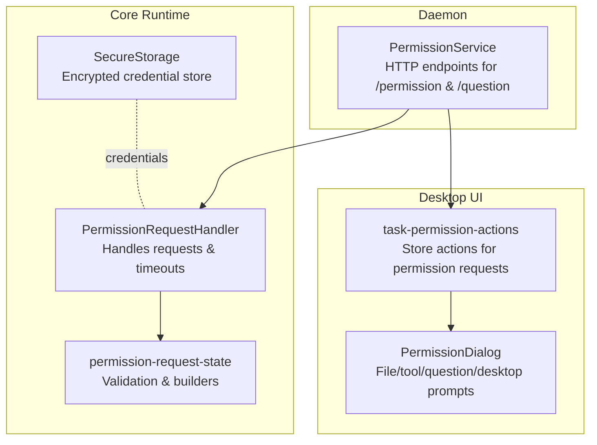
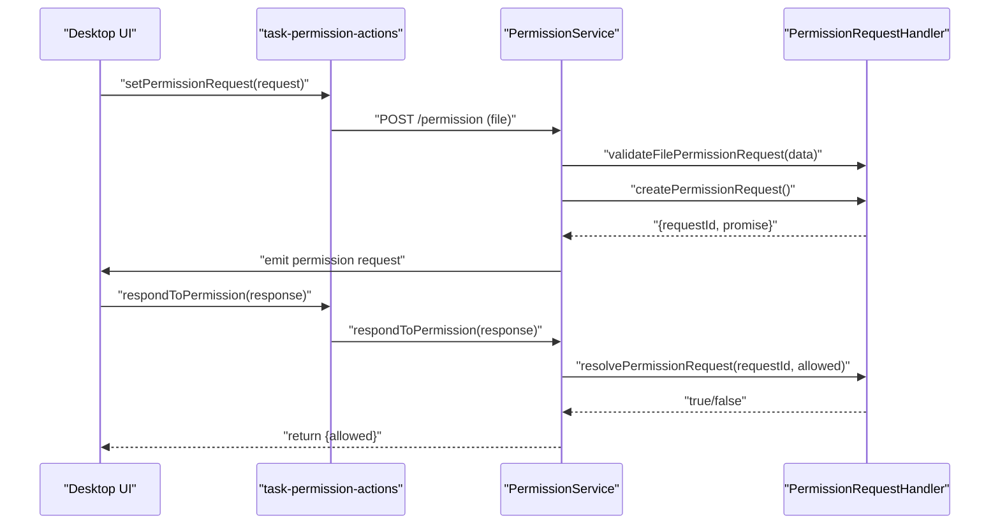
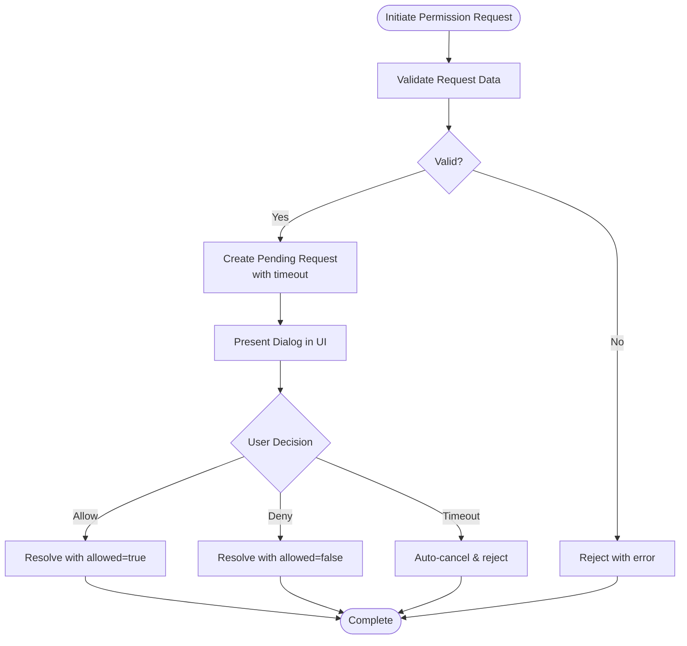
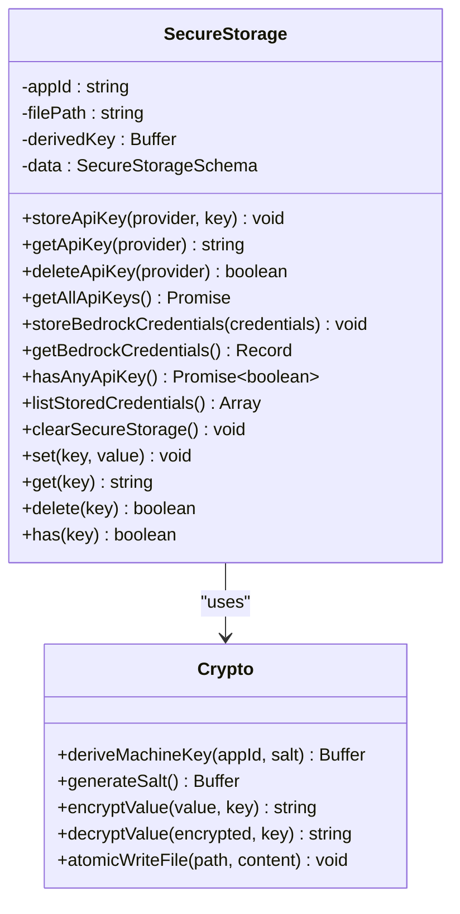
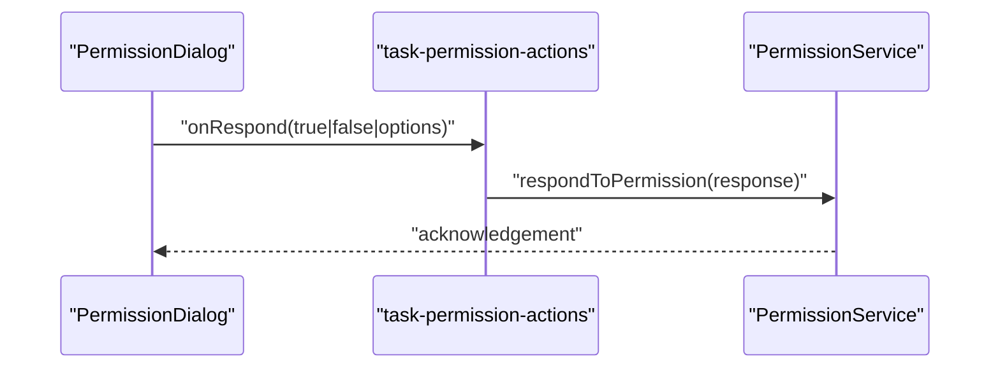
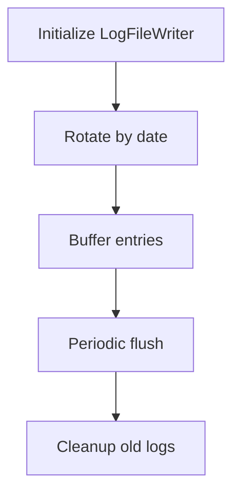
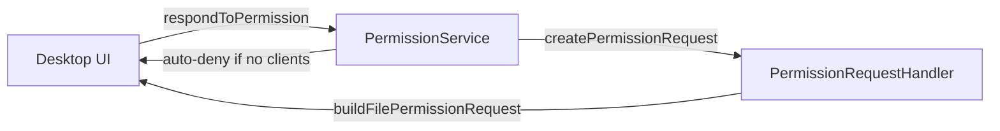
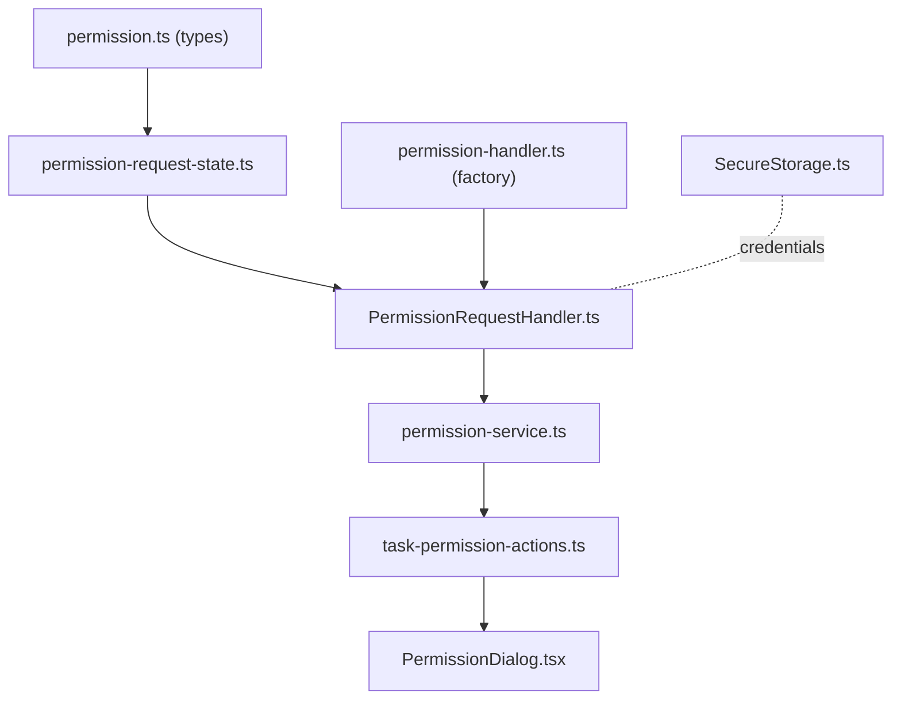

# Permission and Security System

<cite>
**Referenced Files in This Document**
- [PermissionRequestHandler.ts](file://packages/agent-core/src/internal/classes/PermissionRequestHandler.ts)
- [permission-handler.ts](file://packages/agent-core/src/services/permission-handler.ts)
- [permission-handler.ts (factory)](file://packages/agent-core/src/factories/permission-handler.ts)
- [permission-request-state.ts](file://packages/agent-core/src/internal/classes/permission-request-state.ts)
- [permission.ts (types)](file://packages/agent-core/src/common/types/permission.ts)
- [SecureStorage.ts](file://packages/agent-core/src/internal/classes/SecureStorage.ts)
- [secure-storage-crypto.ts](file://packages/agent-core/src/internal/classes/secure-storage-crypto.ts)
- [permission-service.ts](file://apps/daemon/src/permission-service.ts)
- [task-permission-actions.ts](file://apps/web/src/client/stores/task-permission-actions.ts)
- [PermissionDialog.tsx](file://apps/web/src/client/components/execution/PermissionDialog.tsx)
- [PermissionDialogDesktopTool.tsx](file://apps/web/src/client/components/execution/PermissionDialogDesktopTool.tsx)
- [permissions-filesystem-tests.md](file://docs/qa-suites/permissions-filesystem-tests.md)
- [native-provider.ts](file://packages/agent-core/src/sandbox/native-provider.ts)
- [log-file-writer.ts](file://packages/agent-core/src/internal/classes/LogFileWriter.ts)
- [logging/index.ts (desktop main)](file://apps/desktop/src/main/logging/index.ts)
</cite>

## Table of Contents

1. [Introduction](#introduction)
2. [Project Structure](#project-structure)
3. [Core Components](#core-components)
4. [Architecture Overview](#architecture-overview)
5. [Detailed Component Analysis](#detailed-component-analysis)
6. [Dependency Analysis](#dependency-analysis)
7. [Performance Considerations](#performance-considerations)
8. [Troubleshooting Guide](#troubleshooting-guide)
9. [Conclusion](#conclusion)
10. [Appendices](#appendices)

## Introduction

This document explains the Permission and Security System that safeguards user files and system access across the application. It covers how permission requests are initiated, validated, presented to users, and enforced by the daemon. It also documents secure credential storage, permission UI components, audit logging, and the lifecycle from request initiation to enforcement. The goal is to help both beginners understand why permissions matter and experienced developers implement, configure, and troubleshoot the system effectively.

## Project Structure

The Permission and Security System spans three layers:

- Core runtime logic for permission handling and secure storage
- Daemon service exposing HTTP endpoints for permission and question requests
- Desktop UI rendering permission dialogs and forwarding responses

**Diagram sources**

- [PermissionRequestHandler.ts:37-160](file://packages/agent-core/src/internal/classes/PermissionRequestHandler.ts#L37-L160)
- [permission-request-state.ts:66-179](file://packages/agent-core/src/internal/classes/permission-request-state.ts#L66-L179)
- [SecureStorage.ts:31-204](file://packages/agent-core/src/internal/classes/SecureStorage.ts#L31-L204)
- [permission-service.ts:17-214](file://apps/daemon/src/permission-service.ts#L17-L214)
- [task-permission-actions.ts:10-51](file://apps/web/src/client/stores/task-permission-actions.ts#L10-L51)
- [PermissionDialog.tsx:37-92](file://apps/web/src/client/components/execution/PermissionDialog.tsx#L37-L92)

**Section sources**

- [PermissionRequestHandler.ts:1-160](file://packages/agent-core/src/internal/classes/PermissionRequestHandler.ts#L1-L160)
- [permission-service.ts:1-214](file://apps/daemon/src/permission-service.ts#L1-L214)
- [task-permission-actions.ts:1-51](file://apps/web/src/client/stores/task-permission-actions.ts#L1-L51)
- [PermissionDialog.tsx:1-150](file://apps/web/src/client/components/execution/PermissionDialog.tsx#L1-L150)

## Core Components

- PermissionRequestHandler: Manages pending permission and question requests, timeouts, and validation. Builds structured PermissionRequest objects for downstream consumers.
- PermissionService: Exposes HTTP endpoints for permission and question requests, integrates with the PermissionRequestHandler, and auto-denies when no UI client is connected.
- SecureStorage: Provides encrypted storage for API keys and sensitive values using AES-256-GCM with machine-derived keys and atomic file writes.
- Permission UI: React components that render permission dialogs for file operations, questions, and desktop actions, and forward user decisions back to the daemon.

**Section sources**

- [PermissionRequestHandler.ts:37-160](file://packages/agent-core/src/internal/classes/PermissionRequestHandler.ts#L37-L160)
- [permission-request-state.ts:66-179](file://packages/agent-core/src/internal/classes/permission-request-state.ts#L66-L179)
- [permission-service.ts:64-214](file://apps/daemon/src/permission-service.ts#L64-L214)
- [SecureStorage.ts:31-204](file://packages/agent-core/src/internal/classes/SecureStorage.ts#L31-L204)
- [permission.ts (types):15-50](file://packages/agent-core/src/common/types/permission.ts#L15-L50)
- [PermissionDialog.tsx:37-92](file://apps/web/src/client/components/execution/PermissionDialog.tsx#L37-L92)
- [PermissionDialogDesktopTool.tsx:1-71](file://apps/web/src/client/components/execution/PermissionDialogDesktopTool.tsx#L1-L71)

## Architecture Overview

The system separates concerns between UI presentation and daemon enforcement:

- UI initiates permission requests and renders prompts.
- Daemon validates requests, forwards them to the core handler, and waits for user decisions.
- Core handler enforces timeouts and resolves requests.
- Secure storage secures sensitive credentials independently of the permission flow.

**Diagram sources**

- [permission-service.ts:64-131](file://apps/daemon/src/permission-service.ts#L64-L131)
- [permission-handler.ts:42-171](file://packages/agent-core/src/services/permission-handler.ts#L42-L171)
- [task-permission-actions.ts:25-48](file://apps/web/src/client/stores/task-permission-actions.ts#L25-L48)

## Detailed Component Analysis

### Permission Lifecycle and Enforcement Patterns

- Request creation: The daemon creates a permission request with a unique ID and a timeout-bound promise.
- Validation: Requests are validated against strict schemas for file operations and questions.
- Presentation: The UI receives the request and renders appropriate dialogs.
- Resolution: The UI sends a response back to the daemon, which resolves the pending request in the core handler.
- Timeout handling: Unresolved requests are rejected automatically, preventing indefinite blocking.

**Diagram sources**

- [permission-request-state.ts:106-143](file://packages/agent-core/src/internal/classes/permission-request-state.ts#L106-L143)
- [permission-service.ts:99-116](file://apps/daemon/src/permission-service.ts#L99-L116)
- [PermissionDialog.tsx:37-92](file://apps/web/src/client/components/execution/PermissionDialog.tsx#L37-L92)

**Section sources**

- [permission-service.ts:64-131](file://apps/daemon/src/permission-service.ts#L64-L131)
- [permission-handler.ts:42-171](file://packages/agent-core/src/services/permission-handler.ts#L42-L171)
- [permission-request-state.ts:66-179](file://packages/agent-core/src/internal/classes/permission-request-state.ts#L66-L179)

### File Access Control and Workspace Policies

- The permission system surfaces file operations requiring explicit approval, including create, delete, rename, move, modify, and overwrite.
- Tests define allowed paths, persistence across tasks, and normalization behavior (absolute paths, subdirectories, symlinks, and relative vs absolute paths).
- Operations outside allowed paths trigger permission prompts; approved paths persist in-memory per session and are cleared on restart.

Practical examples from QA scenarios:

- Approve a path inside the configured workspace to avoid prompts for subsequent tasks.
- Deny a path to ensure repeated prompts appear for safety.
- Restart the app to observe permission prompts reappearing after session reset.

**Section sources**

- [permissions-filesystem-tests.md:32-59](file://docs/qa-suites/permissions-filesystem-tests.md#L32-L59)
- [permission.ts (types):1-50](file://packages/agent-core/src/common/types/permission.ts#L1-L50)

### Secure Credential Storage

SecureStorage provides encrypted storage for API keys and other sensitive values:

- Uses AES-256-GCM with randomized IVs and authentication tags.
- Derives a machine-specific key via PBKDF2 using platform identifiers and a per-file salt.
- Persists data atomically to prevent corruption during writes.
- Supports provider-specific keys and listing stored credentials.

**Diagram sources**

- [SecureStorage.ts:31-204](file://packages/agent-core/src/internal/classes/SecureStorage.ts#L31-L204)
- [secure-storage-crypto.ts:55-114](file://packages/agent-core/src/internal/classes/secure-storage-crypto.ts#L55-L114)

**Section sources**

- [SecureStorage.ts:31-204](file://packages/agent-core/src/internal/classes/SecureStorage.ts#L31-L204)
- [secure-storage-crypto.ts:1-114](file://packages/agent-core/src/internal/classes/secure-storage-crypto.ts#L1-L114)

### Permission UI Components

- PermissionDialog renders file permission prompts, including operation type, file path, and optional previews or targets.
- PermissionDialogDesktopTool renders desktop action prompts with details like target window and coordinates.
- task-permission-actions integrates UI responses with the daemon via respondToPermission.

**Diagram sources**

- [PermissionDialog.tsx:37-92](file://apps/web/src/client/components/execution/PermissionDialog.tsx#L37-L92)
- [PermissionDialogDesktopTool.tsx:1-71](file://apps/web/src/client/components/execution/PermissionDialogDesktopTool.tsx#L1-L71)
- [task-permission-actions.ts:25-48](file://apps/web/src/client/stores/task-permission-actions.ts#L25-L48)

**Section sources**

- [PermissionDialog.tsx:37-92](file://apps/web/src/client/components/execution/PermissionDialog.tsx#L37-L92)
- [PermissionDialogDesktopTool.tsx:1-71](file://apps/web/src/client/components/execution/PermissionDialogDesktopTool.tsx#L1-L71)
- [task-permission-actions.ts:10-51](file://apps/web/src/client/stores/task-permission-actions.ts#L10-L51)

### Audit Logging Capabilities

- LogFileWriter rotates logs daily, buffers entries, and flushes periodically.
- Redaction utilities help sanitize sensitive data in logs.
- Desktop logging exports are exposed for consistent log handling across the app.

**Diagram sources**

- [log-file-writer.ts:20-37](file://packages/agent-core/src/internal/classes/LogFileWriter.ts#L20-L37)
- [logging/index.ts (desktop main):1-9](file://apps/desktop/src/main/logging/index.ts#L1-L9)

**Section sources**

- [log-file-writer.ts:1-37](file://packages/agent-core/src/internal/classes/LogFileWriter.ts#L1-L37)
- [logging/index.ts (desktop main):1-9](file://apps/desktop/src/main/logging/index.ts#L1-L9)

### Relationship Between Desktop UI and Daemon Enforcement

- The daemon exposes HTTP endpoints for permission and question requests, validating payloads and enforcing auto-deny when no UI client is connected.
- The core PermissionRequestHandler manages request lifecycles and timeouts, while the daemon bridges to the UI and vice versa.

**Diagram sources**

- [permission-service.ts:64-214](file://apps/daemon/src/permission-service.ts#L64-L214)
- [permission-handler.ts:42-171](file://packages/agent-core/src/services/permission-handler.ts#L42-L171)

**Section sources**

- [permission-service.ts:17-214](file://apps/daemon/src/permission-service.ts#L17-L214)
- [permission-handler.ts:42-171](file://packages/agent-core/src/services/permission-handler.ts#L42-L171)

## Dependency Analysis

- Core runtime depends on shared types and state builders for permission requests.
- Daemon depends on the core PermissionRequestHandler factory and exposes HTTP routes.
- UI depends on shared types and store actions to manage permission requests and responses.
- SecureStorage is independent and used wherever credentials need protection.

**Diagram sources**

- [permission.ts (types):15-50](file://packages/agent-core/src/common/types/permission.ts#L15-L50)
- [permission-request-state.ts:66-179](file://packages/agent-core/src/internal/classes/permission-request-state.ts#L66-L179)
- [PermissionRequestHandler.ts:37-160](file://packages/agent-core/src/internal/classes/PermissionRequestHandler.ts#L37-L160)
- [permission-handler.ts (factory):1-9](file://packages/agent-core/src/factories/permission-handler.ts#L1-L9)
- [permission-service.ts:17-214](file://apps/daemon/src/permission-service.ts#L17-L214)
- [task-permission-actions.ts:10-51](file://apps/web/src/client/stores/task-permission-actions.ts#L10-L51)
- [PermissionDialog.tsx:37-92](file://apps/web/src/client/components/execution/PermissionDialog.tsx#L37-L92)
- [SecureStorage.ts:31-204](file://packages/agent-core/src/internal/classes/SecureStorage.ts#L31-L204)

**Section sources**

- [permission.ts (types):15-50](file://packages/agent-core/src/common/types/permission.ts#L15-L50)
- [permission-request-state.ts:66-179](file://packages/agent-core/src/internal/classes/permission-request-state.ts#L66-L179)
- [PermissionRequestHandler.ts:37-160](file://packages/agent-core/src/internal/classes/PermissionRequestHandler.ts#L37-L160)
- [permission-handler.ts (factory):1-9](file://packages/agent-core/src/factories/permission-handler.ts#L1-L9)
- [permission-service.ts:17-214](file://apps/daemon/src/permission-service.ts#L17-L214)
- [task-permission-actions.ts:10-51](file://apps/web/src/client/stores/task-permission-actions.ts#L10-L51)
- [PermissionDialog.tsx:37-92](file://apps/web/src/client/components/execution/PermissionDialog.tsx#L37-L92)
- [SecureStorage.ts:31-204](file://packages/agent-core/src/internal/classes/SecureStorage.ts#L31-L204)

## Performance Considerations

- Request timeouts prevent UI stalls; tune default timeout based on expected user interaction latency.
- Atomic writes in SecureStorage minimize disk contention and reduce risk of partial writes.
- Log buffering reduces I/O overhead; ensure log directory is on fast storage for production environments.
- Rate limiting on daemon endpoints prevents abuse and ensures fair resource allocation.

[No sources needed since this section provides general guidance]

## Troubleshooting Guide

Common issues and resolutions:

- Permission request times out: Verify UI responsiveness and ensure respondToPermission is invoked. Check daemon logs for route errors.
- Auto-denied requests: When no UI client is connected, the daemon auto-denies requests. Connect the UI or disable the auto-deny behavior if appropriate.
- Invalid request payload: Ensure operation and required fields are present for file permission requests and question requests.
- Secure storage failures: Confirm file permissions on the storage directory and that the process has write access. Check for corrupted files and retry initialization.
- Logs not rotating: Verify log directory exists and is writable; confirm flush intervals and retention settings.

**Section sources**

- [permission-service.ts:92-97](file://apps/daemon/src/permission-service.ts#L92-L97)
- [permission-request-state.ts:106-143](file://packages/agent-core/src/internal/classes/permission-request-state.ts#L106-L143)
- [SecureStorage.ts:42-64](file://packages/agent-core/src/internal/classes/SecureStorage.ts#L42-L64)
- [log-file-writer.ts:29-37](file://packages/agent-core/src/internal/classes/LogFileWriter.ts#L29-L37)

## Conclusion

The Permission and Security System combines a robust core handler, daemon enforcement, and user-facing UI to protect user files and system access. SecureStorage safeguards credentials, while audit logging provides visibility. By understanding the permission lifecycle, access control policies, and secure storage mechanisms, teams can configure, operate, and troubleshoot the system effectively.

[No sources needed since this section summarizes without analyzing specific files]

## Appendices

### Best Practices and Compliance Considerations

- Principle of least privilege: Limit file operations to strictly necessary paths and scopes.
- Credential hygiene: Rotate API keys regularly and avoid storing plaintext secrets.
- Logging hygiene: Redact sensitive fields and restrict log access to authorized personnel.
- Network restrictions: Enforce sandbox rules to limit outbound connections unless explicitly permitted.

**Section sources**

- [permissions-filesystem-tests.md:32-59](file://docs/qa-suites/permissions-filesystem-tests.md#L32-L59)
- [secure-storage-crypto.ts:55-114](file://packages/agent-core/src/internal/classes/secure-storage-crypto.ts#L55-L114)
- [native-provider.ts:145-158](file://packages/agent-core/src/sandbox/native-provider.ts#L145-L158)
