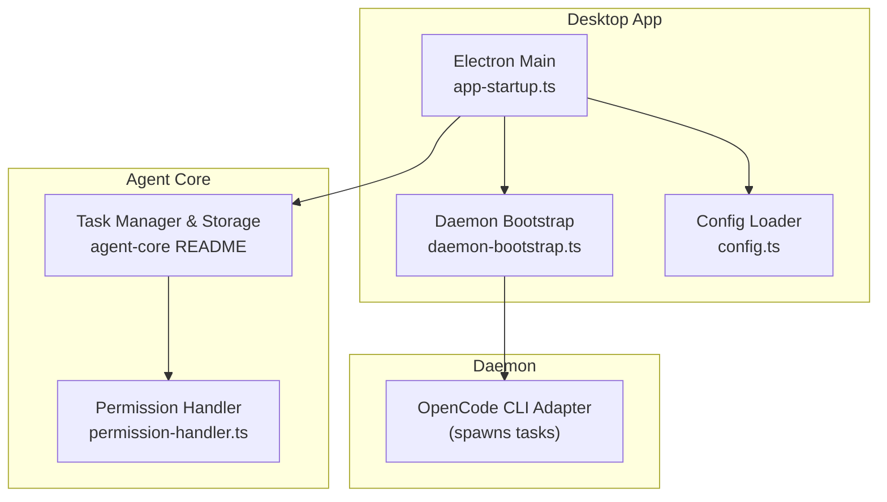
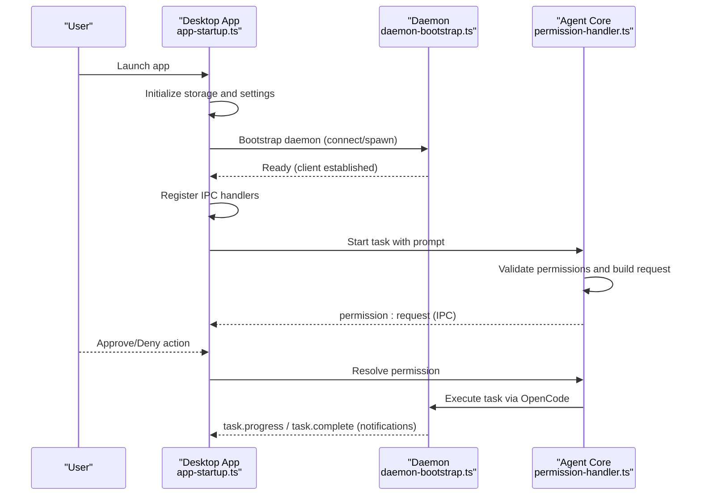
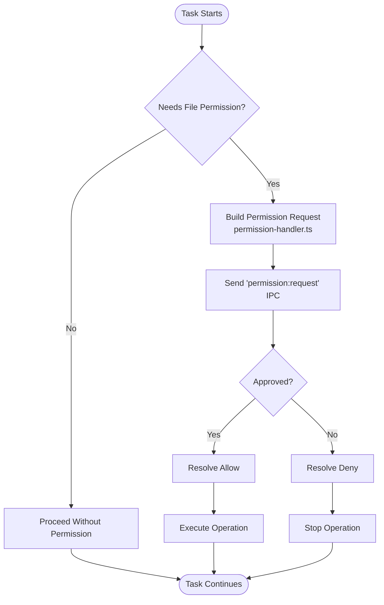
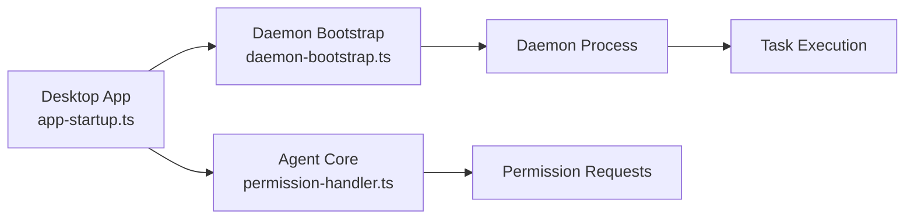

# Getting Started

<cite>
**Referenced Files in This Document**
- [README.md](file://README.md)
- [apps/desktop/package.json](file://apps/desktop/package.json)
- [apps/desktop/src/main/app-startup.ts](file://apps/desktop/src/main/app-startup.ts)
- [apps/desktop/src/main/config.ts](file://apps/desktop/src/main/config.ts)
- [apps/desktop/src/main/daemon-bootstrap.ts](file://apps/desktop/src/main/daemon-bootstrap.ts)
- [packages/agent-core/README.md](file://packages/agent-core/README.md)
- [packages/agent-core/src/internal/classes/PermissionRequestHandler.ts](file://packages/agent-core/src/internal/classes/PermissionRequestHandler.ts)
- [packages/agent-core/src/services/permission-handler.ts](file://packages/agent-core/src/services/permission-handler.ts)
</cite>

## Table of Contents

1. [Introduction](#introduction)
2. [Project Structure](#project-structure)
3. [Core Components](#core-components)
4. [Architecture Overview](#architecture-overview)
5. [Detailed Component Analysis](#detailed-component-analysis)
6. [Dependency Analysis](#dependency-analysis)
7. [Performance Considerations](#performance-considerations)
8. [Troubleshooting Guide](#troubleshooting-guide)
9. [Conclusion](#conclusion)
10. [Appendices](#appendices)

## IntroducDomeWork

Welcome to Accomplish AI Desktop Agent. This guide helps you install the desktop app, connect your AI provider (cloud or local), grant folder access, and run your first tasks in about four minutes. You will learn how the permission system works, see practical examples, and find troubleshooting tips for common setup issues.
DomeWork
## Project Structure

Accomplish is delivered as a desktop app built with Electron and React, and powered by a companion daemon process. The desktop app initializes storage, validates providers, starts the daemon, and exposes a UI for settings and task execution. The agent core library provides task management, storage, permissions, and logging.

**Diagram sources**

- [apps/desktop/src/main/app-startup.ts:47-285](file://apps/desktop/src/main/app-startup.ts#L47-L285)
- [apps/desktop/src/main/daemon-bootstrap.ts:42-201](file://apps/desktop/src/main/daemon-bootstrap.ts#L42-L201)
- [apps/desktop/src/main/config.ts:13-27](file://apps/desktop/src/main/config.ts#L13-L27)
- [packages/agent-core/README.md:9-47](file://packages/agent-core/README.md#L9-L47)
- [packages/agent-core/src/services/permission-handler.ts:37-172](file://packages/agent-core/src/services/permission-handler.ts#L37-L172)

**Section sources**

- [README.md:188-207](file://README.md#L188-L207)
- [apps/desktop/package.json:103-267](file://apps/desktop/package.json#L103-L267)

## Core Components

- Desktop app: Initializes storage, migrates legacy data, validates providers, starts analytics, boots the daemon, registers IPC handlers, and creates the main window.
- Daemon: Runs separately and communicates with the desktop app via a socket/pipe. It executes tasks spawned by the agent core.
- Agent core: Provides factory APIs for task management, storage, permissions, logging, and more. It validates and streams permission requests and thought checkpoints.

Key responsibilities:

- Provider setup and validation (API keys and local models)
- Workspace and folder access configuration
- Permission request handling and timeouts
- Thought stream and task execution notifications

**Section sources**

- [apps/desktop/src/main/app-startup.ts:63-127](file://apps/desktop/src/main/app-startup.ts#L63-L127)
- [apps/desktop/src/main/daemon-bootstrap.ts:42-81](file://apps/desktop/src/main/daemon-bootstrap.ts#L42-L81)
- [packages/agent-core/README.md:53-107](file://packages/agent-core/README.md#L53-L107)

## Architecture Overview

The desktop app and daemon communicate over a local transport. The desktop app registers IPC handlers and forwards daemon notifications to the renderer. The agent core manages tasks, permissions, and logging.

**Diagram sources**

- [apps/desktop/src/main/app-startup.ts:177-192](file://apps/desktop/src/main/app-startup.ts#L177-L192)
- [apps/desktop/src/main/daemon-bootstrap.ts:108-200](file://apps/desktop/src/main/daemon-bootstrap.ts#L108-L200)
- [packages/agent-core/src/services/permission-handler.ts:46-107](file://packages/agent-core/src/services/permission-handler.ts#L46-L107)

## Detailed Component Analysis

### Installation and Setup (macOS, Windows, Linux)

Follow the official downloads and the 2-minute setup steps described below. After installing, the app launches, connects to the daemon, and guides you through provider setup and folder access.

- Download links and supported platforms are available in the repository’s main readme.
- The desktop app build configuration defines product name, artifact naming, and packaging targets for macOS, Windows, and Linux.

What to expect:

- On first launch, the app initializes storage and migrates legacy data if present.
- Providers are validated; missing API keys are removed automatically.
- Optional local model server (Hugging Face) can auto-start if configured.
- The daemon is bootstrapped and notifications are forwarded to the UI.

**Section sources**

- [README.md:174-207](file://README.md#L174-L207)
- [apps/desktop/package.json:103-267](file://apps/desktop/package.json#L103-L267)
- [apps/desktop/src/main/app-startup.ts:54-127](file://apps/desktop/src/main/app-startup.ts#L54-L127)

### Connecting Your AI Provider (Cloud or Local)

Supported providers include major cloud APIs and local models. You can use your own API keys or run local models via compatible tools.

- Cloud providers: Connect via your API keys.
- Local models: Configure local model servers (e.g., Hugging Face) and select a model.
- The desktop app validates provider credentials and removes providers without valid keys.

Practical steps:

- Open Settings and add your provider credentials.
- Select a model if using local inference.
- Confirm the provider appears as connected.

Tip: If a provider disappears after restart, it likely had missing or invalid credentials and was removed automatically.

**Section sources**

- [README.md:148-165](file://README.md#L148-L165)
- [apps/desktop/src/main/app-startup.ts:89-104](file://apps/desktop/src/main/app-startup.ts#L89-L104)

### Choosing Accessible Folders (Workspace)

You control which folders the agent can access. During setup, you choose folders that the agent can read and modify. The agent will ask for permission for any specific file operation outside of these folders.

- Add folders to your workspace in Settings.
- The agent will request permission for actions outside these folders.
- You can review and adjust permissions at any time.

**Section sources**

- [README.md:67-70](file://README.md#L67-L70)
- [packages/agent-core/src/internal/classes/PermissionRequestHandler.ts:37-160](file://packages/agent-core/src/internal/classes/PermissionRequestHandler.ts#L37-L160)

### Four-Minute Setup Checklist

- Install the app for your OS.
- Connect your AI provider (cloud API key or local model).
- Choose accessible folders for the agent.
- Run your first task (e.g., summarize a document, clean a folder, or create a report).
- Approve any permission prompts that appear.

Tip: The demo video and screenshots in the readme offer a quick walkthrough.

**Section sources**

- [README.md:188-207](file://README.md#L188-L207)
- [README.md:215-227](file://README.md#L215-L227)

### Practical Examples of Initial Tasks

Common starter tasks include:

- Cleaning folders: Sort, rename, and move files based on content or rules.
- Summarizing documents: Generate concise summaries from long texts.
- Creating reports: Draft or rewrite reports from notes and data.

These tasks are executed through the UI. The agent will request permission for any file operations outside your chosen workspace folders.

**Section sources**

- [README.md:140-144](file://README.md#L140-L144)
- [packages/agent-core/src/services/permission-handler.ts:119-135](file://packages/agent-core/src/services/permission-handler.ts#L119-L135)

### Permission System Basics

The permission system ensures you approve every action the agent attempts. It distinguishes between:

- File permission requests: for reading/writing/modifying files.
- Question requests: for user choices (e.g., selecting options).

How it works:

- The agent core builds a structured permission request when a task needs access.
- The desktop app receives a permission request notification and shows a prompt.
- You can approve or deny; the app resolves the request within a timeout.
- Pending requests are tracked and cleared on shutdown.

**Diagram sources**

- [packages/agent-core/src/services/permission-handler.ts:46-107](file://packages/agent-core/src/services/permission-handler.ts#L46-L107)
- [packages/agent-core/src/internal/classes/PermissionRequestHandler.ts:37-160](file://packages/agent-core/src/internal/classes/PermissionRequestHandler.ts#L37-L160)

**Section sources**

- [packages/agent-core/src/services/permission-handler.ts:37-172](file://packages/agent-core/src/services/permission-handler.ts#L37-L172)
- [packages/agent-core/src/internal/classes/PermissionRequestHandler.ts:37-160](file://packages/agent-core/src/internal/classes/PermissionRequestHandler.ts#L37-L160)

### Daemon and Task Execution

The desktop app bootstraps the daemon and forwards task-related notifications to the UI. Notifications include progress, messages, completion, errors, summaries, thought streams, and checkpoints.

- The daemon is connected via a socket/pipe and logs are tailed in development.
- Notifications are forwarded to the renderer window for real-time updates.

**Section sources**

- [apps/desktop/src/main/daemon-bootstrap.ts:42-201](file://apps/desktop/src/main/daemon-bootstrap.ts#L42-L201)
- [apps/desktop/src/main/app-startup.ts:177-192](file://apps/desktop/src/main/app-startup.ts#L177-L192)

## Dependency Analysis

High-level dependencies:

- Desktop app depends on the agent core for task management, storage, and permissions.
- The daemon executes tasks via the OpenCode CLI adapter.
- The desktop app registers IPC handlers and forwards daemon notifications.

DomeWork
**Diagram sources**

- [apps/desktop/src/main/app-startup.ts:47-285](file://apps/desktop/src/main/app-startup.ts#L47-L285)
- [apps/desktop/src/main/daemon-bootstrap.ts:42-201](file://apps/desktop/src/main/daemon-bootstrap.ts#L42-L201)
- [packages/agent-core/src/services/permission-handler.ts:37-172](file://packages/agent-core/src/services/permission-handler.ts#L37-L172)

**Section sources**

- [apps/desktop/package.json:53-102](file://apps/desktop/package.json#L53-L102)
- [packages/agent-core/README.md:53-107](file://packages/agent-core/README.md#L53-L107)

## Performance Considerations

- Keep the daemon running to avoid repeated startup overhead.
- Limit unnecessary file operations outside your workspace to reduce permission prompts.
- Use local models judiciously; they may consume system resources depending on model size.

## Troubleshooting Guide

- App fails to start or shows an update-required message:
  - The app detected data created by a newer version. Update the app to continue.
- Provider removed unexpectedly:
  - If a provider lacks a valid API key, it is removed automatically during startup.
- Daemon not responding:
  - The desktop app continues to run even if the daemon fails to start. Check the status indicator and toast messages for connectivity issues.
- Permission prompts timing out:
  - The system enforces a timeout for permission requests. Approve or deny promptly to avoid delays.

**Section sources**

- [apps/desktop/src/main/app-startup.ts:66-78](file://apps/desktop/src/main/app-startup.ts#L66-L78)
- [apps/desktop/src/main/app-startup.ts:96-103](file://apps/desktop/src/main/app-startup.ts#L96-L103)
- [apps/desktop/src/main/daemon-bootstrap.ts:177-192](file://apps/desktop/src/main/daemon-bootstrap.ts#L177-L192)
- [packages/agent-core/src/services/permission-handler.ts:46-81](file://packages/agent-core/src/services/permission-handler.ts#L46-L81)

## Conclusion

You are now ready to install Accomplish, connect your AI provider, configure folder access, and run your first tasks. Use the permission system to maintain full control, and consult the troubleshooting section if you encounter issues. Explore the demo video and screenshots for a guided walkthrough.

## Appendices

- Download links and supported platforms are listed in the repository readme.
- The desktop app build configuration defines packaging and distribution targets.

**Section sources**

- [README.md:174-207](file://README.md#L174-L207)
- [apps/desktop/package.json:103-267](file://apps/desktop/package.json#L103-L267)
