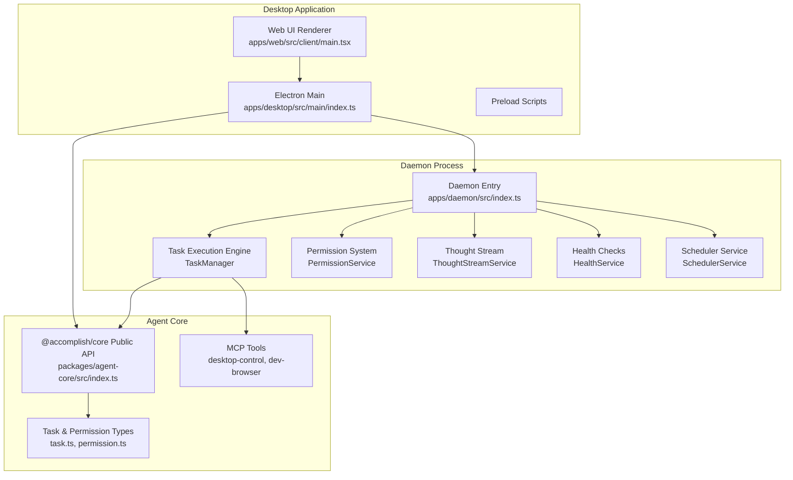
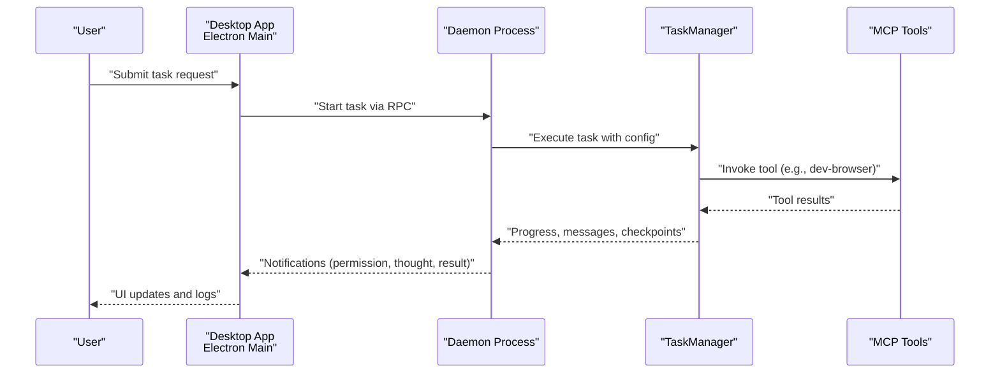
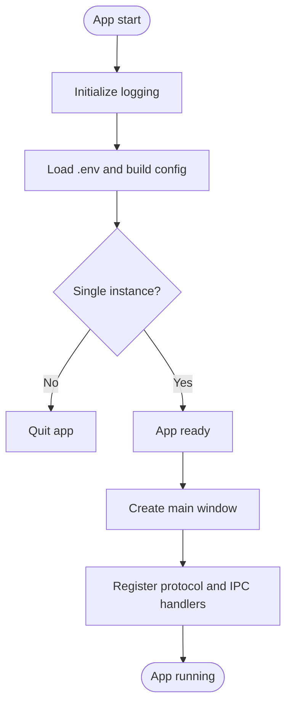
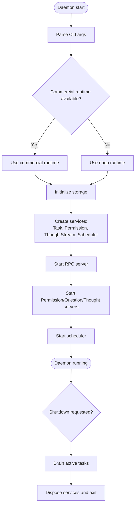
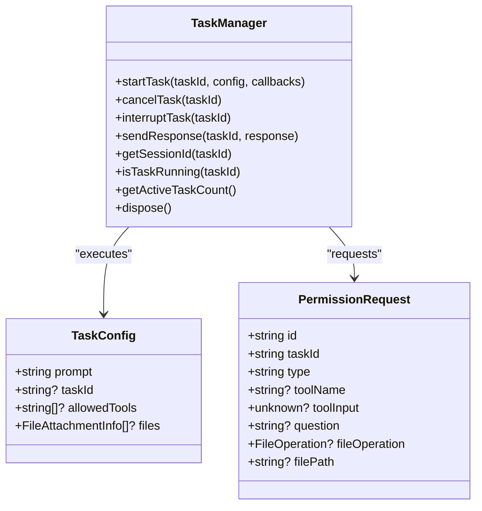
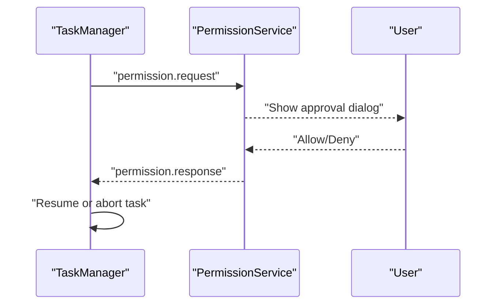
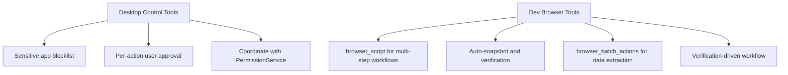
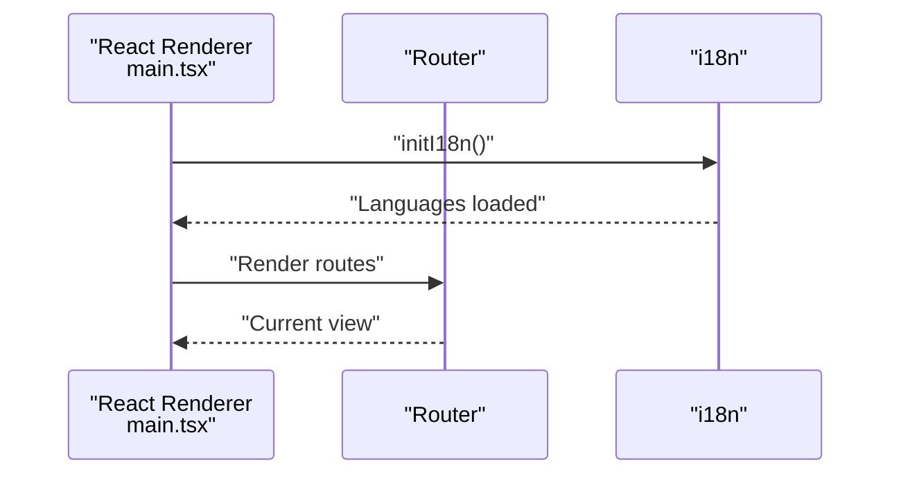
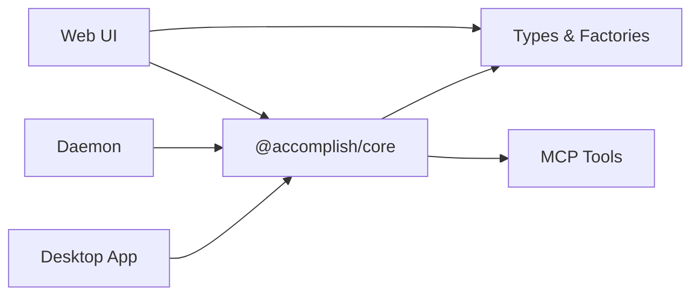

# Project Overview

<cite>
**Referenced Files in This Document**
- [README.md](file://README.md)
- [apps/desktop/src/main/index.ts](file://apps/desktop/src/main/index.ts)
- [apps/daemon/src/index.ts](file://apps/daemon/src/index.ts)
- [packages/agent-core/src/index.ts](file://packages/agent-core/src/index.ts)
- [packages/agent-core/src/common/types/task.ts](file://packages/agent-core/src/common/types/task.ts)
- [packages/agent-core/src/common/types/permission.ts](file://packages/agent-core/src/common/types/permission.ts)
- [packages/agent-core/src/internal/classes/TaskManager.ts](file://packages/agent-core/src/internal/classes/TaskManager.ts)
- [packages/agent-core/mcp-tools/desktop-control/SKILL.md](file://packages/agent-core/mcp-tools/desktop-control/SKILL.md)
- [packages/agent-core/mcp-tools/dev-browser/SKILL.md](file://packages/agent-core/mcp-tools/dev-browser/SKILL.md)
- [apps/web/src/client/main.tsx](file://apps/web/src/client/main.tsx)
- [apps/web/src/client/lib/task-utils.ts](file://apps/web/src/client/lib/task-utils.ts)
</cite>

## Table of Contents

1. [Introduction](#introduction)
2. [Project Structure](#project-structure)
3. [Core Components](#core-components)
4. [Architecture Overview](#architecture-overview)
5. [Detailed Component Analysis](#detailed-component-analysis)
6. [Dependency Analysis](#dependency-analysis)
7. [Performance Considerations](#performance-considerations)
8. [Troubleshooting Guide](#troubleshooting-guide)
9. [Conclusion](#conclusion)

DomeWorkction

Accomplish AI Desktop Agent is an open-source, local-first AI desktop automation platform designed to run entirely on your machine. It empowers users to automate file management, draft and edit documents, and orchestrate browser workflows using their own AI API keys or local models. The platform emphasizes privacy, transparency, and user control, ensuring that sensitive data remains on your device and that every action is auditable and reversible.

Key value propositions:

- Local-first execution: Runs on your machine with your data and files under your control.
- Privacy-focused design: No data leaves your device without explicit consent; permission system governs all actions.
- Multi-provider AI integration: Supports a wide range of providers and local models out of the box.
- Practical automation: Real-world capabilities for organizing files, drafting documents, and automating browser tasks.

Target audience:

- Power users who need reliable, repeatable desktop automation.
- Privacy-conscious professionals who require local execution and auditability.
- Developers and integrators building custom automation workflows with MCP tools and skills.

Common use cases:

- Automatically organize and rename files by project, type, or date.
- Draft, summarize, and rewrite documents and meeting notes.
- Automate browser workflows such as research, form filling, and data extraction.
- Generate periodic reports from files and notes.
- Prepare meeting materials from docs and calendars.

System requirements:

- macOS (Apple Silicon), macOS (Intel), Windows 11, Ubuntu (ARM64), and Ubuntu (x64).

## Project Structure

The project is organized into three primary workspaces:

- Desktop application: Electron-based UI with main and preload processes, responsible for launching the daemon, managing the tray and window lifecycle, and exposing IPC handlers.
- Daemon process: A long-running service that manages task execution, permission requests, thought streams, scheduling, and MCP tool connectivity.
- Web workspace: A React-based UI that integrates with the daemon and provides task execution, history, and settings views.

**Diagram sources**

- [apps/desktop/src/main/index.ts:1-177](file://apps/desktop/src/main/index.ts#L1-L177)
- [apps/daemon/src/index.ts:1-295](file://apps/daemon/src/index.ts#L1-L295)
- [packages/agent-core/src/index.ts:1-583](file://packages/agent-core/src/index.ts#L1-L583)
- [packages/agent-core/src/common/types/task.ts:1-135](file://packages/agent-core/src/common/types/task.ts#L1-L135)
- [packages/agent-core/src/common/types/permission.ts:1-50](file://packages/agent-core/src/common/types/permission.ts#L1-L50)
- [packages/agent-core/mcp-tools/desktop-control/SKILL.md:1-154](file://packages/agent-core/mcp-tools/desktop-control/SKILL.md#L1-L154)
- [packages/agent-core/mcp-tools/dev-browser/SKILL.md:1-420](file://packages/agent-core/mcp-tools/dev-browser/SKILL.md#L1-L420)
- [apps/web/src/client/main.tsx:1-22](file://apps/web/src/client/main.tsx#L1-L22)

**Section sources**

- [README.md:126-181](file://README.md#L126-L181)
- [apps/desktop/src/main/index.ts:1-177](file://apps/desktop/src/main/index.ts#L1-L177)
- [apps/daemon/src/index.ts:1-295](file://apps/daemon/src/index.ts#L1-L295)
- [packages/agent-core/src/index.ts:1-583](file://packages/agent-core/src/index.ts#L1-L583)
- [apps/web/src/client/main.tsx:1-22](file://apps/web/src/client/main.tsx#L1-L22)

## Core Components

- Desktop application (Electron): Initializes logging, sets up the main window, registers IPC handlers, and orchestrates the daemon lifecycle. It also embeds the web UI and exposes protocol handlers for deep linking and OAuth flows.
- Daemon process: Provides a persistent runtime for task execution, permission gating, thought streaming, and scheduling. It starts RPC servers, exposes well-known ports for MCP tools, and manages graceful shutdown with drain semantics.
- Agent Core: Defines the public API, task and permission types, and factories for services like TaskManager, Storage, PermissionHandler, and ThoughtStreamHandler. It also includes browser and MCP tool integrations.
- MCP tools: Specialized automation capabilities packaged as tools, including desktop-control for native desktop actions and dev-browser for browser automation. Both require explicit user approval and are designed for safety and transparency.

Practical examples:

- File organization: Use MCP tools to sort, rename, and move files based on content or rules you define.
- Document drafting: Prompt the agent to write, summarize, or rewrite documents using your chosen provider or local model.
- Browser workflows: Automate multi-step browser tasks such as login flows, form submissions, and data extraction using dev-browser tools.

**Section sources**

- [README.md:126-165](file://README.md#L126-L165)
- [packages/agent-core/mcp-tools/desktop-control/SKILL.md:1-154](file://packages/agent-core/mcp-tools/desktop-control/SKILL.md#L1-L154)
- [packages/agent-core/mcp-tools/dev-browser/SKILL.md:1-420](file://packages/agent-core/mcp-tools/dev-browser/SKILL.md#L1-L420)

## Architecture Overview

The platform follows a clear separation of concerns:

- Desktop app hosts the UI and manages the daemon lifecycle.
- Daemon centralizes task execution, permission system, and MCP tool coordination.
- Agent Core provides shared types, factories, and utilities consumed by both the desktop app and the daemon.
- MCP tools integrate with the daemon via well-known ports and permission APIs.

**Diagram sources**

- [apps/desktop/src/main/index.ts:143-145](file://apps/desktop/src/main/index.ts#L143-L145)
- [apps/daemon/src/index.ts:174-201](file://apps/daemon/src/index.ts#L174-L201)
- [packages/agent-core/src/internal/classes/TaskManager.ts:109-346](file://packages/agent-core/src/internal/classes/TaskManager.ts#L109-L346)
- [packages/agent-core/src/common/types/task.ts:13-92](file://packages/agent-core/src/common/types/task.ts#L13-L92)

## Detailed Component Analysis

### Desktop Application

The desktop application initializes the Electron main process, sets up logging, handles single-instance locking, and creates the main window. It loads environment configuration, registers protocol handlers, and wires IPC handlers for communication with the renderer and daemon.

Key responsibilities:

- Single-instance enforcement and second-instance focus behavior.
- Environment variable loading and Sentry initialization.
- Window lifecycle and system tray behavior.
- Protocol registration for deep linking and OAuth callbacks.

**Diagram sources**

- [apps/desktop/src/main/index.ts:120-146](file://apps/desktop/src/main/index.ts#L120-L146)

**Section sources**

- [apps/desktop/src/main/index.ts:1-177](file://apps/desktop/src/main/index.ts#L1-L177)

### Daemon Process

The daemon is the core runtime that manages task execution, permission requests, and MCP tool connectivity. It starts RPC and HTTP servers, initializes services, and ensures graceful shutdown with a drain period.

Key responsibilities:

- PID lock acquisition and crash recovery.
- RPC server for client connections and method dispatch.
- Permission API and Question API servers for MCP tools.
- Thought stream service for real-time reasoning and checkpoint events.
- Scheduler service for recurring tasks.
- Graceful shutdown with drain and forced termination fallback.

**Diagram sources**

- [apps/daemon/src/index.ts:35-288](file://apps/daemon/src/index.ts#L35-L288)

**Section sources**

- [apps/daemon/src/index.ts:1-295](file://apps/daemon/src/index.ts#L1-L295)

### Task Execution Engine

Task execution is orchestrated by the TaskManager, which interacts with the OpenCode adapter to run tasks in a controlled environment. It supports queuing, concurrency limits, permission requests, and progress reporting.

Key responsibilities:

- Concurrency control and task queuing.
- Adapter lifecycle management and event forwarding.
- Permission request handling and user approval gating.
- Progress callbacks, message batching, and completion/error handling.

**Diagram sources**

- [packages/agent-core/src/internal/classes/TaskManager.ts:93-527](file://packages/agent-core/src/internal/classes/TaskManager.ts#L93-L527)
- [packages/agent-core/src/common/types/task.ts:13-92](file://packages/agent-core/src/common/types/task.ts#L13-L92)
- [packages/agent-core/src/common/types/permission.ts:15-50](file://packages/agent-core/src/common/types/permission.ts#L15-L50)

**Section sources**

- [packages/agent-core/src/internal/classes/TaskManager.ts:1-527](file://packages/agent-core/src/internal/classes/TaskManager.ts#L1-L527)
- [packages/agent-core/src/common/types/task.ts:1-135](file://packages/agent-core/src/common/types/task.ts#L1-L135)
- [packages/agent-core/src/common/types/permission.ts:1-50](file://packages/agent-core/src/common/types/permission.ts#L1-L50)

### Permission System

The permission system ensures that every potentially risky action requires explicit user approval. Requests include file operations, questions, and desktop actions, with timeouts and multi-select options.

Key responsibilities:

- Request generation with context (tool, file path, operation).
- API endpoints for permission and question requests.
- Timeout handling and user decision propagation.
- Integration with TaskManager for gating execution until approval.

**Diagram sources**

- [packages/agent-core/src/common/types/permission.ts:15-50](file://packages/agent-core/src/common/types/permission.ts#L15-L50)
- [apps/daemon/src/index.ts:146-151](file://apps/daemon/src/index.ts#L146-L151)

**Section sources**

- [packages/agent-core/src/common/types/permission.ts:1-50](file://packages/agent-core/src/common/types/permission.ts#L1-L50)
- [apps/daemon/src/index.ts:146-151](file://apps/daemon/src/index.ts#L146-L151)

### MCP Tools: Desktop Control and Dev Browser

MCP tools enable precise automation:

- Desktop Control: Mouse clicks, keyboard input, window management, and screenshots. Requires user approval for every action and includes a sensitive app blocklist.
- Dev Browser: Controlled browser automation via dedicated tools for navigation, filling forms, clicking, screenshots, and data extraction. Emphasizes verification-driven workflows and batch operations.

**Diagram sources**

- [packages/agent-core/mcp-tools/desktop-control/SKILL.md:1-154](file://packages/agent-core/mcp-tools/desktop-control/SKILL.md#L1-L154)
- [packages/agent-core/mcp-tools/dev-browser/SKILL.md:1-420](file://packages/agent-core/mcp-tools/dev-browser/SKILL.md#L1-L420)

**Section sources**

- [packages/agent-core/mcp-tools/desktop-control/SKILL.md:1-154](file://packages/agent-core/mcp-tools/desktop-control/SKILL.md#L1-L154)
- [packages/agent-core/mcp-tools/dev-browser/SKILL.md:1-420](file://packages/agent-core/mcp-tools/dev-browser/SKILL.md#L1-L420)

### Web Interface Integration

The web UI is a React application that renders the task execution, history, and settings views. It initializes internationalization and mounts the router to provide a responsive user experience.

Key responsibilities:

- Router-based navigation and i18n initialization.
- Rendering task lists and execution details.
- Status color mapping and domain extraction utilities for task insights.

**Diagram sources**

- [apps/web/src/client/main.tsx:15-21](file://apps/web/src/client/main.tsx#L15-L21)
- [apps/web/src/client/lib/task-utils.ts:1-53](file://apps/web/src/client/lib/task-utils.ts#L1-L53)

**Section sources**

- [apps/web/src/client/main.tsx:1-22](file://apps/web/src/client/main.tsx#L1-L22)
- [apps/web/src/client/lib/task-utils.ts:1-53](file://apps/web/src/client/lib/task-utils.ts#L1-L53)

## Dependency Analysis

DomeWorkp app depends on the agent-core package for shared types and factories. The daemon composes multiple services and exposes RPC and HTTP endpoints. The web UI consumes the agent-core types and integrates with the daemon via IPC and RPC.

**Diagram sources**

- [packages/agent-core/src/index.ts:14-78](file://packages/agent-core/src/index.ts#L14-L78)
- [apps/desktop/src/main/index.ts:143-145](file://apps/desktop/src/main/index.ts#L143-L145)
- [apps/daemon/src/index.ts:174-201](file://apps/daemon/src/index.ts#L174-L201)

**Section sources**

- [packages/agent-core/src/index.ts:1-583](file://packages/agent-core/src/index.ts#L1-L583)

## Performance Considerations

- Concurrency and queuing: TaskManager enforces a maximum concurrent task limit and queues overflow tasks to prevent resource contention.
- Drain shutdown: The daemon drains active tasks gracefully before terminating, minimizing abrupt interruptions.
- Batching and verification: The web UI utilities extract domains and manage status colors to improve UX responsiveness.
- MCP tool efficiency: Dev browser’s browser_script and batch actions reduce round-trips for multi-step workflows.

[No sources needed since this section provides general guidance]

## Troubleshooting Guide

- Uncaught exceptions and unhandled rejections are logged in the desktop main process for diagnostics.
- Permission denials: If a user denies an action, the task pauses and awaits further instruction; review the permission request context and adjust the workflow.
- MCP tool failures: Desktop Control and Dev Browser provide explicit error messages for common issues (blocked apps, element not found, overlays). Use verification steps and snapshots to diagnose.
- Daemon shutdown: If the daemon does not shut down cleanly, the drain timeout triggers a forced termination; check logs for active tasks and their status.

**Section sources**

- [apps/desktop/src/main/index.ts:100-116](file://apps/desktop/src/main/index.ts#L100-L116)
- [packages/agent-core/mcp-tools/desktop-control/SKILL.md:140-146](file://packages/agent-core/mcp-tools/desktop-control/SKILL.md#L140-L146)
- [packages/agent-core/mcp-tools/dev-browser/SKILL.md:238-251](file://packages/agent-core/mcp-tools/dev-browser/SKILL.md#L238-L251)
- [apps/daemon/src/index.ts:208-288](file://apps/daemon/src/index.ts#L208-L288)

## Conclusion

Accomplish AI Desktop Agent delivers a robust, privacy-preserving automation platform that runs locally on your machine. Its modular architecture separates concerns between the desktop UI, the daemon runtime, and the agent-core library, while MCP tools provide safe, verifiable automation for desktop and browser tasks. With a strong permission system, multi-provider AI support, and practical automation capabilities, it serves both beginners seeking straightforward solutions and experienced developers building sophisticated workflows.

[No sources needed since this section summarizes without analyzing specific files]
