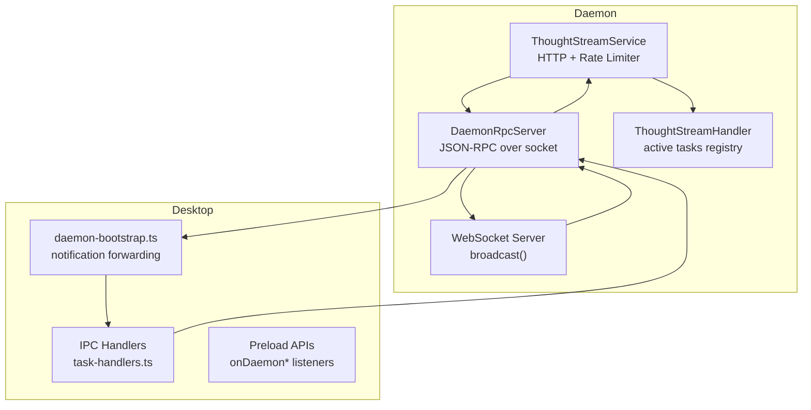
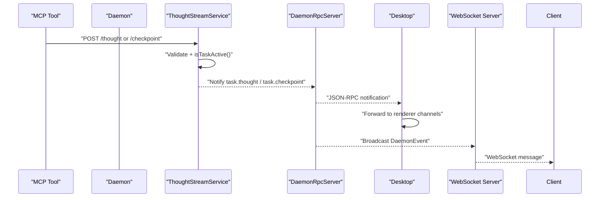
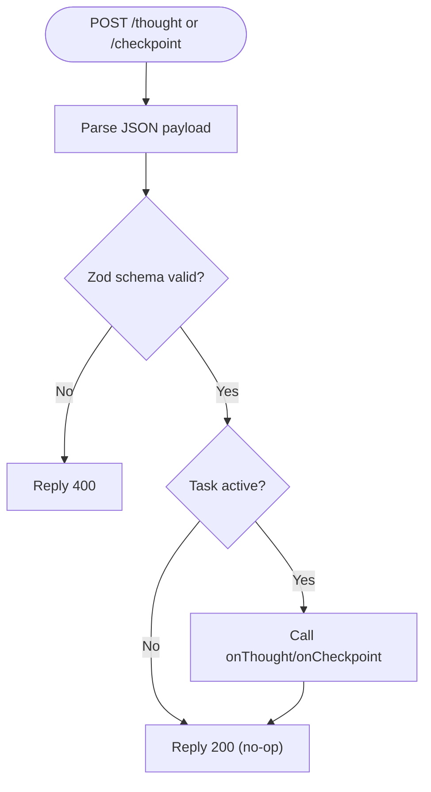
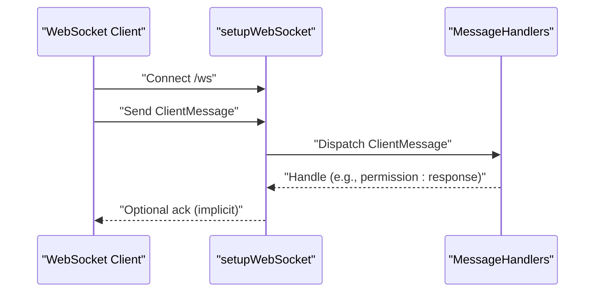
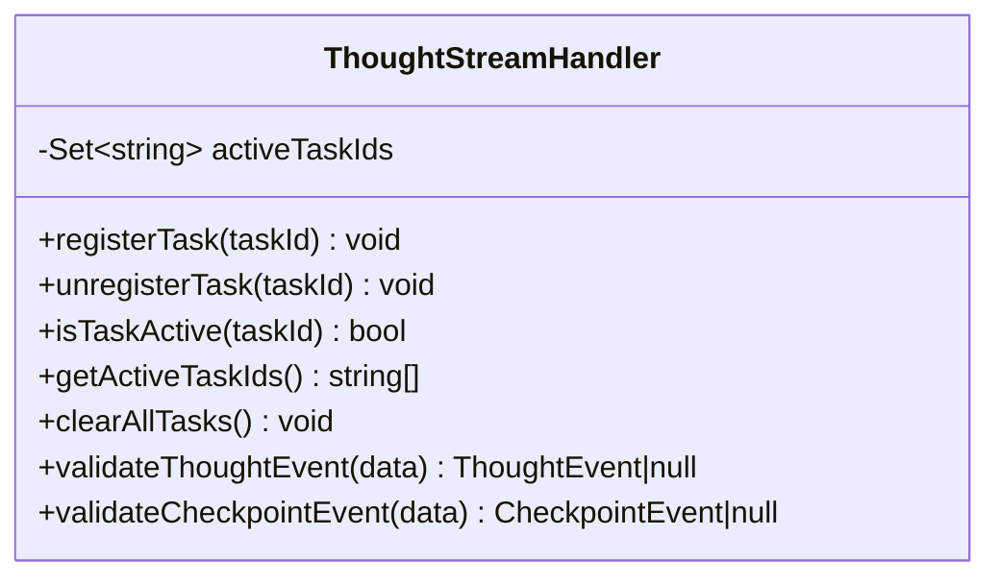
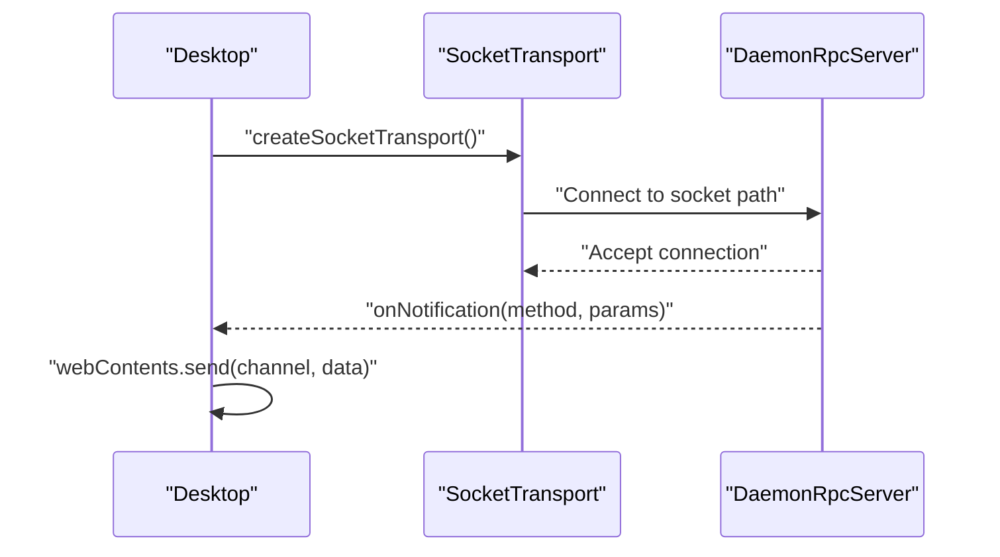
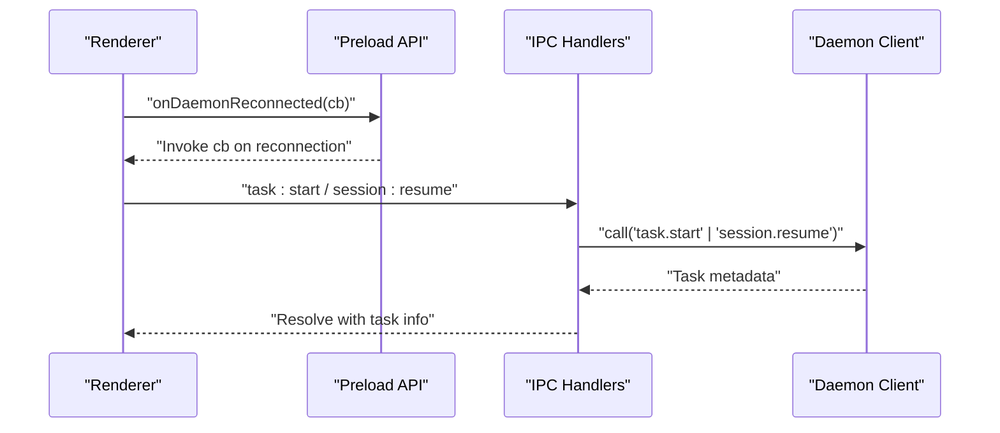
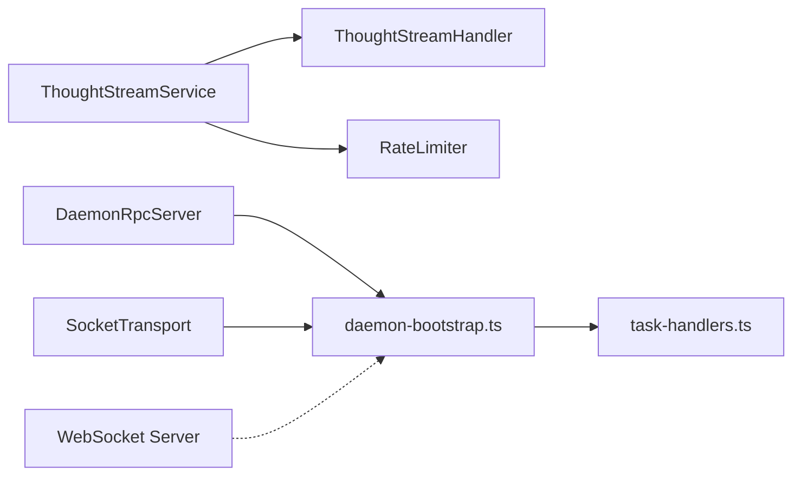

# Real-time Communication

<cite>
**Referenced Files in This Document**
- [thought-stream-service.ts](file://apps/daemon/src/thought-stream-service.ts)
- [websocket.ts](file://apps/daemon/src/websocket.ts)
- [thought-stream-handler.ts](file://packages/agent-core/src/services/thought-stream-handler.ts)
- [rpc-server.ts](file://packages/agent-core/src/daemon/rpc-server.ts)
- [socket-transport.ts](file://packages/agent-core/src/daemon/socket-transport.ts)
- [daemon-bootstrap.ts](file://apps/desktop/src/main/daemon-bootstrap.ts)
- [task-handlers.ts](file://apps/desktop/src/main/ipc/handlers/task-handlers.ts)
- [index.ts (preload)](file://apps/desktop/src/preload/index.ts)
</cite>

## Table of Contents

1. [Introduction](#introduction)
2. [Project Structure](#project-structure)
3. [Core Components](#core-components)
4. [Architecture Overview](#architecture-overview)
5. [Detailed Component Analysis](#detailed-component-analysis)
6. [Dependency Analysis](#dependency-analysis)
7. [Performance Considerations](#performance-considerations)
8. [Troubleshooting Guide](#troubleshooting-guide)
9. [Conclusion](#conclusion)

## Introduction

This document explains the real-time communication architecture that powers live updates during task execution. It covers the thought stream WebSocket service, the IPC-based event forwarding between the desktop UI and the daemon, and the event-driven notification pipeline. You will learn how the daemon exposes a WebSocket endpoint for real-time events, how the desktop registers notification handlers to receive updates, and how IPC handlers proxy user actions to the daemon while maintaining a single source of truth for task state.

## Project Structure

The real-time features span three layers:

- Daemon HTTP/WebSocket service for thought stream and task events
- Daemon RPC server and socket transport for IPC between desktop and daemon
- Desktop IPC handlers and preload APIs that subscribe to and forward notifications

**Diagram sources**

- [thought-stream-service.ts:33-131](file://apps/daemon/src/thought-stream-service.ts#L33-L131)
- [websocket.ts:26-90](file://apps/daemon/src/websocket.ts#L26-L90)
- [rpc-server.ts:33-164](file://packages/agent-core/src/daemon/rpc-server.ts#L33-L164)
- [socket-transport.ts:38-162](file://packages/agent-core/src/daemon/socket-transport.ts#L38-L162)
- [daemon-bootstrap.ts:108-200](file://apps/desktop/src/main/daemon-bootstrap.ts#L108-L200)
- [task-handlers.ts:27-230](file://apps/desktop/src/main/ipc/handlers/task-handlers.ts#L27-L230)
- [index.ts (preload):595-624](file://apps/desktop/src/preload/index.ts#L595-L624)

**Section sources**

- [thought-stream-service.ts:1-132](file://apps/daemon/src/thought-stream-service.ts#L1-L132)
- [websocket.ts:1-91](file://apps/daemon/src/websocket.ts#L1-L91)
- [rpc-server.ts:1-165](file://packages/agent-core/src/daemon/rpc-server.ts#L1-L165)
- [socket-transport.ts:1-163](file://packages/agent-core/src/daemon/socket-transport.ts#L1-L163)
- [daemon-bootstrap.ts:1-201](file://apps/desktop/src/main/daemon-bootstrap.ts#L1-L201)
- [task-handlers.ts:1-231](file://apps/desktop/src/main/ipc/handlers/task-handlers.ts#L1-L231)
- [index.ts (preload):595-624](file://apps/desktop/src/preload/index.ts#L595-L624)

## Core Components

- ThoughtStreamService: An HTTP service that accepts thought and checkpoint events for active tasks, validates them, and forwards them to registered handlers. It runs behind an authentication token and includes a rate limiter.
- WebSocket service: A WebSocket server that broadcasts daemon events to connected clients and handles client-to-daemon messages (e.g., permission responses).
- ThoughtStreamHandler: A reusable component that tracks active tasks and validates thought/checkpoint events.
- DaemonRpcServer and SocketTransport: A Unix socket (or Windows named pipe) JSON-RPC server and client transport enabling reliable IPC between desktop and daemon.
- Desktop notification forwarding: The desktop registers handlers to forward daemon notifications to the renderer process channels.
- IPC task handlers: Thin proxies that forward user actions to the daemon via RPC.

**Section sources**

- [thought-stream-service.ts:33-131](file://apps/daemon/src/thought-stream-service.ts#L33-L131)
- [websocket.ts:5-90](file://apps/daemon/src/websocket.ts#L5-L90)
- [thought-stream-handler.ts:15-132](file://packages/agent-core/src/services/thought-stream-handler.ts#L15-L132)
- [rpc-server.ts:33-164](file://packages/agent-core/src/daemon/rpc-server.ts#L33-L164)
- [socket-transport.ts:38-162](file://packages/agent-core/src/daemon/socket-transport.ts#L38-L162)
- [daemon-bootstrap.ts:108-200](file://apps/desktop/src/main/daemon-bootstrap.ts#L108-L200)
- [task-handlers.ts:27-230](file://apps/desktop/src/main/ipc/handlers/task-handlers.ts#L27-L230)

## Architecture Overview

The real-time pipeline combines HTTP thought stream ingestion, WebSocket broadcasting, and JSON-RPC IPC:

- Thought stream events are posted to the daemon’s HTTP endpoint and validated against active tasks.
- Daemon notifications (task progress, completion, errors, checkpoints, permissions) are pushed via the socket-based JSON-RPC server to the desktop.
- The desktop registers notification handlers and forwards them to the renderer via IPC channels.
- WebSocket clients can receive live updates and send client messages (e.g., permission responses).

**Diagram sources**

- [thought-stream-service.ts:67-122](file://apps/daemon/src/thought-stream-service.ts#L67-L122)
- [rpc-server.ts:78-87](file://packages/agent-core/src/daemon/rpc-server.ts#L78-L87)
- [daemon-bootstrap.ts:143-200](file://apps/desktop/src/main/daemon-bootstrap.ts#L143-L200)
- [websocket.ts:67-78](file://apps/daemon/src/websocket.ts#L67-L78)

## Detailed Component Analysis

### Thought Stream Service (HTTP)

- Purpose: Accept thought and checkpoint events for active tasks, validate payload shapes, and forward to registered handlers.
- Validation: Uses Zod schemas to validate thought and checkpoint payloads and ensures the task is active.
- Routing: Two HTTP endpoints:
  - POST /thought: Validates thought event and forwards to onThought.
  - POST /checkpoint: Validates checkpoint event and forwards to onCheckpoint.
- Security: Requires an authentication token and applies a per-minute rate limit.
- Lifecycle: Exposes start(fixedPort?) and close() to manage the HTTP server.

**Diagram sources**

- [thought-stream-service.ts:67-122](file://apps/daemon/src/thought-stream-service.ts#L67-L122)

**Section sources**

- [thought-stream-service.ts:15-131](file://apps/daemon/src/thought-stream-service.ts#L15-L131)

### WebSocket Service

- Purpose: Provide a WebSocket endpoint for live updates and client-to-daemon message exchange.
- Events: Defines a union of DaemonEvent types broadcast to all clients.
- Messages: Accepts ClientMessage payloads (e.g., permission responses) and dispatches them to registered handlers.
- Broadcasting: Sends a JSON-serialized event to all OPEN WebSocket clients.
- Client count: Provides a helper to inspect connected clients.

**Diagram sources**

- [websocket.ts:26-90](file://apps/daemon/src/websocket.ts#L26-L90)

**Section sources**

- [websocket.ts:5-90](file://apps/daemon/src/websocket.ts#L5-L90)

### ThoughtStreamHandler (Reusable)

- Purpose: Centralized logic to track active tasks and validate thought/checkpoint events.
- Operations:
  - registerTask(taskId)
  - unregisterTask(taskId)
  - isTaskActive(taskId)
  - validateThoughtEvent(data)
  - validateCheckpointEvent(data)

**Diagram sources**

- [thought-stream-handler.ts:15-132](file://packages/agent-core/src/services/thought-stream-handler.ts#L15-L132)

**Section sources**

- [thought-stream-handler.ts:15-132](file://packages/agent-core/src/services/thought-stream-handler.ts#L15-L132)

### Daemon RPC Server and Socket Transport

- RPC Server: JSON-RPC 2.0 over Unix socket (or Windows named pipe). Maintains connected clients, supports notifications, and handles stale sockets.
- Socket Transport: Client-side transport that connects to the daemon socket, parses newline-delimited JSON, and exposes send/onMessage/onDisconnect.
- Notification forwarding: The desktop registers notification handlers to forward daemon events to the renderer.

**Diagram sources**

- [rpc-server.ts:93-135](file://packages/agent-core/src/daemon/rpc-server.ts#L93-L135)
- [socket-transport.ts:38-162](file://packages/agent-core/src/daemon/socket-transport.ts#L38-L162)
- [daemon-bootstrap.ts:143-200](file://apps/desktop/src/main/daemon-bootstrap.ts#L143-L200)

**Section sources**

- [rpc-server.ts:33-164](file://packages/agent-core/src/daemon/rpc-server.ts#L33-L164)
- [socket-transport.ts:38-162](file://packages/agent-core/src/daemon/socket-transport.ts#L38-L162)
- [daemon-bootstrap.ts:108-200](file://apps/desktop/src/main/daemon-bootstrap.ts#L108-L200)

### Desktop Notification Forwarding and IPC

- Notification forwarding: The desktop registers handlers on the daemon client to forward notifications to renderer channels (e.g., task:progress, task:complete, task:checkpoint).
- IPC task handlers: Proxies user actions (task:start, task:cancel, task:interrupt, session:resume) to the daemon via RPC, ensuring a single source of truth for task state.
- Preload APIs: Provide daemon connection lifecycle listeners (disconnected/reconnected/reconnect-failed) for UI updates.

**Diagram sources**

- [index.ts (preload):595-624](file://apps/desktop/src/preload/index.ts#L595-L624)
- [task-handlers.ts:32-77](file://apps/desktop/src/main/ipc/handlers/task-handlers.ts#L32-L77)
- [daemon-bootstrap.ts:143-200](file://apps/desktop/src/main/daemon-bootstrap.ts#L143-L200)

**Section sources**

- [daemon-bootstrap.ts:108-200](file://apps/desktop/src/main/daemon-bootstrap.ts#L108-L200)
- [task-handlers.ts:27-230](file://apps/desktop/src/main/ipc/handlers/task-handlers.ts#L27-L230)
- [index.ts (preload):595-624](file://apps/desktop/src/preload/index.ts#L595-L624)

## Dependency Analysis

- ThoughtStreamService depends on ThoughtStreamHandler for active task checks and Zod schemas for validation.
- DaemonRpcServer and SocketTransport form the IPC backbone; the desktop registers notification handlers on the daemon client.
- WebSocket service is independent but complementary to RPC; it can broadcast live events to external clients.
- IPC handlers depend on the daemon client to enforce a single source of truth for task state.

**Diagram sources**

- [thought-stream-service.ts:33-131](file://apps/daemon/src/thought-stream-service.ts#L33-L131)
- [thought-stream-handler.ts:15-132](file://packages/agent-core/src/services/thought-stream-handler.ts#L15-L132)
- [rpc-server.ts:33-164](file://packages/agent-core/src/daemon/rpc-server.ts#L33-L164)
- [socket-transport.ts:38-162](file://packages/agent-core/src/daemon/socket-transport.ts#L38-L162)
- [daemon-bootstrap.ts:108-200](file://apps/desktop/src/main/daemon-bootstrap.ts#L108-L200)
- [websocket.ts:26-90](file://apps/daemon/src/websocket.ts#L26-L90)

**Section sources**

- [thought-stream-service.ts:33-131](file://apps/daemon/src/thought-stream-service.ts#L33-L131)
- [rpc-server.ts:33-164](file://packages/agent-core/src/daemon/rpc-server.ts#L33-L164)
- [socket-transport.ts:38-162](file://packages/agent-core/src/daemon/socket-transport.ts#L38-L162)
- [daemon-bootstrap.ts:108-200](file://apps/desktop/src/main/daemon-bootstrap.ts#L108-L200)
- [websocket.ts:26-90](file://apps/daemon/src/websocket.ts#L26-L90)

## Performance Considerations

- HTTP rate limiting: The thought stream service applies a per-minute rate limit to mitigate abuse and protect the daemon under load.
- Buffer limits: SocketTransport enforces a maximum buffer size to prevent memory exhaustion from large payloads.
- Minimal parsing overhead: WebSocket message parsing is lightweight and guarded against malformed payloads.
- Single source of truth: IPC handlers proxy all task operations to the daemon, avoiding redundant state and reducing CPU overhead from UI-only updates.
- Backpressure: WebSocket broadcast sends only to OPEN clients; consider throttling if many clients are present.

[No sources needed since this section provides general guidance]

## Troubleshooting Guide

Common issues and remedies:

- Authentication failures for thought stream endpoints:
  - Ensure the HTTP request includes the required authentication token.
  - Verify the daemon started with the correct token and that the port is reachable.
  - Check rate limiter thresholds if receiving frequent 429-like behavior indirectly.
- No real-time updates in the UI:
  - Confirm the desktop has registered notification handlers and is connected to the daemon via socket.
  - Verify that the daemon is emitting notifications and that the desktop forwards them to renderer channels.
- WebSocket connection problems:
  - Validate the WebSocket path (/ws) and that the server is running.
  - Inspect client message shapes; the server ignores invalid JSON or missing type fields.
- IPC handler errors:
  - Review normalized error logs emitted by IPC handlers.
  - Ensure the daemon is reachable and responsive to RPC calls.
- Debugging connection lifecycle:
  - Use preload listeners for daemon disconnection/reconnection events to update UI status.

**Section sources**

- [thought-stream-service.ts:67-122](file://apps/daemon/src/thought-stream-service.ts#L67-L122)
- [rpc-server.ts:78-87](file://packages/agent-core/src/daemon/rpc-server.ts#L78-L87)
- [socket-transport.ts:79-111](file://packages/agent-core/src/daemon/socket-transport.ts#L79-L111)
- [websocket.ts:32-56](file://apps/daemon/src/websocket.ts#L32-L56)
- [task-handlers.ts:32-77](file://apps/desktop/src/main/ipc/handlers/task-handlers.ts#L32-L77)
- [index.ts (preload):595-624](file://apps/desktop/src/preload/index.ts#L595-L624)

## Conclusion

The real-time communication stack integrates a thought stream HTTP service, a WebSocket broadcast channel, and a robust socket-based JSON-RPC IPC layer. Thought stream events are validated and forwarded only for active tasks, while daemon notifications are reliably delivered to the desktop and then to the UI. IPC handlers maintain a single source of truth for task state, ensuring consistency and predictable behavior. Together, these components deliver responsive, resilient real-time feedback during task execution.
