# Storage and Data Management

<cite>
**Referenced Files in This Document**
- [storage/index.ts](file://packages/agent-core/src/storage/index.ts)
- [storage/database.ts](file://packages/agent-core/src/storage/database.ts)
- [storage/migrations/index.ts](file://packages/agent-core/src/storage/migrations/index.ts)
- [storage/migrations/v001-initial.ts](file://packages/agent-core/src/storage/migrations/v001-initial.ts)
- [storage/migrations/v009-favorites.ts](file://packages/agent-core/src/storage/migrations/v009-favorites.ts)
- [storage/migrations/v011-workspace-tasks.ts](file://packages/agent-core/src/storage/migrations/v011-workspace-tasks.ts)
- [storage/repositories/taskHistory.ts](file://packages/agent-core/src/storage/repositories/taskHistory.ts)
- [storage/repositories/workspaces.ts](file://packages/agent-core/src/storage/repositories/workspaces.ts)
- [storage/repositories/appSettings.ts](file://packages/agent-core/src/storage/repositories/appSettings.ts)
- [storage/repositories/ui-settings.ts](file://packages/agent-core/src/storage/repositories/ui-settings.ts)
- [storage/repositories/favorites.ts](file://packages/agent-core/src/storage/repositories/favorites.ts)
- [storage/repositories/task-row-mapper.ts](file://packages/agent-core/src/storage/repositories/task-row-mapper.ts)
- [storage/workspace-meta-db.ts](file://packages/agent-core/src/storage/workspace-meta-db.ts)
- [storage/secure-storage.ts](file://packages/agent-core/src/storage/secure-storage.ts)
</cite>

## Table of Contents

1. [Introduction](#introduction)
2. [Project Structure](#project-structure)
3. [Core Components](#core-components)
4. [Architecture Overview](#architecture-overview)
5. [Detailed Component Analysis](#detailed-component-analysis)
6. [Dependency Analysis](#dependency-analysis)
7. [Performance Considerations](#performance-considerations)
8. [Troubleshooting Guide](#troubleshooting-guide)
9. [Conclusion](#conclusion)
10. [Appendices](#appendices)

## Introduction

This document explains the SQLite-based data persistence system and repository pattern implementation used by the application. It covers the database architecture, schema design, and the migration system that maintains data integrity across application versions. It documents the data repositories for task history, workspaces, user settings, and favorites, along with data access patterns, caching strategies, and performance considerations. Practical examples demonstrate data operations, backup procedures, and troubleshooting. The document also clarifies the relationship between local storage and user preferences, outlines data lifecycle and retention, and provides guidance on database maintenance and optimization.

## Project Structure

The storage subsystem resides under packages/agent-core/src/storage and is organized around:

- A central database initializer and lifecycle manager
- A robust migration system that evolves the schema over time
- A repository pattern that encapsulates data access for domain entities
- A dedicated workspace metadata database for workspace management
- Secure storage for sensitive credentials

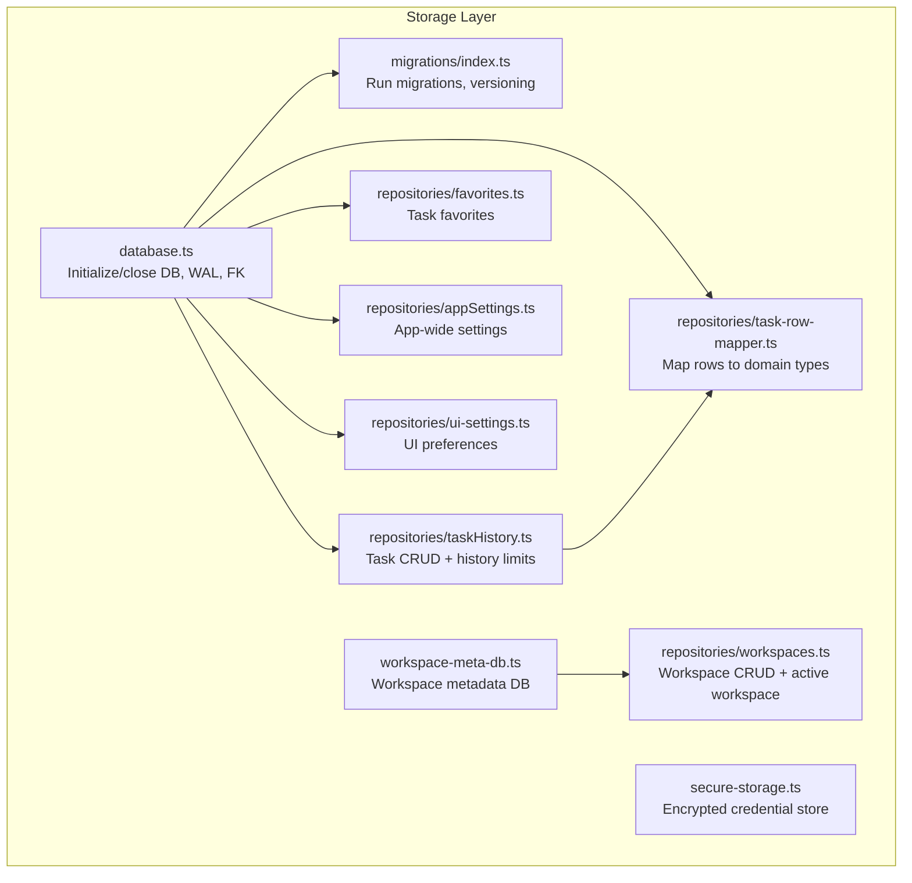

**Diagram sources**

- [storage/database.ts:1-97](file://packages/agent-core/src/storage/database.ts#L1-L97)
- [storage/migrations/index.ts:1-132](file://packages/agent-core/src/storage/migrations/index.ts#L1-L132)
- [storage/repositories/taskHistory.ts:1-191](file://packages/agent-core/src/storage/repositories/taskHistory.ts#L1-L191)
- [storage/repositories/workspaces.ts:1-131](file://packages/agent-core/src/storage/repositories/workspaces.ts#L1-L131)
- [storage/repositories/favorites.ts:1-45](file://packages/agent-core/src/storage/repositories/favorites.ts#L1-L45)
- [storage/repositories/appSettings.ts:1-191](file://packages/agent-core/src/storage/repositories/appSettings.ts#L1-L191)
- [storage/repositories/ui-settings.ts:1-84](file://packages/agent-core/src/storage/repositories/ui-settings.ts#L1-L84)
- [storage/repositories/task-row-mapper.ts:1-124](file://packages/agent-core/src/storage/repositories/task-row-mapper.ts#L1-L124)
- [storage/workspace-meta-db.ts:1-94](file://packages/agent-core/src/storage/workspace-meta-db.ts#L1-L94)
- [storage/secure-storage.ts:1-278](file://packages/agent-core/src/storage/secure-storage.ts#L1-L278)

**Section sources**

- [storage/index.ts:1-118](file://packages/agent-core/src/storage/index.ts#L1-L118)
- [storage/database.ts:1-97](file://packages/agent-core/src/storage/database.ts#L1-L97)
- [storage/migrations/index.ts:1-132](file://packages/agent-core/src/storage/migrations/index.ts#L1-L132)
- [storage/workspace-meta-db.ts:1-94](file://packages/agent-core/src/storage/workspace-meta-db.ts#L1-L94)

## Core Components

- Central database initializer and lifecycle:
  - Initializes SQLite with Write-Ahead Logging (WAL) and foreign keys enabled
  - Runs migrations automatically during initialization
  - Provides reset and backup routines for corrupted databases
- Migration system:
  - Versioned migrations with up/down support
  - Stores current schema version in a dedicated meta table
  - Enforces forward-only upgrades and detects future schema versions
- Repository pattern:
  - Encapsulates data access per domain entity (tasks, workspaces, favorites, app settings)
  - Uses transactions for atomic writes and maintains referential integrity
  - Applies retention policies (e.g., history limits) at the repository level
- Workspace metadata database:
  - Separate SQLite database for workspace definitions and active workspace selection
  - Ensures workspace-related metadata is isolated from task history
- Secure storage:
  - AES-256-GCM encryption using machine-derived keys
  - Atomic writes and salted key derivation
  - Manages API keys and arbitrary secret values

**Section sources**

- [storage/database.ts:1-97](file://packages/agent-core/src/storage/database.ts#L1-L97)
- [storage/migrations/index.ts:1-132](file://packages/agent-core/src/storage/migrations/index.ts#L1-L132)
- [storage/repositories/taskHistory.ts:1-191](file://packages/agent-core/src/storage/repositories/taskHistory.ts#L1-L191)
- [storage/repositories/workspaces.ts:1-131](file://packages/agent-core/src/storage/repositories/workspaces.ts#L1-L131)
- [storage/repositories/favorites.ts:1-45](file://packages/agent-core/src/storage/repositories/favorites.ts#L1-L45)
- [storage/repositories/appSettings.ts:1-191](file://packages/agent-core/src/storage/repositories/appSettings.ts#L1-L191)
- [storage/repositories/ui-settings.ts:1-84](file://packages/agent-core/src/storage/repositories/ui-settings.ts#L1-L84)
- [storage/workspace-meta-db.ts:1-94](file://packages/agent-core/src/storage/workspace-meta-db.ts#L1-L94)
- [storage/secure-storage.ts:1-278](file://packages/agent-core/src/storage/secure-storage.ts#L1-L278)

## Architecture Overview

The storage architecture separates concerns across:

- Application settings and UI preferences persisted in the main database
- Task history and related messages/attachments persisted in the main database
- Workspace definitions and active workspace persisted in a separate workspace metadata database
- Sensitive credentials persisted in an encrypted file-backed store

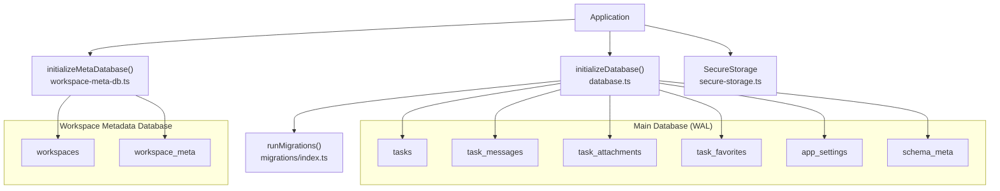

**Diagram sources**

- [storage/database.ts:1-97](file://packages/agent-core/src/storage/database.ts#L1-L97)
- [storage/migrations/index.ts:1-132](file://packages/agent-core/src/storage/migrations/index.ts#L1-L132)
- [storage/migrations/v001-initial.ts:1-88](file://packages/agent-core/src/storage/migrations/v001-initial.ts#L1-L88)
- [storage/migrations/v009-favorites.ts:1-18](file://packages/agent-core/src/storage/migrations/v009-favorites.ts#L1-L18)
- [storage/migrations/v011-workspace-tasks.ts:1-18](file://packages/agent-core/src/storage/migrations/v011-workspace-tasks.ts#L1-L18)
- [storage/workspace-meta-db.ts:1-94](file://packages/agent-core/src/storage/workspace-meta-db.ts#L1-L94)
- [storage/secure-storage.ts:1-278](file://packages/agent-core/src/storage/secure-storage.ts#L1-L278)

## Detailed Component Analysis

### Database Initialization and Lifecycle

- Opens a SQLite database and sets pragmas for performance and integrity
- Runs migrations automatically unless disabled
- Exposes resetDatabase to move corrupted files and remove WAL/SHM artifacts
- Provides isDatabaseInitialized and getDatabasePath for introspection

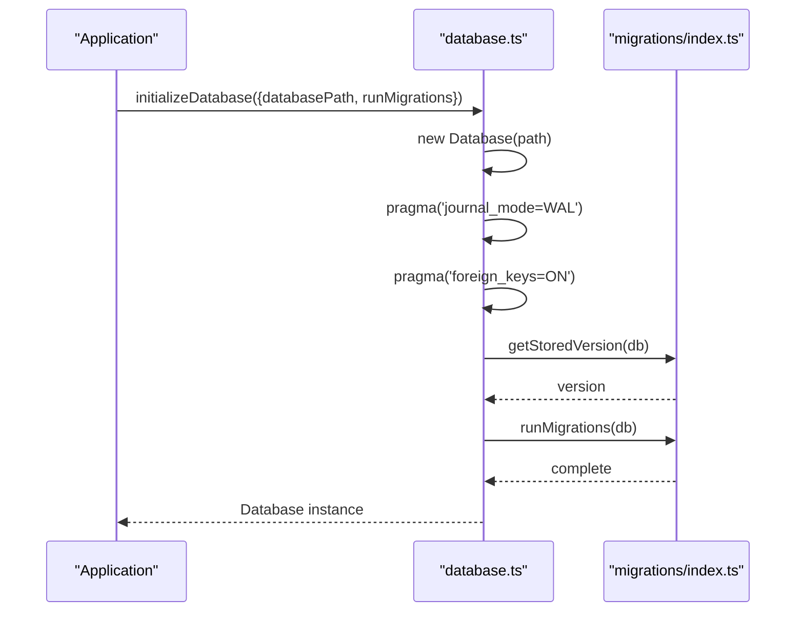

**Diagram sources**

- [storage/database.ts:24-56](file://packages/agent-core/src/storage/database.ts#L24-L56)
- [storage/migrations/index.ts:95-129](file://packages/agent-core/src/storage/migrations/index.ts#L95-L129)

**Section sources**

- [storage/database.ts:1-97](file://packages/agent-core/src/storage/database.ts#L1-L97)

### Migration System

- Maintains a sorted list of migrations and registers new ones dynamically
- Tracks schema version in schema_meta
- Executes migrations inside transactions and updates version atomically
- Throws explicit errors for future schema versions or migration failures

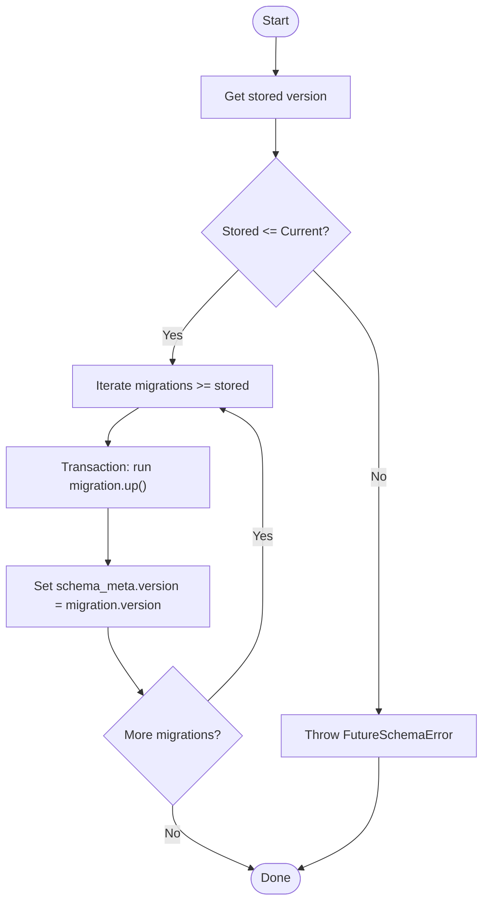

**Diagram sources**

- [storage/migrations/index.ts:68-129](file://packages/agent-core/src/storage/migrations/index.ts#L68-L129)

**Section sources**

- [storage/migrations/index.ts:1-132](file://packages/agent-core/src/storage/migrations/index.ts#L1-L132)
- [storage/migrations/v001-initial.ts:1-88](file://packages/agent-core/src/storage/migrations/v001-initial.ts#L1-L88)

### Schema Design and Evolution

- Initial schema includes schema_meta, app_settings, provider_meta, providers, tasks, task_messages, task_attachments, and supporting indexes
- Favorites table introduced in a later migration
- Workspace tasks feature adds workspace_id to tasks and an index for efficient filtering

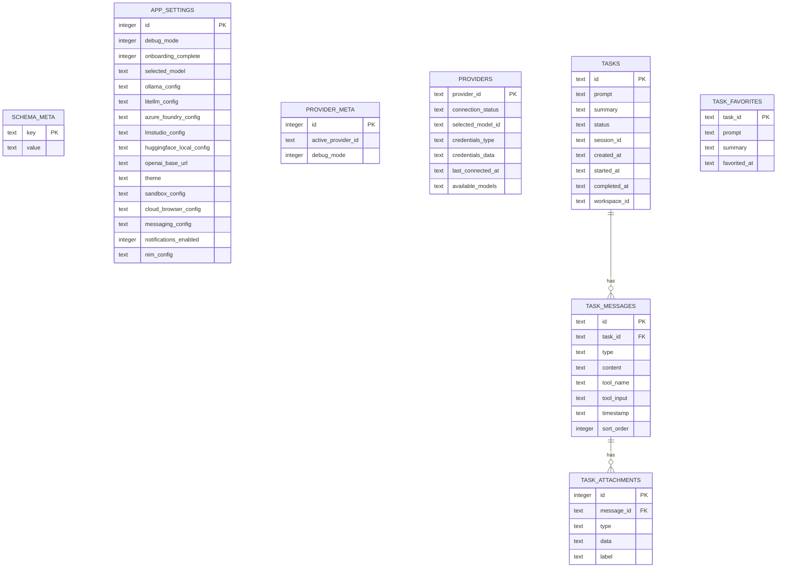

**Diagram sources**

- [storage/migrations/v001-initial.ts:7-86](file://packages/agent-core/src/storage/migrations/v001-initial.ts#L7-L86)
- [storage/migrations/v009-favorites.ts:7-16](file://packages/agent-core/src/storage/migrations/v009-favorites.ts#L7-L16)
- [storage/migrations/v011-workspace-tasks.ts:6-16](file://packages/agent-core/src/storage/migrations/v011-workspace-tasks.ts#L6-L16)

**Section sources**

- [storage/migrations/v001-initial.ts:1-88](file://packages/agent-core/src/storage/migrations/v001-initial.ts#L1-L88)
- [storage/migrations/v009-favorites.ts:1-18](file://packages/agent-core/src/storage/migrations/v009-favorites.ts#L1-L18)
- [storage/migrations/v011-workspace-tasks.ts:1-18](file://packages/agent-core/src/storage/migrations/v011-workspace-tasks.ts#L1-L18)

### Data Repositories

#### Task History Repository

- Retrieves paginated task history with optional workspace scoping
- Persists tasks and associated messages/attachments in a single transaction
- Enforces a maximum number of history items per workspace or globally
- Updates status, session ID, and summary; supports clearing history and deleting individual tasks

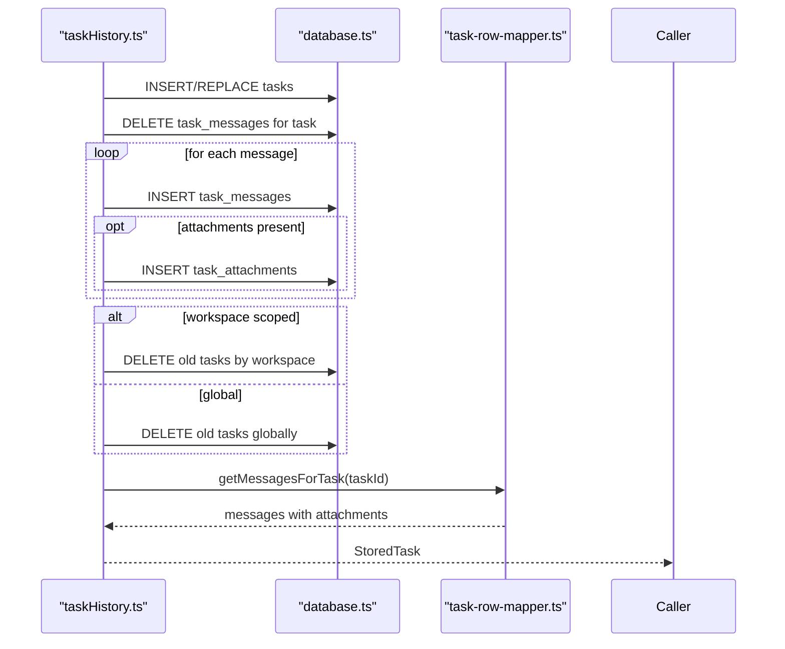

**Diagram sources**

- [storage/repositories/taskHistory.ts:39-111](file://packages/agent-core/src/storage/repositories/taskHistory.ts#L39-L111)
- [storage/repositories/task-row-mapper.ts:46-109](file://packages/agent-core/src/storage/repositories/task-row-mapper.ts#L46-L109)

**Section sources**

- [storage/repositories/taskHistory.ts:1-191](file://packages/agent-core/src/storage/repositories/taskHistory.ts#L1-L191)
- [storage/repositories/task-row-mapper.ts:1-124](file://packages/agent-core/src/storage/repositories/task-row-mapper.ts#L1-L124)

#### Workspaces Repository

- Manages workspace definitions, ordering, and default workspace
- Tracks the active workspace in the workspace metadata database
- Prevents deletion of the default workspace
- Creates default workspace if none exists

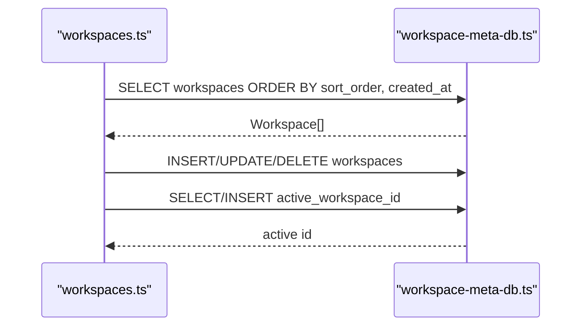

**Diagram sources**

- [storage/repositories/workspaces.ts:25-130](file://packages/agent-core/src/storage/repositories/workspaces.ts#L25-L130)
- [storage/workspace-meta-db.ts:39-71](file://packages/agent-core/src/storage/workspace-meta-db.ts#L39-L71)

**Section sources**

- [storage/repositories/workspaces.ts:1-131](file://packages/agent-core/src/storage/repositories/workspaces.ts#L1-L131)
- [storage/workspace-meta-db.ts:1-94](file://packages/agent-core/src/storage/workspace-meta-db.ts#L1-L94)

#### Favorites Repository

- Adds/removes favorites with timestamps
- Lists favorites ordered by recency
- Checks membership efficiently

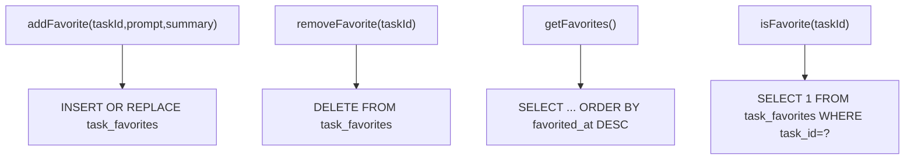

**Diagram sources**

- [storage/repositories/favorites.ts:4-44](file://packages/agent-core/src/storage/repositories/favorites.ts#L4-L44)

**Section sources**

- [storage/repositories/favorites.ts:1-45](file://packages/agent-core/src/storage/repositories/favorites.ts#L1-L45)

#### App Settings and UI Settings Repositories

- App settings repository reads/writes provider configs, theme, sandbox/cloud browser/messaging configs, and notification preferences
- UI settings repository manages debug mode, onboarding completion, theme, notifications, and close behavior
- Both use a singleton row pattern (id=1) for app_settings

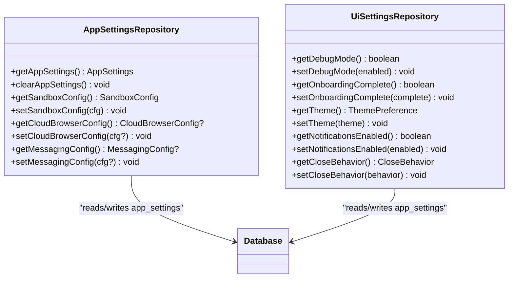

**Diagram sources**

- [storage/repositories/appSettings.ts:149-190](file://packages/agent-core/src/storage/repositories/appSettings.ts#L149-L190)
- [storage/repositories/ui-settings.ts:12-83](file://packages/agent-core/src/storage/repositories/ui-settings.ts#L12-L83)

**Section sources**

- [storage/repositories/appSettings.ts:1-191](file://packages/agent-core/src/storage/repositories/appSettings.ts#L1-L191)
- [storage/repositories/ui-settings.ts:1-84](file://packages/agent-core/src/storage/repositories/ui-settings.ts#L1-L84)

### Data Access Patterns and Caching Strategies

- Transactional writes: All repository writes that touch multiple tables are wrapped in a single transaction to maintain consistency
- Single-pass retrieval: The task row mapper fetches all message rows and then bulk-fetches attachments to avoid N+1 queries
- Indexes: Created on frequently queried columns (e.g., tasks.created_at, task_messages.task_id, task_favorites.favorited_at) to improve read performance
- Retention: Task history is pruned to a fixed maximum count per workspace or globally during save operations
- No in-memory cache: Reads go directly to SQLite; writes are immediate and durable via WAL

**Section sources**

- [storage/repositories/taskHistory.ts:39-111](file://packages/agent-core/src/storage/repositories/taskHistory.ts#L39-L111)
- [storage/repositories/task-row-mapper.ts:46-109](file://packages/agent-core/src/storage/repositories/task-row-mapper.ts#L46-L109)
- [storage/migrations/v001-initial.ts:81-82](file://packages/agent-core/src/storage/migrations/v001-initial.ts#L81-L82)
- [storage/migrations/v009-favorites.ts:15-15](file://packages/agent-core/src/storage/migrations/v009-favorites.ts#L15-L15)

### Relationship Between Local Storage and User Preferences

- App settings and UI preferences are stored in the same main database under app_settings
- UI settings include theme, debug mode, onboarding completion, notifications, and close behavior
- Provider settings (selected model, provider-specific configs) are embedded JSON fields in app_settings
- These preferences influence runtime behavior and UI rendering

**Section sources**

- [storage/repositories/appSettings.ts:149-190](file://packages/agent-core/src/storage/repositories/appSettings.ts#L149-L190)
- [storage/repositories/ui-settings.ts:21-83](file://packages/agent-core/src/storage/repositories/ui-settings.ts#L21-L83)

### Data Lifecycle, Retention Policies, and Archival Rules

- Task history retention:
  - Maximum number of recent items enforced per workspace and globally
  - Older items are deleted during save operations to keep the dataset bounded
- Favorites:
  - Ordered by recency; no automatic pruning is performed in the repository
- Workspaces:
  - Default workspace is ensured; non-default workspaces can be deleted
  - Active workspace is tracked separately in the workspace metadata database
- Provider and sandbox configurations:
  - Stored as JSON blobs; no automatic cleanup policy is defined in the repository

**Section sources**

- [storage/repositories/taskHistory.ts:14-111](file://packages/agent-core/src/storage/repositories/taskHistory.ts#L14-L111)
- [storage/repositories/workspaces.ts:67-130](file://packages/agent-core/src/storage/repositories/workspaces.ts#L67-L130)
- [storage/repositories/favorites.ts:18-44](file://packages/agent-core/src/storage/repositories/favorites.ts#L18-L44)

### Secure Storage for Credentials

- AES-256-GCM encryption with PBKDF2-derived keys from machine identifiers
- Atomic file writes using temporary files followed by rename to prevent corruption
- Supports storing and retrieving API keys per provider and arbitrary key-value pairs
- Provides listing and clearing capabilities

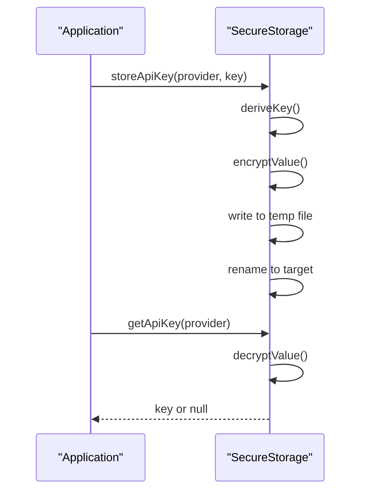

**Diagram sources**

- [storage/secure-storage.ts:148-162](file://packages/agent-core/src/storage/secure-storage.ts#L148-L162)
- [storage/secure-storage.ts:57-82](file://packages/agent-core/src/storage/secure-storage.ts#L57-L82)

**Section sources**

- [storage/secure-storage.ts:1-278](file://packages/agent-core/src/storage/secure-storage.ts#L1-L278)

## Dependency Analysis

- Repositories depend on the main database connection and the task row mapper for domain conversions
- The workspace repository depends on the workspace metadata database
- Migrations depend on the main database and define schema evolution
- Secure storage is independent and does not rely on the main database

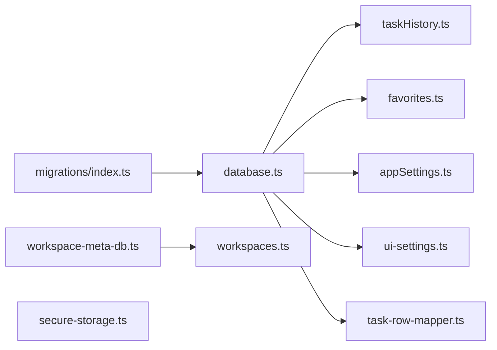

**Diagram sources**

- [storage/database.ts:1-97](file://packages/agent-core/src/storage/database.ts#L1-L97)
- [storage/repositories/taskHistory.ts:1-191](file://packages/agent-core/src/storage/repositories/taskHistory.ts#L1-L191)
- [storage/repositories/favorites.ts:1-45](file://packages/agent-core/src/storage/repositories/favorites.ts#L1-L45)
- [storage/repositories/appSettings.ts:1-191](file://packages/agent-core/src/storage/repositories/appSettings.ts#L1-L191)
- [storage/repositories/ui-settings.ts:1-84](file://packages/agent-core/src/storage/repositories/ui-settings.ts#L1-L84)
- [storage/repositories/task-row-mapper.ts:1-124](file://packages/agent-core/src/storage/repositories/task-row-mapper.ts#L1-L124)
- [storage/workspace-meta-db.ts:1-94](file://packages/agent-core/src/storage/workspace-meta-db.ts#L1-L94)
- [storage/migrations/index.ts:1-132](file://packages/agent-core/src/storage/migrations/index.ts#L1-L132)
- [storage/secure-storage.ts:1-278](file://packages/agent-core/src/storage/secure-storage.ts#L1-L278)

**Section sources**

- [storage/index.ts:1-118](file://packages/agent-core/src/storage/index.ts#L1-L118)

## Performance Considerations

- WAL mode improves concurrent reads and reduces writer stalls
- Foreign keys enable referential integrity at the database level
- Indexes on frequently filtered/sorted columns reduce query cost
- Bulk attachment loading minimizes round trips
- Transactions batch related writes for atomicity and efficiency
- Consider adding indexes for workspace-scoped queries if workload grows

[No sources needed since this section provides general guidance]

## Troubleshooting Guide

- Database not initialized:
  - Ensure initializeDatabase is called before accessing repositories
- Migration errors:
  - Run migrations again; if a future schema is detected, update the application or restore a compatible database
- Corrupted database:
  - Use resetDatabase to back up the current file and remove WAL/SHM artifacts; reinitialize the database
- Workspace metadata issues:
  - Verify workspace meta database path and ensure initializeMetaDatabase is called before workspace operations
- Secure storage failures:
  - Confirm file permissions and that the storage path exists; atomic writes protect against partial writes

**Section sources**

- [storage/database.ts:17-22](file://packages/agent-core/src/storage/database.ts#L17-L22)
- [storage/database.ts:79-96](file://packages/agent-core/src/storage/database.ts#L79-L96)
- [storage/workspace-meta-db.ts:39-71](file://packages/agent-core/src/storage/workspace-meta-db.ts#L39-L71)
- [storage/secure-storage.ts:57-82](file://packages/agent-core/src/storage/secure-storage.ts#L57-L82)

## Conclusion

The storage subsystem combines SQLite with a robust migration system, a clear repository pattern, and a separate workspace metadata database. It ensures data integrity through WAL, foreign keys, and transactional writes, while offering practical retention and preference management. Secure storage protects sensitive credentials with encryption and atomic writes. Together, these components provide a reliable foundation for task history, workspace management, user preferences, and secure credential handling.

[No sources needed since this section summarizes without analyzing specific files]

## Appendices

### Practical Examples

- Initialize and migrate the database
  - Call initializeDatabase with the desired path; migrations run automatically
  - Reference: [storage/database.ts:24-56](file://packages/agent-core/src/storage/database.ts#L24-L56), [storage/migrations/index.ts:95-129](file://packages/agent-core/src/storage/migrations/index.ts#L95-L129)

- Save a task with messages and attachments
  - Use saveTask; it inserts the task, replaces messages, inserts attachments, and prunes history
  - Reference: [storage/repositories/taskHistory.ts:39-111](file://packages/agent-core/src/storage/repositories/taskHistory.ts#L39-L111)

- Retrieve task messages efficiently
  - Use getMessagesForTask; it loads messages and attachments in a single optimized query
  - Reference: [storage/repositories/task-row-mapper.ts:46-109](file://packages/agent-core/src/storage/repositories/task-row-mapper.ts#L46-L109)

- Manage favorites
  - Add/remove favorites and list them ordered by recency
  - Reference: [storage/repositories/favorites.ts:4-44](file://packages/agent-core/src/storage/repositories/favorites.ts#L4-L44)

- Configure UI preferences
  - Toggle debug mode, set theme, manage notifications, and close behavior
  - Reference: [storage/repositories/ui-settings.ts:23-83](file://packages/agent-core/src/storage/repositories/ui-settings.ts#L23-L83)

- Workspace management
  - List/create/update/delete workspaces; track the active workspace
  - Reference: [storage/repositories/workspaces.ts:25-130](file://packages/agent-core/src/storage/repositories/workspaces.ts#L25-L130), [storage/workspace-meta-db.ts:39-71](file://packages/agent-core/src/storage/workspace-meta-db.ts#L39-L71)

- Backup and reset corrupted database
  - Use databaseExists to check presence, resetDatabase to back up and clean WAL/SHM
  - Reference: [storage/database.ts:79-96](file://packages/agent-core/src/storage/database.ts#L79-L96)

- Store and retrieve encrypted credentials
  - Use SecureStorage to store API keys per provider and read them back
  - Reference: [storage/secure-storage.ts:148-162](file://packages/agent-core/src/storage/secure-storage.ts#L148-L162), [storage/secure-storage.ts:57-82](file://packages/agent-core/src/storage/secure-storage.ts#L57-L82)
