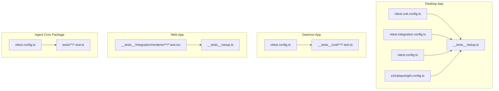
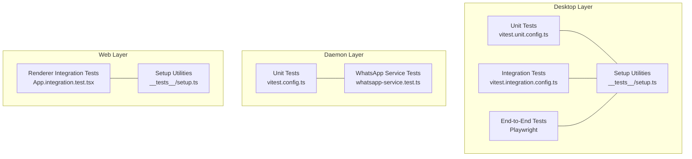
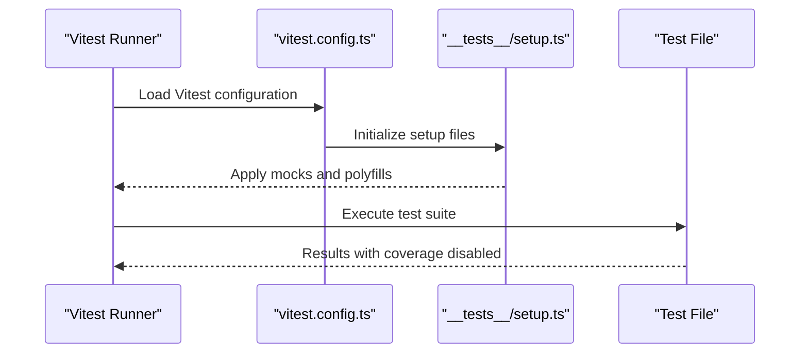
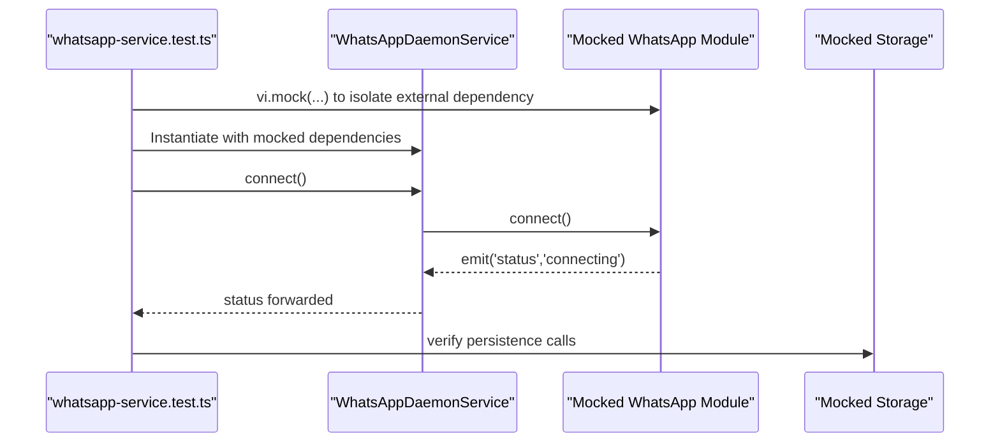
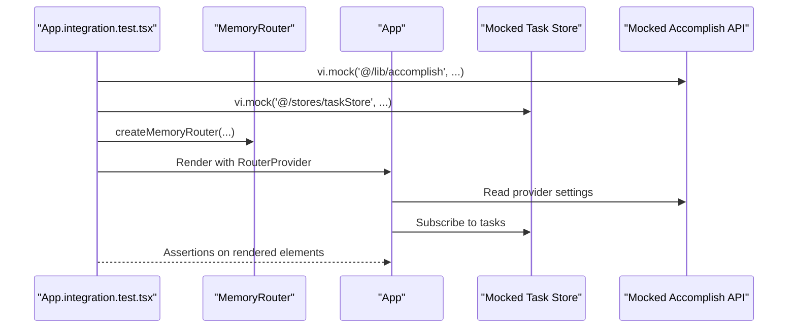
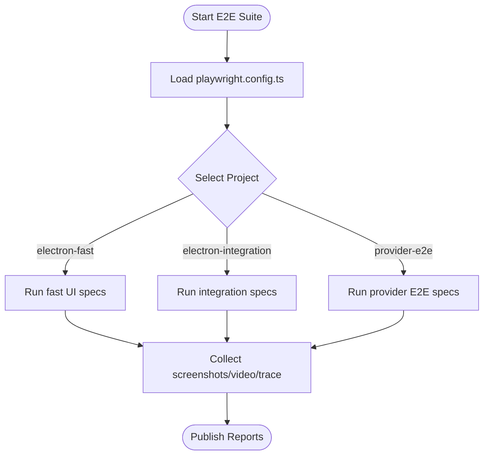
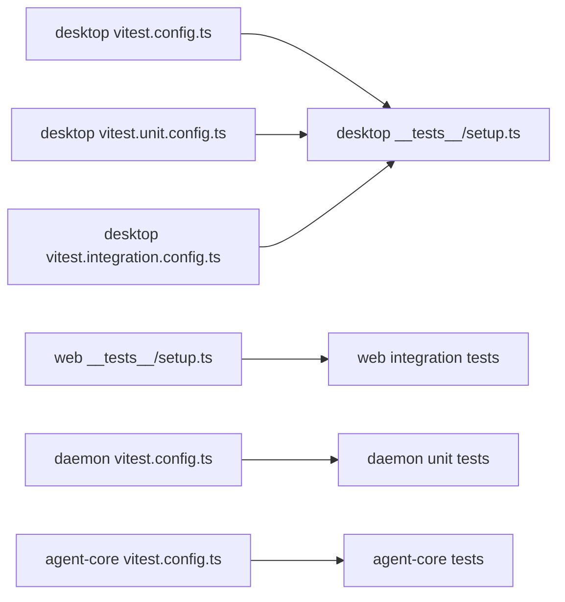

# Testing Strategy

<cite>
**Referenced Files in This Document**
- [apps/desktop/vitest.config.ts](file://apps/desktop/vitest.config.ts)
- [apps/desktop/vitest.unit.config.ts](file://apps/desktop/vitest.unit.config.ts)
- [apps/desktop/vitest.integration.config.ts](file://apps/desktop/vitest.integration.config.ts)
- [apps/desktop/__tests__/setup.ts](file://apps/desktop/__tests__/setup.ts)
- [apps/web/__tests__/setup.ts](file://apps/web/__tests__/setup.ts)
- [apps/web/__tests__/integration/renderer/App.integration.test.tsx](file://apps/web/__tests__/integration/renderer/App.integration.test.tsx)
- [apps/daemon/__tests__/unit/whatsapp/whatsapp-service.test.ts](file://apps/daemon/__tests__/unit/whatsapp/whatsapp-service.test.ts)
- [apps/daemon/vitest.config.ts](file://apps/daemon/vitest.config.ts)
- [packages/agent-core/vitest.config.ts](file://packages/agent-core/vitest.config.ts)
- [apps/desktop/e2e/playwright.config.ts](file://apps/desktop/e2e/playwright.config.ts)
- [.github/workflows/release.yml](file://.github/workflows/release.yml)
</cite>

## Table of Contents

1. [Introduction](#introduction)
2. [Project Structure](#project-structure)
3. [Core Components](#core-components)
4. [Architecture Overview](#architecture-overview)
5. [Detailed Component Analysis](#detailed-component-analysis)
6. [Dependency Analysis](#dependency-analysis)
7. [Performance Considerations](#performance-considerations)
8. [Troubleshooting Guide](#troubleshooting-guide)
9. [Conclusion](#conclusion)
10. [Appendices](#appendices)

## Introduction

This Testing Strategy documents the multi-layered testing approach across unit, integration, and end-to-end layers for the desktop, daemon, and web applications. It explains the Vitest configuration, component testing patterns, service testing methodologies, and continuous integration practices. The document balances conceptual guidance for beginners and technical depth for experienced developers, aligning with the repository’s terminology such as “Vitest configuration,” “integration testing,” and “test utilities.”

## Project Structure

The repository organizes tests by application and layer:

- Desktop app: unit, integration, and end-to-end tests under apps/desktop with dedicated Vitest configurations and a shared setup file.
- Daemon app: unit tests under apps/daemon with a focused Vitest configuration.
- Web app: unit and integration tests under apps/web with a shared setup file for DOM and i18n mocking.
- Agent core package: unit and integration tests under packages/agent-core with its own Vitest configuration.

**Diagram sources**

- [apps/desktop/vitest.unit.config.ts:1-30](file://apps/desktop/vitest.unit.config.ts#L1-L30)
- [apps/desktop/vitest.integration.config.ts:1-30](file://apps/desktop/vitest.integration.config.ts#L1-L30)
- [apps/desktop/vitest.config.ts:1-48](file://apps/desktop/vitest.config.ts#L1-L48)
- [apps/desktop/**tests**/setup.ts:1-50](file://apps/desktop/__tests__/setup.ts#L1-L50)
- [apps/desktop/e2e/playwright.config.ts:1-61](file://apps/desktop/e2e/playwright.config.ts#L1-L61)
- [apps/daemon/vitest.config.ts:1-24](file://apps/daemon/vitest.config.ts#L1-L24)
- [apps/web/**tests**/setup.ts:1-82](file://apps/web/__tests__/setup.ts#L1-L82)
- [packages/agent-core/vitest.config.ts:1-16](file://packages/agent-core/vitest.config.ts#L1-L16)

**Section sources**

- [apps/desktop/vitest.config.ts:1-48](file://apps/desktop/vitest.config.ts#L1-L48)
- [apps/desktop/vitest.unit.config.ts:1-30](file://apps/desktop/vitest.unit.config.ts#L1-L30)
- [apps/desktop/vitest.integration.config.ts:1-30](file://apps/desktop/vitest.integration.config.ts#L1-L30)
- [apps/daemon/vitest.config.ts:1-24](file://apps/daemon/vitest.config.ts#L1-L24)
- [packages/agent-core/vitest.config.ts:1-16](file://packages/agent-core/vitest.config.ts#L1-L16)

## Core Components

- Vitest configuration per app defines aliases, environment, coverage, timeouts, and include/exclude patterns.
- Shared setup files initialize mocks and polyfills for deterministic tests.
- Integration tests leverage DOM environments and component composition to validate UI behavior.
- End-to-end tests use Playwright with Electron to validate real user flows.

Key capabilities:

- Desktop Vitest configuration supports unit and integration modes with coverage disabled by default and tailored include patterns.
- Web Vitest setup mocks i18n and window APIs to stabilize component tests.
- Daemon Vitest configuration focuses on unit tests for backend services.
- Agent core Vitest configuration centralizes coverage reporting for shared packages.

**Section sources**

- [apps/desktop/vitest.config.ts:15-46](file://apps/desktop/vitest.config.ts#L15-L46)
- [apps/desktop/vitest.unit.config.ts:18-28](file://apps/desktop/vitest.unit.config.ts#L18-L28)
- [apps/desktop/vitest.integration.config.ts:18-28](file://apps/desktop/vitest.integration.config.ts#L18-L28)
- [apps/web/**tests**/setup.ts:1-82](file://apps/web/__tests__/setup.ts#L1-L82)
- [apps/daemon/vitest.config.ts:14-22](file://apps/daemon/vitest.config.ts#L14-L22)
- [packages/agent-core/vitest.config.ts:4-14](file://packages/agent-core/vitest.config.ts#L4-L14)

## Architecture Overview

The testing architecture separates concerns by application and layer, with explicit test utilities and configurations to isolate external dependencies.

**Diagram sources**

- [apps/desktop/vitest.unit.config.ts:1-30](file://apps/desktop/vitest.unit.config.ts#L1-L30)
- [apps/desktop/vitest.integration.config.ts:1-30](file://apps/desktop/vitest.integration.config.ts#L1-L30)
- [apps/desktop/e2e/playwright.config.ts:1-61](file://apps/desktop/e2e/playwright.config.ts#L1-L61)
- [apps/desktop/**tests**/setup.ts:1-50](file://apps/desktop/__tests__/setup.ts#L1-L50)
- [apps/daemon/vitest.config.ts:1-24](file://apps/daemon/vitest.config.ts#L1-L24)
- [apps/daemon/**tests**/unit/whatsapp/whatsapp-service.test.ts:1-302](file://apps/daemon/__tests__/unit/whatsapp/whatsapp-service.test.ts#L1-L302)
- [apps/web/**tests**/setup.ts:1-82](file://apps/web/__tests__/setup.ts#L1-L82)
- [apps/web/**tests**/integration/renderer/App.integration.test.tsx:1-405](file://apps/web/__tests__/integration/renderer/App.integration.test.tsx#L1-L405)

## Detailed Component Analysis

### Desktop Application Testing

- Vitest configuration:
  - Aliasing for main process and agent-core modules.
  - Coverage disabled by default with explicit thresholds and include/exclude rules.
  - Environment set to node; setup files configured for test initialization.
- Unit and integration configurations:
  - Separate Vitest configs for unit and integration scopes with distinct include patterns and timeouts.
- Setup utilities:
  - Mocks logging and SQLite to avoid native dependencies in tests.
  - Ensures deterministic behavior for main process and preload tests.

**Diagram sources**

- [apps/desktop/vitest.config.ts:1-48](file://apps/desktop/vitest.config.ts#L1-L48)
- [apps/desktop/**tests**/setup.ts:1-50](file://apps/desktop/__tests__/setup.ts#L1-L50)

**Section sources**

- [apps/desktop/vitest.config.ts:15-46](file://apps/desktop/vitest.config.ts#L15-L46)
- [apps/desktop/vitest.unit.config.ts:18-28](file://apps/desktop/vitest.unit.config.ts#L18-L28)
- [apps/desktop/vitest.integration.config.ts:18-28](file://apps/desktop/vitest.integration.config.ts#L18-L28)
- [apps/desktop/**tests**/setup.ts:1-50](file://apps/desktop/__tests__/setup.ts#L1-L50)

### Daemon Application Testing

- Vitest configuration:
  - Aliasing for agent-core modules.
  - Node environment with targeted include patterns for unit tests.
- Example service test:
  - Demonstrates mocking external modules (e.g., WhatsApp service) and event emitters.
  - Validates service behavior via spies and assertions on emitted events and persisted state.

**Diagram sources**

- [apps/daemon/**tests**/unit/whatsapp/whatsapp-service.test.ts:1-302](file://apps/daemon/__tests__/unit/whatsapp/whatsapp-service.test.ts#L1-L302)
- [apps/daemon/vitest.config.ts:1-24](file://apps/daemon/vitest.config.ts#L1-L24)

**Section sources**

- [apps/daemon/vitest.config.ts:14-22](file://apps/daemon/vitest.config.ts#L14-L22)
- [apps/daemon/**tests**/unit/whatsapp/whatsapp-service.test.ts:1-302](file://apps/daemon/__tests__/unit/whatsapp/whatsapp-service.test.ts#L1-L302)

### Web Application Testing

- Vitest setup:
  - Adds DOM polyfills and mocks i18n translation keys to English for deterministic UI text.
  - Exposes a mock accomplish API on window for renderer tests.
- Integration testing pattern:
  - Uses jsdom environment and MemoryRouter to validate routing and component composition.
  - Mocks external dependencies (e.g., animation libraries, IPC API, and page components) to focus on App coordination logic.

**Diagram sources**

- [apps/web/**tests**/integration/renderer/App.integration.test.tsx:1-405](file://apps/web/__tests__/integration/renderer/App.integration.test.tsx#L1-L405)
- [apps/web/**tests**/setup.ts:1-82](file://apps/web/__tests__/setup.ts#L1-L82)

**Section sources**

- [apps/web/**tests**/setup.ts:1-82](file://apps/web/__tests__/setup.ts#L1-L82)
- [apps/web/**tests**/integration/renderer/App.integration.test.tsx:1-405](file://apps/web/__tests__/integration/renderer/App.integration.test.tsx#L1-L405)

### End-to-End Testing (Desktop)

- Playwright configuration:
  - Serial execution to accommodate Electron single-instance constraints.
  - Projects for fast, integration, and provider E2E tests with varied timeouts and retries.
  - Artifacts configured for screenshots, video, and traces on failure.
- CI integration:
  - Release workflow builds platform-specific artifacts; E2E tests can be integrated similarly to validate releases.

**Diagram sources**

- [apps/desktop/e2e/playwright.config.ts:1-61](file://apps/desktop/e2e/playwright.config.ts#L1-L61)

**Section sources**

- [apps/desktop/e2e/playwright.config.ts:1-61](file://apps/desktop/e2e/playwright.config.ts#L1-L61)

## Dependency Analysis

- Desktop:
  - Vitest configs depend on aliases to agent-core and main process modules.
  - Setup utilities mock native modules and logging to avoid runtime dependencies.
- Daemon:
  - Unit tests rely on isolated mocks for external services and event emitters.
- Web:
  - Integration tests depend on jsdom and router mocks; setup ensures deterministic i18n and window APIs.
- Agent Core:
  - Centralized Vitest configuration enables coverage reporting for shared packages.

**Diagram sources**

- [apps/desktop/vitest.config.ts:1-48](file://apps/desktop/vitest.config.ts#L1-L48)
- [apps/desktop/vitest.unit.config.ts:1-30](file://apps/desktop/vitest.unit.config.ts#L1-L30)
- [apps/desktop/vitest.integration.config.ts:1-30](file://apps/desktop/vitest.integration.config.ts#L1-L30)
- [apps/desktop/**tests**/setup.ts:1-50](file://apps/desktop/__tests__/setup.ts#L1-L50)
- [apps/web/**tests**/setup.ts:1-82](file://apps/web/__tests__/setup.ts#L1-L82)
- [apps/daemon/vitest.config.ts:1-24](file://apps/daemon/vitest.config.ts#L1-L24)
- [packages/agent-core/vitest.config.ts:1-16](file://packages/agent-core/vitest.config.ts#L1-L16)

**Section sources**

- [apps/desktop/vitest.config.ts:1-48](file://apps/desktop/vitest.config.ts#L1-L48)
- [apps/web/**tests**/setup.ts:1-82](file://apps/web/__tests__/setup.ts#L1-L82)
- [apps/daemon/vitest.config.ts:1-24](file://apps/daemon/vitest.config.ts#L1-L24)
- [packages/agent-core/vitest.config.ts:1-16](file://packages/agent-core/vitest.config.ts#L1-L16)

## Performance Considerations

- Test execution speed:
  - Use separate Vitest configs for unit vs integration to reduce overhead and tailor timeouts.
  - Prefer mocking heavy dependencies (e.g., databases, external services) to keep tests fast.
- Coverage:
  - Desktop coverage is disabled by default; enable selectively for targeted modules when needed.
- E2E:
  - Use serial execution and project-based grouping to balance reliability and runtime.

[No sources needed since this section provides general guidance]

## Troubleshooting Guide

Common issues and resolutions:

- Native module failures in tests:
  - Ensure mocks are applied early in setup files (e.g., SQLite and logging mocks).
- Missing translations in UI tests:
  - Confirm i18n setup loads English locale files and interpolation logic.
- Router and component rendering:
  - Verify jsdom environment and MemoryRouter setup in integration tests.
- CI stability:
  - Increase retries for flaky E2E specs; disable screenshots/traces for sensitive provider tests.

**Section sources**

- [apps/desktop/**tests**/setup.ts:1-50](file://apps/desktop/__tests__/setup.ts#L1-L50)
- [apps/web/**tests**/setup.ts:1-82](file://apps/web/__tests__/setup.ts#L1-L82)
- [apps/web/**tests**/integration/renderer/App.integration.test.tsx:1-405](file://apps/web/__tests__/integration/renderer/App.integration.test.tsx#L1-L405)
- [apps/desktop/e2e/playwright.config.ts:18-26](file://apps/desktop/e2e/playwright.config.ts#L18-L26)

## Conclusion

The repository employs a layered testing strategy with Vitest-driven unit and integration tests and Playwright-powered end-to-end tests. Desktop, daemon, and web applications each maintain dedicated configurations and setup utilities to isolate external dependencies and ensure reliable, repeatable test execution. Coverage is centralized for shared packages, and CI pipelines build platform-specific artifacts suitable for broader validation.

[No sources needed since this section summarizes without analyzing specific files]

## Appendices

### Practical Examples

- Writing a unit test for a daemon service:
  - Isolate external dependencies with vi.mock.
  - Use spies to assert interactions with mocked storage and event emitters.
  - Reference: [WhatsApp service unit test:1-302](file://apps/daemon/__tests__/unit/whatsapp/whatsapp-service.test.ts#L1-L302)

- Writing a component integration test for the web app:
  - Mock accomplish API and router; render with MemoryRouter.
  - Focus on App coordination and route rendering.
  - Reference: [App integration test:1-405](file://apps/web/__tests__/integration/renderer/App.integration.test.tsx#L1-L405)

- Executing tests:
  - Desktop unit/integration: use the respective Vitest configs.
  - Daemon unit: run with the daemon Vitest config.
  - Web integration: run with the web setup and integration tests.
  - References:
    - [Desktop Vitest unit config:1-30](file://apps/desktop/vitest.unit.config.ts#L1-L30)
    - [Desktop Vitest integration config:1-30](file://apps/desktop/vitest.integration.config.ts#L1-L30)
    - [Daemon Vitest config:1-24](file://apps/daemon/vitest.config.ts#L1-L24)
    - [Web setup:1-82](file://apps/web/__tests__/setup.ts#L1-L82)

- Continuous Integration:
  - Platform builds are defined in the release workflow; E2E tests can be integrated similarly.
  - References:
    - [Release workflow:1-232](file://.github/workflows/release.yml#L1-L232)
    - [Desktop E2E config:1-61](file://apps/desktop/e2e/playwright.config.ts#L1-L61)

### Testing Coverage Goals and Quality Assurance

- Coverage:
  - Agent core coverage configured with reporters and include patterns.
  - Desktop coverage disabled by default; enable selectively for critical modules.
- Thresholds:
  - Desktop Vitest configuration defines coverage thresholds for statements, branches, functions, and lines.
- QA Practices:
  - Use setup files to standardize mocks and environment initialization.
  - Group tests by layer and application to maintain isolation and clarity.

**Section sources**

- [packages/agent-core/vitest.config.ts:8-14](file://packages/agent-core/vitest.config.ts#L8-L14)
- [apps/desktop/vitest.config.ts:22-40](file://apps/desktop/vitest.config.ts#L22-L40)

### Cross-Platform and Security Considerations

- Cross-platform:
  - CI builds target macOS, Linux (x64/arm64), and Windows; validate E2E coverage across platforms.
- Security:
  - Disable sensitive artifacts (screenshots/traces) for provider E2E tests to prevent credential exposure.
- Performance:
  - Favor unit and integration tests for rapid feedback; reserve E2E for critical user flows.

**Section sources**

- [.github/workflows/release.yml:12-174](file://.github/workflows/release.yml#L12-L174)
- [apps/desktop/e2e/playwright.config.ts:18-32](file://apps/desktop/e2e/playwright.config.ts#L18-L32)
