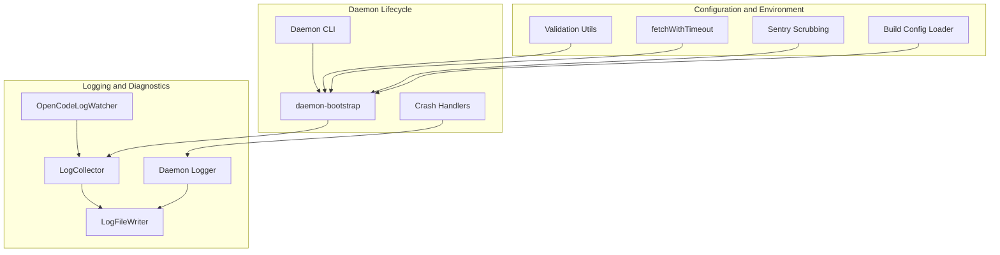
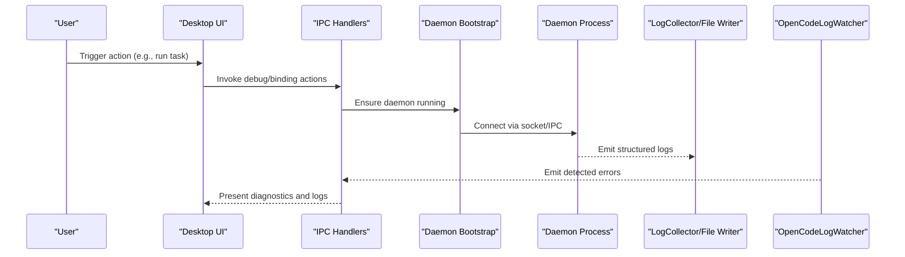
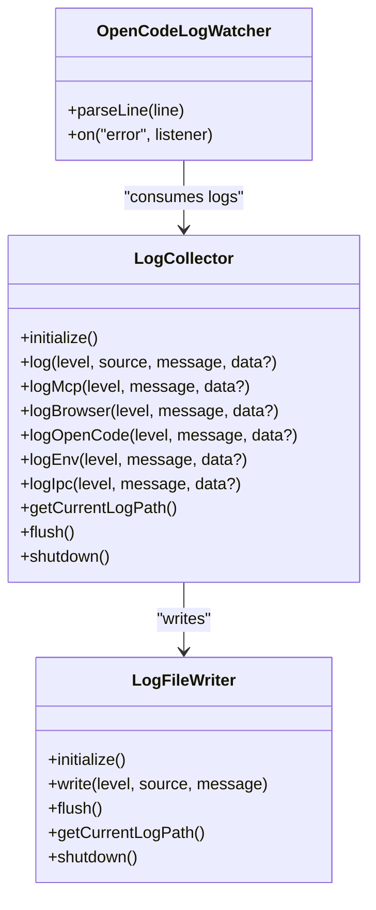
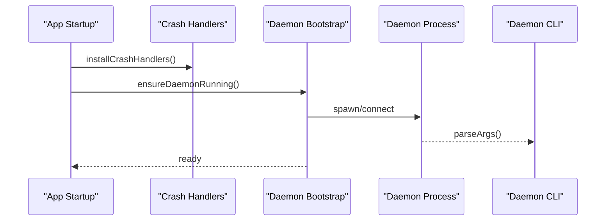
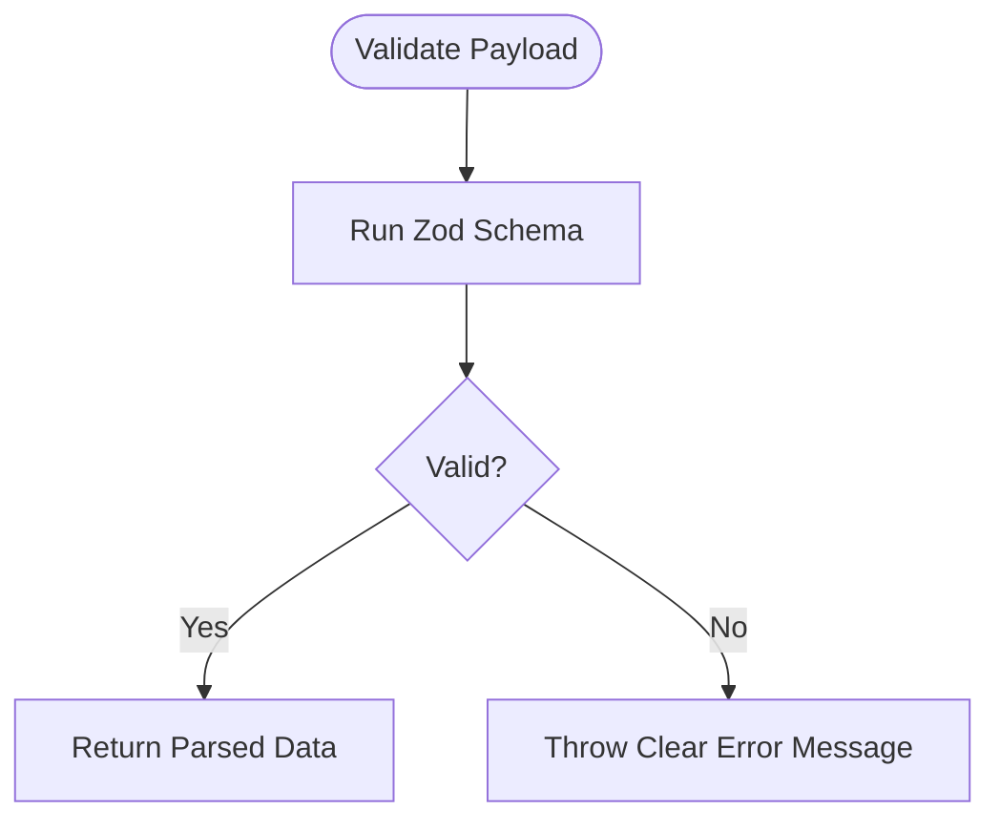
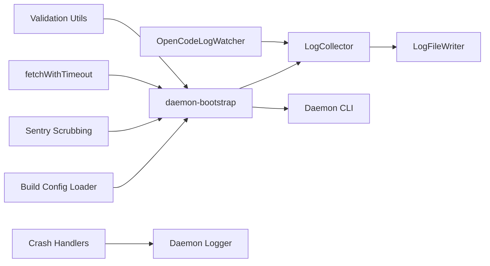

# Troubleshooting and FAQ

<cite>
**Referenced Files in This Document**
- [error.ts](file://packages/agent-core/src/utils/error.ts)
- [logging.ts](file://packages/agent-core/src/utils/logging.ts)
- [LogCollector.ts](file://packages/agent-core/src/internal/classes/LogCollector.ts)
- [LogFileWriter.ts](file://packages/agent-core/src/internal/classes/LogFileWriter.ts)
- [logger.ts](file://apps/daemon/src/logger.ts)
- [crash-handlers.ts](file://packages/agent-core/src/daemon/crash-handlers.ts)
- [OpenCodeLogWatcher.ts](file://packages/agent-core/src/internal/classes/OpenCodeLogWatcher.ts)
- [bug-report-handlers.ts](file://apps/desktop/src/main/ipc/handlers/bug-report-handlers.ts)
- [debug-handlers.ts](file://apps/desktop/src/main/ipc/handlers/debug-handlers.ts)
- [daemon-bootstrap.ts](file://apps/desktop/src/main/daemon-bootstrap.ts)
- [cli.ts](file://apps/daemon/src/cli.ts)
- [validation.ts](file://packages/agent-core/src/common/schemas/validation.ts)
- [fetch.ts](file://packages/agent-core/src/utils/fetch.ts)
- [sentry-scrub.ts](file://apps/desktop/src/main/sentry-scrub.ts)
- [build-config.ts](file://apps/desktop/src/main/config/build-config.ts)
- [daemon-architecture.md](file://docs/daemon-architecture.md)
</cite>

## Table of Contents

1. [Introduction](#introduction)
2. [Project Structure](#project-structure)
3. [Core Components](#core-components)
4. [Architecture Overview](#architecture-overview)
5. [Detailed Component Analysis](#detailed-component-analysis)
6. [Dependency Analysis](#dependency-analysis)
7. [Performance Considerations](#performance-considerations)
8. [Troubleshooting Guide](#troubleshooting-guide)
9. [Conclusion](#conclusion)
10. [Appendices](#appendices)

## Introduction

This Troubleshooting and FAQ section provides a practical, layered guide to diagnosing and resolving common issues across installation, configuration, and performance domains. It covers systematic error diagnosis, log analysis, and resolution strategies tailored to the codebase’s logging, crash handling, daemon lifecycle, and IPC-based diagnostics. Both beginners and experienced developers will find actionable workflows, diagnostic commands, and platform-aware guidance.

## Project Structure

The troubleshooting workflow spans three primary areas:

- Logging and diagnostics: centralized logging, file rotation, and structured log capture
- Daemon lifecycle and connectivity: bootstrapping, reconnection, and IPC-based diagnostics
- Configuration and environment: validation, proxy handling, and build-time configuration

**Diagram sources**

- [LogCollector.ts:33-106](file://packages/agent-core/src/internal/classes/LogCollector.ts#L33-L106)
- [LogFileWriter.ts:20-108](file://packages/agent-core/src/internal/classes/LogFileWriter.ts#L20-L108)
- [OpenCodeLogWatcher.ts:148-197](file://packages/agent-core/src/internal/classes/OpenCodeLogWatcher.ts#L148-L197)
- [logger.ts:12-22](file://apps/daemon/src/logger.ts#L12-L22)
- [daemon-bootstrap.ts:45-81](file://apps/desktop/src/main/daemon-bootstrap.ts#L45-L81)
- [cli.ts:13-38](file://apps/daemon/src/cli.ts#L13-L38)
- [crash-handlers.ts:16-31](file://packages/agent-core/src/daemon/crash-handlers.ts#L16-L31)
- [validation.ts:45-55](file://packages/agent-core/src/common/schemas/validation.ts#L45-L55)
- [fetch.ts:25-46](file://packages/agent-core/src/utils/fetch.ts#L25-L46)
- [sentry-scrub.ts:75-120](file://apps/desktop/src/main/sentry-scrub.ts#L75-L120)
- [build-config.ts:43-80](file://apps/desktop/src/main/config/build-config.ts#L43-L80)

**Section sources**

- [LogCollector.ts:33-106](file://packages/agent-core/src/internal/classes/LogCollector.ts#L33-L106)
- [LogFileWriter.ts:20-108](file://packages/agent-core/src/internal/classes/LogFileWriter.ts#L20-L108)
- [OpenCodeLogWatcher.ts:148-197](file://packages/agent-core/src/internal/classes/OpenCodeLogWatcher.ts#L148-L197)
- [logger.ts:12-22](file://apps/daemon/src/logger.ts#L12-L22)
- [daemon-bootstrap.ts:45-81](file://apps/desktop/src/main/daemon-bootstrap.ts#L45-L81)
- [cli.ts:13-38](file://apps/daemon/src/cli.ts#L13-L38)
- [crash-handlers.ts:16-31](file://packages/agent-core/src/daemon/crash-handlers.ts#L16-L31)
- [validation.ts:45-55](file://packages/agent-core/src/common/schemas/validation.ts#L45-L55)
- [fetch.ts:25-46](file://packages/agent-core/src/utils/fetch.ts#L25-L46)
- [sentry-scrub.ts:75-120](file://apps/desktop/src/main/sentry-scrub.ts#L75-L120)
- [build-config.ts:43-80](file://apps/desktop/src/main/config/build-config.ts#L43-L80)

## Core Components

- Centralized logging and structured capture
  - LogCollector intercepts console output and routes it to a file writer with structured metadata and source detection.
  - LogFileWriter rotates logs daily, enforces size limits, and redacts sensitive data.
  - OpenCodeLogWatcher parses OpenCode logs and emits structured error events for error diagnosis.
- Daemon lifecycle and crash safety
  - Crash handlers install global uncaught exception and unhandled rejection handlers to ensure fatal errors are logged before process exit.
  - Daemon bootstrap manages process spawning, reconnection, and IPC registration for diagnostics.
- Configuration and environment
  - Validation utilities enforce payload correctness and surface clear error messages for misconfiguration.
  - Proxy-aware fetch integrates with environment variables for robust network troubleshooting.
  - Build config loader surfaces build-time configuration and environment differences (e.g., OSS vs packaged mode).

**Section sources**

- [LogCollector.ts:33-106](file://packages/agent-core/src/internal/classes/LogCollector.ts#L33-L106)
- [LogFileWriter.ts:20-108](file://packages/agent-core/src/internal/classes/LogFileWriter.ts#L20-L108)
- [OpenCodeLogWatcher.ts:148-197](file://packages/agent-core/src/internal/classes/OpenCodeLogWatcher.ts#L148-L197)
- [crash-handlers.ts:16-31](file://packages/agent-core/src/daemon/crash-handlers.ts#L16-L31)
- [daemon-bootstrap.ts:45-81](file://apps/desktop/src/main/daemon-bootstrap.ts#L45-L81)
- [validation.ts:45-55](file://packages/agent-core/src/common/schemas/validation.ts#L45-L55)
- [fetch.ts:25-46](file://packages/agent-core/src/utils/fetch.ts#L25-L46)
- [build-config.ts:43-80](file://apps/desktop/src/main/config/build-config.ts#L43-L80)

## Architecture Overview

The troubleshooting architecture integrates logging, daemon lifecycle, and IPC-based diagnostics to enable systematic error diagnosis and performance troubleshooting.

**Diagram sources**

- [daemon-bootstrap.ts:45-81](file://apps/desktop/src/main/daemon-bootstrap.ts#L45-L81)
- [LogCollector.ts:33-106](file://packages/agent-core/src/internal/classes/LogCollector.ts#L33-L106)
- [LogFileWriter.ts:20-108](file://packages/agent-core/src/internal/classes/LogFileWriter.ts#L20-L108)
- [OpenCodeLogWatcher.ts:148-197](file://packages/agent-core/src/internal/classes/OpenCodeLogWatcher.ts#L148-L197)
- [debug-handlers.ts:7-11](file://apps/desktop/src/main/ipc/handlers/debug-handlers.ts#L7-L11)

## Detailed Component Analysis

### Logging and Error Diagnosis

- LogCollector
  - Intercepts console.log/warn/error and writes structured entries with level, source, and optional data.
  - Provides convenience methods for categorizing logs (MCP, browser, OpenCode, environment, IPC).
- LogFileWriter
  - Daily rotation, size checks, and redaction of sensitive content.
  - Robust flush/backup behavior with buffer overflow protection.
- OpenCodeLogWatcher
  - Parses OpenCode logs for error patterns and emits structured error events with service/provider/model/session context.
- Serialization utilities
  - Ensures unknown error values are safely serialized for error diagnosis.

**Diagram sources**

- [LogCollector.ts:33-106](file://packages/agent-core/src/internal/classes/LogCollector.ts#L33-L106)
- [LogFileWriter.ts:20-108](file://packages/agent-core/src/internal/classes/LogFileWriter.ts#L20-L108)
- [OpenCodeLogWatcher.ts:148-197](file://packages/agent-core/src/internal/classes/OpenCodeLogWatcher.ts#L148-L197)

**Section sources**

- [LogCollector.ts:33-106](file://packages/agent-core/src/internal/classes/LogCollector.ts#L33-L106)
- [LogFileWriter.ts:20-108](file://packages/agent-core/src/internal/classes/LogFileWriter.ts#L20-L108)
- [OpenCodeLogWatcher.ts:148-197](file://packages/agent-core/src/internal/classes/OpenCodeLogWatcher.ts#L148-L197)
- [error.ts:8-13](file://packages/agent-core/src/utils/error.ts#L8-L13)

### Daemon Lifecycle and Connectivity

- Crash handlers
  - Install global uncaught exception and unhandled rejection handlers to log fatal errors and exit cleanly.
- Daemon bootstrap
  - Ensures the daemon is running, sets mode, tails logs in dev, re-registers handlers on reconnect, and monitors connection state.
- Daemon CLI
  - Parses arguments for socket path, data directory, packaging mode, and resource/app paths.

**Diagram sources**

- [crash-handlers.ts:16-31](file://packages/agent-core/src/daemon/crash-handlers.ts#L16-L31)
- [daemon-bootstrap.ts:45-81](file://apps/desktop/src/main/daemon-bootstrap.ts#L45-L81)
- [cli.ts:13-38](file://apps/daemon/src/cli.ts#L13-L38)

**Section sources**

- [crash-handlers.ts:16-31](file://packages/agent-core/src/daemon/crash-handlers.ts#L16-L31)
- [daemon-bootstrap.ts:45-81](file://apps/desktop/src/main/daemon-bootstrap.ts#L45-L81)
- [cli.ts:13-38](file://apps/daemon/src/cli.ts#L13-L38)

### Configuration and Environment

- Validation utilities
  - Zod-based validation with clear error messages for invalid payloads (e.g., task config, permission responses).
- Proxy-aware fetch
  - Integrates with environment variables for proxy selection and NO_PROXY exclusions; supports timeouts and dispatcher injection.
- Build config loader
  - Loads build-time configuration from a build.env file and logs environment differences (e.g., OSS mode).

**Diagram sources**

- [validation.ts:45-55](file://packages/agent-core/src/common/schemas/validation.ts#L45-L55)

**Section sources**

- [validation.ts:45-55](file://packages/agent-core/src/common/schemas/validation.ts#L45-L55)
- [fetch.ts:25-46](file://packages/agent-core/src/utils/fetch.ts#L25-L46)
- [build-config.ts:43-80](file://apps/desktop/src/main/config/build-config.ts#L43-L80)

## Dependency Analysis

- Logging depends on file writer and source detection; OpenCodeLogWatcher consumes logs for error diagnosis.
- Daemon bootstrap coordinates with crash handlers and CLI parsing; IPC handlers rely on logging for diagnostics.
- Configuration utilities underpin network and validation behavior.

**Diagram sources**

- [LogCollector.ts:33-106](file://packages/agent-core/src/internal/classes/LogCollector.ts#L33-L106)
- [LogFileWriter.ts:20-108](file://packages/agent-core/src/internal/classes/LogFileWriter.ts#L20-L108)
- [OpenCodeLogWatcher.ts:148-197](file://packages/agent-core/src/internal/classes/OpenCodeLogWatcher.ts#L148-L197)
- [daemon-bootstrap.ts:45-81](file://apps/desktop/src/main/daemon-bootstrap.ts#L45-L81)
- [cli.ts:13-38](file://apps/daemon/src/cli.ts#L13-L38)
- [crash-handlers.ts:16-31](file://packages/agent-core/src/daemon/crash-handlers.ts#L16-L31)
- [validation.ts:45-55](file://packages/agent-core/src/common/schemas/validation.ts#L45-L55)
- [fetch.ts:25-46](file://packages/agent-core/src/utils/fetch.ts#L25-L46)
- [sentry-scrub.ts:75-120](file://apps/desktop/src/main/sentry-scrub.ts#L75-L120)
- [build-config.ts:43-80](file://apps/desktop/src/main/config/build-config.ts#L43-L80)

**Section sources**

- [LogCollector.ts:33-106](file://packages/agent-core/src/internal/classes/LogCollector.ts#L33-L106)
- [LogFileWriter.ts:20-108](file://packages/agent-core/src/internal/classes/LogFileWriter.ts#L20-L108)
- [OpenCodeLogWatcher.ts:148-197](file://packages/agent-core/src/internal/classes/OpenCodeLogWatcher.ts#L148-L197)
- [daemon-bootstrap.ts:45-81](file://apps/desktop/src/main/daemon-bootstrap.ts#L45-L81)
- [cli.ts:13-38](file://apps/daemon/src/cli.ts#L13-L38)
- [crash-handlers.ts:16-31](file://packages/agent-core/src/daemon/crash-handlers.ts#L16-L31)
- [validation.ts:45-55](file://packages/agent-core/src/common/schemas/validation.ts#L45-L55)
- [fetch.ts:25-46](file://packages/agent-core/src/utils/fetch.ts#L25-L46)
- [sentry-scrub.ts:75-120](file://apps/desktop/src/main/sentry-scrub.ts#L75-L120)
- [build-config.ts:43-80](file://apps/desktop/src/main/config/build-config.ts#L43-L80)

## Performance Considerations

- Logging throughput and disk I/O
  - Use structured logs and daily rotation to keep individual files manageable.
  - Monitor buffer flush intervals and size thresholds to balance latency and disk usage.
- Network performance and reliability
  - Configure proxies appropriately to avoid unnecessary retries and timeouts.
  - Use timeouts and dispatcher caching to optimize repeated requests.
- Daemon responsiveness
  - Ensure the daemon is reachable and logs are being tailed in development for quick feedback loops.

[No sources needed since this section provides general guidance]

## Troubleshooting Guide

### Systematic Approaches

- Error diagnosis
  - Collect logs from the current log directory and review structured entries with level/source metadata.
  - Use OpenCodeLogWatcher to identify recurring errors and correlate with service/provider/model/session identifiers.
- Log analysis
  - Rotate and inspect daily log files; confirm redaction of sensitive data.
  - Filter for error-level entries and cross-reference timestamps with application events.
- Performance troubleshooting
  - Monitor buffer flush behavior and file size limits; adjust thresholds if necessary.
  - Verify proxy configuration and NO_PROXY exclusions to reduce latency and failures.

**Section sources**

- [LogCollector.ts:33-106](file://packages/agent-core/src/internal/classes/LogCollector.ts#L33-L106)
- [LogFileWriter.ts:20-108](file://packages/agent-core/src/internal/classes/LogFileWriter.ts#L20-L108)
- [OpenCodeLogWatcher.ts:148-197](file://packages/agent-core/src/internal/classes/OpenCodeLogWatcher.ts#L148-L197)

### Installation Problems

- Symptoms
  - Daemon fails to start or cannot connect to the main process.
  - Logs show initialization errors or missing configuration.
- Diagnostic steps
  - Verify daemon bootstrap connectivity and reconnection behavior.
  - Confirm CLI argument parsing for socket path and data directory.
  - Check build environment configuration and OSS vs packaged mode indicators.
- Resolution strategies
  - Ensure the daemon process is spawned and the PID lock is cleared on exit.
  - Re-run bootstrap to establish IPC and re-register handlers.
  - Validate build.env presence and schema parsing outcomes.

**Section sources**

- [daemon-bootstrap.ts:45-81](file://apps/desktop/src/main/daemon-bootstrap.ts#L45-L81)
- [cli.ts:13-38](file://apps/daemon/src/cli.ts#L13-L38)
- [build-config.ts:43-80](file://apps/desktop/src/main/config/build-config.ts#L43-L80)

### Configuration Issues

- Symptoms
  - Tasks fail due to invalid payloads or missing fields.
  - Network requests fail behind proxies or with timeouts.
- Diagnostic steps
  - Validate payloads using Zod schemas and review error messages.
  - Inspect environment variables for proxy configuration and NO_PROXY exclusions.
  - Confirm timeout settings and dispatcher usage for network requests.
- Resolution strategies
  - Correct invalid fields highlighted by validation errors.
  - Set appropriate proxy environment variables and ensure NO_PROXY matches target hosts.
  - Increase timeouts or adjust dispatcher caching for repeated requests.

**Section sources**

- [validation.ts:45-55](file://packages/agent-core/src/common/schemas/validation.ts#L45-L55)
- [fetch.ts:25-46](file://packages/agent-core/src/utils/fetch.ts#L25-L46)

### Performance Troubleshooting

- Symptoms
  - Excessive disk writes or delayed log flushes.
  - Slow network responses or frequent timeouts.
- Diagnostic steps
  - Review buffer sizes and flush intervals; check for file size exceeded conditions.
  - Analyze network request patterns and proxy dispatcher usage.
- Resolution strategies
  - Adjust buffer thresholds and flush intervals to balance latency and throughput.
  - Optimize proxy configuration and NO_PROXY patterns to avoid unnecessary routing.

**Section sources**

- [LogFileWriter.ts:20-108](file://packages/agent-core/src/internal/classes/LogFileWriter.ts#L20-L108)
- [fetch.ts:25-46](file://packages/agent-core/src/utils/fetch.ts#L25-L46)

### Platform-Specific Issues

- Windows/macOS/Linux specifics
  - Ensure proper file permissions for log directories and PID locks.
  - Validate platform-specific environment variables for proxies and paths.
- Packaging and distribution
  - Distinguish OSS builds from packaged builds using build.env loading and environment logs.

**Section sources**

- [build-config.ts:43-80](file://apps/desktop/src/main/config/build-config.ts#L43-L80)

### Security-Related Concerns

- Operational error filtering
  - Use operational error detection to tag and downgrade expected errors.
  - Scrub sensitive strings from error events and messages before reporting.
- Data minimization
  - Rely on redaction in log writers and scrubbing utilities to avoid exposing secrets.

**Section sources**

- [sentry-scrub.ts:75-120](file://apps/desktop/src/main/sentry-scrub.ts#L75-L120)
- [LogFileWriter.ts:20-108](file://packages/agent-core/src/internal/classes/LogFileWriter.ts#L20-L108)

### Collecting Diagnostic Information and Reporting Bugs

- Steps
  - Enable debug mode and use IPC handlers to generate a bug report.
  - Attach screenshots, AX tree snapshots, and collected logs.
  - Include environment details (platform, app version) and task context.
- Output
  - Save a structured JSON report with metadata and supporting artifacts.

**Section sources**

- [bug-report-handlers.ts:17-107](file://apps/desktop/src/main/ipc/handlers/bug-report-handlers.ts#L17-L107)

### Frequently Asked Questions

- How do I find the current log file path?
  - Use the log collector’s method to retrieve the current log path for export or inspection.
- Why are my logs not appearing in the file?
  - Ensure the log collector is initialized and the file writer is active; check for file size exceeded conditions.
- How do I diagnose OpenCode errors?
  - Use the OpenCode log watcher to parse logs and emit structured error events with contextual identifiers.
- What should I check if the daemon won’t connect?
  - Verify bootstrap connectivity, socket path, and CLI arguments; confirm reconnection and handler registration.
- How do I fix proxy-related network failures?
  - Set appropriate proxy environment variables and NO_PROXY patterns; confirm dispatcher usage and timeouts.

**Section sources**

- [LogCollector.ts:146-148](file://packages/agent-core/src/internal/classes/LogCollector.ts#L146-L148)
- [LogFileWriter.ts:20-108](file://packages/agent-core/src/internal/classes/LogFileWriter.ts#L20-L108)
- [OpenCodeLogWatcher.ts:148-197](file://packages/agent-core/src/internal/classes/OpenCodeLogWatcher.ts#L148-L197)
- [daemon-bootstrap.ts:45-81](file://apps/desktop/src/main/daemon-bootstrap.ts#L45-L81)
- [fetch.ts:25-46](file://packages/agent-core/src/utils/fetch.ts#L25-L46)

## Conclusion

This guide consolidates practical workflows for diagnosing installation, configuration, and performance issues. By leveraging structured logging, daemon lifecycle controls, and IPC-based diagnostics, teams can systematically isolate problems, collect actionable evidence, and apply targeted fixes. For advanced scenarios, combine error diagnosis, log analysis, and performance troubleshooting to uncover root causes efficiently.

[No sources needed since this section summarizes without analyzing specific files]

## Appendices

### Practical Workflows

- Installation verification
  - Confirm daemon bootstrap success and IPC registration.
  - Validate CLI arguments and environment configuration.
- Configuration validation
  - Run payload validation and address reported issues.
  - Test proxy configuration and NO_PROXY exclusions.
- Performance tuning
  - Adjust log buffer and flush settings.
  - Optimize network dispatcher usage and timeouts.

**Section sources**

- [daemon-bootstrap.ts:45-81](file://apps/desktop/src/main/daemon-bootstrap.ts#L45-L81)
- [cli.ts:13-38](file://apps/daemon/src/cli.ts#L13-L38)
- [validation.ts:45-55](file://packages/agent-core/src/common/schemas/validation.ts#L45-L55)
- [fetch.ts:25-46](file://packages/agent-core/src/utils/fetch.ts#L25-L46)
- [LogFileWriter.ts:20-108](file://packages/agent-core/src/internal/classes/LogFileWriter.ts#L20-L108)
