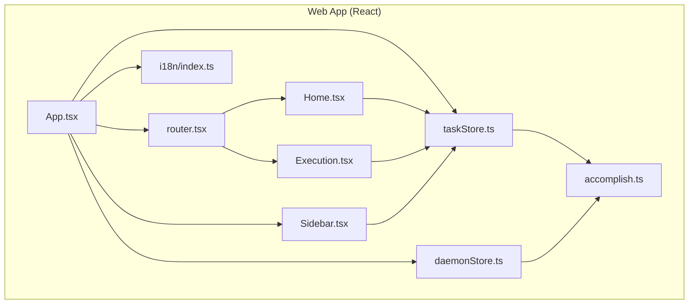
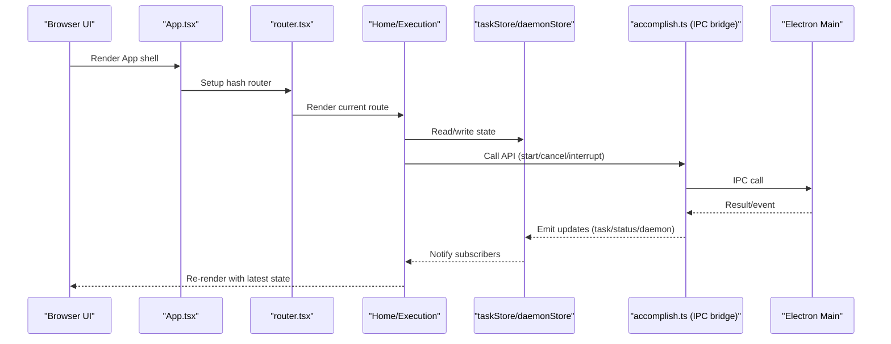
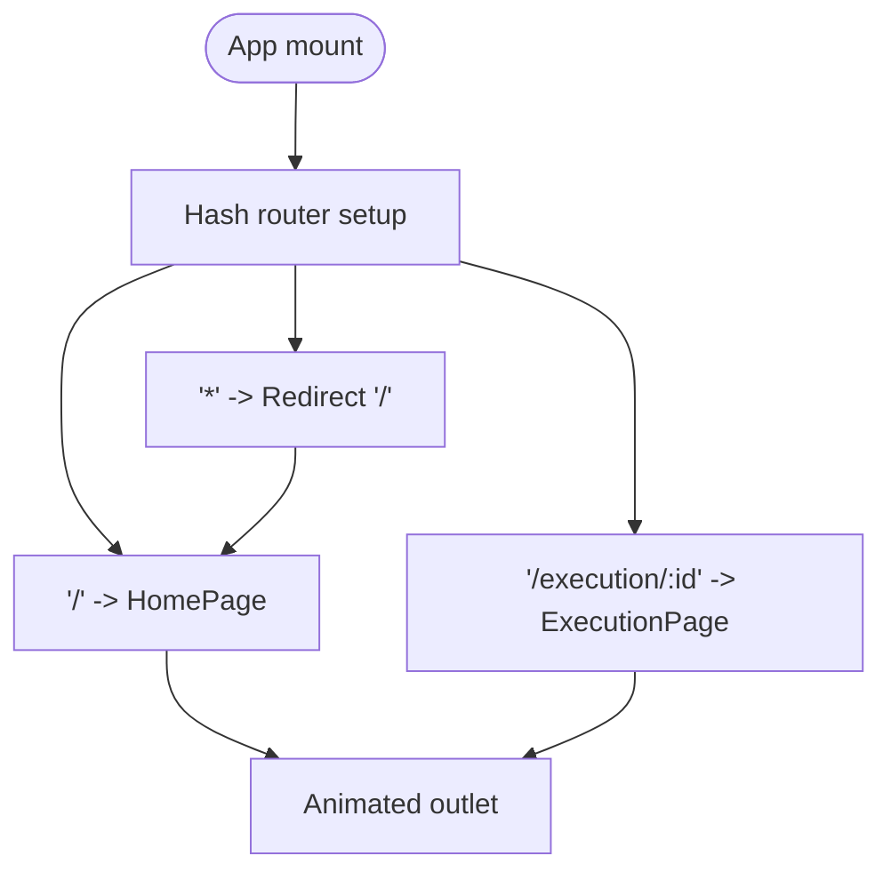
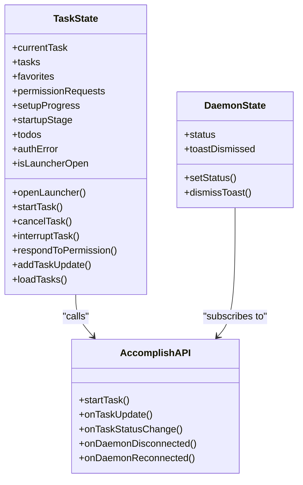
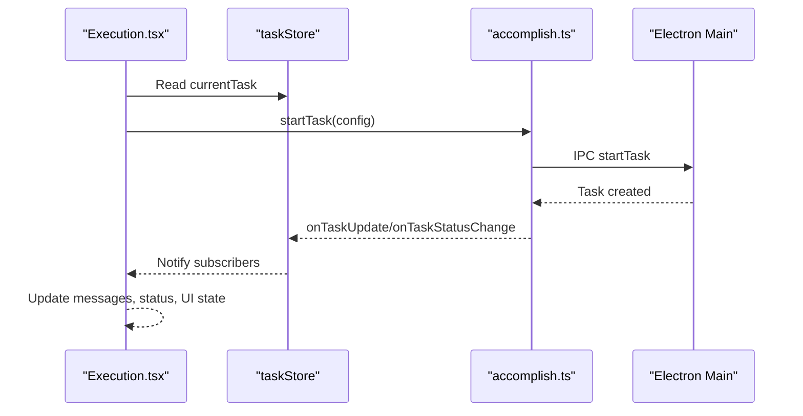
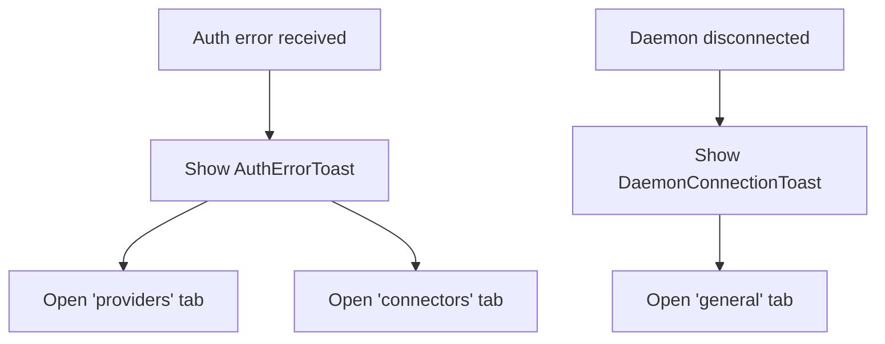
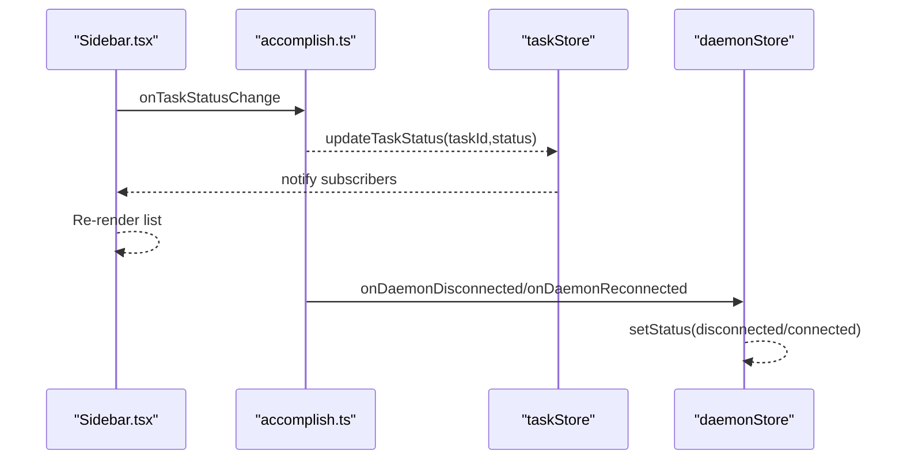
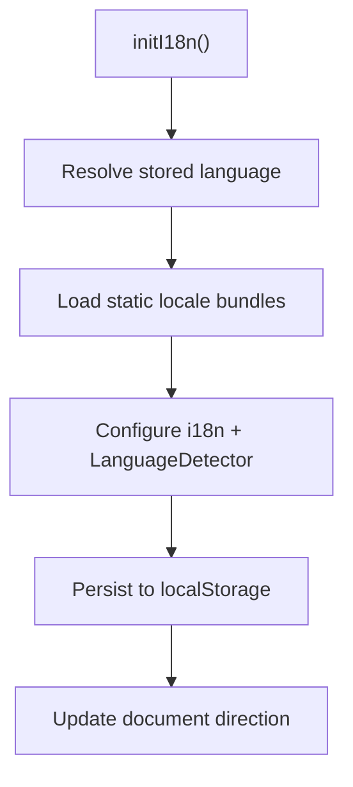

# Web Interface

<cite>
**Referenced Files in This Document**
- [package.json](file://apps/web/package.json)
- [vite.config.ts](file://apps/web/vite.config.ts)
- [index.html](file://apps/web/index.html)
- [App.tsx](file://apps/web/src/client/App.tsx)
- [router.tsx](file://apps/web/src/client/router.tsx)
- [taskStore.ts](file://apps/web/src/client/stores/taskStore.ts)
- [daemonStore.ts](file://apps/web/src/client/stores/daemonStore.ts)
- [Sidebar.tsx](file://apps/web/src/client/components/layout/Sidebar.tsx)
- [Home.tsx](file://apps/web/src/client/pages/Home.tsx)
- [Execution.tsx](file://apps/web/src/client/pages/Execution.tsx)
- [accomplish.ts](file://apps/web/src/client/lib/accomplish.ts)
- [i18n/index.ts](file://apps/web/src/client/i18n/index.ts)
</cite>

## Table of Contents

1. [Introduction](#introduction)
2. [Project Structure](#project-structure)
3. [Core Components](#core-components)
4. [Architecture Overview](#architecture-overview)
5. [Detailed Component Analysis](#detailed-component-analysis)
6. [Dependency Analysis](#dependency-analysis)
7. [Performance Considerations](#performance-considerations)
8. [Troubleshooting Guide](#troubleshooting-guide)
9. [Conclusion](#conclusion)
10. [Appendices](#appendices)

## IntroductionDomeWork

This document explains the React-based web alternative to the desktop application, focusing on the browser-accessible UI for Accomplish. It covers the component architecture, state management with Zustand stores, routing with React Router, real-time updates via Electron IPC bridges, internationalization, and responsive design. It also describes the task execution interface, settings management, and how the web interface relates to the desktop application’s functionality.

## Project Structure

The web application is organized as a React 19 app built with Vite. Key areas:

- Entry points: App.tsx and router.tsx
- Pages: Home and Execution
- Components: Layout, TaskLauncher, SettingsDialog, Sidebar, and UI primitives
- Stores: taskStore and daemonStore for state management
- Internationalization: i18n configuration with static locale bundles
- Build: Vite configuration with aliases and theme initialization



**Diagram sources**

- [App.tsx:1-195](file://apps/web/src/client/App.tsx#L1-L195)
- [router.tsx:1-17](file://apps/web/src/client/router.tsx#L1-L17)
- [Home.tsx:1-137](file://apps/web/src/client/pages/Home.tsx#L1-L137)
- [Execution.tsx:1-253](file://apps/web/src/client/pages/Execution.tsx#L1-L253)
- [Sidebar.tsx:1-168](file://apps/web/src/client/components/layout/Sidebar.tsx#L1-L168)
- [taskStore.ts:1-116](file://apps/web/src/client/stores/taskStore.ts#L1-L116)
- [daemonStore.ts:1-86](file://apps/web/src/client/stores/daemonStore.ts#L1-L86)
- [accomplish.ts:1-757](file://apps/web/src/client/lib/accomplish.ts#L1-L757)
- [i18n/index.ts:1-240](file://apps/web/src/client/i18n/index.ts#L1-L240)

**Section sources**

- [package.json:1-70](file://apps/web/package.json#L1-L70)
- [vite.config.ts:1-84](file://apps/web/vite.config.ts#L1-L84)
- [index.html](file://apps/web/index.html)
DomeWork
## Core Components

- App shell and routing: App.tsx orchestrates the layout, page transitions, and dialogs; router.tsx defines routes.
- Pages: Home.tsx provides the primary task input and examples; Execution.tsx renders the task execution UI and controls.
- Sidebar: Sidebar.tsx lists conversations, manages new task and settings actions, and displays daemon status.
- State stores: taskStore maintains task lifecycle, favorites, permission requests, and updates; daemonStore tracks daemon connectivity.
- Accomplish bridge: accomplish.ts exposes typed IPC APIs to the Electron main process.
- Internationalization: i18n/index.ts initializes i18n with static locale bundles and persists language preferences.

**Section sources**

- [App.tsx:54-195](file://apps/web/src/client/App.tsx#L54-L195)
- [router.tsx:1-17](file://apps/web/src/client/router.tsx#L1-L17)
- [Home.tsx:11-137](file://apps/web/src/client/pages/Home.tsx#L11-L137)
- [Execution.tsx:33-253](file://apps/web/src/client/pages/Execution.tsx#L33-L253)
- [Sidebar.tsx:19-168](file://apps/web/src/client/components/layout/Sidebar.tsx#L19-L168)
- [taskStore.ts:90-116](file://apps/web/src/client/stores/taskStore.ts#L90-L116)
- [daemonStore.ts:28-86](file://apps/web/src/client/stores/daemonStore.ts#L28-L86)
- [accomplish.ts:46-643](file://apps/web/src/client/lib/accomplish.ts#L46-L643)
- [i18n/index.ts:108-240](file://apps/web/src/client/i18n/index.ts#L108-L240)

## Architecture Overview

The web interface runs inside the Electron shell and communicates with the main process via a typed API surface. The UI subscribes to IPC events for task updates, status changes, and daemon connectivity. State is centralized in Zustand stores, and routing is handled by React Router with animated page transitions.



**Diagram sources**

- [App.tsx:54-195](file://apps/web/src/client/App.tsx#L54-L195)
- [router.tsx:1-17](file://apps/web/src/client/router.tsx#L1-L17)
- [Home.tsx:11-137](file://apps/web/src/client/pages/Home.tsx#L11-L137)
- [Execution.tsx:33-253](file://apps/web/src/client/pages/Execution.tsx#L33-L253)
- [taskStore.ts:90-116](file://apps/web/src/client/stores/taskStore.ts#L90-L116)
- [daemonStore.ts:28-86](file://apps/web/src/client/stores/daemonStore.ts#L28-L86)
- [accomplish.ts:46-643](file://apps/web/src/client/lib/accomplish.ts#L46-L643)

## Detailed Component Analysis

### Routing and Navigation

- Hash routing with React Router v7 ensures SPA navigation without server configuration.
- Root route mounts App, which embeds Sidebar and animated outlet.
- Nested routes include the home page and execution page with dynamic task ID.



**Diagram sources**

- [router.tsx:6-16](file://apps/web/src/client/router.tsx#L6-L16)
- [App.tsx:35-52](file://apps/web/src/client/App.tsx#L35-L52)

**Section sources**

- [router.tsx:1-17](file://apps/web/src/client/router.tsx#L1-L17)
- [App.tsx:156-195](file://apps/web/src/client/App.tsx#L156-L195)

### State Management with Zustand

- taskStore encapsulates:
  - Task lifecycle: start, cancel, interrupt, status updates
  - Favorites: CRUD operations
  - Permission requests: receive and respond
  - Updates: single and batch task updates
  - Todos and startup stages
- daemonStore centralizes daemon connectivity status and toast dismissal state.
- Stores subscribe to IPC events at module boundaries to keep UI synchronized.



**Diagram sources**

- [taskStore.ts:31-88](file://apps/web/src/client/stores/taskStore.ts#L31-L88)
- [daemonStore.ts:20-43](file://apps/web/src/client/stores/daemonStore.ts#L20-L43)
- [accomplish.ts:445-579](file://apps/web/src/client/lib/accomplish.ts#L445-L579)

**Section sources**

- [taskStore.ts:90-116](file://apps/web/src/client/stores/taskStore.ts#L90-L116)
- [daemonStore.ts:28-86](file://apps/web/src/client/stores/daemonStore.ts#L28-L86)

### Task Execution Interface

- Execution page renders:
  - Header with prompt and status
  - Waiting states (queued) with messaging
  - Conversation view with streaming-like message rendering
  - Stop button during running tasks
  - Follow-up input with attachments and voice commands
  - Completion footer and optional debug panel
- Uses hooks to manage scroll, permissions, startup stages, and credit state.



**Diagram sources**

- [Execution.tsx:33-253](file://apps/web/src/client/pages/Execution.tsx#L33-L253)
- [taskStore.ts:90-116](file://apps/web/src/client/stores/taskStore.ts#L90-L116)
- [accomplish.ts:54-61](file://apps/web/src/client/lib/accomplish.ts#L54-L61)

**Section sources**

- [Execution.tsx:79-155](file://apps/web/src/client/pages/Execution.tsx#L79-L155)
- [Execution.tsx:158-210](file://apps/web/src/client/pages/Execution.tsx#L158-L210)
- [Execution.tsx:226-234](file://apps/web/src/client/pages/Execution.tsx#L226-L234)

### Settings Management and Authentication

- SettingsDialog is reused across pages to manage providers, voice, skills, connectors, scheduler, and general settings.
- Auth error handling triggers a toast that opens the appropriate settings tab for re-authentication.
- DomeWorknection toast allows quick access to general settings when daemon disconnects.



**Diagram sources**

- [App.tsx:167-191](file://apps/web/src/client/App.tsx#L167-L191)
- [daemonStore.ts:48-83](file://apps/web/src/client/stores/daemonStore.ts#L48-L83)

**Section sources**

- [App.tsx:69-94](file://apps/web/src/client/App.tsx#L69-L94)
- [App.tsx:170-177](file://apps/web/src/client/App.tsx#L170-L177)

### Real-Time Updates and IPC Integration

- Accomplish bridge exposes typed IPC methods and event subscriptions.
- Sidebar subscribes to task status changes and updates the conversation list immediately.
- DaemonStore subscribes to daemon connection events and resets toast dismissal on reconnect failures.



**Diagram sources**

- [Sidebar.tsx:40-55](file://apps/web/src/client/components/layout/Sidebar.tsx#L40-L55)
- [daemonStore.ts:48-83](file://apps/web/src/client/stores/daemonStore.ts#L48-L83)
- [accomplish.ts:445-457](file://apps/web/src/client/lib/accomplish.ts#L445-L457)

**Section sources**

- [Sidebar.tsx:32-55](file://apps/web/src/client/components/layout/Sidebar.tsx#L32-L55)
- [daemonStore.ts:28-86](file://apps/web/src/client/stores/daemonStore.ts#L28-L86)
- [accomplish.ts:445-579](file://apps/web/src/client/lib/accomplish.ts#L445-L579)

### Internationalization and Responsive Design

- i18n initializes with static locale bundles and persists language preference in localStorage.
- Language detection falls back to navigator language and supports four locales.
- Responsive layout uses Tailwind utilities; page transitions leverage Framer Motion.



**Diagram sources**

- [i18n/index.ts:108-191](file://apps/web/src/client/i18n/index.ts#L108-L191)

**Section sources**

- [i18n/index.ts:108-240](file://apps/web/src/client/i18n/index.ts#L108-L240)
- [Home.tsx:52-136](file://apps/web/src/client/pages/Home.tsx#L52-L136)

### Relationship Between Web and Desktop Functionality

- The web interface runs inside the Electron shell and relies on the Electron main process for task execution, settings, and daemon control.
- The accomplish.ts bridge exposes a typed API surface to the renderer, enabling seamless integration with desktop features like providers, skills, workspaces, and scheduled tasks.
- The UI remains browser-safe while leveraging Electron-specific capabilities such as file picking, browser previews, and daemon control.

**Section sources**

- [accomplish.ts:46-643](file://apps/web/src/client/lib/accomplish.ts#L46-L643)
- [App.tsx:109-128](file://apps/web/src/client/App.tsx#L109-L128)

## Dependency Analysis

- Dependencies include React 19, Radix UI, Framer Motion, Tailwind-based UI, react-router v7, react-i18next, and Zustand.
- Vite aliases resolve @locales and agent-core to browser-safe surfaces.
- External AWS SDK packages are marked as external to avoid bundling Node-only modules.

```mermaid
graph LR
Pkg["apps/web/package.json"] --> React["react, react-dom"]
Pkg --> Router["react-router"]
Pkg --> UI["@radix-ui/*, lucide-react, framer-motion"]
Pkg --> State["zustand"]
Pkg --> I18N["i18next, react-i18next"]
Pkg --> AgentCore["@accomplish_ai/agent-core (common)"]
Vite["vite.config.ts"] --> Alias["@locales, agent-core common"]
Vite --> External["@aws-sdk/* external"]DomeWork
```

**Diagram sources**

- [package.json:17-47](file://apps/web/package.json#L17-L47)
- [vite.config.ts:52-82](file://apps/web/vite.config.ts#L52-L82)

**Section sources**

- [package.json:1-70](file://apps/web/package.json#L1-L70)
- [vite.config.ts:51-84](file://apps/web/vite.config.ts#L51-L84)

## Performance Considerations

- Keep IPC-bound state minimal and normalized; rely on event subscriptions to update UI efficiently.
- Use animated outlets sparingly; ensure exit animations complete before switching routes.
- Lazy-load heavy components and defer non-critical computations to background threads where possible.
- Optimize image assets and avoid unnecessary re-renders by memoizing props and using shallow equality checks in selectors.
- Prefer batched updates for task message streams to reduce reflows.

## Troubleshooting Guide

- App initialization errors: The App component detects Electron runtime and sets an error state with localized messages. Verify Electron shell availability and onboarding completion.
- Auth errors: The AuthErrorToast opens the appropriate settings tab; clear the auth error after saving credentials.
- Daemon connectivity: The DaemonConnectionToast appears when daemon disconnects; use the general settings tab to address configuration issues.
- Locale issues: If translations appear missing, confirm language preference persistence and static bundle loading.

**Section sources**

- [App.tsx:109-128](file://apps/web/src/client/App.tsx#L109-L128)
- [App.tsx:167-191](file://apps/web/src/client/App.tsx#L167-L191)
- [daemonStore.ts:48-83](file://apps/web/src/client/stores/daemonStore.ts#L48-L83)
- [i18n/index.ts:196-223](file://apps/web/src/client/i18n/index.ts#L196-L223)

## Conclusion

The web interface provides a browser-accessible, Electron-integrated UI for Accomplish. It leverages React Router for navigation, Zustand for state, and a typed IPC bridge for real-time updates. The design emphasizes responsive layouts, internationalization, and seamless integration with desktop features such as providers, skills, and daemon control.

## Appendices

### Practical Usage Examples

- Starting a task:
  - Use the Home page input bar to submit a prompt; the system calls the IPC startTask method and subscribes to updates.
- Managing settings:
  - Open the SettingsDialog from the sidebar or error toasts; choose tabs for providers, voice, skills, connectors, scheduler, or general.
- Monitoring daemon status:
  - The daemon status dot in the sidebar reflects connection state; reconnect attempts trigger status updates.

### Cross-Browser Compatibility

- The build excludes Node-only AWS SDK packages and resolves agent-core to a browser-safe surface.
- Theme initialization compiles to a static script injected at runtime.

**Section sources**

- [vite.config.ts:76-82](file://apps/web/vite.config.ts#L76-L82)
- [vite.config.ts:14-49](file://apps/web/vite.config.ts#L14-L49)

### Deployment and Customization

- Build artifacts are emitted under dist/client; base path is configured for relative URLs.
- Customize theme by modifying theme-related files and rebuilding; the theme initializer script is generated at build time.
- Add or modify locales by extending the i18n configuration and adding new JSON files under locales.

**Section sources**

- [vite.config.ts:73-76](file://apps/web/vite.config.ts#L73-L76)
- [i18n/index.ts:51-64](file://apps/web/src/client/i18n/index.ts#L51-L64)
